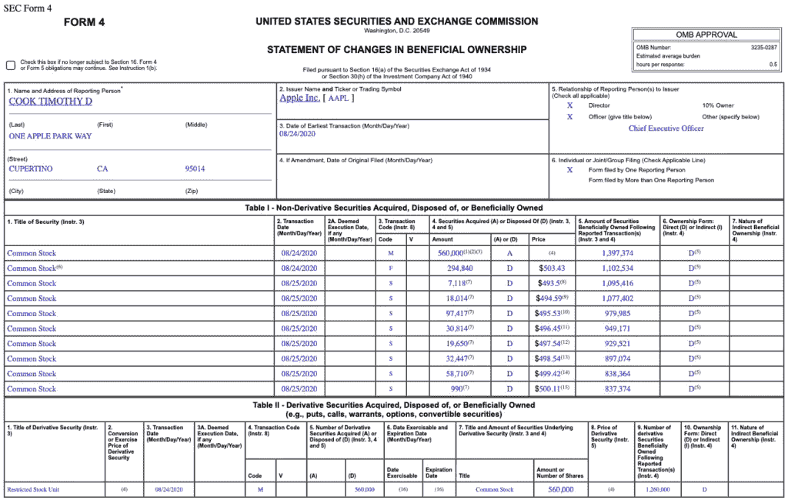

# 细价股和尽职调查:了解重要的 SEC 文件

> 原文：<https://medium.datadriveninvestor.com/penny-stocks-due-diligence-understanding-important-sec-filings-334bddd14a53?source=collection_archive---------24----------------------->

# 你知道如何研究细价股吗？

**说到[仙股](https://pennystocks.com/penny-stocks-trading)DD**是什么？如果你是交易新手，或者只是想学习一些额外的研究知识，让我来解释一下。**DD**的定义就是尽职调查的简称。你可能会在社交媒体上看到一份关于此事的声明。也许你在某个地方的邮件里看到过提到。这个“DD”基本上是研究的另一个术语。

无论你是日内交易者还是在寻找投资低价股的方法，理解某些发行者的股票为什么会波动是很重要的。我敢肯定，对于那些在市场上呆过一段时间的人来说，你会同意有些催化剂比其他催化剂更有影响力。这些同样有影响力的催化剂也可能给市场留下更持久的印象。

**了解更多信息**

*   在你的投资组合中，细价股处于什么位置？
*   [如何交易细价股:2020 年初学者指南](https://pennystocks.com/featured/2020/06/19/trading-penny-stocks-beginners-guide-2020/)
*   仙股 101:股票市场什么时候开门

我相信你也看到过某些低价股大幅上涨，但第二天或几天后又回落。与此同时，你可能会看到某些低价股的交易价格创新高，然后在某些公司事件曝光后继续走高。有可能的是，某些上市公司文件中的更详细的细节揭示了更多的信息，交易者过去要么在一个交易中停留更长时间，要么拿着他们的钱跑去下一个交易。

# 为什么企业备案很重要？

当然，我们知道证券交易委员会要求公司及时提交某些报表。但是不要忽视披露。通常情况下，这些文件会透露更多的信息，而这些信息通常不会在新闻稿中详细阐述。在这里你可以深入了解一家公司运营的细节。你可以看到哪些内部人士在买入或卖出。你还可以看到是否有大型对冲基金或激进投资者在公司中建仓。该公司可能不会在公告中公布所有这些细节。

然而，你可能会在文件中看到它们。这就是为什么我认为不仅要理解如何根据技术分析来交易低价股，还要对基本的基本面分析有一个正确的理解。在本文中，我们不会讨论财务比率或与之相关的东西。

但是，如果你在寻找一项举措背后的潜在催化剂，我们将讨论一些可以及时披露信息的申报类型。还有其他归档类型吗？*当然是*！然而，如果你是一个活跃的交易者，你需要一个快速搜索信息的“入口”。下面是一些交易者在购买细价股之前用来整理行动计划的文件类型。

另外，如果你需要访问这些信息，我们在 PennyStocks.com 上提供。在我们的“股票代码”搜索框中搜索任何公司的代码，在公司的“详细报价”下，你会看到不同的标签。其中一个标签是“证券交易委员会备案”。现在让我们言归正传。你也可以在我们 60 多页的电子书中了解更多关于如何交易细价股的信息，[这里](https://pennystocks.com/featured/2020/09/05/penny-stock-basics-how-to-read-sec-filings-types/#ex1)。

 [## 股票捐赠:知道什么|数据驱动的投资者

### 有很多交易者和投资者也分别试图找出捐赠他们的…

www.datadriveninvestor.com](https://www.datadriveninvestor.com/2020/08/03/stock-donations-what-to-know/) 

# 什么是 10-K 文件？

10-K 文件的定义是关于公司财务表现的综合年度报告。这是上市公司一年一次的申报。这是美国证券交易委员会(SEC)对大多数上市公司的要求。

这是一份很长的文件，但给出了一份关于公司历史、组织结构、管理结构和薪酬的完整报告。它还报告全年的财务报表和收益。您还会看到管理层对业务相关绩效和风险的讨论。

# 什么是 10-Q 归档？

10-Q 文件的定义是关于公司财务表现的全面季度报告。通常情况下，一家公司会提交 3 个“Qs ”,然后是它的“K”。它为投资者提供了公司的持续业绩。与 10-K 类似，Qs 报告类似的信息，但基于单个季度。

他们自己也可以成为催化剂，因为公司会在正式新闻发布之前发布声明。这也是经常查看档案的另一个原因。根据公司的规模，一家公司需要在季度结束后的 40-45 天内提交季度报告。

# 什么是 8k 档案？

8K 文件或“表格 8K”的定义是向 SEC 提交的关于重大事件或公司变更的声明。这些关注的是对股东或 SEC 本身可能重要的事件。这份报告主要是向公众通报某些事件的最新情况，如收购、财务变动、管理层/董事变动、财务变动或任何与股东利益相关的事情。

有时公司会提交 8K 表格，而不是发布正式公告。这通常是我们看到细价股“不知从哪里冒出来”的地方，因为事件不在新闻提要中。

# 什么是附表 13D 和附表 13G 备案？

这些附表涉及各方报告在一家公司的某一股票类别中超过 5%的股票所有权。5%的门槛被认为是公司的“重大所有权”。

正因为如此，必须申报。这些表单有更长的格式定义。但主要区别在于投资者的规模。附表 13D 由“积极投资者”和拥有公司 20%以上流通股的投资者提交。

**【阅读更多】** [做仙股最好的 App 是什么？](https://pennystocks.com/featured/2020/05/03/what-is-the-best-app-for-penny-stocks/)

A 13G 指的是“被动投资者”,他们拥有一家公司不到 20%的流通股。一旦“被动投资者”达到 OS 的 20%以上，他们需要开始提交 13D 报表。这些都很重要，因为我们会看到哪些大型基金或投资者在一家公司持有较大的头寸。这些通常会提升特定公司的人气。

# 什么是表格 4 提交？

这是许多有经验的交易者不时寻找的东西。什么是中学四年级？根据美国证券交易委员会的说法，这是一份“受益所有权变动表”。每当公司内部人员的持股发生重大变化时，它必须向委员会备案。

如果某人是拥有公司 10%或 10%以上流通股的董事、官员或股东，你会认为他是内幕人士。这些表格细分了报告人与公司的关系，并提供了有关股票买卖的重要信息。他们也将显示公司股票期权发行。这些期权通常来自公司的员工激励计划。

为什么表格 4 很重要？嗯，在最简单的层面上，表格 4 将显示内部人员正在采取的行动。他们购买股票、出售股票、行使期权等吗？？这些可以显示市场的乐观情绪，尤其是当内部人士购买股票时。另一个需要注意的是，如果表格 4 显示的是内幕交易。归档时有特别的注释吗？这是预先确定的股票出售计划的一部分吗？许多公司根据规则 10 b5–1 制定销售计划。

它允许内部人员建立一个出售他们所拥有的股票的计划。内部人士将实施一项计划，预先确定在预定时间出售的股票数量。这避免了对内幕交易指控的审查。

# 如何快速阅读 SEC 文件

正如我在上面所说的，还有很多其他类型的文件需要了解。然而，这些是一些最受欢迎的美国证券交易委员会的文件，看看快速和肮脏的 DD 会议。在年底或年初看一看 10-K 可以成为任何一年开始或结束的强大催化剂。你会看到该公司的融资交易、整体表现，以及他们如何设法度过潜在的经济风暴。

显然，在 2020 年，冠状病毒起了很大的作用。在这一年中，10-q 发挥了很大的作用，因为它揭示了公司如何能够处理短期的扩张或收缩。此外，你不能忽视这样一个事实，即当涉及到公司融资交易时，即使是短期的 8k 备案也可以揭示特定的信息。

特别是 8-K，可以显示预定融资交易的确切转换价格或销售价格。从这个角度来看，作为投资者，你应该明白“大钱”在哪里投资。此外，你会明白，如果某些低价股下跌，在 8k 融资更新后，有可能在该水平形成新的支持或阻力。

最重要的是，当谈到如何阅读 SEC 文件时，有一件事需要理解。这些细节是原始信息。因此，不管你从公司的头条新闻中得到什么，提交给 SEC 的报告揭示了公司的真实状况，无论是好是坏。如何(短期或长期)利用你研究的信息来建立交易策略，这取决于你自己。

# 细价股和交易基础

这些是最常被提及的潜在催化剂。当谈到寻找可购买的细价股时，知道一只股票为什么会波动是至关重要的。所以今年做 DD 的时候要记住这一点。

**【阅读更多】** [交易细价股初学者指南](https://pennystocks.com/featured/2020/03/10/beginners-guide-trading-penny-stocks-2020-march-10-2020/) s

也请记住，研究是重要的，但它不需要成为唯一的焦点。跟踪市场的势头。在许多情况下，基本面不太吸引人的细价股可能会因为一个短期的催化剂而爆发出最大的波动。显然，在这种情况下，你会希望有一个短期的方法来利用这种势头。

在一天结束时，目标是用这些低于 5 美元的股票赚钱，有太多的方法去实现它。所以，不管你是交易它们还是投资低价股，确保你根据你准备做的交易或投资的类型做了适量的 DD。

*原载于 2020 年 9 月 5 日*[*【https://pennystocks.com】*](https://pennystocks.com/featured/2020/09/05/penny-stock-basics-how-to-read-sec-filings-types/)*。*

**访问专家视图—** [**订阅 DDI 英特尔**](https://datadriveninvestor.com/ddi-intel)