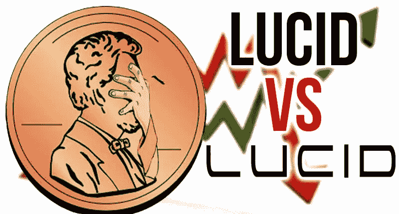
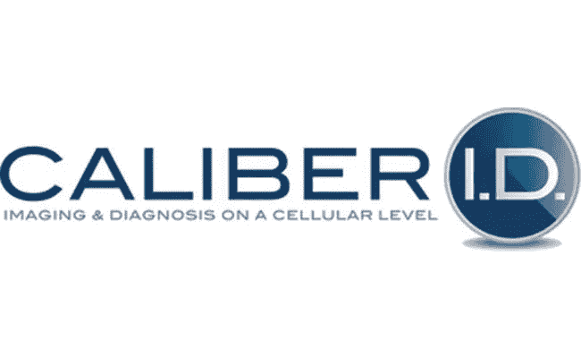

# 细价股&认错人？清晰马达聚焦

> 原文：<https://medium.datadriveninvestor.com/penny-stocks-mistaken-identity-lucid-motors-in-focus-61675b9ab1db?source=collection_archive---------16----------------------->

# 有时市场过于饥渴&细价股因此受益

仙股对于刚起步的公司来说是众所周知的。从早期的制药公司到尖端科技公司，[小盘股](https://pennystocks.com/featured/2020/06/19/entertainment-penny-stocks-list-today-june-19-2020/)因其创新的经营方式而受到追捧。虽然许多人永远无法实现商业化，但有少数人已经蓬勃发展，并因其史诗般的成长故事而闻名。

我为什么要提起这个？嗯，在股票市场，你也可以通过投机来推动势头。随着过去几个月 IPO 的火爆，投资者会寻找任何先入为主的机会。这不仅仅是最近的事，甚至可以追溯到 Twitter 的首次公开募股(Twitter 股票报道 T5)。如果你在过去的 7 年里没有交易过低价股，你可能不会熟悉 Twitter 的错误身份。让我解释一下。

Twitter 股票 IPOd 在 2013 年 11 月。然而，在此之前，投资者困惑地认为他们很聪明，选择了一个被认为会让 Twitter 上市的股票代码。除了寻找信件，什么也不做的投资者把一只几乎一文不值的电子零售商 Tweeter 的股票误认为是“推特”网站。

**【阅读更多】** [一只仙股错认后暴涨 14900%](https://pennystocks.com/featured/2019/04/18/a-penny-stock-jumps-14900-after-mistaken-identity/)

这最终导致股价上涨超过 1000%。原因是什么？Tweeter 的股票代码是 TWTRQ(这也表明它处于破产状态，因此“Q”是第 5 个字母)。虽然 Twitter 最终采用了“TWTR”，但 Tweeter 被 FINRA 重新分配了一个符号，THEGQ 认为它以前的符号与 Twitter 的“太相似了”(在此插入翻白眼)。

# 这已经不是细价股第一次认错人了

其他值得注意的“混乱”发生在 Zoom Video ( [ZM 股票报告](https://pennystocks.com/ticker/?symbol=ZM))准备上市的时候。在一家名为 Zoom Technologies (F/k/a/ ZOOM)的公司不知情的情况下，交易员猜测 Zoom video 将以股票代码“Zoom”开始交易。

现在，这发生在 2020 年早些时候，所以你可能已经听到风声或被炒作所吸引。ZOOM 的股价从 1 月份的 1 美元左右飙升至 3 月份的 60 美元高点；是的，59 美元，5900%的移动。此后不久，Zoom Technologies 停止了交易。这是一家总部设在中国的公司，主要从事技术和通信业务。

# 最新错认的仙股？

市场现在如此热情，以至于散户们都迫不及待地想要找到下一个大突破。与此同时，一些人已经忘记了高音和变焦技术的教训。

最近，人们对电动汽车产生了极大的兴趣。我们已经看到特斯拉有史以来第一次超过每股 1000 美元，Nio Inc. ( [NIO Stock Report](https://pennystocks.com/ticker/?symbol=NIO) )最近扭转了业务，Nikola ( [NKLA 股票报告](https://pennystocks.com/ticker/?symbol=NKLA))最近通过与 VectoIQ 的合并上市。

由于 Nikola 最近的“首次公开募股”在几天内将股价从大约 10 美元(VTIQ)飙升至超过 90 美元的高点，围绕下一只大型电动汽车股票的炒作是非常真实的。Lucid Motors 拥有一个几乎完工的全新、最先进的工厂和一个使用圆柱形电池的高能量电池组，被称为“特斯拉黑仔”。尽管 Lucid 的首席执行官兼首席技术官彼得·罗林森(Peter Rawlinson)“请不要把我们描述为特斯拉杀手”，但如果你告诉人们不要做某事，他们可能会做得更多。

# 谁是 Lucid Motors

Lucid Motors 是由前特斯拉 Model S 首席工程师彼得·罗林森(Peter Rawlinson)领导的美国初创公司。沙特阿拉伯的公共投资基金也支持 2018 年 9 月从沙特基金获得超过 10 亿美元的公司。据报道，自那以后，它没有筹集到任何额外的资金。

其生产设施的建设已接近完成，如果一切按计划进行，一款豪华的新型电池电动轿车将于今年下线。此外，Lucid 预计在 2021 年初交付。

除了为 Formula E 赛车提供电池，它还准备展示其最终的量产版 Lucid Air 轿车。Lucid Air 的起价为 6 万美元，提供了令人印象深刻的 400 英里的行驶里程，最高时速为 200 英里，据称 0-60 英里/小时的时间仅为 2.5 秒。

# Lucid Motors 的股价是多少？

就是这么回事。Lucid Motors 的股价还不存在。Lucid 成立于 2007 年，名为 Atieva。最初，它专注于为其他汽车制造商制造电动汽车电池和动力系统。但几年后，该公司于 2016 年 10 月更名为 Lucid Motors。随后，该公司正式宣布有意开发一款全电动高性能豪华车。

其他著名的领导包括前特斯拉校友，彼得霍赫霍尔丁和埃里克巴赫。米迦勒·卡特是 Lucid 的副总裁。他负责将所有这些不同的想法汇集在一起。他的履历包括在思科、高通和英特尔的工作。L. Michael Hone 是团队中的一员，他与公司没有任何关系。他是上市公司 Caliber Imaging & Diagnostics 的首席执行官。这是一家场外上市的“黑暗或不存在的”细价股票交易，代码为 LCDX。

该公司前身为 Lucid Inc .，2012 年 8 月更名为 Caliber Imaging and Diagnostics([LCDX 股票报告](https://pennystocks.com/ticker/?symbol=LCDX))。该公司的重点是为某些疾病的诊断提供识别技术，如皮肤癌。坦率地说，如果该公司坚持下来，他们可能会利用 COVID 测试。

**了解细价股**

*   [低价股交易入门&赚钱](https://pennystocks.com/featured/2020/06/18/a-beginners-guide-to-trading-penny-stocks-making-money/)
*   [做仙股最好的 App 是什么？](https://pennystocks.com/featured/2020/05/03/what-is-the-best-app-for-penny-stocks/)

但最近一次给通讯社增光添彩的公关是在 2014 年。它的最后一份申请也是在那一年。但我能理解这对一些人来说有多困惑。对 Lucid Motors 股票的搜索产生了将 LCDX 识别为关联股票的其他金融网站的结果。名字改成了口径成像。目前唯一与 LCDX 和鲁西德有关的是一个在 2012 年 8 月 16 日改变的名字。

*原载于 2020 年 6 月 19 日 https://pennystocks.com**的* [*。*](https://pennystocks.com/featured/2020/06/19/penny-stocks-mistaken-identity-lucid-motors-stock/)