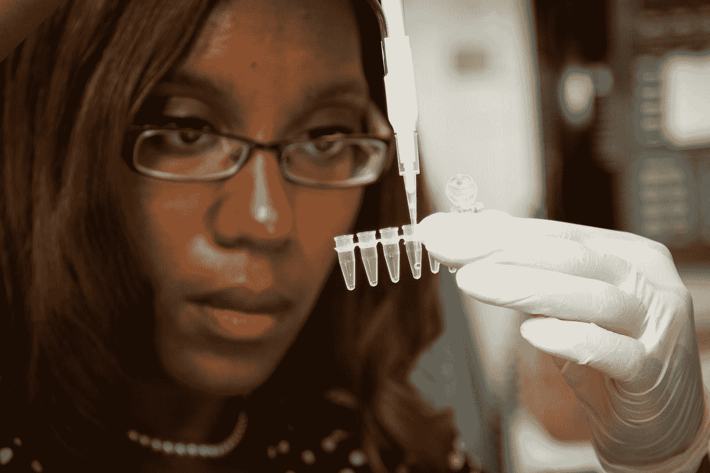

# 人们讨厌针头:谁将在 Theranos 上分娩？

> 原文：<https://medium.datadriveninvestor.com/people-hate-needles-who-will-deliver-on-theranos-b7fcc479ce24?source=collection_archive---------16----------------------->

## 几十年来我一直避免验血

Photo by [National Cancer Institute](https://unsplash.com/@nci?utm_source=medium&utm_medium=referral) on [Unsplash](https://unsplash.com?utm_source=medium&utm_medium=referral)

我不知道我是什么血型。我没有它的记录。这是不负责任的，我知道。剧情转折是这样的:我在医疗保健行业工作。

距离我上次验血已经过去了至少 25 年——四分之一世纪。我 27 了，所以对抽血的经历没有记忆。一想到要抽血，我就焦虑不安。我不是一个人。

# 对针头的恐惧是一个被忽视的医疗障碍

有很多人都有同样的针头恐惧症。叫做[锥虫恐惧症](https://www.healthline.com/health/trypanophobia#:~:text=Trypanophobia%20is%20an%20extreme%20fear,tolerate%20needles%20much%20more%20easily.)。但是医疗保健行业还没有系统地把它作为一个公共健康问题来解决。

医疗保健行业通常以轻蔑的语气对待这个问题。“他们只需要克服它。”谷歌搜索“锥虫恐惧症验血”。你会看到更多关于克服恐惧的结果，而不是让验血变得不那么可怕。这是预防保健的真正障碍:

> “然而，对于 10%或更多的人来说，对针头或锥虫恐惧症的恐惧非常严重，可能会影响他们接受适当或任何医疗和牙科护理的能力。”——[T3【苏珊娜·科芬】医学博士 ](https://www.kevinmd.com/blog/2012/09/fear-needles-paralyzes-medical-care.html)

# 发明者:在硅谷血拼

最近我发现了一部有趣的关于网飞的纪录片。这是硅谷最臭名昭著的医疗创业公司 Theranos 的故事。

我记得在新闻中听说过 Theranos。他们开发了一种技术，可以用一滴血进行实验室测试。我欣喜若狂。终于有人懂了！如果我能再坚持几年，大抽血针就过时了。当一切都分崩离析时，我崩溃了。

**注:** *以下是我基于纪录片的分析。真实发生的细节可能与屏幕上描绘的不同。*

## 正确的想法——错误的执行

Theranos 了解锥虫恐惧症在预防保健中发挥的屏障作用。他们销售的产品解决了一个历史上被忽视的问题。

他们也认识到两家保守的公司控制了市场——实验室公司和 T2 的 Cerner 公司。半个世纪以来，他们一直以同样的方式进行血液检测。他们没有令人信服的理由来改变任何事情。但是 Theranos 开始问一些破坏性的问题:

*   **我们如何用更少的血液做血液检查？**
*   **我们如何能够**为预防性保健提供便捷的采血途径？
*   我们怎样才能让血液工作不那么痛苦，更容易接受？

这些都是正确的问题。Theranos 触及了医疗保健行业的痛处。但是他们太过分了。他们希望每个家庭都有一个小得不可思议、像苹果一样的消费者实验室。他们想对一滴血完成 200 多项测试。

他们不仅仅想颠覆实验室行业，他们还想重新定义它。

## 自我是敌人

所有这些都是炒作！炒作！炒作！Theranos 的创始人伊丽莎白·霍姆斯成为了技术创新的典型代表。

然后，她的自我妨碍了她。像许多硅谷领导人一样，她受到了史蒂夫·乔布斯的启发。尽管史蒂夫·乔布斯是一个有创造力的天才，但他是一个无视同龄人专业知识的自大狂。尽管有乔布斯，iPod 和 iPhone 还是成功了，而不是因为他。

 [## 中风的教训——我们能选择更好的医疗保健方式吗？数据驱动的投资者

### 2020 年 7 月 5 日星期天，我父亲患了出血性中风，严重瘫痪了他的右侧身体和语言。他是一个…

www.datadriveninvestor.com](https://www.datadriveninvestor.com/2020/07/26/lessons-from-a-stroke-can-we-choose-our-way-into-better-healthcare/) 

伊丽莎白采取了同样的心态。在硅谷，为了追求理想化的未来而忽视现实是一种时尚。一切都是戏剧化的，是为了吸引风险投资家的注意。

Theranos 公司的工程师说，如果实验室设备大 2 到 3 倍，许多设计问题就会迎刃而解。这个设备已经比实验室公司或 Cerner 系统小了几个数量级。但是伊丽莎白不同意。它有家用打印机那么大。愿景需要它。

说不可能的工程师被告知不是“硅谷料”。这种行为没有动机——这是[煽风点火](https://medium.com/@c0d3rgirl/gaslighting-in-the-workplace-5f44d439ca21)。

随之而来的是一个逐渐腐蚀的商业模式，并最终崩溃。Theranos 试图“假装它，直到你成功”,并在这个过程中把真正的人的健康置于危险之中。他们成为了未能颠覆美国医疗保健的臭名昭著的创业公司。

# 欺诈是医疗保健自满的燃料

这次硅谷的失败比 Juicero 受到的打击要大得多。ther anos 的先例给[医疗创新带来了不可逆转的损害](https://sea.mashable.com/tech/2879/theranos-screwed-up-legit-blood-test-innovations-for-everybody)。以下是医疗决策者对此的解释:

*   “明白了！我们不像科技公司。你不能打破东西，快速失败。”
*   “实验室很复杂！实验室公司和 Cerner 的控制是有原因的。”
*   “这不可能——尽管有大量风险投资，Theranos 还是失败了！”

我手指穿刺验血的梦想随着 Theranos 飞船一起沉入海底。

什么样的风险投资会资助另一个经历过第一次崩盘的 Theranos？在看到 Theranos 伤害真正的患者后，哪个医疗保健提供商会信任另一家初创公司？*谁会再怀疑 Lab Corp 和 Cerner？*

# 永远不要忽视最小可行产品

故事中最令人沮丧的部分是 Theranos 有一个可行的产品。他们没有[做敏捷对](https://www.bain.com/insights/books/doing-agile-right/#:~:text=Agile%20isn't%20a%20goal,recover%20from%20its%20potential%20pitfalls.)。他们看不到[最小可行产品](https://www.agilealliance.org/glossary/mvp/#:~:text=A%20minimum%20viable%20product%20(MVP)%20is%20a%20concept%20from%20Lean,customers%20with%20the%20least%20effort.)。

谁在乎第一次迭代是冰箱大小？谁在乎它只做 5 种最常见的血液检查？嗯，很多医疗服务提供者会关心的！这是对现状的巨大改善。

只有自我成了拦路虎。

医疗保健市场容易接受迭代过程。硅谷的任何人都不应该犹豫推出更保守的产品来解决这个问题。

请，代表锥虫恐惧症社区，有人完成 Theranos 开始的工作！

**访问专家视图—** [**订阅 DDI 英特尔**](https://datadriveninvestor.com/ddi-intel)