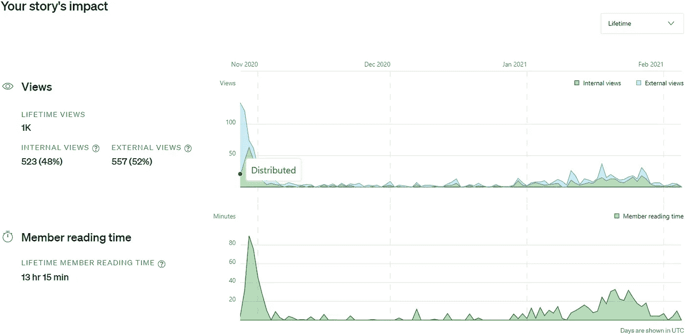
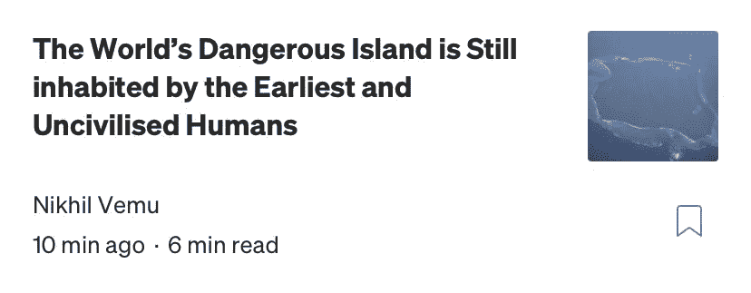
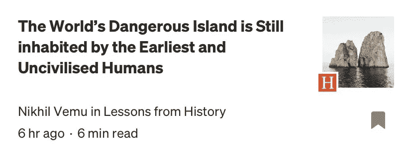
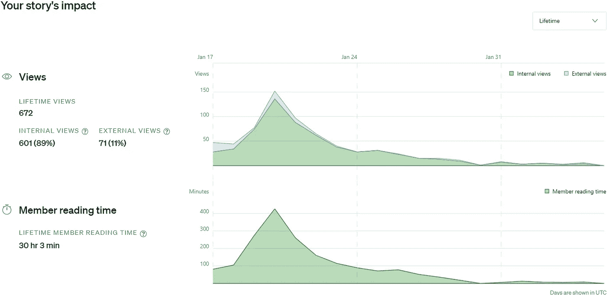

# 完美的工艺，我做了一个伟大的故事，有 30 多个小时的阅读时间！

> 原文：<https://medium.datadriveninvestor.com/perfectly-crafting-i-made-a-great-story-with-23-hours-reading-time-376dfed7c400?source=collection_archive---------6----------------------->

## 有意思吗？我是这么做的。

Photo by [Ameer Basheer](https://unsplash.com/@24ameer?utm_source=medium&utm_medium=referral) on [Unsplash](https://unsplash.com?utm_source=medium&utm_medium=referral)

> 对于一个新手作家来说，最美味的水果是他统计数据中惊人的大数字。

老实说，这些数字不会是偶然的。他们将是他伟大的背景工作和退格的结果，试图使他的创作越来越吸引读者。

# 下面是我的两个故事，给了我惊喜，也就是鼓励:

## 我的第一个惊喜——2020 年 10 月 28 日:

我的第一个最大的惊喜来自于故事“Vertu:最昂贵的手机品牌”。有什么特别的？’。

*(我将文章昵称为 Vertu)*

我确信大多数媒体读者不会知道这个被低估的品牌。所以我开始写它。

在最后的评论中，这篇文章感觉像是 Vertu 的“广告”。我不想在任何酒馆发表，因为他们遵守 Medium 的无广告政策。我自己发表的，带着我的狗去散步。

回来后，我想看看它的统计数据。而**就** **被始乱终弃了！**

但是我感到有点不满意。如果我之前猜测这是一个值得策展的故事，我会把它发表在酒吧里，对吗？

过了一会儿，我收到了创业公司发来的*私信。他们说他们喜欢我的文章，他们的读者也会喜欢，他们问我是否有兴趣和他们一起出版。*

我被加入了 Medium 最大的活跃酒馆！我简直不敢相信！我马上把我的作品加入其中，他们接受了。对我这个新手来说，那是一个伟大的时刻。

> 第一天的浏览量很大！ **134 浏览量**！
> 
> 第三天的会员阅读时间最高，为 **1 小时 29 分**！

Stats for ‘Vertu’

我的其他文章*(直到最近的一篇)*都没有达到过**那个**水平。现在已经超过 1k 次了。

我尽最大努力在接下来的故事中打破自己的记录。努力是不够的。他们至少没有达到 Vertu 的一半。

这个故事仍在获得平均 10/天的浏览量和 10 分钟/天的会员阅读时间。

## 我的第二个惊喜——2021 年 1 月 17 日:

一篇非策划的文章在第四天晚上就超过了 Vertu！

那些日子我迷上了' ***写作合作社*** '的帖子。最强调的一点是“质量胜于数量”。

很多人都不知道印度北哨兵岛背后的历史。所以我想写一篇关于这个的文章，把质量放在心上。

**故事是这样的:**
[‘世界上最危险的岛屿仍然居住着最早的未开化的人类。’](https://medium.com/lessons-from-history/the-worlds-dangerous-island-is-still-inhabited-by-the-earliest-and-uncivilised-humans-c3d81a319a2b?source=friends_link&sk=2ed799499cbc523cc68063719a22bf16)

## 背景工作:

这是一个非常有趣的话题，我不想让它像我以前的文章一样出现。我优先考虑**最高质量和审查**。

我做了很多研究，收集了很多关于这个岛的信息。我在浏览器中收藏了许多信息丰富的标签。我在笔记本上记下每一个有趣的小点，并框出句子。我确保我没有在文章的正文中留下任何多余的脂肪。

据我所知，最终的作品是清晰的，有见识的，有趣的。一位' ***历史的教训*** '的编辑已经把它收进了他的酒馆。我希望这能满足我在辛苦工作后对美味水果的需求。

## 发布后:

唉！看我的特色照片！与下面雄伟的**泰姬陵**图片和我在最新列表中的文章上面的**美丽的** **雕像**图片相比，它看起来非常单调。

所以我换成了 Unsplash 更漂亮的随机图，肯定能吸引读者。

Before and after replacing the featured picture

可悲的是，这个故事不是策划好的。这些观点就像我的常规文章观点一样。

## 统计数据:

但是，我的上帝！我大吃一惊！看会员阅读时间！有多少人鼓掌！成员们越来越多地阅读这个故事。我获得了有史以来最高的追随者增长率。

Stats for the story — ‘World’s Dangerous island’

> 第三天，它获得了 **7 小时 6 分钟**的会员阅读时间，超过 Vertu 的最高纪录 4.7 倍！

**672** **浏览量和 30 小时会员阅读时间**会比那边很多其他作家差。但是作为一个有经验的新手，关注者和文章数量都比较少，我觉得我做了一些很棒的事情。

> 成比例的**较低的浏览量**和**较高的会员阅读时间**表明读者觉得你的故事很有趣。

## 我不在乎的语法错误:

第一个策划的故事标题是'**早期男人依然存在！在印度的北哨兵岛**’。我认为我在最后一分钟改变标题是一个很好的决定。

单词“**世界危险**”引起了滚动者的注意，因为它包含了“*负面情绪”。虽然我不在乎语法错误。*

有时候，我会为了简洁而牺牲语法。

没有什么'**世界危岛'**。有'**世界*最*危险岛屿'**。

> 尤塞恩博尔特不是世界上跑得最快的人。他是世界上跑得最快的人。希望现在天气晴朗了。

# 以更好的方式写作:

随着统计数据的提高，我对自己的信心增加了一点。现在我想提高我下一篇文章的质量。

老实说，我沉迷于在 Medium 上写文章，我有时会不顾头痛，或者牺牲我的睡眠时间来写作。现在，我计划充分休息，并在两者之间留出空隙。

一个好的计划是阅读他人的文章和书籍，并从他们的风格中获得灵感。

这些有助于写出高质量的文章。

嘿！我从未发现历史如此有趣！从现在开始，我可以在这个领域写更多的东西。

# 最后注意:

发布这篇课后作业的目的是为了表达我的快乐、感激，并让读者了解我为我的最新文章所做的背景工作。这将有助于人们更好地了解我。

最后，我想感谢你们每一个人阅读和喜欢我的故事。这个美好的回忆给了我极大的鼓舞。