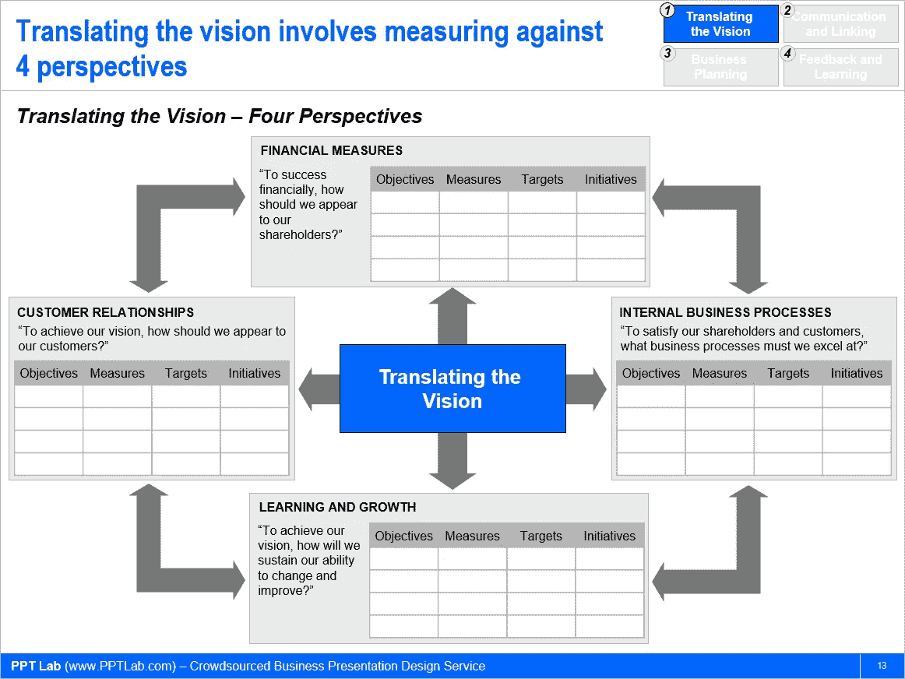
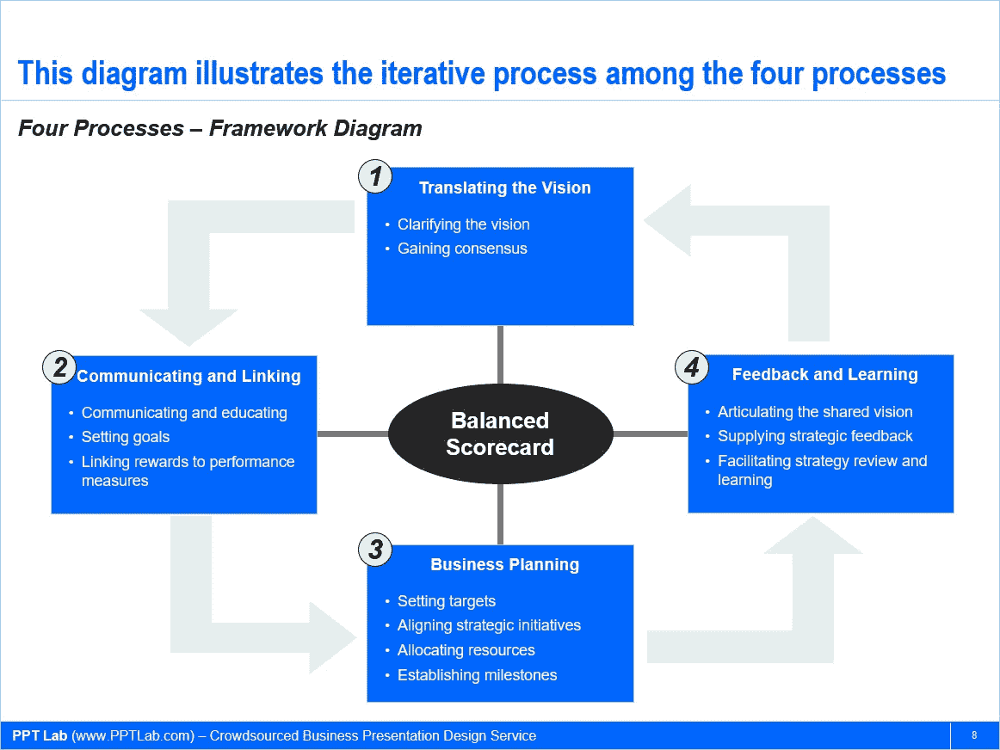

# 用平衡计分卡实施战略管理

> 原文：<https://medium.datadriveninvestor.com/perform-strategic-management-right-with-a-balanced-scorecard-4c5a51b4834a?source=collection_archive---------17----------------------->

*注:本文由我的同事***原创发布。**

**

*想出一个企业愿景、一份使命宣言、一套战略(相对而言)很容易。但是，当涉及到愿景和战略的执行时，事情变得更具挑战性。随着组织规模的扩大，这种困难也会增加。对于适当的战略绩效管理，有许多方法和工具。最好的战略管理框架仍然是[平衡计分卡](https://flevy.com/business-toolkit/balanced-scorecard-bsc)。*

*首先，我们来定义一下战略管理。维基百科指出，战略管理分析了公司最高管理层代表所有者采取的重大举措，包括外部环境中的资源和绩效。它需要明确组织的使命、愿景和目标，制定政策和计划，通常是为了实现这些目标而设计的项目和计划，然后分配资源来实施政策和计划、项目和计划。它是一种低于设定目标、高于策略的管理活动。*

*每个企业的目标都是盈利。因此，企业目标、计划和投资通常都与财务指标相关联。它将如何影响销售？投资回报率是多少？投资回收期是多久？结果，大多数战略管理系统都关注于**财务指标**。平衡记分卡的不同之处在于，它采用“平衡”方法，用三个重要的非财务类别来补充传统的财务指标:*

*   ***客户关系***
*   ***内部业务流程***
*   ***学习与成长***

*这种平衡的方法允许组织跟踪财务结果，同时监控能力建设和获得持续、可持续增长所需的无形资产的进度。*

**

*战略管理方法的基础应该基于平衡计分卡。有了记分卡和度量标准，组织应该采用一种连续的、迭代的方法来管理其战略和平衡记分卡。通过这一过程，公司可以实现以下目标:*

1.  *阐明并更新整体公司战略；*
2.  *在整个组织内传达战略；*
3.  *使部门和个人目标与战略保持一致；*
4.  *将战略目标与长期目标和年度预算联系起来；*
5.  *确定并调整战略计划；和*
6.  *进行定期绩效评估，以了解和改进战略。*

*请注意，平衡记分卡方法也可以在较低的级别独立实施，例如在部门或项目计划级别。由于上述原因，它是许多组织和咨询公司首选的记分卡方法。您可以在此了解更多关于[平衡计分卡的信息。](https://flevy.com/browse/business-document/Balanced-Scorecard-134)*

*正确实施 BSC 需要一组迭代的四个过程。*

***流程 1。翻译愿景***

*第一个过程是翻译愿景。这包括将愿景声明转化为可操作的术语。该流程还确保在管理层，我们获得共识及其真正的精髓。尽管达成共识似乎是一项简单且不言自明的任务，但事实往往并非如此。愿景陈述通常很模糊，不同的人很容易做出不同的解释。换句话说，即使每个人都同意一个愿景声明，每个人可能会对该声明在操作方面的实际含义形成不同的解释。*

***过程二。通信和链接***

*第二个包括在整个组织中传达翻译后的愿景，并就其含义对人们进行教育。它还包括设定目标和将奖励与绩效指标挂钩。*

***流程 3。商业计划***

*然后，必须根据前两个过程中完成的工作来执行业务规划。业务规划活动包括设定目标、调整战略计划和分配资源。在大多数公司，战略规划和预算是两个独立的过程。BSC 迫使您的组织整合这两个过程。*

***流程 4。反馈和学习***

*第四个过程提供了战略反馈和审查的机制。它允许持续的战略改进。可以用记分卡跟踪的信息包括对产品的反馈、关于内部流程的新知识和技术发现。*

**

*如上图所示，反馈和学习反过来转化愿景。*

*当然，战略管理的方法可以由组织的规模来驱动。一个全球性的组织可能会采用一个更加结构化的战略管理模型。这是由于它的规模、经营范围以及需要包含利益相关者的观点和要求。*

*一个小型或中型企业可能会采取创业的方法。这是因为它的规模和业务范围相对较小，拥有的资源也较少。在这种情况下，首席执行官可以简单地概述一个使命，并根据该使命开展所有活动。*

*随着组织规模的扩大，平衡计分卡方法变得更加有用和必要。*

*如需更深入的讨论，请查看以下资源:*

*   *[平衡计分卡工具包](https://flevy.com/business-toolkit/balanced-scorecard-bsc) —收集了 10 多个与平衡计分卡直接相关的框架*
*   *[绩效管理工具包](https://flevy.com/business-toolkit/performance-management-perf)—20 多个绩效管理框架的集合*
*   *[绩效管理流](https://flevy.com/browse/stream/performance-management) — Flevy 最全面的绩效管理产品，包含 25 个以上的框架(如平衡计分卡、OKR、关键绩效指标、价值映射、标杆管理等)。).*

# *想在绩效管理方面取得卓越成就吗？*

*获取知识并发展专业技能，成为绩效管理专家。我们的框架基于领先的咨询公司、学者和公认的主题专家的思想领导力。[点击此处了解全部详情。](https://flevy.com/browse/stream/performance-management)*

*绩效管理(也称为战略绩效管理、绩效衡量、业务绩效管理、企业绩效管理或公司绩效管理)是一种用于监控企业绩效的战略管理方法。它描述了用于监控和管理组织的业务绩效的方法、度量、流程、系统和软件。*

*正如彼得·德鲁克的名言，“如果你不能衡量它，你就不能改进它。”*

*拥有一个结构化和稳健的战略绩效管理系统(如平衡计分卡)对任何组织的可持续成功都至关重要；并影响到我们组织的所有领域。*

*[点击此处了解我们的**绩效管理最佳实践框架**。](https://flevy.com/browse/stream/performance-management)*

*在 [**管理和企业咨询**](https://app.ddichat.com/category/management-and-corporate-consulting) **:** 中安排一个 DDIChat 会话*

* [## 专家-管理和企业咨询- DDIChat

### DDIChat 允许个人和企业直接与主题专家交流。它使咨询变得快速…

app.ddichat.com](https://app.ddichat.com/category/management-and-corporate-consulting) 

在此申请成为 DDIChat 专家[。
与 DDI 合作:](https://app.ddichat.com/expertsignup)[https://datadriveninvestor.com/collaborate](https://datadriveninvestor.com/collaborate)在此订阅 DDIntel [。](https://ddintel.datadriveninvestor.com/)*