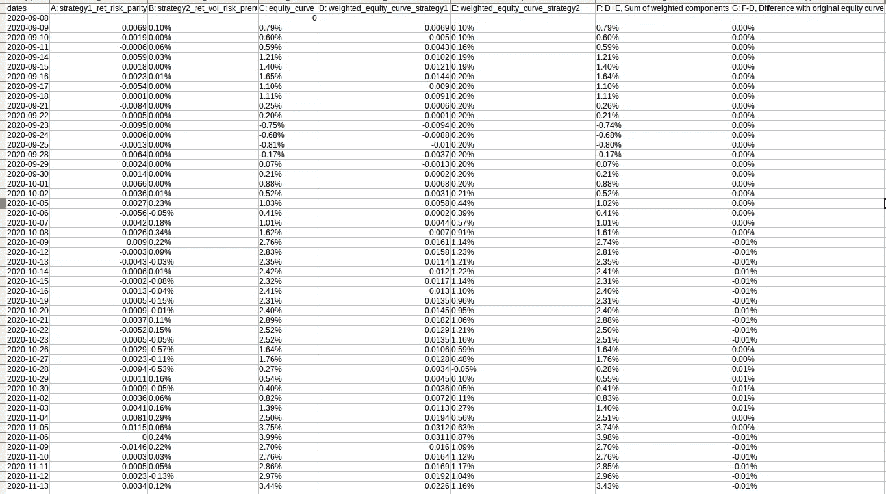

# 在我的全自动算法交易系统中开发性能监控组件(第 3 部分)

> 原文：<https://medium.datadriveninvestor.com/performance-monitoring-component-in-my-fully-automated-algorithmic-trading-system-part-3-3d41f14005?source=collection_archive---------9----------------------->

Equity curve breakdown: Return attribution of different strategies

如果你的投资组合中有多种策略，你可能会问自己:总体表现中有多少是由某一特定策略决定的？还是某个特定的乐器？

一些听起来微不足道的事情。不是。事实上，当你开始考虑不同战略和不同时期的现金流入和流出时，还有更多东西要看。

在我以前的文章([第一部分](https://medium.com/datadriveninvestor/developing-a-performance-monitoring-component-in-my-fully-automated-algorithmic-trading-system-88f5afae05cd) & [第二部分](https://medium.com/datadriveninvestor/developing-a-performance-monitoring-component-in-my-fully-automated-algorithmic-trading-system-983368441bba))中，我在我的算法交易系统中开发了最小可行产品(MVP)功能来跟踪以下内容:

*   滑点/佣金
*   每日回报
*   计入账户现金流入和流出后的绩效(时间加权回报)
*   汇率的影响
*   滚动波动性——当前战略风险的代表
*   下降表

*这里***解释全自动算法交易系统的设计和部署。**

*在我三部曲的最新部分中，我添加了一个新的特性:**各个策略对整体权益曲线的回报贡献。**此功能能够衡量影响，同时说明不同策略的资金流入和流出。*

***回报贡献—解读曲线***

*您可以对下图进行如下解释——总体权益曲线(绿线)可以分解为其组成部分，即在最后一个时期，在投资组合价值的 3%收益中，策略 1(蓝线)贡献了大约 2%,策略 2(橙线)贡献了大约 1%。*

**

*Equity curve breakdown: Return attribution of different strategies*

***回报贡献——数学***

*在这一部分，你可以参考我的解释和下面我手写的方程式。我本可以用乳胶来写方程式，但我选择了节省 1 个小时的时间。*

1.  *首先，我找出每个周期 t 中持有的各个策略的投资组合价值(净清算价值)的比例/权重，w，s。*

**

*Proportion/weight of portfolio value held by strategy*

*2.第二，我用 t-1 时的 w 乘以这个时期策略的时间加权收益，t，得出策略 s 在 t 时的加权收益。*

**

*Weighted return of strategy s at time t*

*3.第三，为了得出加权回报权益曲线(绿色和橙色线)，我将累积积应用于第二点的加权回报。*

**

*Cumulative product of weighted returns*

*4.最后但并非最不重要的是，根据时间加权回报对原始权益曲线进行三角测量。我总结了成份股加权权益曲线，并能够回到原始权益曲线。你可以参考下表。*

**

*Triangulate with the original equity curve*

*注意:我还没有完全考虑过这个问题，因为我只是在寻求一个近似值。我怀疑这种微小的差异是由于组内和组间效应的动态成分造成的。我在这里写了一个 R 包**，在不同的上下文中分解这样的‘变化’。***

****

****我的待办事项中有哪些需要进一步增强的性能监控组件？****

*   **执行价格和自适应限价订单的偏差。**
*   **获取均值-方差、风险-平价、布莱克-里特曼解决方案的策略之间的相关性/协方差矩阵**

> **如果你喜欢这篇文章，你可能会发现前传第一部和第二部也很有趣！在前传中，我加入了额外的性能监控功能，如权益曲线、时间加权回报、下滑、汇率影响、滚动波动和提款。**

****源代码****

****参考文献****

*   **[https://www . cfaininstitute . org/-/media/documents/book/RF-lit-review/2019/rflr-performance-attribute . ashx](https://www.cfainstitute.org/-/media/documents/book/rf-lit-review/2019/rflr-performance-attribution.ashx)**