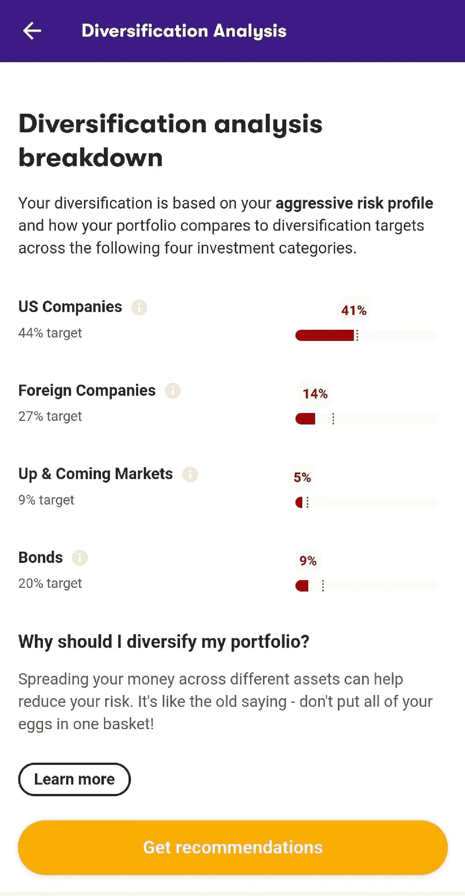

# 个人投资应用——两种策略的故事

> 原文：<https://medium.datadriveninvestor.com/personal-investment-apps-a-tale-of-two-strategies-181fec85e332?source=collection_archive---------12----------------------->

“我想你会喜欢我刚开始使用的这个新投资应用程序。就像一个可以赚钱的游戏。这叫 Stash。”

这是三年前我的好朋友 Jen 对我说的一句话，它引发了一千次股票交易。她的建议并不罕见，因为应用程序交换一直是我们关系中反复出现的主题。她让我进了 Fitbit 作为回报，我把她介绍给了多林哥。我不再使用健身追踪器，珍的西班牙语课也越来越少，但我们的投资几乎成了每天的话题。

Jen and I spend a lot of our face-to-face time on our phones, but the apps we share always spark dialogue. Photo: [Pillar Pedreira/Agência Senad](https://www.flickr.com/photos/agenciasenado/30554309793/)o on [Wikimedia Commons](https://commons.wikimedia.org/wiki/File:Fotos_produzidas_pelo_Senado_(30554309793).jpg)

自从珍的致命建议后，我们每个人都发展了自己使用 Stash 的方式。虽然我们的投资理念有相似之处，但我们的策略和方法却非常不同。如果不是因为一个重要的事实，这是不值得注意的，我们很快就会谈到这个事实。

让我们先弄清楚一件事——我们不是在谈论日内交易。Stash 不是为这种投资而建立的，它的四个每日交易窗口不能提供日内交易者所依赖的即时反应。这并没有阻止我和 Jen 从一开始就努力让它为我们工作，但是由于我们朝九晚五的工作要求，缺乏交易灵活性和我们错过交易窗口的倾向很快使我们的尝试压力太大。

此外，日内交易并不是我们任何一个人想要的。我们本想快速致富，因为谁不想呢，但我们真正的期望总是长期的。一旦我们完成了短暂的日内交易，我们都安定下来，开始使用 Stash。

Jen’s inability to watch good things just sit around also means that cookies don’t last long in her house. Photo: Polymath38 on [Wikimedia Commons](https://commons.wikimedia.org/wiki/File:Cookie_jar.jpg)

正是在这里，我们的投资路径开始出现分歧。Jen 的主要策略是定期自动买入或自动买入。Jen 对这种投资非常感兴趣，因为，正如她所说的，“我不能为狗屎存钱。”许多人用传统的储蓄账户做一些类似的事情，但是看到现金坐在那里，看起来什么都不做，让 Jen 想花掉它。

为她的每一笔投资建立每周购买计划，这有助于 Jen 在心理上将 Stash 重新标记为账单。这对她来说非常有效，因为她如此勤奋地支付账单，以至于只用了六分之一的时间就还清了 30 年的抵押贷款。这也意味着，每次她有新的股票时，她储存的金额都会增加，因为她的第一步总是设置自动储存。

我的方法远比 Jen 的更手工。我的自动投资为零。当我想投资时，我会安排从我的银行账户中取出一定数量的钱，存入我的总储备基金。然后，我根据股票或交易所交易基金(ETF)的当前价格以及我从新闻中或从 Jen 那里听到的任何金融八卦，将这笔资金分配到两三只股票或 ETF 中。这种方法通常会阻止我把钱投入到可能接近价值峰值的投资中，这是 Jen 用她的自动存款所冒的风险。然而，这也让我有可能错过两周一次的买入之间的价值低谷。我可以通过更经常地检查我的个人投资价值，并在计划外增加现金来最小化这种风险，但这不是我目前策略的一部分。

你可以想象，Jen 选择每周买入她的每一笔投资，这意味着她比我投入更多的钱。我每月的投资总额大约是 50 美元，而珍的投资总额是几百美元。这部分是因为，与 Jen 不同，我有一个单独的高收益储蓄账户，在我允许存放资金之前，我会把钱存入这个账户。尽管我喜欢藏钱，但一想到我的全部积蓄都要受市场涨跌的影响，我就感到恶心。我没有 Jen 那种大胆的能力把 Stash 当成我的应急账户。但这并不意味着我过去没有用过。

 [## 将数据隐私转化为你的优势，重建消费者的信任:下一个投资前沿

### 抖音的使用在疫情期间激增，全球大约有 8 亿用户使用该平台…

www.datadriveninvestor.com](https://www.datadriveninvestor.com/2020/09/18/turn-data-privacy-to-your-advantage-and-rebuild-consumers-trust-the-next-investment-frontier/) 

珍和我以前都从我们的账户里取过大笔钱。在我的情况下，提取的钱刚好少于 1000 美元，这是我账户的全部金额。事实上，在我做一些个人财务调整的时候，我花了大约一年的时间把所有的钱都拿出来了。在我选择退出期快结束时，Jen 自己取出了一万美元，数额要大得多。这是她的大部分股票价值，但不像我，珍从未停止投资。她的自动建仓方法让她的投资组合再次迅速盖过了我的投资组合，尽管我回来交易时买入的金额比我的习惯要大。

今天，Jen 的投资组合价值是我的 20 倍——优势 Jen。不过，她的购买方式让她处于不利地位的地方是多样化。几周前，Stash 推出了多样化分析工具。这份细目表向你展示了对于你所选择的投资风险水平，投资于美国公司、外国公司、新兴市场和债券的理想平衡是什么样的。然后，它会将你的实际投资组合拿出来进行比较，这样你就可以看到专家建议你调整什么。

My portfolio diversification analysis. Jen managed to hit the target on US Companies, but all of her other rankings were lower than mine. Photo by author

珍和我立即比较了我们的结果。我的账户状况很好，尽管还有一些地方需要改进。相比之下，Jen 的多样化经营就糟透了。她每周都在投资上砸钱，但她持有的许多股票都是通过 Stash 每周(以前是每天)的“Stash Party”赠品开始的。我有相当数量的相同股票——Stash Party 是我当时回到 Stash 的部分原因——但我的手动购买方法促使我在股价高时将钱投入增长较慢的投资，如债券。因此，我的投资组合中有很大一部分是由这些类别的投资构成的。

不过，没什么大不了的，对吧？多样化是可以解决的。我将接下来的几次买入瞄准了我的分析中最薄弱的部分，看到这些分数立即有了提高。Jen 也采取了多样化的措施，在她薄弱的地方投入额外的资金。

但是珍的针没有动。事实上，除非 Jen 进行几次更大的“额外”购买，或者重新分配她的自动储备，否则她不太可能提高她的多样化投资，或者至少不会很快提高。她的自动存储方法意味着这个门槛每周都在提高，因为她把同样比例的投资现金投入到同样的账户中，这些账户让她获得了最初的低多样性排名。

当然，如果她的股票价值突然暴跌，或者她的债券和新兴市场投资价值飙升，这种情况可能会改变。第一个比第二个更有可能发生，它对 Jen 多元化的积极影响可能是短暂的。从长远来看，Jen(和我)的多元化水平可能会因股票暴跌而恶化。我这么说是因为当股市在去年春天开始触底时，我们都把所有多余的钱都投入了股市，我怀疑我们会以同样的方式对另一次暴跌做出反应。

市场暴跌的真实可能性突显了低多元化的风险。高度多元化是一个值得推荐的投资策略。简单来说，你没有把所有的鸡蛋放在一个篮子里。市场波动可能会抹去你的大部分股票回报，但你的“更安全”的投资——有时感觉它们的增值速度和一只老乌龟走路的速度差不多——几乎不会受到灾难性的打击。

这就是为什么专业管理的退休投资通常基于投资者的预期退休年份，也是为什么鼓励年轻工人尽快购买 401Ks 等产品。退休投资组合离目标年份越远，就有越多的时间来弥补风险更高但收益可能更高的投资的损失。随着退休年的临近，投资组合转向债券和类似的选择，以帮助确保前几年的任何重大收益免受市场冲击。

珍比我大七岁。她可能会被建议采取比我风险更低的投资策略，因为我们的目标是长期的。当然，在某些时候和某些地方，Jen 更激进的投资组合被证明是理想的。珍成功地提取了 1 万美元。她在 2020 年初将这笔钱取出，当时市场正创下一个又一个新高。考虑到长期投资和冠状病毒仍在地平线上，Jen 不愿意出售。但是，兑现她藏匿的投资组合将消除所有，但少数最后支付她的抵押贷款，她迫切希望该法案了她的生活。

事实证明，Jen 在接近市场顶部时卖出了股票。她全部提款中的 3000 美元或 30%是利润。根据 NerdWallet 的数据，股票市场的平均回报率为 10%(这大约是我自己提款时的利润)。Jen 当时的投资组合并不比现在多元化多少，她风险更高的投资策略对她手中的房契起到了很大作用。更重要的是，她的时机恰到好处。

Movement of the Dow Jones Industrial Average from January 2017 to April 2020\. Photo: [Creative Commons/Wikimedia](https://en.wikipedia.org/wiki/File:Stock_market_crash_(2020).svg). Edits in red by author.

但是，如果她直到几个月后才开始偿还抵押贷款呢？在她退出后不久，市场见顶，然后随着疫情站稳脚跟，开始了 2 月至 3 月的疯狂下跌。如果 Jen 在春天想要那 10，000 美元，那么其中的大部分就不会存在了。

当然，几个月和几年的投资大不相同。如果 Jen 根本不想撤资，并让她的投资安然度过这场风暴，她在市场低点买入的收益可能已经覆盖了她在 12 月份卖出的大多数股票目前的价值差异。传统智慧会告诉她不要管这笔钱，多付一年左右的抵押贷款，如果我是她，我可能会这么做。如果市场继续上涨，她可能会后悔退出。相反，她时间上的幸运意外给了她合理期望的最好结果。

这将我们引向我在开始时提到的关键事实。珍和我基本上同时重新开始了我们的投资，我从零开始回到 Stash，珍努力重建她的投资组合，但最终清理掉了她的房子。我们有相同的投资机会——储物聚会、春季市场暴跌等。但选择了不同的投资方式和速度。正如我们所看到的，Jen 的投资组合是我的 20 倍，但我的投资组合更加多样化。读到这里，人们可能会认为我们得到了截然不同的结果。但是我们没有。事实上，我们目前的回报率几乎相等。

在这种情况下，你可能想知道我们的投资方法是否真的比另一种更好。你应该像我一样更慢更保守，还是像 Jen 一样更有活力更大胆？如果你的目标是长期增长和稳定，你可能更适合我的战略。Jen 自己也表达了这种想法，至少在多样化方面。现在她的抵押贷款已经没有了，她预计在未来十年左右不会有任何大额提款的愿望。她正努力使自己的投资组合多样化，更好地将自己与今年早些时候可能让她陷入困境的各种市场变化隔离开来。

但如果你像 Jen 一样，认为传统的储蓄对你来说很难，你需要看到更大的短期回报，以便把钱藏起来，她的方法可能更适合你。你总有机会像她一样，在市场下跌前获得 30%的利润。只要知道这是一个风险更大的赌注，尤其是如果你没有耐心时不时地度过低谷。(根据记录，Jen 以个人的骄傲断然拒绝任何对她不利的销售。当她在一家大麻公司的股票上遭受了 1000 美元的长期贬值时，她的坚忍反应令人敬畏。)

重点是你应该以适合你个性和你目标的方式投资，无论是短期还是长期。尽管我们的友谊有很多相似之处，但在一些重要的方面，我和珍是非常不同的人。她可以把 20，000 美元当作自己的储蓄账户，进行高风险投资。这种前景会让我心悸。她可以平静地看着一只摇摇欲坠的股票损失 95%的价值，但仍然拒绝卖出，即使反弹的前景渺茫。如果我一开始就冒险买入这种潜在的垃圾股，我可能早就减少损失了。她可以打开 auto-Stash，然后坐下来，让应用程序为她买入，不管每笔投资在做什么。我需要感觉到我能最大限度地控制每一美元的价值。

也许所有这些都是我和 Jen 喜欢一起投资的原因。我们的方法不同，足以挑战我们的个人假设，让我们考虑我们自己可能不会采取的策略。我们有时确实会采纳对方的建议——Jen 会选择我发现的一只新的低风险 ETF，或者我会向她感兴趣的一家不确定或不稳定的公司注入一点额外的现金——但我们从不强迫对方改变我们的整体策略。我们的方法对我们每个人来说都是最好的，只要账面上至少有一点利润，对我们来说就足够了。

**进入专家视角—** [**订阅 DDI 英特尔**](https://datadriveninvestor.com/ddi-intel)