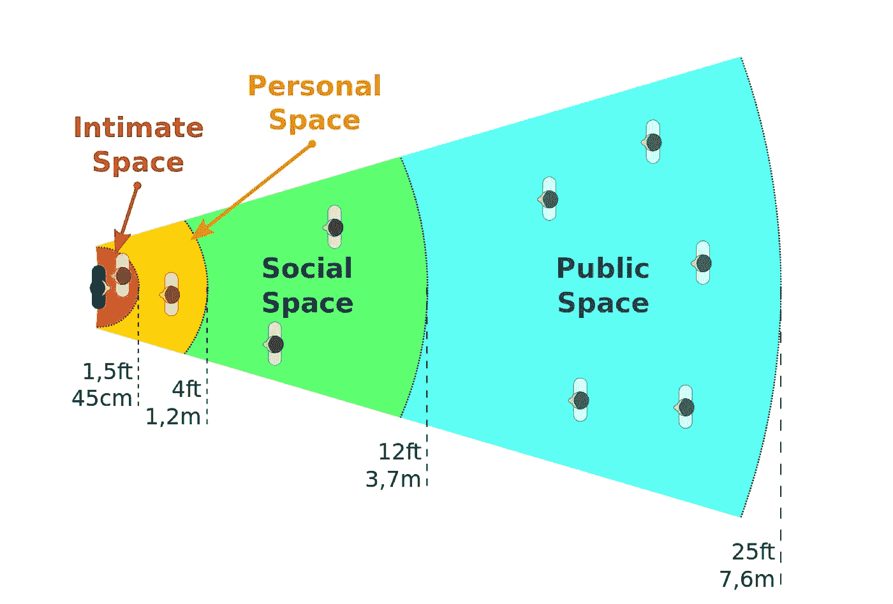

# 私人空间和在家工作

> 原文：<https://medium.datadriveninvestor.com/personal-space-and-work-from-home-ff120eb0baca?source=collection_archive---------6----------------------->

## 这对生产力意味着什么

Image by Jean-Louis Grall / CC BY-SA ([https://creativecommons.org/licenses/by-sa/3.0](https://creativecommons.org/licenses/by-sa/3.0))

当新冠肺炎袭击和关闭开始时，我再次意识到我非常幸运。有很多人在挣扎，但我的挣扎真的只是围绕着生产力。我足够幸运，能够从亚马逊 Prime 订购食品杂货或送货上门。当路边杂货店没有我要的东西时，我的耐心就受到了考验。真实的零世界问题。

当然…和两个更小的孩子呆在家里是̶a̶ ̶c̶h̶a̶l̶l̶e̶n̶g̶e̶lovely.惯例已经过时，屏幕时间无限增加。

我通常在租来的办公室工作。然后学校/日托被关闭。然后，我们呼吁，在疫情肆虐的时候，让保姆在身边不是一个好主意。然后去租的办公室也不是一个好主意，即使它是一个孤立的封闭空间，因为有些设施是共享的，你不知道谁碰了什么。

 [## 释放结果的简单哲学|数据驱动的投资者

### 这是我们播客中帕迪·布鲁斯南的一段话。帕迪是一个正念和冥想老师，一个…

www.datadriveninvestor.com](https://www.datadriveninvestor.com/2020/03/16/a-simple-philosophy-to-unlock-results/) 

然而，呆在家里可以观察到空间是如何影响情绪和生产力的。

我们四个人住在一个小公寓里很难熬。3 月初，我们收到通知，我们大楼里至少有一个人的新冠肺炎病毒检测呈阳性，这意味着沿着走廊走到电梯，然后乘电梯到大厅，然后在外面的大厅来回走，都有被感染的风险。散步或开车可能会暴露我们潜在的无症状的自我，或者暴露给大楼里的许多老年人。

除此之外，尽管工人面临风险，大楼停车结构的建设仍在继续。一整天，千斤顶锤不停地敲打着混凝土，这使得 Zoom 会议变成了一场被孩子们拉着、听着施工噪音、试图真正思考工作的战斗。

几个星期后，我妻子想出了一个主意，让我们试着去别的地方度过隔离期。呆在原地是一种冒险，我们的神经开始紧张，而 ***非常幸运*** ，我们有能力这样做。我们最终搬进了一所房子，一夜之间，效果立竿见影。

进入后院，进入地下室，远离邻居的声音，不需要去大厅或门卫室取东西就能收到快递，这些都有很大的不同。我可以完成更多的工作，恢复理智。

另一个好处是有专门的工作空间。即使孩子们仍然可以找到我，我也可以在餐桌旁开辟一个角落来工作，这有助于我进入“工作模式”。

我怀疑物理空间能在多大程度上影响情绪和工作效率。我持一种坚忍的看法，认为一个空间应该对我的前景和产出没有什么影响。我错了。

对于那些与在家工作的员工打交道的公司来说，盘点一下他们的家庭状况，以便调整期望值可能是件好事。甚至像额外的卧室这样的东西也可能意味着高生产率和疯狂之间的区别。

归结到关键因素，我们得到这些问题:

*   在没有电话或会议安排的情况下，你每天能不间断工作多少分钟？
*   你有专门的工作空间吗？
*   你和其他人分享那个空间吗？(也就是说，他们至少在你工作的一半时间里都在那里)
*   你白天必须照顾孩子或受抚养的家庭成员吗？
*   你白天接触很多噪音吗？
*   你觉得 WFH 对你的工作能力和注意力有什么影响？

通过获得这些问题的答案，我们可能会更好地了解我们的同事是如何处理 WFH 的，如果他们不总是按时赴约，或者需要处理紧急的个人问题或家庭破裂，就可以放他们一马。

**进入专家视图—** [**订阅 DDI 英特尔**](https://datadriveninvestor.com/ddi-intel)