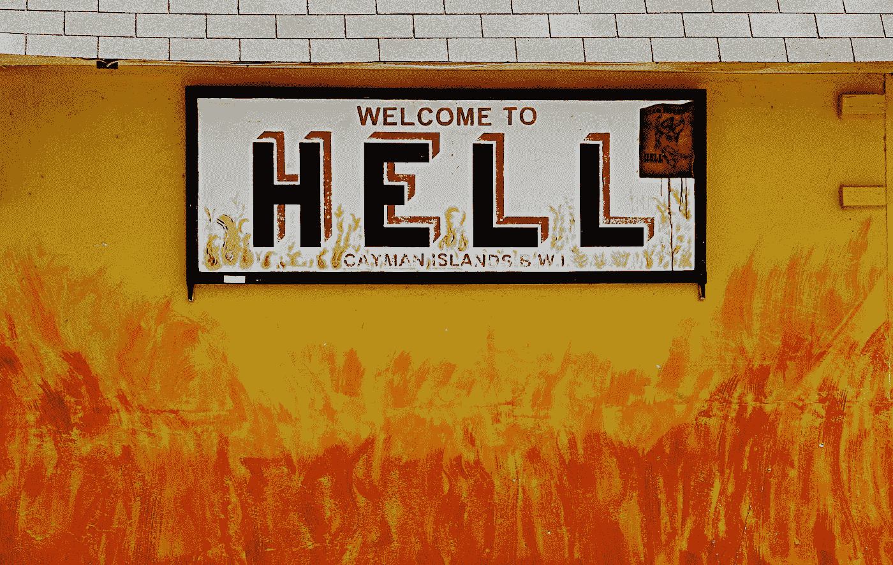
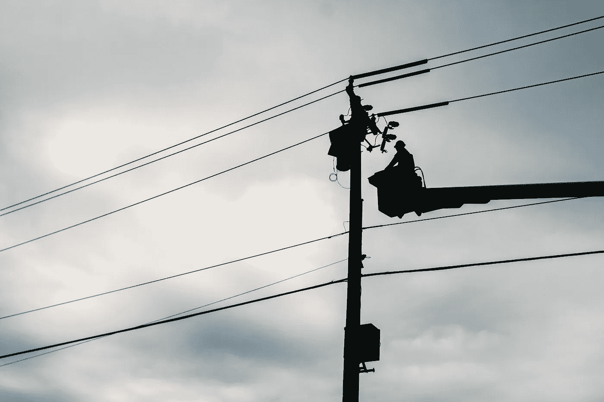
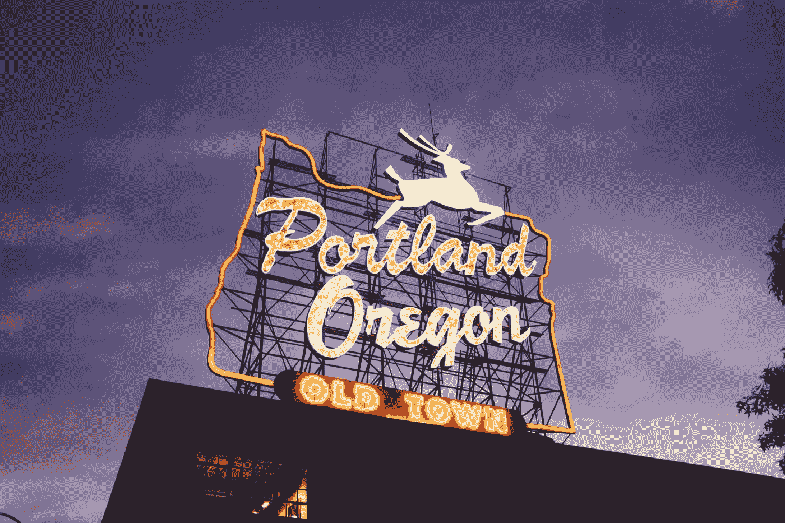

# 视角是企业家最好的朋友。这是我如何赢得我的！

> 原文：<https://medium.datadriveninvestor.com/perspective-is-the-entrepreneurs-best-friend-here-is-how-i-earned-mine-804b6b211ac1?source=collection_archive---------11----------------------->

Photo by [Sylas Boesten](https://unsplash.com/@fathomfilms?utm_source=unsplash&utm_medium=referral&utm_content=creditCopyText) on [Unsplash](https://unsplash.com/s/photos/risk?utm_source=unsplash&utm_medium=referral&utm_content=creditCopyText)

为自己创业是你做过的最具挑战性和最冒险的决定之一。你的成功取决于你能多好地管理对企业来说意味着生死的决策。你能忍受可能让你损失数千美元的决定吗？几百万呢？你家人的晚餐呢？你能做出让人们丢掉工作的重大决策吗？这种决定会让你失去公司，让你的家庭陷入混乱？这些是你每天都要做的决定，没有指南。

# 你怎么知道什么是正确的决定

简答？你不知道。你找到尽可能多的信息，尽可能做出明智的决定。很多时候这取决于你的直觉。你的直觉。你在真空中做决定，几乎没有准备时间。

这里有一个问题:做出这些困难的决定不会让你残废。如果是这样，而你错过了机会，从这种情况中恢复会更加困难。你不能让有问题的决定阻止你做出决定并继续前进。

 [## 在创业之旅中，拥抱学习|数据驱动的投资者

### 好像建立一个数百万美元的公司还不够困难，企业家必须额外照顾他们的…

www.datadriveninvestor.com](https://www.datadriveninvestor.com/2018/10/16/on-the-entrepreneurial-trek-embrace-the-learning/) 

记住，当你做这些生死抉择时，你不能怀疑自己；做出决定，然后继续前进。如果是错的，回头改正，从中吸取教训，自我评估，找出你做错了什么。告诉你自己，“如果我走之字形而不是之字形，我会领先，或者至少减少我失去的东西”是一个愚蠢的差事。你站起来，向前走，用你所学的知识重新做一遍。你不能做的是让错误的决定让你产生怀疑，并冻结你。那样做，你就真的有麻烦了。

Photo by [James Lee](https://unsplash.com/@picsbyjameslee?utm_source=unsplash&utm_medium=referral&utm_content=creditCopyText) on [Unsplash](https://unsplash.com/s/photos/what-the-hell?utm_source=unsplash&utm_medium=referral&utm_content=creditCopyText)

# 听起来没什么吸引力

现在，你可能会对自己说，“这听起来太残忍了，为什么有人会自己做生意呢？如果风险和压力如此之大，那么做到底有什么意义呢？”

答案很简单:没有比这更好的了。没有什么比知道自己对家庭和自己负有全部责任更令人满足的了。你对自己负责，我相信这是巨大的授权。对我来说，对他人负责和对自己负责同样重要，这增加了满足感——还有，养猫，你每天都在做，拥有自己的事业。

> "学会倾听猫的声音，你就可以做任何事情！"

Photo by [American Public Power Association](https://unsplash.com/@publicpowerorg?utm_source=unsplash&utm_medium=referral&utm_content=creditCopyText) on [Unsplash](https://unsplash.com/s/photos/man-on-wire?utm_source=unsplash&utm_medium=referral&utm_content=creditCopyText)

# 无形的走钢丝行为

事实上，成为一名成功的企业家的回报是巨大的，很多时候人们只看到好处。很搞笑；我认为人们看到一个企业主的所作所为，会对自己说，“伙计，他的生活真轻松。他出现在这里。他在那里做这个。看来他过上了最好的生活！”

外人很难看到真实的视角；去理解什么是真正的压力。很多企业主每天都在平衡和导航，这是不可能的。然而，如果他们擅长，一个企业家会让它看起来平滑无缝。

我处理得很好，我经常冒一切风险，从不三思而行。我睡得像个婴儿。我一无所有，知道什么是真正的痛苦，所以这种观点对我的成功至关重要。对任何从远处观看的人来说，这似乎毫不费力。毫不费力就像一个 NBA 球员让投篮看起来很容易一样。

Photo by [Tim Mossholder](https://unsplash.com/@timmossholder?utm_source=unsplash&utm_medium=referral&utm_content=creditCopyText) on [Unsplash](https://unsplash.com/s/photos/basketball?utm_source=unsplash&utm_medium=referral&utm_content=creditCopyText)

# 太轻松了

你曾经站在一个 NBA 球员背后，看他在三分线后投篮吗？他们让它看起来毫不费力。你看不到的，是他们这辈子投的 20 年，1000 万个篮球。生意也是一样。一个有经验的企业家会看到这一点，并知道发生了什么。

是的，很难。然而，这也是除了生孩子之外你能做的最有意义的事情。要成功做到这一点，你必须相信你是不可战胜的，没有什么可以阻止你。你一定认为你是超人。我认为大多数企业主相信他们是，如果他们不相信，他们应该相信。

> “把世界的重量扛在肩上需要超人的努力，由超人来完成。”

你必须相信你能承受生活抛给你的一切；我认为不管环境如何，你都会活下来。你可能会被揍一顿；你的脖子上可能会粘上氪石，你不得不奋力冲出泳池。你可能要爬上、下、越过或绕过任何障碍物。你必须每天都相信你会胜利，毫发无伤地从另一边走出来。这可能需要一天，一周，一个月，一年，十年，但是你必须坚持工作，坚持努力。我不认为大多数人理解这种心态的价值。

把世界的重量扛在肩上需要超人的努力。那是企业家！现在，将这一点与强大的自我、谦逊和谦卑结合起来，你就有了一个非常有力的组合。

# 我的观点

你必须努力不要失去洞察力，并从中汲取力量。生活会教会你许多功课；尽量不要忘记他们。对我来说，我永远不会忘记，17 岁时，我曾住在镇上最糟糕的地方，住在一个每周 25 美元的廉价旅馆里，与海洛因成瘾者和妓女住在一起。我们共用一个浴室，有一扇用床单盖着的窗户，一张你会在一部糟糕的 70 年代电影中看到的破旧的床，还有一盏没有灯罩的灯！只有该死的灯泡。这是一个噩梦，但它是我的。当时我不知道这是一场噩梦，我很高兴有一个地方睡觉。

我想到躺在那张床上，听瘾君子们争论谁用的垃圾比谁多——听妓女们做她们的生意，尤其是在周末。“失败者负责人”尖叫着瘾君子不要烧毁大楼。这些事情每晚都在我周围发生，吓得我魂不附体。

Photo by [Zack Spear](https://unsplash.com/@zackspear?utm_source=unsplash&utm_medium=referral&utm_content=creditCopyText) on [Unsplash](https://unsplash.com/s/photos/old-hotel?utm_source=unsplash&utm_medium=referral&utm_content=creditCopyText)

住在那个蹩脚的，毒品泛滥的，我们称之为旅馆的地方，盯着天花板，不知道你要做什么，让这一切看起来如此绝望。绝望是因为你相信你没有选择；你面前什么都没有。没有人敲你的门告诉你去上学，去上大学，把你推向任何特定的方向，或者提供任何好处。什么都没有。你 100%靠自己！我会小心上班时不被抢劫，回家时也会小心。

> “当你有我的经历时，做出艰难的决定有多难？不是的，因为我从来不会失去我的视角。”

# 偶然的企业家心态

从那次经历以及其他类似的经历中，我相信我带着企业家的心态离开了。这家酒店只是塑造今天的我的众多例子中的一个。从我记事起，我就一直是这样，当我 28 岁决定创办自己的公司时，我的经历至关重要。关键是因为当机会出现时，我毫不犹豫。

从我的角度来看，这无疑比小时候偷食物要好得多；13 岁失去兄弟姐妹；
14 岁右眼失明；
16 岁时，我被四个家伙碾压，鼻子被打破，昏迷在一个公交车站下；
我之前提到的那个可爱的酒店，当时我 17 岁；
18 岁被螺丝刀捅；
在我 19 岁的时候，一个垃圾箱砸到了我，导致了 14 次腰部手术和三次阿片类药物依赖，
更不用说在 21 岁时目睹了多起谋杀和三起自杀。

我可以继续。

关键是我们都可以为自己没有做想做的事情找借口，无论是在我们的个人生活还是事业中。我知道有很多人比我过得更糟。几年前我在非洲，看到了我无法想象的贫困程度。还是那句话，视角。

Photo by [bill wegener](https://unsplash.com/@wegenerb?utm_source=unsplash&utm_medium=referral&utm_content=creditCopyText) on [Unsplash](https://unsplash.com/s/photos/africa-slums?utm_source=unsplash&utm_medium=referral&utm_content=creditCopyText)

# 这个问题

我能更好地处理创业的压力，是因为我在成长过程中学会了处理它吗？

或者，如果我成长的方式不同，我会做得更好吗？

视角让我毫无疑问地做决定；有效管理和处理压力；对自己和自己的能力有不可动摇的信心，并努力在这个过程中保持谦逊。

我认为成为一个成功的企业家需要具备的所有特征。

多好的旅程啊！

【关于我的更多信息，请到 jerrybrazie.com 链接到我的播客，在脸书链接到杰里·巴兹的商业页面，在脸书链接到我的成功心态小组页面，在推特和 insta gram[*@杰里·巴兹*](http://twitter.com/jerrybrazie) *。*