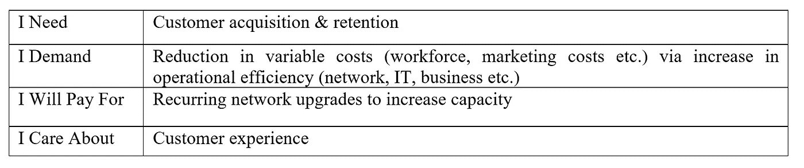
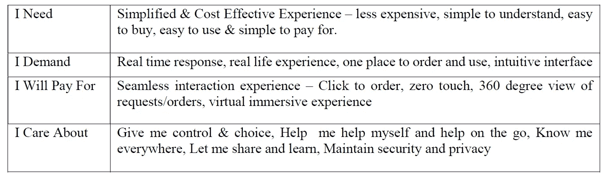
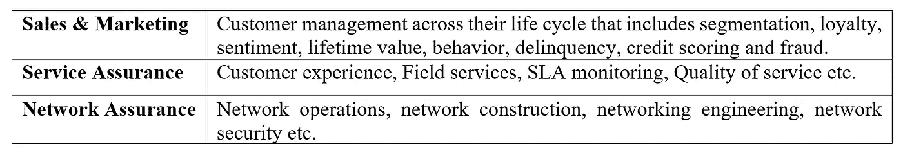
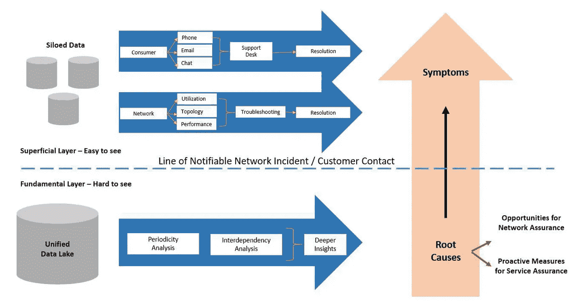

# 使用机器学习和人工智能解决电信企业问题的前景

> 原文：<https://medium.datadriveninvestor.com/perspectives-on-enterprise-problem-solving-for-telecommunications-using-machine-learning-ai-d57f1ac26c30?source=collection_archive---------7----------------------->

在公开文献中，关于分析、数据科学、机器学习和人工智能的定义有很多争论。其核心是，它们都指向一个全面的数据驱动的解决问题的策略。分析、数据科学和人工智能/人工智能的目标是:

*1。解决问题*

*2。支持一个叙述*

*3。理解一个现象*

*4。去发现新的东西*

企业的目标以及实现这些目标的开源和优质服务产品的目标可以分为以下几类:

*1。解释—描述性(商业智能空间)*

*2。预测—预测(数据科学空间)*

*3。推荐—规定性(人工智能空间)*

对发生的事情的解释(支持一个叙述或理解一个现象)属于 BI 空间。对未来事件的预测是解决问题的最有效方法之一，属于数据科学领域(它涉及机器学习和深度学习)。推荐通常属于人工智能领域，目标是发现一些新的东西。每个企业用例总是属于这三大目标中的一个或多个。

 [## 认知计算——一套被广泛认为是……

### 作为它的用户，我们已经习惯了科技。这些天几乎没有什么是司空见惯的…

www.datadriveninvestor.com](https://www.datadriveninvestor.com/2020/02/19/cognitive-computing-a-skill-set-widely-considered-to-be-the-most-vital-manifestation-of-artificial-intelligence/) 

所有这些区别都很重要，因为人工智能/人工智能行业领域的动态性质。随着它的成熟，一个共同的理解将会发展，但在此之前，这种结构会简化我们的思维过程，以便更好地解决问题。

电子通信行业是技术的推动者。它是资本密集型的，因为它需要大量的网络基础设施来提供固定线路和无线服务。为了有效地解决问题，我们需要区分关键利益相关者及其观点。

> 1.运营商或通信服务提供商
> 
> 2.订购服务的最终客户
> 
> 3.作为咨询合作伙伴或独立软件供应商的合作伙伴。

运营商的固定成本直接由客户数量(网络流量)决定。因此，获得新客户会显著提高电信公司的盈利能力，失去新客户会导致利润急剧下降。

Communication Service Provider’s Perspectives

不要过多考虑客户类型、他们的人口统计数据或所提供的服务类型，[最终客户期望以下](https://www.customerzone360.com/topics/customer/articles/436358-telecommunications-2020-how-enterprises-will-get-b2c-like.htm#):

**Customer Perspectives**

有些咨询和技术合作伙伴可以解决通信服务提供商的特定业务需求或业务挑战。这些合作伙伴希望不仅仅是解决方案提供商，而是真正的合作伙伴。他们了解客户的业务、他们试图实现的目标以及底层技术。这三种力量结合在一起，他们试图为自己的业务定位，以实现长期发展。

Partner Perspectives

整个电信业的业务问题在本质上是相似的。这些问题的解决方案可以大致分为三个领域。

Telecommunications Problem Domains

在采用的早期阶段，AI & ML 服务吸引了销售、营销和服务保证领域，因为它们通过客户获取、保留和增强客户体验对底线收入产生了直接影响。

使用机器学习和人工智能解决问题的一个关键要求是数据湖。拥有一个数据湖对于将信息放在一个地方，然后利用它供 AI/ML 服务使用是至关重要的。下图描述了拥有一个统一的数据湖来确定根本原因而不是单独诊断症状的重要性。

数据湖模型建立在数据需要在一个地方可访问的思想之上。但是 AI/ML 更多的是关于数据，而不是数据中的信号。它不仅仅是一个数据湖，还需要成为一个[数据中心](https://www.zdnet.com/article/why-ai-machine-learning-is-driving-data-lakes-to-data-hubs/)，在这里共享、实时处理和按需基础设施可以产生更好的模型和见解。拥有良好的云战略是使用 AI/ML 解决电信问题的关键要求。

**Diagnosing Symptoms vs Identifying Root Causes**

最后，使用 AI/ML 解决企业问题需要四个关键领域的专业知识:

*1)了解数据的电信专业知识*

*2)了解下游整合的业务专业知识，以获得真正的投资回报*

*3)问题框架和解决方案开发的 AI/ML 专业知识*

*4)端到端解决方案协调的 IT 解决方案架构专业知识*

作者 [Subhash Talluri](https://www.linkedin.com/in/subhashtalluri/) ，是人工智能/人工智能领域的 AWS 解决方案架构师，专注于电信行业。