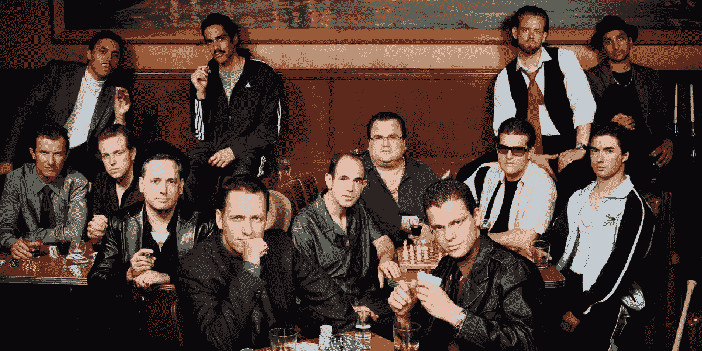
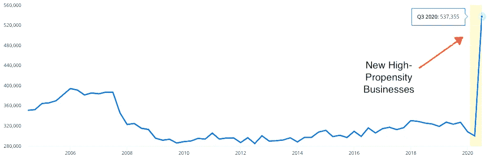

# 彼得·泰尔提出的开创十亿美元生意的 7 个问题是无情的

> 原文：<https://medium.datadriveninvestor.com/peter-thiels-7-questions-for-starting-a-billion-dollar-business-ce5a924bd1bc?source=collection_archive---------3----------------------->

## 这就是为什么你应该考虑他们所有人。

Source / [WikiCommons](https://en.wikipedia.org/wiki/File:PayPal_Mafia.jpg)

新冠肺炎·疫情制造了全球紧张局势，点燃了另一个创业的春天。

# 适量的紧张会改变世界。

随着消费者采用新的购买习惯，老企业消亡，新的创业公司如雨后春笋般成长。

我们正集体行动起来，解决日益增长的需求、新问题，并构建“*新常态*”人们意识到他们不仅仅是工人、工资单数据和电子表格上的数字。在家工作的员工意识到他们可以同时为多家公司提供服务。

你的知识、承诺和个性是你超越传统职业的机会。

# 新企业家时代正在酝酿之中。

今年，我将与全球数千万人一起建立我的数字公司。

今年，美国的商业申请出现了[的大幅增长，迄今为止，2019 年的增幅为 31.8%。数据显示，仅在 2020 年第三季度(7 月至 9 月)，就有超过 50 万家高倾向企业注册。高倾向意味着企业有很大的潜力雇佣其他人。](https://www.census.gov/econ/bfs/index.html)

Author / [Census.gov](https://www.census.gov/econ/bfs/index.html)

在大洋彼岸，英国在 2020 年第三季度见证了 221，020 家新成立的公司，根据公司统计与去年同期[相比**增长了 30.2%。**](https://assets.publishing.service.gov.uk/government/uploads/system/uploads/attachment_data/file/929462/Incorporated_Companies_in_the_UK_2020_Q3_CSV_file.csv/preview)

根据毕马威的报告，在全球范围内，风险投资支持的初创公司在过去一个季度的 4861 笔交易中筹集了 732 亿美元。

这种突然的变化可能会带来更多的自由职业者、自助创业公司和令人兴奋的公司。

# 来自彼得·泰尔的 7 个创业问题

彼得·泰尔强烈主张避免传统智慧。

泰尔先生通常不需要介绍，但这里有一点给第一次听说这位德裔美国企业家和投资者的人。

彼得·泰尔与埃隆·马斯克共同创立了贝宝，在脸书的早期阶段为其提供资金，投资了 Airbnb，现在经营着美国国防承包商 Palantir。众所周知，他是一个有争议的人，他会问公司的每个新员工一个问题来充分接受这一点:“很少有人同意你对什么重要事实的看法？”

这个问题无疑是一场思考的盛宴，尤其是考虑到从彼得·泰尔的核心圈子里崛起的亿万富翁的数量之多令人匪夷所思。Paypal 黑手党——一群最初的 PayPal 员工——出去建立了特斯拉、SpaceX、LinkedIn、YouTube，Inc .、Palantir Technologies、Affirm、Slide、Kiva、YouTube 和 Yelp。

**你*到底能从创业巨星身上学到什么？***

*彼得·泰尔分享了 7 个问题，每个创业公司都必须回答这些问题才能获得成功。以下笔记来自他的畅销书，*零比一:创业笔记，或如何构建未来。**

*根据彼得的说法，如果你掌握了所有 7 个问题，你就走上了成功和财富之路。*

**

*Photo by [ThisisEngineering RAEng](https://unsplash.com/@thisisengineering?utm_source=medium&utm_medium=referral) on [Unsplash](https://unsplash.com?utm_source=medium&utm_medium=referral)*

# *1.工程问题:你能创造突破性的技术而不是渐进的改进吗？*

*畅销书的书名是零比一。*

*只有突破才能从零到一，创造惊人的进步。从 1 到 2 的东西只是增量，从 68 到 69 的东西对客户来说几乎是不可识别的。*

*破坏这个场景的唯一方法是带来一些突破性的东西，或者至少比我们已经拥有的东西好十倍。你可以把这个建议应用到自由职业和公司业务中。*

*上个月，我提出了比客户预期高出 10 倍的价格。我现在有一个顶级徽章和超过 8000 美元的努力。如果你试图创新，那么提供一个改变游戏规则的服务或产品。*

*亚马逊是创造突破的天才。我再也无法想象没有 Kindle 的生活了。然后，看看 Alexa Echo，这是一款*超便宜的*智能设备，它包含强劲的声音、无限的音乐库，并帮助你创建一个智能家居，所有这些都不到 50 美元。*

*问问你自己，你的提议是否具有开创性？*

*如果不是，你如何瞄准游戏规则改变者？*

# *2.时机问题:现在是创业的好时机吗？*

*大多数创业公司不会因为产品不好或者服务不到位而失败。*

*彼得·泰尔认为，大多数创业公司只是在错误的时间出现了。想法通常是好的，但公司可以早几十年。微软在 2000 年推出了它的第一款平板电脑，比苹果早了将近 10 年，然而今天没有人拥有微软的平板电脑。人们有一个 iPad 或一个三星标签。*

*与微软不同，年轻的创业公司没有奢侈的机会去赌一个以上的创新产品。现金流毁掉了大多数年轻的企业。如果明天无法接触到群众，也许是时候调整重心了。你的想法可能存在于另一个时代。*

*投资者知道这个痛苦的事实。我很少会预测不出一支股票或一支 ETF 的趋势。吸干我的钱的是我进出市场的时机。*

*时间是新的商业定位。*

**时机，时机，时机。**

# *3.垄断问题:你是从一个小市场的大份额开始吗？*

*从一个大市场开始感觉像是一个安全的赌注。*

*人们和公司会验证你的想法，你也知道这个行业到底有多少钱。你可以创建精确的 KPI，设定大胆的目标，走上一条成熟的道路。创业公司就是这样失败的。*

*玩大市场意味着你在和鲨鱼、鲸鱼和大鱼一起游泳。为最少的可行受众开发产品是一条更好的道路，因为大公司经常忽视利基市场的力量。脸书从哈佛开始，帮助学生社交。谷歌来自斯坦福。你的公司可能来自于只为几个朋友和邻居提供能引起他们共鸣的服务。Doghbie 是一家价值百万美元的公司，在当地提供手工制作的饼干。*

*老牌企业通常会忽略微小的市场，因为它们达不到传统的收入目标。你可以享受更少的竞争或者至少一个你可以应付的竞争。年轻的创业公司很难与跨国公司争夺同一块蛋糕。*

> *主要目标是做一条小鱼。你会和英镑一起成长，新的鱼不会对你的生存构成直接威胁。*

*主宰一个利基市场。吃吧。创造。喂。展开。*

**

*Photo by [Pedro Santos](https://unsplash.com/@pedro_ag_santos?utm_source=medium&utm_medium=referral) on [Unsplash](https://unsplash.com?utm_source=medium&utm_medium=referral)*

# *4.人们会问:你有合适的团队吗？*

*人就是生意。*

*我设定了一个个人目标，雇佣比我聪明的人，因为他们以我无法做到的方式为公司做出贡献。我的理想可能不总是可以实现的，但如果我有疑问，我会和一个能轻易胜过我的人一起去，即使这意味着很多个人焦虑。*

***知识就是商业，而我不是这个房间里最聪明的人。***

*彼得·泰尔用早期清洁技术创业公司作为例子来说明这一点。*

**“清洁技术公司的高管们穿着西装打着领带跑来跑去。这是一个巨大的危险信号，因为真正的技术人员穿着 t 恤和牛仔裤。因此，我们制定了一个总括规则:拒绝任何创始人盛装出席推介会议的公司。一个会销售的 CEO 没有错，但如果他真的*看起来*像一个推销员，他可能不擅长销售，更不擅长技术。”**

*你的人能比你做得更好吗？*

*如果答案是*不*，你就没有真正的伟大事业。*

* [## 规划和建立您的房地产业务|数据驱动的投资者

### 房地产行业是有史以来最受欢迎的五大职业之一。原因很简单。它确实…

www.datadriveninvestor.com](https://www.datadriveninvestor.com/2020/12/14/plan-and-build-your-real-estate-business/) 

# 5.分销问题:你有办法不仅创造产品，还能交付产品吗？

互联网有助于销售。

你可以钉 SEO，掌握社交媒体，地毯式轰炸你的潜在客户，并通过良好的电子邮件活动达到数千人。准入门槛低，不用像 80 后的创业公司一样担心分配问题。

但是，所有的推广和可及性并不能让你的公司成功。最有力的营销工具是*口碑*。当你满足了一个客户，他们会把你的想法分享给其他潜在客户，其他潜在客户会找到更多的客户。(想想[梅特卡夫定律](https://en.wikipedia.org/wiki/Metcalfe%27s_law#:~:text=Metcalfe's%20law%20states%20the%20effect,the%20system%20(n2).&text=Only%20later%20with%20the%20globalization,describe%20Ethernet%20purchases%20and%20connections.)但是对于商业来说。)

你能创造疯狂的粉丝，像野火一样传播你的想法吗？如果可以的话，考虑大规模交付你的产品来创造更多狂热的粉丝。

你准备好带你的公司去月球了吗？

Photo by [Dane Deaner](https://unsplash.com/@danedeaner?utm_source=medium&utm_medium=referral) on [Unsplash](https://unsplash.com?utm_source=medium&utm_medium=referral)

# 6.持久性问题:你的市场地位在未来 10 年或 20 年内还能保持吗？

彼得·泰尔谈论未来现金流的重要性。

你有没有想过几乎没有收入的公司是如何达到 IPO 和惊人的市场评价的？

Twitter 和脸书在向客户出售一个广告之前都是价值数十亿美元的公司。耐久性问题隐藏了答案。投资者以 10 年或 20 年后的感知价值来评估公司，因为他们会考虑公司未来可能解决的问题。想象一下，如果你的公司是早期的脸书，试图连接哈佛的大学生。

当你第一次进入一个新市场时，这个市场通常需要时间来发展。你的商业前景对任何即将到来的决定都至关重要。如果你计划未来 10 年或 20 年，尽管竞争即将到来，你也可以保持领先，建立自己的公司。

企业家和投资者试图预测未来的问题，并在问题出现之前找到解决方案。

# 7.秘密问题:你是否发现了别人看不到的独特机会？

当客户和创始人发现同一个秘密时，奇迹就会发生。

又是彼得·泰尔最喜欢的问题——“*在什么重要的真理上很少有人同意你的观点？”—* 揭开创业现实的另一层。

人们和企业并不热衷于在未经测试的产品和业务上挥霍金钱。大多数人都是实用主义者。但是，你如何向实用主义者推销产品，并让他成为你产品的早期用户呢？

彼得·泰尔相信秘诀是造就一家伟大的公司。

如果你发现了一个别人看不到的独特机会，那么你就有值得追求的东西。独特的机会意味着大多数企业看不到你所看到的。只有你知道别人不知道的东西，你才能主宰市场。大多数人一开始并不理解好的想法。

这里明显的缺点是坏主意也会得到同样的反馈。

然而，如果你和你的客户都知道一个秘密，这对任何创业公司的未来都是一个好兆头。

Photo by [Mario Gogh](https://unsplash.com/@mariogogh?utm_source=medium&utm_medium=referral) on [Unsplash](https://unsplash.com?utm_source=medium&utm_medium=referral)

# 你还在等什么？

你正生活在创业的春天。

每次经济低迷都会造成紧张，这改变了客户的行为，并为新业务创造了机会。找到一个你感兴趣的问题，开一家公司，并提供解决方案。

今天大概是创业的最佳时机。问自己一些深刻而不舒服的问题，想想如何在未来几年建立一个成功的公司。

如果你对如何经营一家企业感到困惑，那就向伟人学习吧。

进入专家视图— [**订阅 DDI 英特尔**](https://datadriveninvestor.com/ddi-intel)*