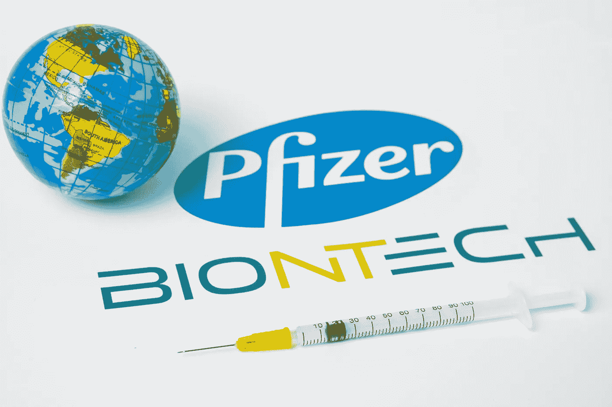
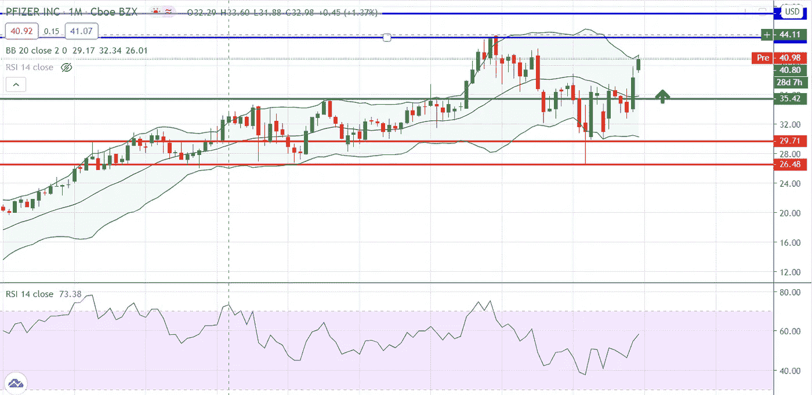
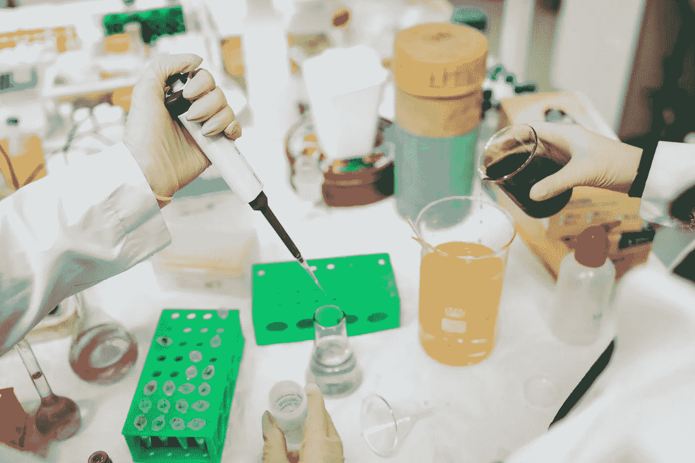
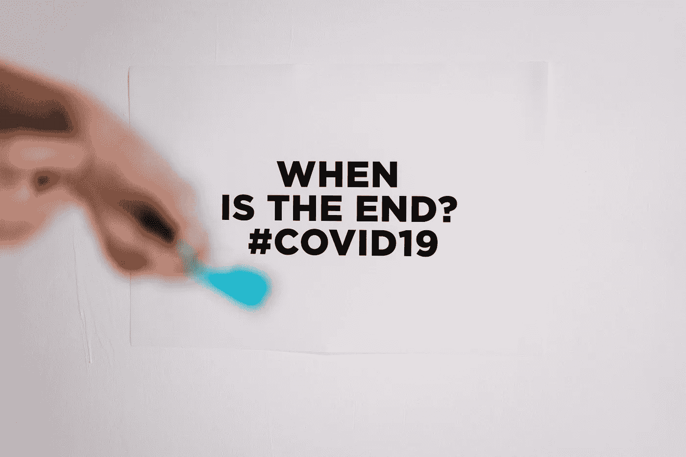

# 辉瑞是下一个游戏规则改变者

> 原文：<https://medium.datadriveninvestor.com/pfizer-the-next-game-changer-8eae9e22f55d?source=collection_archive---------26----------------------->

根据最近的报告，辉瑞公司(纽约证券交易所代码:PFE)可能是第一个上市的疫苗。到目前为止，最受期待的候选疫苗是 BNT162b2，这是与德国生物技术公司 BioNTech 合作开发的新冠肺炎疫苗。

周三，英国监管机构已经批准辉瑞公司的疫苗投入使用。到目前为止，英国已经订购了 4000 万剂辉瑞/BioNTech 联合疫苗，足以为 2000 万人接种疫苗。该公司还向 FDA 提交了一份他们的候选 mRNA 疫苗紧急使用授权(EUA)的申请。

辉瑞疫苗在大范围内预防轻度至重度新冠肺炎病的有效率为 95%。辉瑞公司与美国政府签署了 19.5 亿美元的协议，供应 1 亿剂疫苗，并可选择另外 5 亿剂。

## **在最近积极的疫苗消息之后，金融市场鲜有显著的变动**

*   油价创 8 个月新高
*   美国股市指数道琼斯攀升至八个月来的最高水平，并在上周触及 30000 点的里程碑。
*   金价创下七年来最大单日跌幅。

## **辉瑞(纽约证券交易所:PFE)股票技术展望**

短期来看，该股可以继续上涨，第一个潜在目标应该是 42.30 美元，其次是 44 美元，该股有很强的阻力。另一方面，任何回调现在都可能被视为买入机会。未来两周的预期交易区间在 35 美元支撑位和 44 美元阻力位之间。从长期来看，该股有可能最终升至 50.03 美元的历史高点，但无论如何，这取决于 FDA 的批准和成功的疫苗分销。

 [## 如何通过使用 SCENARIO | Data Driven Investor 实现数字化，在新冠肺炎经济衰退中茁壮成长

### 如果数字化是避免新冠肺炎破产的解药会怎样？一百万人死亡，三十八…

www.datadriveninvestor.com](https://www.datadriveninvestor.com/2020/11/13/how-to-thrive-in-the-covid-19-recession-by-going-digital-using-scenario/) 

**新冠肺炎疫苗竞赛期间值得关注的其他生物技术股**

1.  **Moderna(纳斯达克股票代码:MRNA):** Moderna 是第一家在美国开始人体临床试验的实验性新冠肺炎疫苗制药商。11 月 17 日，Moderna 宣布了 mRNA-1273 的 3 期研究。该试验符合研究方案中预先规定的功效统计标准，疫苗功效为 94.5%。该股取得了惊人的长期价格反弹，从 2020 年 1 月 7 日的 17.68 美元到 2020 年 12 月 1 日的 178 美元，今年以来上涨了 700%以上。
2.  **阿斯利康(纳斯达克代码:AZN):** 上周，英国制药巨头阿斯利康(纳斯达克代码:AZN)加入了疫苗开发的领先行列，该公司报告称，后期试验显示其新冠肺炎疫苗非常有效。阿斯利康的疫苗名为 AZD1222，是基于经过时间考验的技术，经过基因改造，可以刺激针对冠状病毒的免疫反应。
3.  **Inovio Pharmaceuticals(纳斯达克股票代码:INO):** 在公司推进第二阶段研究后，股票最近获得了一些积极的势头，第二阶段部分将评估新冠肺炎 DNA 疫苗候选人 INO-4800 在美国成人中的效力。
4.  **Novavax(纳斯达克代码:NVAX):** 在经历了几周的下跌后，该公司的股票终于在 FDA 批准该公司的新冠肺炎疫苗候选药物 NVX-CoV2373 的快速通道指定后找到了底部。今年年初以来，NVAX 的股票已经上涨了 2200%。

## **结论**

接下来的几周对于决定这个制药巨头是否会获得 FDA 的批准至关重要。FDA 预计将在其疫苗和相关生物制品咨询委员会于 12 月 10 日召开的下一次会议上审查辉瑞的疫苗。

另一方面，最大的问题是他们将如何处理疫苗分发，特别是到达农村人口，那些没有定期获得医疗保健的人将是困难的。冷藏一直被认为是分销的一个问题，但辉瑞公司已经明确表示，他们有特殊的包装，可以将疫苗冷藏数周。它可以储存在 36 至 46 华氏度，在冰箱里可以持续近 30 天。而包括 Moderna 在内的其他公司，他们的冷藏要求则稍微容易一些。

最近，莫比尔县卫生部门的 Scott Chavers 博士说，“一旦 FDA 批准使用疫苗，它们将立即准备好分发，”莫比尔县卫生部门正在订购一个可以处理 200，000 剂疫苗的冰箱。

**访问专家视图—** [**订阅 DDI 英特尔**](https://datadriveninvestor.com/ddi-intel)