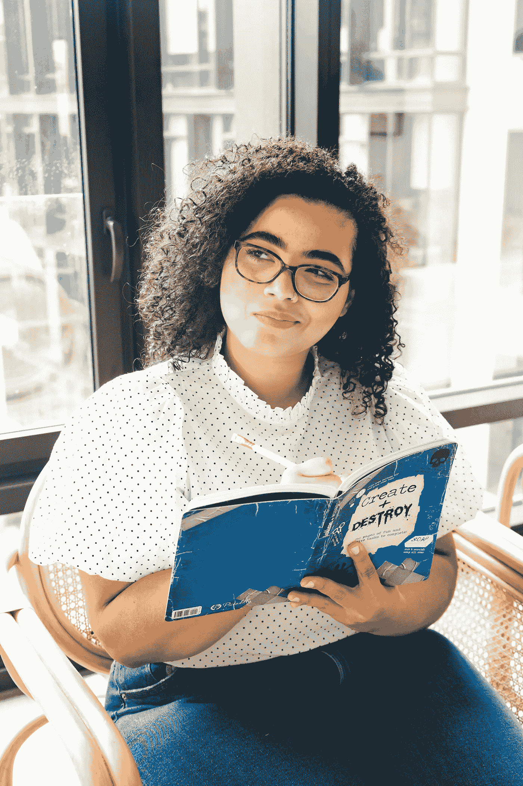

# 哲学 101:自由是说我今天不用电话，也不使用电话。

> 原文：<https://medium.datadriveninvestor.com/philosophy-101-freedom-is-saying-i-wont-use-a-phone-today-and-not-using-one-fd62713d8f8f?source=collection_archive---------9----------------------->

## 康德的自由观。

Photo by [The Creative Exchange](https://unsplash.com/@thecreative_exchange?utm_source=unsplash&utm_medium=referral&utm_content=creditCopyText) on [Unsplash](https://unsplash.com/s/photos/thinking?utm_source=unsplash&utm_medium=referral&utm_content=creditCopyText)

一个门外汉把自由看作是做任何事和说任何话的能力。

根据这个观点，我们可以说自由意味着去你想去的地方，吃你想吃的东西，不受限制地生活。

这真的是自由的全部吗？或者这个概念比我们想象的要多？

每个人都想自由。自由是世界各大洲许多人的口头禅。非洲人要求自由，摆脱那些让他们的国家陷入无休止的债务和经济衰退的领导人。美国人要求黑人从长期的刻板印象和虐待中获得自由:

 [## 我们都有自己的观点——为什么你不希望自己的观点受到攻击或质疑呢？

### 每个人都应该得到公平的对待，这包括质疑你的观点。

medium.com](https://medium.com/@amanwi96/we-all-have-opinions-why-dont-you-want-yours-attacked-or-questioned-6f7a63c150c7) 

女权主义者呼吁妇女和女孩从父权制的枷锁中解放出来。我们都呼吁世界摆脱恐怖主义、枪支暴力和大规模杀戮。宇宙恳求摆脱全球变暖，这样的例子不胜枚举。总有一些东西是人类试图从中获得自由的。

我想更多地阐明个人自由。

什么是真正的自由？

让我和你们分享一个关于查尔斯的小故事，从那里我们将看到伊曼纽尔·康德所说的自由是什么。

查尔斯刚满 18 岁。西方世界的“独立&自由”时代。

不像其他人，查尔斯的父母 Chenwi 先生和夫人相信监督一个孩子，直到他们能自立；像现在一样，他仍然不能忍受。查尔斯的哥哥姐姐们在 20 岁出头和 25 岁左右就获得了独立，看起来对他来说也是如此。

 [## 释放结果的简单哲学|数据驱动的投资者

### 这是我们播客中帕迪·布鲁斯南的一段话。帕迪是一个正念和冥想老师，一个…

www.datadriveninvestor.com](https://www.datadriveninvestor.com/2020/03/16/a-simple-philosophy-to-unlock-results/) 

Chenwi 夫妇知道青春期是孩子一生中的一个危险时期。他们决定脚踏实地，确保他们的孩子在这些艰难的时刻做出正确的选择。

> *“青春期可以认为是从* [*童年*](https://www.omicsonline.org/scholarly/childhood-epilepsy-journals-articles-ppts-list.php) *到成年的过渡阶段。这可能是迷失方向和发现的时候。*
> 
> *过渡期会带来独立和自我认同的问题；许多青少年和他们的同龄人在学业、性、毒品、酒精和社交生活方面面临艰难的选择。*
> 
> 在青少年走向成年的过程中，同龄人群体、浪漫兴趣和外表在一段时间内会自然变得越来越重要。”
> 
> *—*[*J Comm Pub Health Nurs 2017，Vol 3(4): 194*](https://www.omicsonline.org/open-access/variables-influencing-premarital-sex-among-secondary-school-adolescents-in-anambra-state-nigeria-2471-9846-1000194-95820.html)

为了实现他们的目标，陈氏夫妇制定了他们家中每个人的生活准则；没有熬夜，没有和他们认为不守规矩的朋友出去玩，等等。

诺伯特·陈维街对面的邻居最近刚满 19 岁，他们并没有列出一长串该做和不该做的事情。他的父母是自由主义者。

查尔斯暗暗希望他有诺伯特的父母——哪怕只有一天。他的生活将更少被“控制”，他可能会变得像其他孩子一样“自由”。

他觉得上当了。

我是个囚犯！当他看着诺贝特和他的朋友们每天晚上从他狭小的卧室窗户里出去闲逛时，他陷入了崩溃的沉思。

看着其他人做“酷”的事情，却不能参与其中，这让我非常难过。我相信你能理解查尔斯被父母囚禁的感觉，而诺贝特却自由自在。

但是诺伯特真的像查尔斯认为的那样“自由”吗？

为了回答这个问题，让我们看看康德眼中的自由是什么。

Photo by [DESIGNECOLOGIST](https://unsplash.com/@designecologist?utm_source=unsplash&utm_medium=referral&utm_content=creditCopyText) on [Unsplash](https://unsplash.com/s/photos/freedom?utm_source=unsplash&utm_medium=referral&utm_content=creditCopyText)

# 什么是真正的自由？

伊曼纽尔·康德。历史上一位著名的哲学家以一种相当独特的方式看待自由。对他来说，自由是自主行动的能力，也就是根据你给自己的法律行动。

简单来说，自由就是说我今天不吃甜食，不吃甜食。不管你有多想要糖果。

康德解释说，当我们寻求满足欲望(口渴、饥饿、性欲等)时。人们很容易相信我们是在自由选择。相反，我们只是在服从一个不是我们创造的提示。

> 自由就是说我今天不吃甜食，不吃甜食。不管你有多想要糖果。

如果你因为饥饿而吃东西，你就真的不自由，因为你没有选择饥饿。你只是遵从你内心的渴望。根据欲望行动使我们成为工具，而不是我们所追求的行动的作者。

同样的，如果我们相信、行动或支持某事，自由选择意味着没有任何外在的动力。

康德给**起了一个特殊的名字，即**即**他律。**

***回到我们的诺伯特和查尔斯的故事***

基于康德的自由观，两者都不自由。

查尔斯的行为是基于一种外部影响(父母)。他没有自由地选择晚上呆在家里，去上学并取得好成绩或健康饮食。他做所有这些事情主要是为了取悦他的父母。在他情绪激动的时候，他希望他能远离学校，不用每天晚上都坐在家里。

另一方面，诺贝特正在经历一个他无法控制的身体和精神变化阶段。他的父母可能不会阻止他，但这并不自动意味着他是自由的。

他熬夜、吸毒和其他冒险行为是伴随青春期而来的冲动，并因同龄人的压力而进一步增强。感觉“酷”和融入现状的需要证明了他缺乏“康德式的自由”。

> 根据欲望行动使我们成为工具，而不是我们所追求的行动的作者。

康德自由观背后的存在理由是，我们都是有理性、有推理能力的人。你和我有能力独立于我们的感觉，辨别我们自己想要什么。

运用康德学派的思想。我想知道我们今天的世界是否如我们所相信的那样是对“自由”的描绘。我们生活在一个以欲望为导向的世界。人们被允许做他们想做的事，说他们想说的话。有来自内部和外部的压力，去寻找某种方式，驾驶某种汽车，以某种方式思考等等。

社交媒体的出现让这些欲望飙升。人们有一种深切的感觉，要跟上琼斯才能感到相关。

> *根据* [*Drugs.ie(毒品和酒精信息并支持*](http://www.drugs.ie/drugs_info/for_parents_carers/risks_resilience/)*)****帮助降低药物成瘾风险的主要韧性因素之一*** *是一个人的能力* ***【三思而后行】*** *。*

换句话说，自由推理和做出理性选择的能力对于决定一个人有多“自由”非常重要。

如果别人给你灌输了这些观点，那么选择成为女权主义者或反对种族主义并不是你的固有选择。今天的大多数人都被迫改变观点，做出妥协。认为这些东西可能在更广泛的范围内被视为对自由的权利；支持它的个人并不是真正自由的。

所以下一次，在你爱上一个想法，一个运动等等之前。问问你自己，你真的是在自由行动还是“受影响”。

> 真正的自由在于我们能够做出选择，而不是出于我们的感觉或别人所说的应该。

就像上瘾一样，我们生活的其他领域也是由我们独立思考的潜力决定的。—要理性。

在那里，它在全球变暖问题上做出选择，或者带头反对非洲领导人；真正的自由在于我们能够做出选择，而不是出于我们的感觉或别人所说的应该。

为了自由，我们必须做出不受外界影响的选择。

让我们从闹钟响起时醒来这样的小事做起。尽管拉着睡更。然后被更大的生活选择所吸引。

尽管这些事情听起来很容易，但它们确实需要有意识的努力来做出决定，并坚定不移地坚持下去，尽管我们的感受和其他来自外部的拉动因素。

## 你相信我们今天是自由的吗——或者我们只是欲望的奴隶？

## 感谢阅读。
先别走。这是我的更多信息。

 [## 单身却有性生活？你在说谁？

### 单身和独身的阴影。

medium.com](https://medium.com/self-ish/single-yet-having-sex-who-are-you-decieving-25c4e1143522)  [## 愤怒:心理学家说，这可能是由自卑引发的。

### 下次有人惹恼你，再想想。

medium.com](https://medium.com/@amanwi96/anger-psychologists-say-it-might-be-triggered-by-low-self-esteem-df1d7f40d90a)  [## 我更喜欢积极分手的 5 个理由——相信我，这很有效。

### 如果我们决定分道扬镳，你就不存在了。

medium.com](https://medium.com/@amanwi96/5-reasons-why-i-prefer-aggressive-breakups-trust-me-it-works-6561241a1819) 

**访问专家视图—** [**订阅 DDI 英特尔**](https://datadriveninvestor.com/ddi-intel)