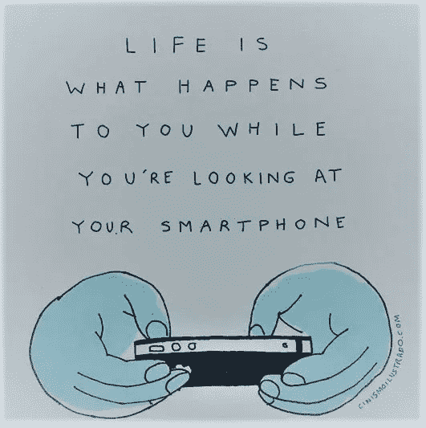

# 庞宾，新的美国！！

> 原文：<https://medium.datadriveninvestor.com/phubbing-the-new-us-41d5778f3493?source=collection_archive---------19----------------------->

不管你是否知道，你在 2020 年比之前几年更容易上当受骗。这是一个全球性的规避现象，谈话杀手，对健康有害。

cinismoilustrado.com

“Phubbing”是电话冷落某人你交谈，看一眼手机。虽然这可能不是你经常使用的词典术语，但是，这很可能是你日常生活的一部分。简单地想一想，讨论因为你的同伴(或你)掏出手机，一头扎进社交媒体的虫洞而变慢的频率有多高。这个词是在 2012 年 5 月由麦格理词典组织的一次探索中出现的，但迄今为止仍然高度相关，鉴于我们生活在一个动荡的时代，相互抨击使得当今时代比以往任何时候都更具挑战性*。*这个词是创造出来的，用来形容人们无视其他人在他们面前使用手机的现象。后者导致了“停止抽大麻”运动，号召羞辱有罪的人，设计反抽大麻的地方，并且，对于真正讨厌的手机上瘾者，进行了阶段性的调解。

Phubbing 的本意大概是通过互联网把你和其他人联系起来，但它实际上是在做相反的事情。这种现象是技术如何影响我们社交技能的最好例子，看起来可能是现代生活中相对无害的一部分，如果令人讨厌的话，但它实际上正在破坏我们的人际关系。尤其是在现在，当社会化和友谊的程度处于历史最低点的时候。疫情一直在威胁着地球上每个人的四种**【基本需求】，而像 phubbing 这样的催化剂只会让 phubbing 人感到沮丧和被排斥，从而加速归属感、自尊、有意义的存在感和控制感的丧失。此外，还有一种孤独感，害怕与交谈群体无关。尽管粗鄙者无意伤害被冷落者，但最终会导致他们的自尊和自信受损。由于大脑同时全神贯注于多个问题，长期的笨人也会受到影响，失去注意力和任务优先级的能力。**

**虽然许多人不会把被羞辱的感觉传达给被羞辱者，但这种宽容的传达往往会使问题进一步恶化。重要的是向对方解释被羞辱的感受，因为对方可能无法从你的角度来看。向一个亲密的朋友倾诉，并和那个讨厌鬼讨论这个问题，有助于形成一个对话的渠道和一个潜在问题的可能的缓解计划。**

** [## 物联网与集群报告(下)|数据驱动的投资者

### 就竞争力而言，基本上有五个行业将从物联网技术中受益最多:-工业…

www.datadriveninvestor.com](https://www.datadriveninvestor.com/2020/05/23/internet-of-things-and-clusit-report-part-ii/) 

Phubbing 表现为无害或偶尔扰乱，但可能是一些更大问题的冰山一角，如手机成瘾，自尊问题，社交媒体依赖和自我控制问题。这些问题在青少年中非常普遍，因为他们的头脑容易受影响，任何事件都会留下不可磨灭的印记。已有多个案例报道称，phubbing 是社交媒体依赖的前兆。在最初阶段停止这种做法符合所有人的最佳利益。

阻止它是一个奉献和纪律的问题。设定不使用手机的时间段，比如晚餐和就寝时间。试着把你的屏幕时间变成高生产力的时间，这当然不需要金钱上的回报，但是有益于人际关系和专注。花更多的时间和家人在一起，让所有成员都参与一些活动，比如棋类游戏、电影之夜或后院烧烤，或者如果你喜欢修剪草坪或铲雪。没错，每个人都有机会。没有一个习惯是永久的，也没有一个习惯是难以打破的。是时候通过启发我们的青少年不要成为屏幕迷来避免屏幕跟踪者的出现了。是时候关掉我的屏幕了！！

**进入专家视角—** [**订阅 DDI 英特尔**](https://datadriveninvestor.com/ddi-intel)**