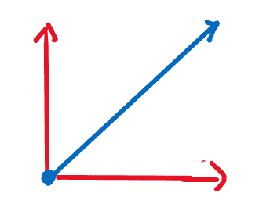
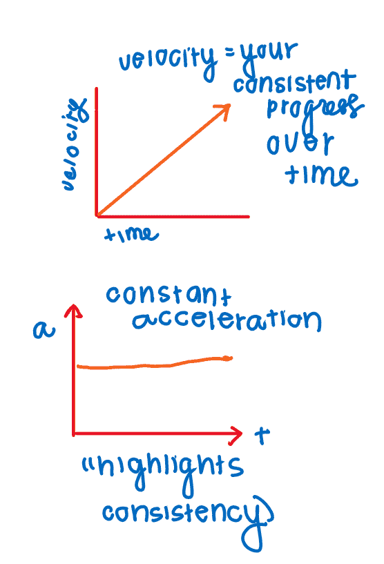
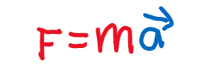
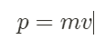
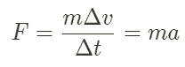
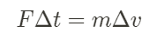
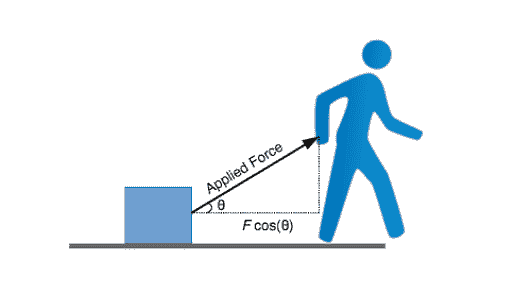
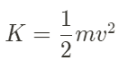
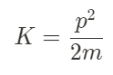

# 物理学和个人进步

> 原文：<https://medium.datadriveninvestor.com/physics-and-personal-progress-59838dd22b80?source=collection_archive---------17----------------------->

谁知道为我的物理期末考试而学习会让我成为一个生产力 x 物理交叉学科？

# 速度

让我们从一些简单的事情开始，这可能是你在物理入门课程中学到的第一件事:**什么是速度？** ( *运动学，呜呜！🍻)*

答案是:速度是你的运动方向。不像速度，它只是数量(或者矢量的大小，如果你愿意的话)。如果你和你的朋友在相反的方向骑自行车，但是你们以相同的速度前进，你们有相同的速度，但是不同的速度。

如果你以一定的速度做事，你会比速度较慢的人进步得快；通常情况下，你也会处于不同的方向。一个每周能写出 15 篇文章的人比一个每周只写一篇文章的人在写作技巧方面要快得多(假设他们每周都在这样做)。这忽略了文章的质量，我们稍后会谈到。

在物理学中，速度向量也不完全致力于 x 轴或 y 轴；可以斜着走。

在我们的上下文中，这应该分为两个不同的方向。还记得勾股定理吗？是的，应该是这样的。

这些“分量矢量”比最终矢量的大小要小。在一个特定的方向上的关注更少，而在两个方向上的关注更多(如果你真的想变得复杂，可能是三个)。所以在这两个方向上，即使你有很大的速度，你的注意力是分散的——因此，你在两个方向上的移动比你在一个特定方向上的移动要慢。

然而，如果你不得不感到在多个方向分裂，不要担心！还有更多。

# 加速度+力

我们有**加速**，或者通俗地说，“加速或者减速。”更具体地说，它是一定时间内速度的变化。本质上，如果你改变你的速度，你可以更快或更慢地前进，这取决于你的方向——这就是你的加速度。

根据**牛顿第二定律，加速度通常是由施加到物体上的外力引起的。**

**力**被定义为推力或拉力，将一个人带出其恒定状态。当外力作用于运动中的物体时，它们将被迫沿着力的方向加速——从而改变它们的速度。

回到自行车的例子:假设有人骑自行车去上班。突然，他们意识到他们拥有的时间太少了，或者他们只是厌倦了以同样的速度前进。那么，骑自行车的人是做什么的？**他们蹬得更快，在特定的方向上给自行车施加更大的力**。自行车加速，因此移动得更快。因此，他们能够更快地去上班。

基本上:如果你鞭策自己，你会让自己更快地工作。我个人是自己注意到的。在疫情的前两个月，我几乎没有进行任何体育活动——我总是在为 AP 考试而学习。做完后，我觉得很无聊。我妈妈开始告诉我去锻炼，所以我强迫自己观看并跟随克洛伊汀锻炼。我这样做了几天，只是强迫自己——然后我注意到这成了一种习惯。一小时三十分钟的 HIIT 训练成了我夏天的特色。

*要记住的一件关键事情是:把对你没有价值的力挡在外面，把朝着你想去的方向的力最大化。*

# 动力

这使我想到另一点:建立势头的问题。

你的动量是运动物体的质量和速度的乘积。本质上，它与你的速度成正比，但是它包含了你的质量。

因此，有两种方法可以增加你的动量:要么增加质量，要么增加速度(从而增加加速度)。理论上，速度的改变比质量的改变更容易，因为你必须施加一个力来增加它。因此，你可以通过在一定时间内施加一个力来改变动量。这本质上就是你如何激活某物成为动力，这个术语叫做**冲动。**

当你在某件事情上取得进展时，“质量”就是你为取得进展所做的事情的质量。这意味着有两种方法可以保持一致的势头:

*   动作要快，结果要快，尽管它们可能不是最好的质量。
*   增加“质量”，产生结果，但产生的速度不一定一样。

然而，如果你让自己走得更快，同时产生更高质量的结果，你就会增加你的动力(即**增强动力**)。

在系统没有净力的情况下，动量守恒。当有净力(产生冲量)时，动量发生变化。通过增加力量(或以更快的速度获得更好的结果的推力)，你正在激活一种冲动，当这种冲动得到适当的维持时，可以产生更高的动力。

 [## 在家工作如何提高我的工作效率|数据驱动型投资者

### 在家工作确实激发了我最大的潜能，让我更有效率。因为在家工作给了我…

www.datadriveninvestor.com](https://www.datadriveninvestor.com/2020/07/29/how-working-from-home-increased-my-productivity/) 

# 能量(特别是动能)

在物理学中，每当我们在一定的位移上施加更大的力时，就做功。它们必须在相同的方向上——如果施加的力与你希望实现的位移方向相反，这将适得其反，因为你本质上是在做负功，这就消除了能量。做了积极的工作，你会获得更多的能量。

*   因此，当你在做某件事的时候，你必须倾向于这样做。

Thanks, Khan Academy!

请注意，组件的考虑也应适用——最好是完全拥有**运动方向上的净力(即你在某个特定焦点上的进展),而不是将其分散在多个区域。这样，你可以最大化力的平行分量。然而，这比相反的方向要好。**

但是，什么是能量呢？能量本质上是物理量，是物体做功的能力。它有多种形式:势能、动能、化学能、核能、热能等。

在这里，因为它是如此侧重于牛顿力学，我们将只侧重于前两个。

势能基本上就是你停滞时的能量。你并没有真正做什么，但是你有 T2 的潜力。重要的是利用这一潜力。对于一个物体，它通常基于它们的重力势能(因此，它们必须处于最大高度)。对于弹簧，它必须拉伸到最大振幅。对我们来说，这是我们的停滞——无止境的好奇和学习，但没有用这些学习做任何事情。

通过获得速度，并产生高质量的结果，你可以减少你的势能，并将其转化为动能。动能计算如下:

基本上，你的速度越大，你的动能就越大，你的进步就越大。你的工作质量(质量)也是一个关键因素，但它没有拥有那个速度重要。你可能还注意到了动量的关系:

这确实突出了你的工作质量虽然重要，但不如保持速度重要。当它成为一种习惯，并随着时间的推移持续下去，你会发现质量会变得更好。不要过分纠结于质量:正如耐克所说，**只管去做。**

# 总结一下:

*   所有这些物理原理:速度、加速度、力、动量和能量以某种方式联系在一起。
*   当你弄清楚你的优先事项，特别是如何让自己 10 倍的时候，去一个特定的方向，并坚持下去。否则，所做的工作是无效的。
*   最大化你的速度将是增加你动能的最大因素。
*   永远在你的动力中寻找推动你前进的动力，而不是对抗。

更多见解，请联系我的 Linkedin(领英)和 T2 的 Twitter(推特)，并订阅我的 T4 个人简讯！

*这篇文章的灵感来自为物理期末考试所做的学习，以及我将在下面链接的几篇好文章。*

[**https://fs.blog/2018/03/speed-velocity/**](https://fs.blog/2018/03/speed-velocity/)

[**https://jamesclear.com/physics-productivity**](https://jamesclear.com/physics-productivity)

 [## 这些箭头会改变你对生产力的看法

### 一个受物理学启发的方程式，适用于你生活或工作中的任何优先事项

medium.com](https://medium.com/@izzygrandic/these-arrows-will-change-your-outlook-on-productivity-7368c20243b7) 

## 访问专家视图— [订阅 DDI 英特尔](https://datadriveninvestor.com/ddi-intel)