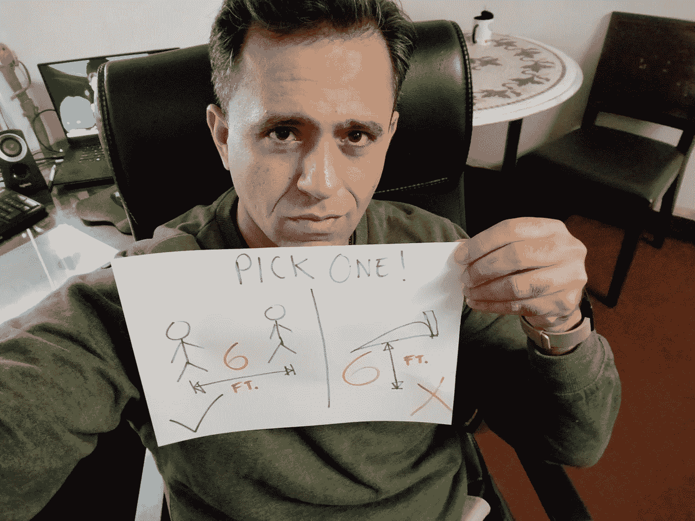

# 选择你的 6 英尺——分开或低于！

> 原文：<https://medium.datadriveninvestor.com/pick-your-6-feet-apart-or-under-f953a3720fd5?source=collection_archive---------20----------------------->

抵制变革是我们抗击冠状病毒的致命弱点

Personal photo by Khawaja Saud Masud

当我走向医院的紧急入口时，我看到一群男男女女，有老有少，还有一对坐着轮椅的夫妇。这是昨天，我带一个家庭亲戚去了一个严重的健康问题，尽管与冠状病毒无关。

不仅对 1+1 政策(即一名患者只能由一名护理人员陪同进入医院)有激烈的争论，包括保安在内的 20 多人之间的身体接触也令人震惊。随着每一次推拉，我觉得他们都无意中卷入了某种集体自杀仪式。

 [## 大笔资金和尖端技术:人工智能/人工智能投资将如何革新医疗保健…

### 在过去几年人工智能(AI)和机器学习(ML)的显著发展中…

www.datadriveninvestor.com](https://www.datadriveninvestor.com/2018/03/22/big-money-and-cutting-edge-technology-how-investment-in-ai-ml-will-revolutionize-the-healthcare-industry/) 

我站在远处，大声喊着“站开”、“散开”和“至少 6 英尺”，但坦率地说，除了一位坐在轮椅上的老太太，没有人朝我这边看。我所目睹的是，在一家顶级医院，尽管有足够数量的保安人员，但对 1+1 政策的实施却没有任何控制。没有协议提醒我们，我们不再生活在新冠肺炎时代之前——没有人暗示，也没有人监督社交距离的要求。

是的，有些标语和横幅上写着只能有一个人陪伴患者，但这是假设我们的公众会关注这样的通知，因为他们争先恐后地用轮椅把他们的亲人带进来，有些人甚至抱着他们——所有人都聚集在一个由四名警卫把守的狭窄门口。安保人员互相大喊大叫，愤怒地重复着政策，并指着横幅，好像这不是他们编造的。这是纯粹的故意伤害。

我问一个从我身边走过的医生，他是这里的负责人。他继续走着，脸朝下看着他的智能手机，喃喃自语，上帝！然后我走到另一个入口寻找管理员，这时两个管理人员和一个医生开始漫不经心地走向紧急入口，两个人都没有戴口罩或手套。看起来医院里的每个人对所有刺激都麻木了，医院执行的唯一协议就是“保持冷静”。

我带着我的亲戚穿过另一扇门去做体检，登记后，当我进入候诊室时，我看到另外近 24 个人并排坐着，尽管有足够的空间容纳两倍于他们的力量。不到一半的人戴着口罩。我拉过一把椅子，放在房间的右边角落，让我的亲戚坐在离大家安全距离的地方。

几分钟后，我看到一名医院官员和她的助手一起检查我们所在的候诊室。她站在离我两步远的地方，小心翼翼地小声问她的员工，“为什么每个人都粘在一起？”工作人员只是沮丧地摇摇头，然后她再次小声说，我离开后，请外面几排的人散开，坐在远处。显然，这位官员试图在这种情况下保持冷静，尽管媒体和每个走廊的标志都压倒性地意识到要保持距离。

在我亲戚的检查结束后，我们回到了正门的出口处，最初像暴徒一样的人群已经散去，事情似乎已经得到了控制。一切都很好！

我们似乎都在尽最大努力，但坦率地说，这还不够好，我们人类有学习困难或最困难的方式的倾向。保安人员没有接受过处理潜在的高传染性社交场合的培训，医生可能因为缺乏 [PPE(个人防护设备)](https://www.cdc.gov/hai/pdfs/ppe/PPE-Sequence.pdf)供应或缺乏纪律而不戴口罩，管理人员由于缺乏纪律或资源而无法全天候实际执行社交距离政策，患者及其家属进入医院时会加倍害怕， 不知道他们或他们的亲人是否会因为非冠状病毒的健康问题而去医院，回家时体内会携带最近取出的病毒炸弹——所有人都在拼命努力适应后新冠肺炎世界。

这不仅需要时间，但不幸的是，我们有很多第一手或第二手的经历，失去了因这种病毒而失去的亲人，并且知道许多死亡是可以通过社会距离和洗手避免的——所有的行动都在我们自己的手中——这是双关语。

当这一波和最有可能的一波新冠肺炎飓风在未来几个月甚至几年消退时，我们对机会成本以及如果更多的自律和专注本可以挽救多少生命进行了事后分析，我们作为一个人类群体可能会感到非常羞愧。

有多少生命会因为我们选择避开 [6 英尺社交距离](https://www.cdc.gov/coronavirus/2019-ncov/php/risk-assessment.html)指南或警告而失去，并且没有实行定向卫生？如果让我猜的话，我会说至少一半。为了我们大家，我希望我错了。

我们这个物种的致命弱点并不是缺乏准备，而是对全球威胁的全球行动呼吁采取懒散的态度，对承担个人责任的疏忽，以及对某些人来说，对命运的不认真态度。

这是基本的人性在起作用，至少在任何变化的最初阶段——我们抵制，我们站在惰性一边，直到变化战胜我们，然后我们屈服于它，并期待站在新的正常的惰性一边。

我们最终会适应，但这是在付出沉重代价之后。从很多方面来看，新冠肺炎疫情都在考验我们为了更大的利益而快速集体适应的能力。

> 勇气是知道什么不该害怕。柏拉图

我们知道新冠肺炎的死亡率很低(可能低于 2%)，但传播这个杀手的是真正的杀手。我们现在应该害怕的不是新冠肺炎，而是我们自己。

*请查看我的文章“* [*抗击冠状病毒需要人均纪律，而不是人均 GDP*](https://medium.com/datadriveninvestor/need-discipline-per-capita-not-gdp-per-capita-to-fight-the-coronavirus-88158840601)*。”*

______________________________________________________________