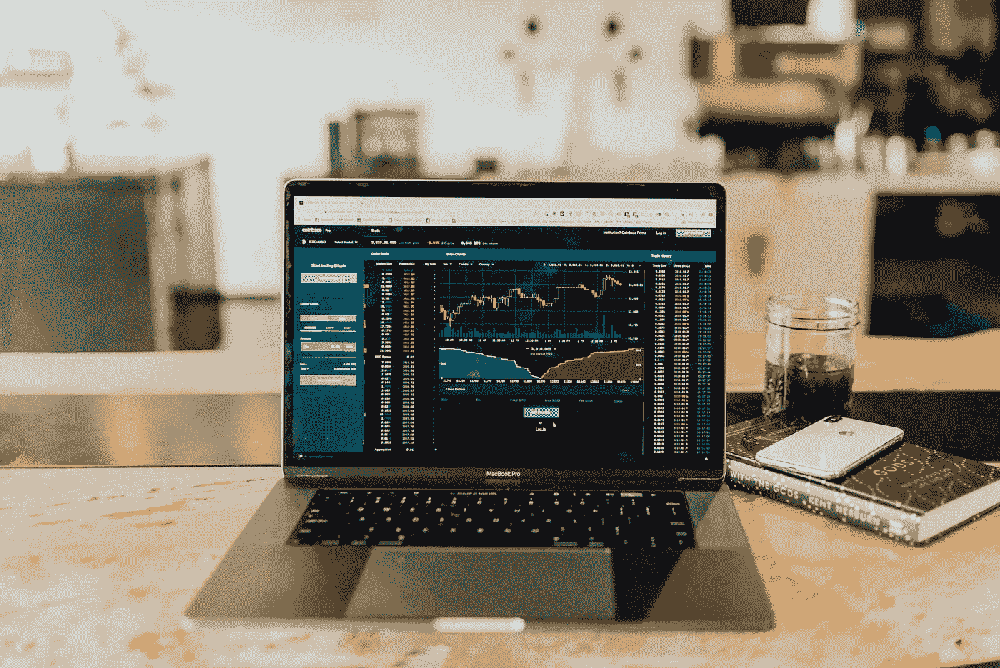

# 挑选个股与购买指数

> 原文：<https://medium.datadriveninvestor.com/picking-individual-stocks-vs-buying-an-index-235f3d35d5c3?source=collection_archive---------6----------------------->

Photo by [Austin Distel](https://unsplash.com/@austindistel?utm_source=unsplash&utm_medium=referral&utm_content=creditCopyText) on [Unsplash](https://unsplash.com/s/photos/invest?utm_source=unsplash&utm_medium=referral&utm_content=creditCopyText)

> 你必须强迫自己考虑反对的观点。尤其是当他们挑战你最喜欢的想法时。”—查理·芒格

投资股市有三种主要方式:

1.  购买指数基金，实质上是购买一整组公司和其他金融资产；
2.  选择个人公司购买；
3.  通过由专业基金经理积极管理的基金进行投资，也称为共同基金。

不存在对所有人都有效的最佳策略。你应该选择一个符合你目标的。

 [## 投资区块链前要问的三个简单问题(也是一个困难的问题)|数据…

### 现在是了解区块链的最佳时机。不同货币之间的增长率，比如…

www.datadriveninvestor.com](https://www.datadriveninvestor.com/2020/03/12/three-simple-questions-and-one-difficult-one-to-ask-before-investing-in-a-blockchain/) 

在这篇文章中，我将集中讨论前两个策略，因为投资共同基金通常需要支付高额佣金，即使你的投资没有利润。许多共同基金甚至不能“跑赢市场”，所以你最好投资一只费用率低的指数基金。

# 指数基金

如果你买了一只指数基金，你就会接触到一大堆公司，既有高质量的，也有低质量的。这种策略会让你获得平均市场回报，从长远来看是好事。举例来说，如果你看看 *S & P 500* ，它在过去 90 年的平均年化总回报率约为 10%。T4 标准普尔 500 指数是一个股票市场指数，衡量在美国股票市场交易的 500 家最大公司的价值。

在某种程度上，你可以认为这种投资策略风险较小，因为你拥有大量公司，如果一家公司破产，它会被另一家公司取代。

另一个可能的好处是，你不需要花时间研究和选择个股购买。

# 挑选个股

另一方面，如果你只购买一组精选的大公司，你可以获得比仅仅购买指数基金更高的回报。这个策略需要更多的努力，因为它需要对我们收购的每家公司进行仔细的分析。

我们在这里的多样性会减少，但是我们会对我们要买的东西有更好的了解。

与之前你可以*“买了就忘了”*的策略不同，挑选个股需要你积极投资(研究公司，以低于其公允价值的价格买入，在价格远高于公允价值时卖出)。

# 结论

在这篇文章中，我介绍了两种不同的股票市场投资方式。两者都有优点和缺点，你应该选择一个最符合你的目标和需求的。

最重要的是，为了获得良好的投资回报，我们应该始终有一个长远的眼光！

感谢阅读！

*原载于 2020 年 5 月 9 日*[*【https://vitorpedro.com】*](https://vitorpedro.com/picking-individual-stocks-vs-buying-an-index/)*。*

*这不是投资建议。这只是我对这个话题的一点浅见。*