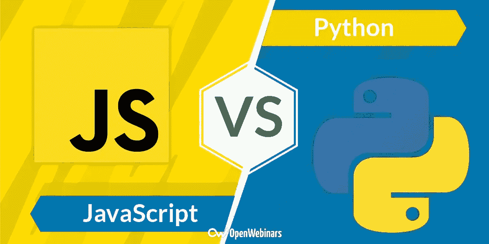
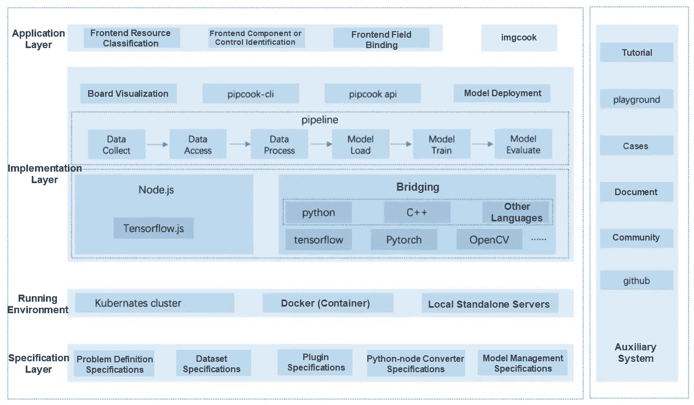
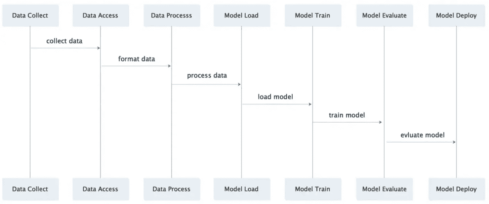

# Pipcook —为前端提供完整的智能算法框架

> 原文：<https://medium.datadriveninvestor.com/pipcook-providing-the-frontend-with-a-complete-intelligent-algorithm-framework-9e39ec5e9237?source=collection_archive---------40----------------------->

*By 阙月*

随着深度学习的发展，我们生活的所有领域都在经历智能转型。作为定位最接近用户的团队，前端也希望利用 AI 能力来提高我们的效率，降低人力成本，为用户提供更好的体验。智能转型被视为前端开发未来的一个重要增长领域。然而，前端工程师有以下疑问:

*   既然前端业务已经成熟，提供了良好的用户体验，为什么我们还需要机器学习？
*   既然机器学习需要海量的数据和人工标注，那我们为什么不用传统的规则(if…else)？
*   应用机器学习一定要掌握高等数学知识吗？
*   我们一定要找时间学习新的语言吗，比如 Python？

为了解决这些疑问，我们需要一种解决方案，使 AI 能够提高前端效率，并最大限度地降低使用机器学习的成本和难度。因此，我们产生了开发一个对前端工程师友好的 JavaScript (JS)框架的想法。这将允许他们快速收集和处理数据，并进行机器学习实验，而不必掌握先进的数学和深度学习知识。这个框架还必须是灵活的、可伸缩的，并且具有工业级的可用性。为了实现这些目标，我们推出了基于 tfjs-node 的前端算法框架 Pipcook。

# 任务解析

通过与前端工程师的交流和研究，我们发现了阻止前端团队进入 AI 领域的主要原因:

1.  **语言障碍:**在传统的机器学习和深度学习领域，Python、R、C ++是最常见的语言。前端工程师的语言 JS 很少涉及，不适合密集型计算。
2.  **算法壁垒:**数学和算法知识对于前端人员来说是一个巨大的挑战。
3.  **场景壁垒:**前端场景很少使用智能技术，因为前端工程师无法明确定义与智能技术相关的问题，解决问题时也不考虑智能技术。
4.  **数据壁垒:**前端难以获取高质量的数据，这也是智能领域普遍存在的问题。此外，数据格式和规范对前端不友好。在接下来的部分中，我们将详细讨论如何解决前面的每个问题。

*A Problem Analysis Diagram*

## 实施场景

随着 AI 的快速发展，智能赋能了很多行业。我们相信有一些网络场景可以应用人工智能。然而，在很多情况下，非算法工程师无法有效识别和确定可以使用机器学习的场景。此外，由于缺乏对模型和算法的深入理解，他们不确定深度学习可以在多大程度上解决问题，以及其性能是否优于传统的规则引擎。要解决这个问题，我们可以使用以下两种方法之一:

*   请前端工程师深入学习算法知识，让他们了解每种算法背后的原理，确定解决不同类型问题应该采用的技术。这种方法对前端工程师的要求太高，有些可能不是很热衷。
*   在我们的框架中总结出一组前端业务和领域可能遇到的场景，并将这些场景进行分类，形成案例库。有了这些案例，前端工程师可以很容易地找到类似的场景，更好地理解机器学习可以解决的问题，并直观地将这些或类似的案例应用到他们的业务中。这种方法涉及到更容易的学习曲线。

## 数据处理

我们知道数据和模型是深度学习的核心要素。如果模型是火箭发动机，数据就是它的燃料。机器学习需要大量高质量的燃料，才能让它发挥全部潜力。前端这些年积累了一些数据，我们在数据采集上也有优势，因为我们是最接近用户的团队。

前端拥有以下数据:

*   来自设计文档和模块库的 UI 数据(尽管这些数据质量参差不齐)
*   编码每天积累的数据
*   记录来自在线业务的数据，包括性能、错误和其他自定义数据日志
*   其他业务的具体数据

数据可以分为计算机视觉(CV)数据和文本数据。CV 和自然语言处理(NLP)也是机器学习的重点。然而，前端工程师通常不知道如何处理数据，以便将其转化为模型的燃料。我们的框架必须提供快速简单的数据处理，以及方便的功能，如数据质量评估和数据可视化。

## 算法

对于非算法工程师来说，模型和算法是另一个巨大的障碍。他们总是担心自己不理解一个模型的数学原理，不知道如何使用深度学习框架，比如 TensorFlow。这个问题很容易解决，也很难解决。

之所以容易解决，是因为在一些传统的深度学习领域已经积累了多年的经验，几乎每个领域都有自己流行的、成熟的、具有产业可用性的模型。我们只需要在框架中提供模型实现。这样，非算法工程师可以在不需要任何配置的情况下使用模型，也不需要担心内部实现。然而，这个问题很难解决，因为一些非算法工程师认为模型太像黑盒，并希望根据他们已知的算法知识稍微调整它们。因此，我们还必须在框架中提供干预和调整能力。

## 语言

*JS vs. Python*

语言问题既简单又复杂。作为一个简单的解决方案，我们可以使用 JS，这是前端开发人员最熟悉的语言。所以我们纯粹用 Typescript 开发 Pipcook，提供基于 JS 的 API，实现基于 tfjs-node 的数据处理和模型的插件。然而，基于 JS 的机器学习生态系统仍在发展中，我们不能希望 JS 生态系统在短时间内提供与 Python 一样的丰富性。所以，如果我们的框架只用 JS，或多或少必然是不完整的。我们的解决方案是提供一个 Python 的节点版本，比如 Swift，这样就可以在 Node.js 中调用 Python 库来帮助前端团队。

## 摘要

解决了前面的问题，我们就知道为什么要用机器学习，什么时候可以用，怎么用。此外，我们从前端工程师的角度为每个问题提供了解决方案。随着 Pipcook 和整个基于 JS 的机器学习生态系统逐渐成熟，我们相信前端工程师在使用智能能力方面会越来越好。

# 技术解决方案

*A Diagram of the Pipcook Architecture*

在解决了场景、算法、数据处理、语言问题之后，我们设计了一个基于流水线的前端流格式机器学习框架，如上图所示。管道中的模型和数据流。我们可以在这个管道中嵌入插件来处理模型和数据，并将它们转发到下游。每个插件负责机器学习周期中的特定任务。Pipcook 定义了一系列规范，允许第三方开发者开发插件来扩展 Pipcook 的功能。我们的框架是基于 TensorFlow.js 进行机器学习和训练的。我们还可以通过 Python 桥接来使用 Python 生态系统。以下部分介绍了该框架的几个关键部分。

## 管道和插件

*A Sequence Diagram*

Pipcook 是一个基于管道的框架，包括数据收集、数据访问、数据处理、模型配置、模型培训、模型服务部署和在线培训。一个特定的插件负责每个进程。插件可以让你自定义每个流程，管道可以让你串联插件实现算法工程。整个过程基于 Node.js，节点包管理器(NPM)管理和维护插件。用于数据处理和模型服务部署的插件可以与现有的前端技术系统深度集成。

## 数据收集、访问和处理

Pipcook 定义了一组数据集规范。这防止了由于用于数据收集、访问和处理的插件中的不同数据集标准而导致的数据访问和使用成本。它还确保数据可以在不同的管道之间共享。这些插件使用的协议可以在不同的标注工具下生成标准统一的数据集。数据处理插件使理解和优化数据集变得更加容易。

## tfjs-节点

Pipcook 的底层模型和算法能力由著名的机器学习框架 TensorFlow 的节点版本提供。tfjs-node 使得使用 js 进行机器学习更加容易。因此，我们基于 JS 的机器学习平台也可以很容易地使用 tfjs-node。比如我们可以使用成熟的官方模型(比如 MobileNets)，使用基本的算子建立一个新的模型，或者使用它的张量能力来弥补 JS 平台没有类似 NumPy 的东西。

# 观点

Pipcook 作为一个全新的基于 JS 的、开源时间不长的机器学习平台，还有很多不完善的地方。为了推动整个前端行业向智能化发展，我们将致力于不断优化 Pipcook。

## 模型能力

目前，Pipcook 的内置插件支持图像分类和对象检测的管道，对象检测的管道使用 Python 功能。未来，我们希望开发基于原生 tfjs-node 的模型，以扩展基于 js 的机器学习生态系统。此外，Pipcook 将继续提供更多插件来支持流行的深度学习任务，如 NLP 和图像分割。我们也欢迎第三方开发者为这些模型做出贡献。

## 分布式计算

随着数据量和模型复杂性的增加，我们的计算能力可能会不足。未来，我们将在多个设备上训练模型，支持并行、分布式并行和异步数据训练，并使用集群来解决计算能力问题。

## 部署优化

目前，Pipcook 只支持简单的解决方案，比如本地部署。未来，Pipcook 将与各种云服务提供商合作，如阿里云、AWS、谷歌云，将模型部署到管道中的云计算机器学习部署服务。这将允许您在培训完成后立即开始使用预测服务。

## 摘要

未来，我们希望结合阿里巴巴智能前端团队和整个开源社区的力量，不断优化 Pipcook 及其所代表的智能前端功能。这样可以为智能前端能力提供包容性的技术解决方案，积累更多有竞争力的样本和模型，提供更高准确率和可用性的智能代码生成服务，提高前端 R & D 效率。此外，前端工程师将不再需要做简单重复的工作，让他们有更多的时间专注于具有挑战性的工作。

# 原始来源:

 [## pip cook——为前端提供完整的智能算法框架

### 阿里巴巴 F(x)团队 2020 年 12 月 14 日 419 随着深度学习的发展，我们生活的各个领域都在经历着…

www.alibabacloud.com](https://www.alibabacloud.com/blog/pipcook-%E2%80%94-providing-the-frontend-with-a-complete-intelligent-algorithm-framework_597002)