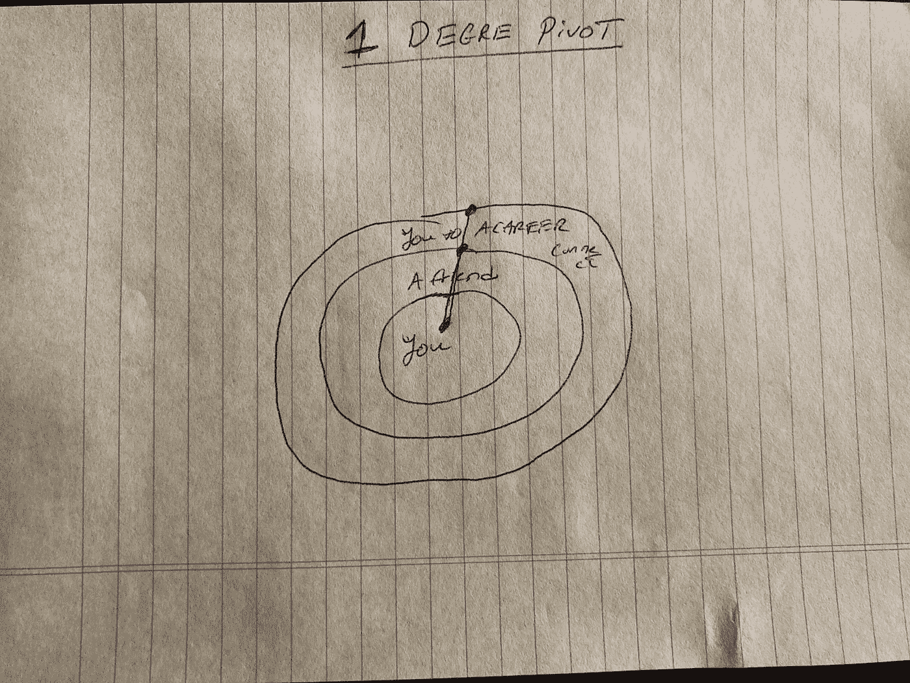

# 旋转 1 度

> 原文：<https://medium.datadriveninvestor.com/pivot-1-degree-38a04d9d3e86?source=collection_archive---------14----------------------->

> 他们:奥巴，你怎么认识这个人的？！
> 
> 我:哦，那个人是朋友的朋友的朋友。
> 
> 他们:哦，妈的就是这样。

随着我的品牌不断成长，我意识到这种对话会一次又一次地出现。每当类似的对话出现时，我通常会生气，但特别是这次对话，我没有。这个对话继续出现真的不完全是我的错。一部分是关于纽约创意圈，当然另一部分是关于我的社交。这只是我品牌的力量。我们确保我们认识你，你的朋友，以及他们朋友的朋友。这样做的目的是确保整个团队都知道我在做什么。这种做法被定义为六度分离。**六度分隔**是指所有人彼此之间平均有六个或更少的社会联系。在 COVID 之前，这是一项强大的技术。现在，我们生活在一个这种技术不那么有效的世界里，因为我们不能亲自见面。然而，我们可以克服这一点，以更有效、更有影响力的方式推广我们的品牌，同时保持 6 英尺的距离。最后，你会感谢[泰勒·麦克劳德](https://medium.com/u/2e314bfb6a96?source=post_page-----38a04d9d3e86--------------------------------)给了你这颗宝石。

九度分离表明，只要有五个共同的人，我们就可以见任何人。这最终会让你与某个名人会面，你会激励他在未来与你一起工作。嗯，你不可能在疫情进行的时候遇见 5 个人，所以你怎么能遇见那个名人呢？我们需要将分离度缩小到 1 或 2。这是一个直接连接的呼叫。为什么？！这次隔离做了一件事。它让我重新联系上了我曾经疏远的某些人。当我与这些人重新联系时，我们能够从中断的地方连接起来。然而，这不是兴奋剂的一部分。我想和某些人联系，但是我没有认识他们的人。现在，我有了直接连接，我真的不必进一步扩大我的朋友圈子。我可以肯定地保持距离。总的来说，当你有任何东西的直接来源时，它将帮助我快速地变平。

 [## 金钱:冠状病毒疫情期间的投资|数据驱动的投资者

### 在我将近 20 年的金融服务生涯中，我曾经负责监督整个…

www.datadriveninvestor.com](https://www.datadriveninvestor.com/2020/07/29/money-investing-during-the-coronavirus-pandemic/) 

我们真正开始传播品牌的最佳方式是尽可能拉近与我们的关系。我们如何做到这一点？！我们可以像我一样回到我们的联系人那里，重新与他们联系。当我们这样做时，我们打开了机会之门，并意识到我们离建立更大的联系更近了。第二个选择是品牌植入！这里的品牌放置是为了视觉上的关注。它是把东西放在人体上，让人们看到它时可以提问。这使得品牌或你的名字进一步扩大。这些东西缩小了我们的分离度，可以一步一步地俘获那些或大或小的粉丝。最终，我们会接触到需要他们关注的人。有了这两样东西，我们就能真正抓住一批始终如一并愿意为我们的军火库增值的观众

今天，回到你所有的联系人那里。打他们！真诚地与他们交流，看看你和他们都去过哪里。寻求协同和合作。这是你缩小分离程度的地方，并真正开始专注于真正让你成为工艺创意者的东西。在这段时间里不要匆忙，所以一步一步来。

## 获得专家观点— [订阅 DDI 英特尔](https://datadriveninvestor.com/ddi-intel)