# 在 VBA 交易和编码的枢纽点。

> 原文：<https://medium.datadriveninvestor.com/pivot-points-in-trading-and-coding-them-in-vba-71c705d3fcbd?source=collection_archive---------3----------------------->

## 一步一步的指南，创建一个功能宏，帮助我们通过支点交易。

支点是最古老和最有效的交易技术之一。它们基本上是用公式计算出来的支撑位/阻力位，而不是在图表上观察出来的。支点的客观性使它们成为交易时预测反转水平的不可否认的强大工具。他们依靠非常简单而直观的公式:

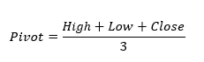

支点可以被认为是一个引力水平，因为它倾向于将价格拉向它，也就是说，如果价格低于支点，交易者可以预期价格会上涨，反之亦然。从支点，我们可以计算出当天隐含的支撑位和阻力位。交易它们的方式也很简单。接近隐含支撑的价格可能给我们做多的机会，而接近阻力位的价格可能给我们做空的机会。这里有一个温和的提醒，做多一项资产意味着买入，做空意味着当你没有该证券时卖出，这样当你以更低的价格买回时(如果它下跌)，你就可以获利。换句话说，利用今天的收盘价、最高价和最低价，我们将能够预测明天的预期反应水平。

在 Python 的 ***新技术指标成功后，我刚刚出版了一本新书。它对复杂的交易策略进行了更完整的描述和补充，Github 页面致力于不断更新代码。如果你对此感兴趣，请随时访问下面的链接，或者如果你喜欢购买 PDF 版本，你可以在 Linkedin 上联系我。***

[](https://www.amazon.com/gp/product/B09919GQ22/ref=as_li_tl?ie=UTF8&camp=1789&creative=9325&creativeASIN=B09919GQ22&linkCode=as2&tag=sofien-20&linkId=bc5df3f6ab0f3af2df79641c56b949ba) [## 交易策略之书

### 亚马逊网站:交易策略之书(9798532885707): Kaabar，Sofien:书籍

www.amazon.com](https://www.amazon.com/gp/product/B09919GQ22/ref=as_li_tl?ie=UTF8&camp=1789&creative=9325&creativeASIN=B09919GQ22&linkCode=as2&tag=sofien-20&linkId=bc5df3f6ab0f3af2df79641c56b949ba) 

计算隐含支撑位和阻力位的公式如下:

一级点:

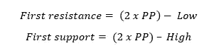

第二个水准点(以防第一个不成立):

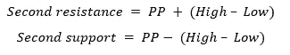

第三等级点(以防第二等级点不成立):


只要简单一致，它往往在市场上表现良好。枢轴点往往在更长的时间框架内工作得更好。我们将看到如何在交易中应用它们，然后如何在 excel 中创建一个宏，通过输入昨天的关键值(最高价、最低价和收盘价)为我们提供所需的支点。

下面我们将计算第二天的隐含水平，以决定在哪里买，在哪里卖。

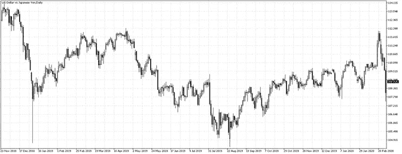

USDJPY Daily Chart.

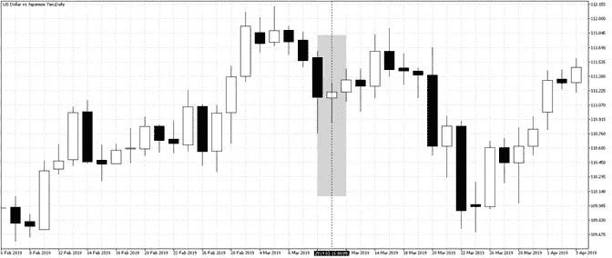

USDJPY daily graph showing the calculation candle. Using the data from this daily candle, we will calculate the supports and the resistances for tomorrow.

让我们以小时图放大 2019 年 11 月 3 日。第一个灰色区域代表计算日，第二个灰色区域是我们将应用预计支撑和阻力的地方(2019 年 12 月 3 日)。换句话说，我们将在交易区交易，当我们接近阻力时卖出，当我们接近支撑时买入。

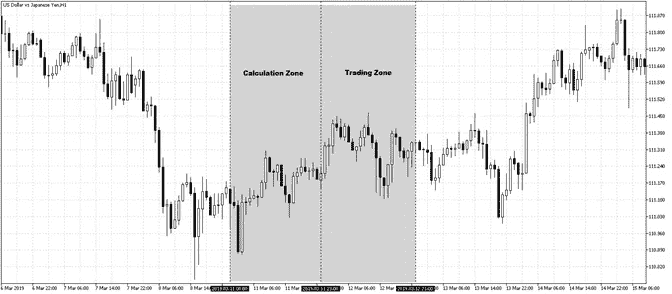

USDJPY pivot point calculation zone and trading zone. The calculation zone is the highlighted candle in the previous chart.

下面预测的水平分别是在 **110.95** 和 **111.39** 的第一支撑位和阻力位，以及在 **111.12** 的支点。注意这些价位附近的价格反应。

> 当市场波动时，支点交易结合反向指标是从当前市场动态中获利的好方法。当支点支撑或阻力被突破或超越时，这可能是继续向下一个支撑/阻力的信号。

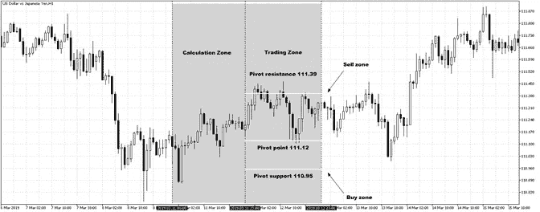

A trader can sell around 111.39 and buy around 110.95\. The pivot point can be used as a profit target. Hence, selling at 111.39 and targeting 111.12.

# 卡玛利拉和斐波纳契枢轴点。新品种？

**Camarilla 枢轴**类似于普通枢轴点，由 Nick Scott 于 1989 年创建。他们使用前一天的收盘价以及区间(当天的高点减去当天的低点)来寻找关键的支撑位和阻力位。通常情况下，Camarilla 支点是为 4 个不同的支持和 4 个不同的阻力水平计算的，然而，我发现最重要的是第三个水平。一般来说，支点是基于均值回归的原则，因此，每当价格达到第三个阻力或第三个支撑位时，就应该开始反向交易。

一级点:

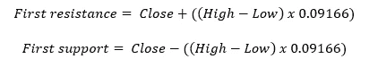

第二个水准点(以防第一个不成立):

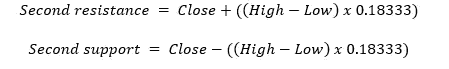

第三等级点(以防第二等级点不成立):

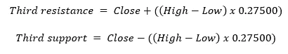

**斐波纳契枢轴**也类似于正常的枢轴点，除了我们使用斐波纳契回撤作为前一天范围的乘法因子。这里的想法是将这些回撤纳入斐波那契爱好者的中枢系统。下面是我们稍后将在代码中包含的公式。

一级点:

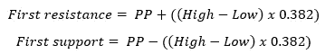

第二个水准点(以防第一个不成立):

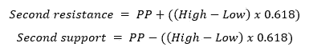

第三等级点(以防第二等级点不成立):

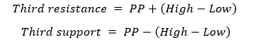

***注意*** *:注意第三个斐波那契枢轴点的水平与第二个正常枢轴点的水平相同。*

烛台模式的使用肯定会改善系统，因为他们的数字将被包括在交易过程中。**例如，看到一个 doji 在到达一个支点支撑之前形成，将会提高确认系数，给交易更多的信心**。我在 Medium 上写过一篇关于烛台模式的文章:

[](https://medium.com/@kaabar.sofien/do-candlestick-patterns-work-on-their-own-a-systematic-fx-back-test-using-python-b70158fdb07a) [## 烛台图案自己起作用吗？使用 Python 进行系统的 FX 回溯测试。

### 在巨大的模式识别交易领域，我们发现一些非常流行的技术模式，它们总是出现在…

medium.com](https://medium.com/@kaabar.sofien/do-candlestick-patterns-work-on-their-own-a-systematic-fx-back-test-using-python-b70158fdb07a) 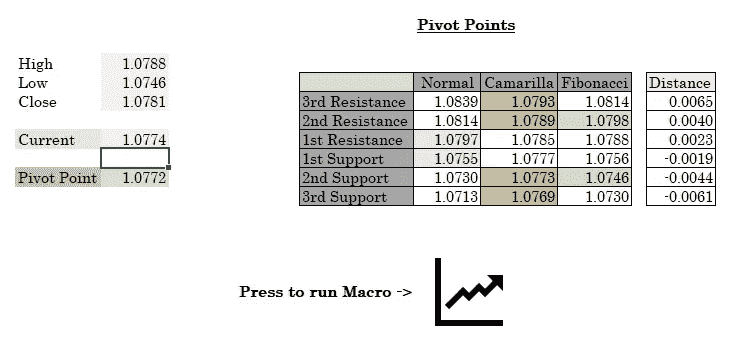

An example of the Macro.

在上图中，我们输入了最高价、最低价、收盘价和当前价格。当我们运行宏指令时，我们将得到必要的交易级别。例如，在正常的第一个阻力标签下，我们有 **1.0797** 表示该区域周围的阻力。当前价格是 **1.0774** ，我们距离阻力 **23** 点(如距离标签所示)。类似地，位于 **1.0755** 的第一个支撑位是该水平附近的买入机会。

下一个例子展示了 pivot 技术的失败以及如何从另一个场景中获利。

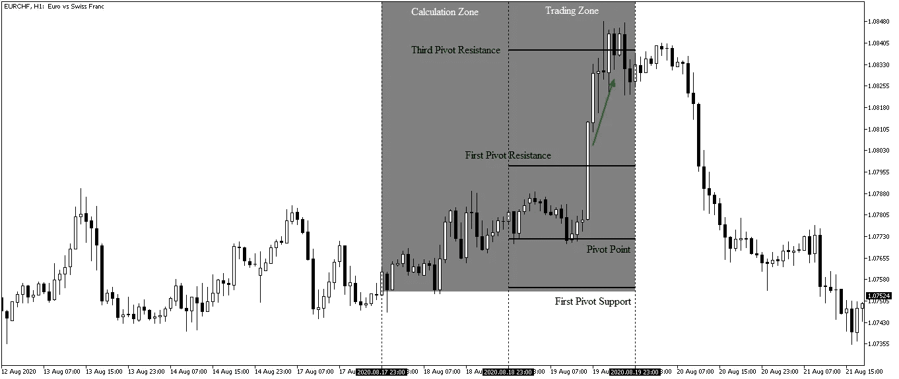

Example of a failure at the first Pivot resistance but a good reaction around the Third pivot resistance.

# 从头开始使用宏

现在，让我们看看当我们运行本文末尾提供的代码时，它会给我们带来什么(*注意:我已经对它添加了解释性注释，以便更容易理解这个非常简单的 VBA 代码块*)。

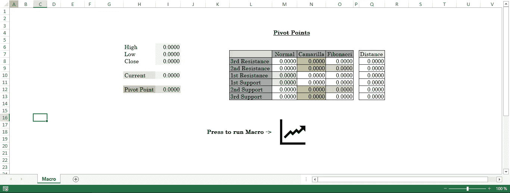

Basic illustration of an empty template that will be populated by the macro. Note that the code only populates. The design is not included as it is not important.

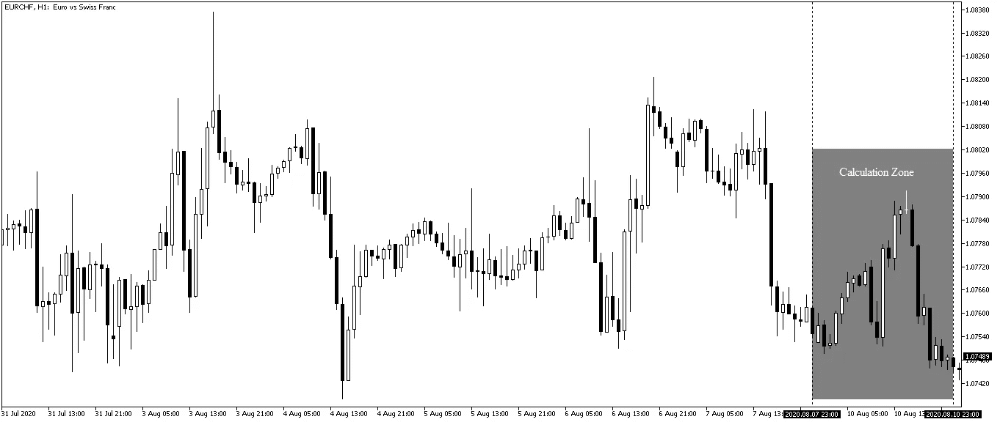

Finding our calculation zone. The zone we will use to populate the High, Low, and Close cells.

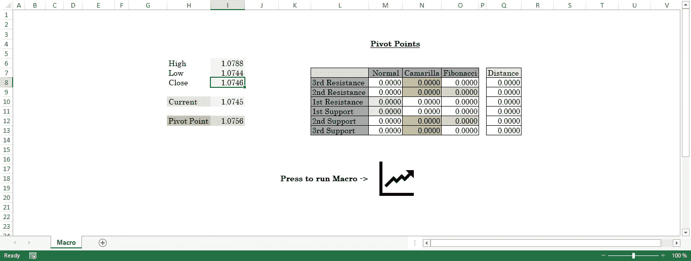

Inputting the cells and running the Macro.

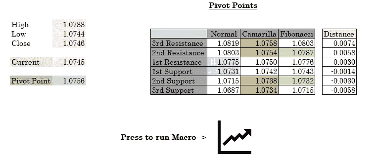

The results of running the Macro showing the implied support and resistance levels.

现在，我们可以选择任何我们喜欢的枢轴系统。我只是举了一个使用普通支点技术的例子，如下所示。

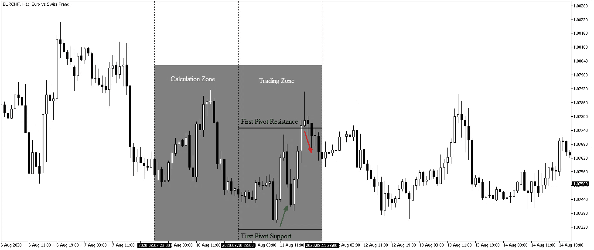

The green arrow shows an opportunity to buy while the red arrow shows an opportunity to sell.

# **结论**

快速、简单且可预测。表征支点的三个特征。当然，您可以尝试其他枢轴点来查看差异，它们都工作得很好。可以做进一步的研究，以便为不同的资产类别找到最佳类型的支点。

如果你也对更多的技术指标和使用 Python 创建策略感兴趣，那么我关于技术指标的畅销书可能会让你感兴趣:

[](https://www.amazon.com/gp/product/B08WZL1PNL/ref=as_li_tl?ie=UTF8&camp=1789&creative=9325&creativeASIN=B08WZL1PNL&linkCode=as2&tag=sofien-20&linkId=e3cb9716bb6a07cf6c8b9fb585412b07) [## Python 中的新技术指标

### 亚马逊网站:Python 中的新技术指标(9798711128861): Kaabar，Sofien 先生:书籍

www.amazon.com](https://www.amazon.com/gp/product/B08WZL1PNL/ref=as_li_tl?ie=UTF8&camp=1789&creative=9325&creativeASIN=B08WZL1PNL&linkCode=as2&tag=sofien-20&linkId=e3cb9716bb6a07cf6c8b9fb585412b07) 

随着最近的事件，一个可能正在消失的问题是市场缺乏波动性，这可能会阻碍我们的交易能力，因为该系统主要用于日交易(尽管它可以被修改为年度计算)。记住，交易需要波动。下面是 VBA 电码。用户必须在正确的位置输入以下数据:

*   高细胞 E4
*   单元格 E5 中的低
*   关闭单元格 E6

```
Sub Pivots()'Defining the variables (As variants for simplicity)
Dim FRNP 
Dim SRNP
Dim TRNP
Dim FSNP
Dim SSNP
Dim TSNPDim FRCP
Dim SRCP
Dim TRCP
Dim FSCP
Dim SSCP
Dim TSCPDim FRFP
Dim SRFP
Dim TRFP
Dim FSFP
Dim SSFP
Dim TSFPDim H 'High variable
Dim L 'Low variable
Dim C 'Close variable
Dim PP 'Pivot point variableH = Range("E4").Value 'Assigning the high to its cell
L = Range("E5").Value 'Assigning the low to its cell
C = Range("E6").Value 'Assigning the close to its cell
PP = (H + L + C) / 3 'Pivot point formula
Range("E8").Value = PP'Normal
FRNP = 2 * PP — L 'First resistance Normal Pivot point
FSNP = 2 * PP — H 'First support Normal Pivot point
SRNP = PP + FRNP — FSNP 'Second resistance Normal Pivot point
SSNP = PP — FRNP + FSNP 'Second support Normal Pivot point
TSNP = FSNP — H + L 'Third resistance Normal Pivot point
TRNP = FRNP + H — L 'Third support Normal Pivot pointRange("H7").Value = FRNP 'Populating
Range("H6").Value = SRNP 'Populating
Range("H5").Value = TRNP 'Populating
Range("H8").Value = FSNP 'Populating
Range("H9").Value = SSNP 'Populating
Range("H10").Value = TSNP 'Populating'Camarilla
FRCP = C + ((H — L) * 1.1 / 12) 'First resistance Camarilla Pivot
FSCP = C — ((H — L) * 1.1 / 12) 'First support Camarilla Pivot
SRCP = C + ((H — L) * 1.1 / 6) 'Second resistance Camarilla Pivot
SSCP = C — ((H — L) * 1.1 / 6) 'Second support Camarilla Pivot
TRCP = C + ((H — L) * 1.1 / 4) 'Third resistance Camarilla Pivot
TSCP = C — ((H — L) * 1.1 / 4) 'Third support Camarilla PivotRange("I7").Value = FRCP 'Populating
Range("I6").Value = SRCP 'Populating
Range("I5").Value = TRCP 'Populating
Range("I8").Value = FSCP 'Populating
Range("I9").Value = SSCP 'Populating
Range("I10").Value = TSCP 'Populating'Fibonacci
FRFP = PP + ((H — L) * 0.382) 'First resistance Fibonacci Pivot
FSFP = PP — ((H — L) * 0.382) 'First support Fibonacci Pivot
SRFP = PP + ((H — L) * 0.618) 'Second resistance Fibonacci Pivot
SSFP = PP — ((H — L) * 0.618) 'Second support Fibonacci Pivot
TRFP = PP + ((H — L) * 1) 'Third resistance Fibonacci Pivot
TSFP = PP — ((H — L) * 1) 'Third support Fibonacci PivotRange("J7").Value = FRFP 'Populating
Range("J6").Value = SRFP 'Populating
Range("J5").Value = TRFP 'Populating
Range("J8").Value = FSFP 'Populating
Range("J9").Value = SSFP 'Populating
Range("J10").Value = TSFP 'Populating'Distance From Actual price
Range("Q8").Value = TRNP - Actual
Range("Q9").Value = SRNP - Actual
Range("Q10").Value = FRNP - Actual
Range("Q11").Value = FSNP - Actual
Range("Q12").Value = SSNP - Actual
Range("Q13").Value = TSNP - ActualEnd Sub
```


[https://pixabay.com/photos/blur-chart-computer-data-finance-1853262/](https://pixabay.com/photos/blur-chart-computer-data-finance-1853262/)

**访问专家视图—** [**订阅 DDI 英特尔**](https://datadriveninvestor.com/ddi-intel)