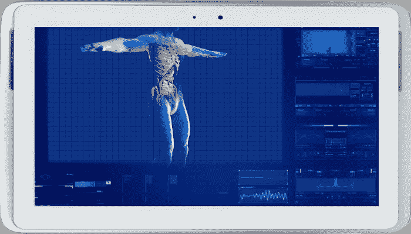

# 转向远程医疗带来了新的好处和风险

> 原文：<https://medium.datadriveninvestor.com/pivot-to-telehealth-brings-new-benefits-and-risks-8c091caef57c?source=collection_archive---------21----------------------->

冠状病毒疫情正在改变人们接受医疗保健的方式，转向更远程的诊断选项，作为第一线护理。好处有很多，但不幸的是，医疗保健数据泄露将再次激增！

# 医疗保健福利的演变

远程医疗选项，即患者远程参与，是非常有意义的。如果有人感觉不舒服，可以与医疗专业人员进行远程会话，进行初步评估和诊断，而不是让他们出现在医生的办公室。这种远程初步评估的能力为患者和医疗保健系统带来了许多好处。

远程考试对各方都方便很多。没有人喜欢准备好去看医生，尤其是感觉不舒服的时候。不方便又费时。似乎总是有一个等待和病人不知道他们的耐心。医生面临着尽可能减少延误的持续压力。

 [## 为什么加密对日常生活至关重要？数据驱动的投资者

### 你几乎每天都要输入密码，这是你生活中最基本的加密方式。然而问题是…

www.datadriveninvestor.com](https://www.datadriveninvestor.com/2020/02/10/why-encryption-is-critical-to-everyday-life/) 

安排一个准确的开始时间可以更有效地利用医疗资源。事实上，在线医生不需要是初级保健医生，甚至不需要在病人所在地。可以基于疾病的类型来配对可用的临床医生。对于简单的问题，最初的分类可能足以进行诊断。季节性感冒、过敏和简单感染可能只需要患者可以拿到的药物处方，从而完全避免了去诊所的需要。

生病并不总是发生在上班时间。在繁忙的时候，找到一个可以预约看医生的时间可能需要几天。对于那些有孩子的人来说，总是有一种周末深夜发烧，这让父母们很伤脑筋，因为他们不能去看医生。在许多情况下，唯一的其他选择是昂贵的急救护理。而在线护理系统可能能够从全球范围内调配资源，覆盖每天的所有时间，以提供初始护理。

集中调度可以将空闲的医生与患者匹配起来，以减少等待时间，并使办公室中的医生有更多时间与需要动手检查的患者在一起。首先在网上与医疗专业人士会面，可以起到过滤器的作用，减少医疗机构的工作量，因为不是每个人都需要去医生的办公室。

在线服务对每个人来说也可能更安全。正如最近的新冠肺炎·疫情所显示的，人们可以在医生的办公室里传播传染性疾病。护理提供者和其他患者处于危险之中。远程评估消除了患者和工作人员之间进一步传播的可能性。

远程医疗对各方都更方便，代表了医疗资源效率的改进模式，减少了传染性疾病的传播，并允许采用分散的护理方法，可以实现全天候预约！这可能是现代医疗保健系统的下一次发展。

# 数据风险出现了

如此突出的优势和便利性将推动快速采用，同时也带来了额外的风险。通常在私人房间里进行的病人-医生对话将通过互联网进行。个人问题、健康测量、诊断、处方和其他敏感数据将被远程收集，因此暴露程度更高。数据将通过潜在的不安全系统和网络进行收集、存储和传输。患者目前使用他们的个人电脑和电话，这些电脑和电话可能没有得到很好的保护。

在快速的数字化转型过程中，安全性常常被抛在一边。交付和扩展远程医疗工具和服务的热潮将会给开发和测试周期带来压力。通常在这种情况下，优先考虑的是实现先发优势、尽快将产品推向市场、保持低成本或优化性能。强化产品的挑战既复杂又耗时。网络安全经常被降低优先级，被忽视，或者被降级为将来“某个时候”要解决的事情。

# 网络、设备、应用的发展

健康数据具有巨大的价值，在过去一直是被重点攻击的目标。美国医疗保健行业在过去几年中经历了大规模数据泄露带来的巨大影响，这种影响在 2015 年达到顶峰，当时大约 35%的[美国人口的健康记录在一年内被暴露](https://ocrportal.hhs.gov/ocr/breach/breach_report.jsf)。我们吸取了许多惨痛的教训，因此，在过去的五年中，保护传统医疗保健数据基础设施的网络安全工作得到了改善。这是一个缓慢的过程。

远程服务的快速创新将催生新的设备、服务、接口、应用和流程。其中的每一个都代表了错误处理数据的潜在漏洞或攻击者利用的立足点。如果没有经过良好设计、测试和维护的安全性，攻击者会发现很容易破坏新工具并获取患者数据和私人对话。

患者的身份、位置、生命体征、药物、诊断和病史可能会暴露。传感器数据也容易受到攻击。起初，它可能是基本的，并限于心率、血压、呼吸、氧饱和度、温度和葡萄糖水平。

最终，更先进的家庭医疗保健设备将变得普遍，这将允许不仅仅是生命体征被远程采集并发送给医生。随着测试变得更加分散，新的解决方案可能能够扫描非法药物使用、性传播疾病、传染性病毒和细菌感染，甚至包括可以检测囊肿、癌症和其他疾病的扫描设备。

隐私风险随着数据数量和敏感性的增加而增加。更多的解决方案为攻击者创造了更大的复杂性和机会。本质上，新冠肺炎疫情正在推动行业以更好的方式为患者服务，同时加速隐私处于更大危险的道路上。

# 主动管理风险

随着医疗保健扩展到采用远程解决方案，患者的安全和隐私必须成为优先考虑的问题。认为网络安全可以在部署后附加上，这是一个常见的错误，很多时候会导致灾难性的后果。为了取得最大的积极效果，必须尽早建立必要的投资和承诺。医疗保健和保险行业必须采取战略行动，建立强有力的可持续保护。

# 10 大医疗网络安全最佳实践:

1.  网络安全专家应该加入董事会或顾问委员会，从高层提出建议并推动企业承担责任。
2.  拥有合适的网络安全领导来建立、监督和管理该计划。他们必须代表并传达支持整体业务目标的风险和解决方案。
3.  投资于适当的 DevOps 安全功能，并将它们集成到开发流程中。
4.  包括在发布前对产品和服务进行严格的安全测试，以及发布后的漏洞奖励
5.  所有产品和服务的设计都必须能够在发现新漏洞时进行修补，并以对患者最安全的方式失效。
6.  明确定义隐私政策，并制定将接受测试和审计的合规性控制措施。
7.  将安全性、隐私性和安全性的要求与质量保证测试和验证过程逻辑地联系起来。
8.  利用值得信赖的行业解决方案和配置，设计解决方案来持续保护静态、使用中和传输中的患者数据。
9.  制定危机应对计划，并能够与业务伙伴一起高效、有效地执行这些计划。
10.  与网络安全专业人士的行业社区合作。没有一家公司什么都知道。利用专家。

医疗保健行业正处于一个重要的变革时刻。对于患者和护理提供者来说，巨大的好处触手可及，但网络安全风险不容忽视。在适当管理伴随风险的同时，有机会实现医疗保健的巨大改善。这需要领导力、深谋远虑和技能来执行一项战略，保护和尊重医疗保健发誓要帮助的病人。