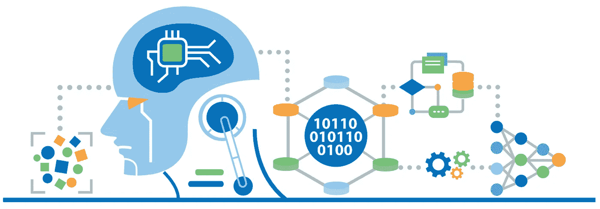
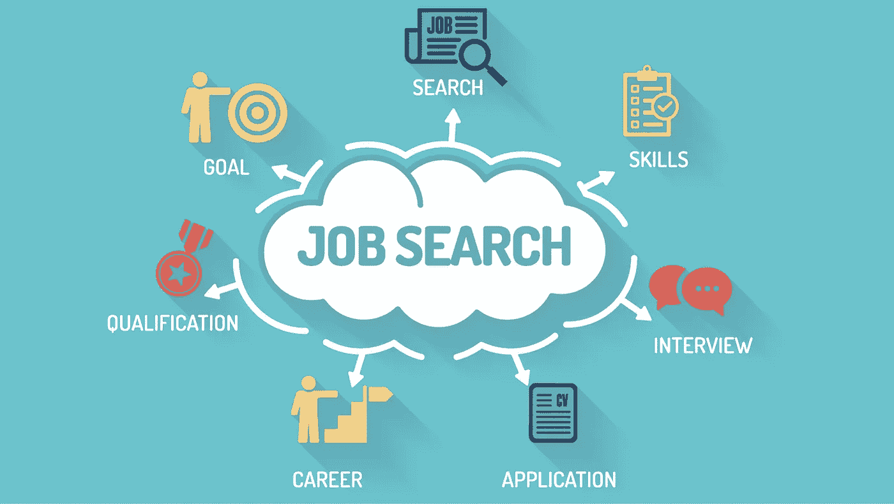

# 将我的职业从机械工程师转向数据科学家

> 原文：<https://medium.datadriveninvestor.com/pivoting-my-career-from-mechanical-engineer-to-data-scientist-f34828bb2509?source=collection_archive---------1----------------------->

## 我如何决定改变我的职业和行业

[https://www.scnsoft.com/services/data-science](https://www.scnsoft.com/services/data-science)

2019 年，我决定考虑与当时不同的行业。我于 2017 年从纽约大学坦登工程学院毕业，获得机械工程学士学位。当我在大学一年级决定攻读机械工程时，我觉得机械工程有足够广泛的应用，从本科学习中获得的技能可以应用于各种行业。这是真的，但是当你确切地知道你想做什么时，它肯定会有所帮助，因此，可以把你的学习集中在那个目标上。硕士生通常会因为这个原因重返校园；这样他们就可以专注于他们研究领域的某一方面。

当决定你想学什么和你想从事什么样的工作时，知道你完成学业后想在哪个城市/州工作肯定会有帮助。

Source: [https://money.usnews.com/careers/best-jobs/mechanical-engineer](https://money.usnews.com/careers/best-jobs/mechanical-engineer)

当我学习机械工程的时候，我总是觉得自己呆在纽约。但不幸的是，我艰难地发现，如果你学习一门与计算机无关的工程学科(即机械、电气、环境、土木)，你会有点局限于建筑领域。建筑业对工程师的需求很大。这很好，如果这是你想看到自己做的工作。但如果你像我一样，你可能会发现自己需要重新考虑你的学业，并寻找有效的旋转机会。

 [## 成为数据科学家所需的 8 项技能|数据驱动型投资者

### 数字吓不倒你？没有什么比一张漂亮的 excel 表更令人满意的了？你会说几种语言…

www.datadriveninvestor.com](https://www.datadriveninvestor.com/2019/02/07/8-skills-you-need-to-become-a-data-scientist/) 

对我来说，有效的旋转机会来自于研究。我知道我想留在纽约或东海岸的大城市。有了这些信息，我对那些希望改变职业生涯的人所能获得的实际机会进行了研究。

Source: [https://www.edureka.co/blog/what-is-data-science/](https://www.edureka.co/blog/what-is-data-science/)

我不断发现数据科学是“2018 年最热门的职业”，我有一个朋友刚刚将他的经济学重点转向数据分析。我看到了潜力，并对该领域进行了真正的研究，看到了一个明确的市场。

但是，在做任何重大的专业调整时，你还必须确保你喜欢你正在考虑进入的领域。我开始用 Python 进行编码实践，因为这是我正在寻找的数据科学项目在教学大纲中使用的主要语言。

第一次做编码练习非常吓人，因为这是我多年来第一次编码。我上一次用不同的编程语言 Matlab 编程是在大学一年级。但是随着我练习得越来越多，我意识到我更喜欢数据科学任务。编码变得更加流畅，我开始变得更加舒适。

2019 年夏天，我辞去了建筑/水处理行业机械工程师的工作，参加了一个数据科学沉浸式训练营。我参加的项目是纽约市金融区的熨斗学校。

这个项目非常密集，但是很有见地。有如此多的应用程序和工具是我从未想象过的。我在这个项目中学到的所有技能都是我将永远坚持并继续努力的技能。

我有机械工程背景，对微积分、统计和数学有很好的掌握。我最初挣扎的是编码，因为我已经很多年没有编码了，但是我坚信任何人都可以学习编码，如果他们开始学习的话。我今天可以写代码，这是一项 5 年前我无法想象自己会掌握的技能。

我们接触和实施的一些项目和理论包括机器学习、深度学习、自然语言处理、AB 测试、统计意义、AWS 关系数据库和各种各样的数据科学技术，可用于解决我们未来雇主的数据科学问题。

Source: [https://lerner.udel.edu/seeing-opportunity/common-mistakes-in-the-job-search-process/](https://lerner.udel.edu/seeing-opportunity/common-mistakes-in-the-job-search-process/)

自从我在 11 月份完成我的项目以来，我一直在积极地面试。无论你从事什么行业，找工作都是一件难事，但我可以诚实地说，我已经收到了数据科学/数据分析职位的回复。公司真心实意地希望填补这些职位空缺。这是一个市场，我不后悔转向这个新领域。我很高兴自己迈出了这一步，也很高兴看到摆在我面前的机会。

如果您想更多地了解我的职业生涯经历，或者正在寻找您团队中的数据科学家/数据分析师，让我们在 [LinkedIn](http://linkedin.com/in/nabil-abbas) 上聊天吧！

希望这篇博客对你有所帮助！