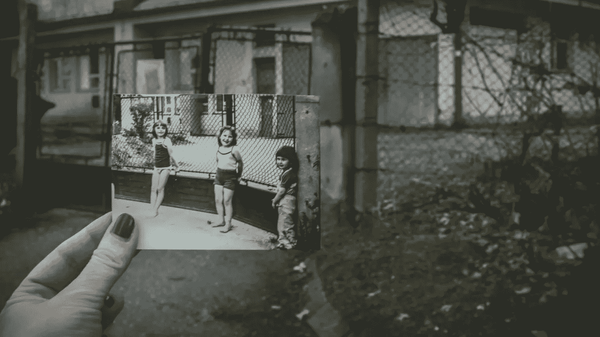
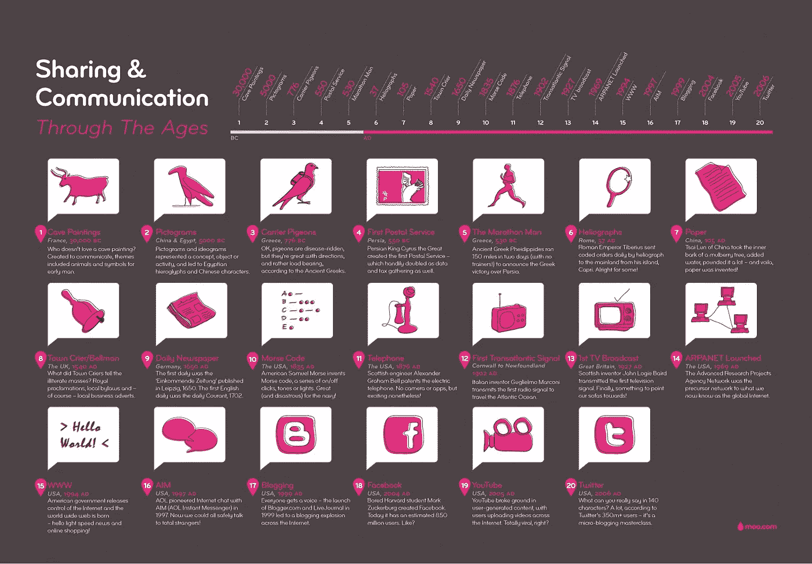
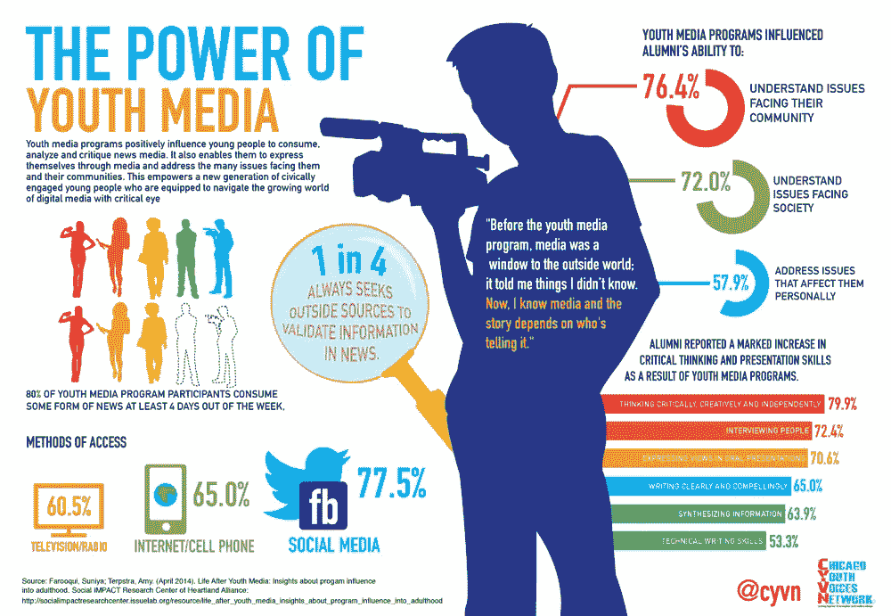
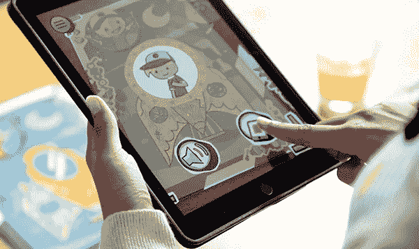
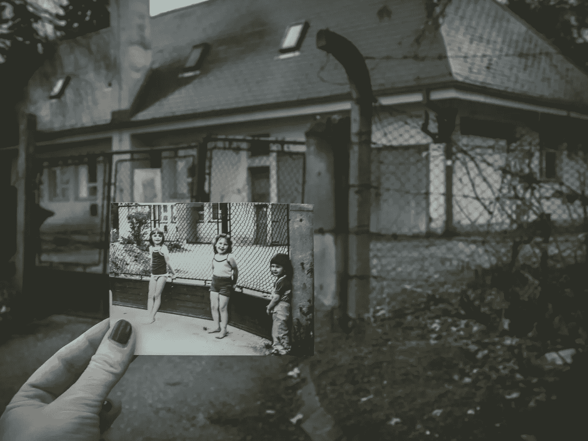

# “Place”:一个跨媒体讲故事的增强现实(AR)社交媒体平台

> 原文：<https://medium.datadriveninvestor.com/place-a-transmedia-storytelling-augmented-reality-ar-social-media-platform-eb8f35fcb1e7?source=collection_archive---------26----------------------->

## “Place”是一个不错的创业公司名称。一个词。名词。一个动词。当我们将故事嵌入到我们喜欢的地方时，我们会说“放置它”。

Photo Credit: [Anita Jankovic](https://unsplash.com/photos/m5oFzzrcKwc)

# 追踪媒体发展

自从 21 世纪以来，讲故事已经发生了许多有趣的变化。早期，信息在不同的模拟媒介(如文本和照片)中高度分层，需要一定程度的专业知识、技巧和编辑、排版和出版方面的资金投入才能达到预期的效果。因此，在公共领域讲故事仍然不在公民的权限之内，需要有组织机构的干预来精心制作故事。

## 随着数字媒体的出现，出现了三个独立的发展。

1.  有了互联网，信息共享和交流变得更加容易，学习变得独立于同一地点。
2.  编辑、翻译、操作和分享这些类似艺术媒体的工具随后被转移到数字媒体中，为人们**提供了便捷的讲故事平台**。
3.  数字媒体本身**从基于桌面的静态操作发展到基于移动的动态操作，**因此，允许人们在不同的地方访问信息，并将不同形式的数字故事集成到数字媒体生态系统中。

Infographic Credit: [Daily Infographic](https://www.dailyinfographic.com/the-evolution-of-communication-infographic)

> **这三项发展催生了两个重要的感性概念，它们有能力改变我们的城市结构，促使市民参与空间和场所的创造，以及由此产生的故事的构建:**

1.  在社会-政治-空间层面，信息和故事不再通过专业从业者的视角来识别，而是由专业人士和爱好者共同制作，从而产生了公民新闻的理念。因此，它不能被想象为掌握在一个特定的组织手中，该组织需要实体存在并获得访问数据或添加数据的许可— **但社交媒体的管理者和制作者之间需要谨慎的约定。**
2.  讲故事不再被想象成区分数字和模拟，或者真实和虚拟——这些区别现在正在消失。由于人们**在沉浸于城市结构**的同时获取和产生信息，未来几十年讲故事将进一步模糊我们的数字设备和我们的物理环境之间的界限，并将一个设备的信息放置到另一个设备上以获得无缝体验——这被称为**增强现实**的最佳使用。

Infographic Credit: [Newsbite](http://www.newsbite.org/general/the-power-of-youth-media.html)

取上述两个感性观念的元素——***(1)公民参与*** 、 ***(2)与探索的不同媒介的交集*** (音频、视频、摄影、文字等。) ***和平台*** (网站和社交媒体——推特、脸书、Instagram、Youtube、Tumblr、Reddit 等。)、 ***(3)基于位置和基于运动的应用*** (GPS 集成、定向)和 ***(4)将现实与设备屏幕融合的界面*** (相机集成、3D 成像、激光雷达、摄影测量)——我们实现了一个基于网络或基于应用的平台的可能性，该平台可以允许公民单独或集体参与，与 ***【他们的地方】*** 互动，在参与中产生各种形式的通信

> **"** 将**【广场】**的过去、现在和未来的记忆汇集到一个单一的平台上，人们可以在沉浸于**【广场】**的街道时访问这个平台。

****

**Image Credit: [Shutterstock](https://www.shutterstock.com/image-vector/hand-holding-smartphone-use-augmented-reality-591185132)**

# **这将为市民、市民企业和实体“场所”带来多重好处:**

*   **社区企业和社会影响者将更多地渗透到公共领域，并与人民建立更深入、更强大和更有意义的关系，以至于他们将有机会积极参与个人和团体的个人和日常生活，从而加强社会城市化运动的原则并为其提供连续性，以及参与规划过程和参与者。**

> **想象一下，美食博主在城市间留下美食足迹，应用程序中嵌入的遗产步行，留下记忆的数字足迹，抗议活动永远嵌入网站，供后代记住并再次体验——想象一下你自己坐在广场上，戴上耳机听马丁·路德·金的演讲，说“我有一个梦想…”， 或者贾瓦哈拉尔·尼赫鲁(Jawaharlal Nehru)在印度独立时说“在午夜钟声敲响的时候……”，或者圣雄甘地(Mahatma Gandhi)，或者安娜·哈扎尔(Anna Hazare)，或者你的地方领导人，或者你最喜欢的作家，或者你最好的朋友，在演讲发表或记忆产生多年后——想象一下坐在改造过的“地方”里，但通过 AR/VR 设备的嵌入式音频或视频重新想象它。 想象自己回忆自己的经历。想象一下你的头发竖起来的感觉。想象一下你脊背发凉的感觉。**

*   **公民将被允许决定 ***【他们的地方】*** 的故事的结局，并在制作故事的同时学习讲故事的技巧，让他们有机会思考自己的个人故事，并更深入地了解他们在所处环境的社会和政治历史中的地位，从而培养一代有见识的公民，他们记住自己的历史，认识自己的现状，并集体表达自己的愿望，并与邻里、城市、国家、民族国家和世界的更大主题保持一致。**

> **人们将分享他们的故事，但为了安全起见，他们将能够在自己的小组或公开或私下展示这些故事。想象一下回到你的家乡，走过**【你的地方】**同样的老街，只是现在看起来完全不同，但是你的记忆，私人的，你的初恋，你的童年好友，你的家人，你的老房子，你的宠物狗和猫，它们都在那里，在你面前通过你的屏幕，你的耳机，你的 VR 耳机或你的谷歌眼镜重建。如果你丢失了你的账户，没关系，有人会分享你的记忆来保存它。如果它是公开的，社区或平台本身就会拯救它。**未来的几代人将会玩捉迷藏，在“你原来的位置”中找到“你的记忆”,重温你们这一代人的经历。这不正是文化和遗产保护的理念吗？****

*   **平台将成为***【the Place】***之外的人探索主题、理解主题、沉浸回忆、体验空间的工具，从而超越时间的限制，将***【the Place】***【the Place】【the Place】***的人物、地点和事件作为活的遗产。*****

> **没有陈词滥调的导游，没有广告，只是随机的人们在时间中漂浮，改变他们的过滤器和搜索偏好，以筛选他们的媒体形式，以及他们希望沉浸其中的时间段，同时体验**“这个地方”**。**通过“他们的人民”和“他们的故事”的镜头，而不是通过随机的历史学家的镜头，记忆、回忆和重新想象“地方”。****

****

**Image Credit: [Engine Creative](http://www.enginecreative.co.uk/blog/bic-brings-colouring-to-life-with-augmented-reality-games-unique-app/)**

# **结尾:简单地说就是这个想法**

**这个想法是将来自社交媒体参与的记忆浸入到我们的物理环境的结构中——将它们嵌入到它们形成的位置，并将它们放置到发生的 ***【地点】*** 和 ***【人民】*** 的物理现实的记忆中。**

**无论是一家初创公司，还是 GitHub/StackShare 上的 openAI，它可能有自己的数百万个版本，但想法只是准备一个网站/应用程序作为基于位置的增强/虚拟现实沉浸平台，可以链接信息(文本，照片，视频， 来自其他社交媒体平台或**的音频)允许用户将它们直接上传到云上——并将其放置在基于 3D 地图的跟踪器**上，该跟踪器通过他们的手机读取一个人的位置(GPS 坐标),并且**以 AR/VR 格式显示信息片段，如果它们在任何嵌入信息坐标的特定半径/距离内。****

**该平台的根本目的是作为一个讲故事的工具，以便公民可以专注于创建初步的内容和故事，并将其添加到参与平台上***——与他们所属地方的人民、社区、企业——他们的社区和城市。*****

> ****通过该应用程序，我们的愿景是建立一个由所有人和关键影响者/故事讲述者组成的学习联盟，他们可以共同推进这一倡议，并继续建立变革性城市行动平台的基本框架，这将塑造遗产、记忆、社区和邻里以及城市和国家的未来。最重要的是，标志着社交媒体最具变革性阶段的到来——一个永远将它与我们生活的物理现实和结构融合的阶段。****

********

****[P](http://www.enginecreative.co.uk/blog/bic-brings-colouring-to-life-with-augmented-reality-games-unique-app/)hoto Credit: [Anita Jankovic](https://unsplash.com/photos/m5oFzzrcKwc)****

****(看看上面的照片，想象那是你的手机、耳机、虚拟现实耳机或谷歌眼镜。现在想象照片中的孩子是 30 年前的你和你的兄弟姐妹，背景是你家的前门。现在可能会有一个平台来永远保存那段记忆，并帮助你重温它。那么，现在告诉我，如果这个想法不能让你兴奋，让你起鸡皮疙瘩，它不能让你感动，它不值得建立？)****

****我硕士项目的第三学期包括一次国际实地考察，围绕着复兴摩拉维亚，这是哥伦比亚麦德林文化最密集的社区之一。****

****我的团队和我的任务是为即将开展的开发工作制定一个沟通策略，诠释“活的遗产”这一主题。****

****我们想到了创建一个基于增强现实(AR)应用/网站的讲故事平台的想法，该平台可以帮助人们和组织共同制作他们自己的记忆，并将它们嵌入到 3D 地图中。****

****高中毕业后，小组工作激发了我再次学习编程的欲望。尽管新冠肺炎打乱了所有的计划，但实地考察从未进行，我回到了印度，但我没有放弃学习编码。****

****冒险进入开源代码的世界，我已经从基于概念创业的想法转变为与大家分享它的愿景——意识到它比我大得多。****

****对于可能读过这篇文章的大多数人来说，这可能是一个普通的概念(尤其是对那些来自技术领域的人来说)，但这可能会引起你们中一些人的兴趣。****

****所以现在是通过 T4 科技和社交媒体来分享社会变革和领导力的想法和愿景。****

****这个想法是在[Bartlett 发展规划单位](https://www.ucl.ac.uk/bartlett/development/)、[伦敦大学学院](https://www.ucl.ac.uk/)、[建筑与发展中的城市设计](https://www.ucl.ac.uk/bartlett/development/programmes/postgraduate/msc-building-and-urban-design-development)(2019–2020)硕士课程的一部分，针对摩拉维亚的活遗产的[学期第三期实地考察而提出的；在](https://www.ucl.ac.uk/bartlett/development/news/2020/jun/un-habitat-praises-co-creation-living-heritage-atlas-msc-budd-students-and-partners?fbclid=IwAR1_uGfyUL5jADyQZRIP6dbuyBYSYOVpHOgUK47caE1-xcZcDpLMnGllxPI)[乔万娜·阿斯托尔福](https://www.ucl.ac.uk/bartlett/development/giovanna-astolfo)医生和[卡特琳娜·奥尔蒂斯](https://www.ucl.ac.uk/bartlett/development/dr-catalina-ortiz)医生的监督下。****

****演习团队:[娜塔莉亚·梅伦德斯·富恩特斯](https://www.linkedin.com/in/nataliamelendezfuentes337674b2/)，[奥雷莉·克内赫特](https://www.linkedin.com/in/aur%C3%A9lie-knecht-3304bb137/)，[米娜·阿卜杜勒·迈莱克](https://www.linkedin.com/in/mina-abdelmelek-858b6153/)，[任敏](https://www.linkedin.com/in/min-ren-8204a51aa/)，刘梦迪[塔伦·巴辛(作者)](https://www.linkedin.com/in/yodagoesskinnydipping/)****

****感谢您抽出时间阅读本文。鳍！****