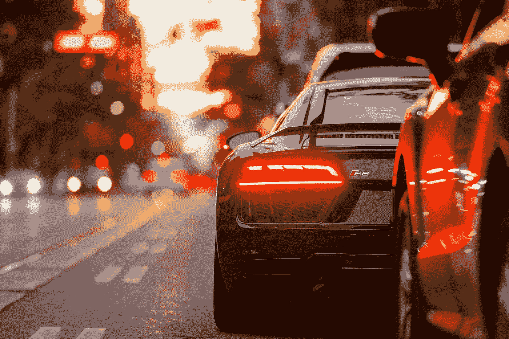
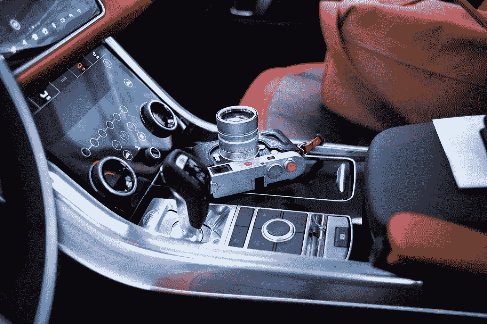
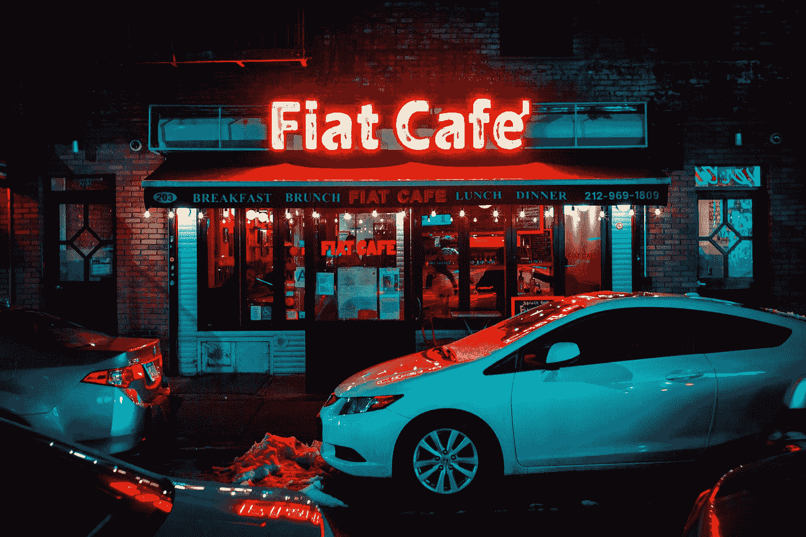
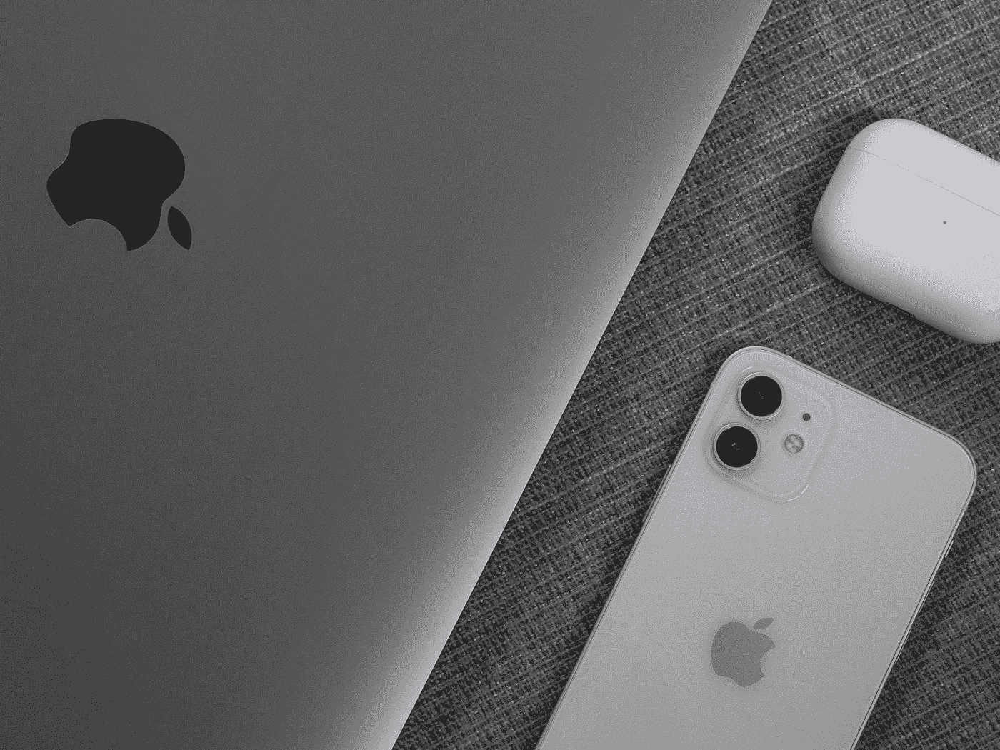

# 汽车格子:互联网的下一个家

> 原文：<https://medium.datadriveninvestor.com/plaid-for-cars-the-internets-next-home-5a94b7721707?source=collection_archive---------12----------------------->

# **汽车。创新**

我认为你想到特斯拉、电动汽车和/或埃隆·马斯克的几率为 90%。

在很大程度上，这是准确的。埃隆·马斯克正在改变汽车的工作方式，但随着数百万辆电动汽车的生产和传统汽车制造商[生产自己的电动汽车](https://www.barrons.com/articles/traditional-auto-makers-are-getting-into-evs-here-are-their-plans-to-battle-tesla-51606734002)，电动汽车现在似乎成为主流。他们**几乎**成为过去。

我认为新的机会在于车辆和乘客的软件。2015 年，美国人驾驶的时间超过[850 亿小时；这个数字可能只会增加。与此同时，尽管距离主流采用还有几年时间，但自动驾驶汽车已经开始进入社会，无论是特斯拉的自动驾驶汽车还是亚马逊的 Zoox。](https://www.volpe.dot.gov/news/how-much-time-do-americans-spend-behind-wheel)

无论如何，有一点是清楚的，随着数十亿小时的新发现的时间，消费者将期待拥有更好软件的汽车。

这创造了一个为汽车创造消费者友好软件的机会真空。

# **车企不是科技公司。**

Tesla’s Single Screen Dashboard

**特斯拉改了这个**。特斯拉以其极简设计而闻名，选择单一屏幕，而不是传统汽车制造商追求的复杂仪表盘。传统制造商称他们的汽车有 3 个屏幕是创新，尽管该软件对用户来说并不直观，并且提供的功能非常有限。

Traditional Dashboard

再次，**特斯拉改了这个**。特斯拉的屏幕有自己的网络浏览器，可以让你像电脑一样使用你的汽车，观看网飞或谷歌什么的。这太神奇了！

尽管预计 2020 年生产的新车中有 75%可以接入互联网，但这些汽车中只有很少一部分可以接入互联网，因为当你已经忙于驾驶时，几乎没有必要购买互联网接入，而且因为大多数汽车都没有很好地与互联网集成。

随着自动驾驶汽车的出现，这种情况将会改变。一个显而易见的受益者将是互联网服务提供商，随着用户寻求访问他们的汽车，他们将获得数百万客户。

# **汽车用格子花呢**

Photo by [Kenny Luo](https://unsplash.com/@kennyluoping?utm_source=medium&utm_medium=referral) on [Unsplash](https://unsplash.com?utm_source=medium&utm_medium=referral)

缺乏软件现代主义，无法与科技公司争夺顶尖科技人才，这给汽车公司带来了一个问题。

传统汽车公司已经在电动汽车技术方面赶上了特斯拉，因此有机会建立一个集中的软件系统供所有汽车公司使用。

有了这个，我们就可以得到汽车的**格子。作为背景，Plaid 是一家金融科技公司，它将传统银行与大多数新的金融科技初创公司(如 Venmo 和 Chime)联系起来。在 Plaid 之前，银行必须与这些公司合作，构建复杂的技术基础设施来进行集成。**格子创造了一刀切的解决方案**。**

这个系统将成为汽车的操作系统。它将通过一个 API 将所有不同的汽车品牌/型号**连接到用户想要看到的所有不同的互联网应用程序。它将提供自己版本的应用商店，用户可以从中下载应用。它将允许人们从任何汽车屏幕上访问谷歌。它将把汽车与互联网连接起来。**

从本质上说，这项服务将提供一个通用、直观、用户友好的界面，传统汽车公司可以通过实现这一界面，在软件方面与类似特斯拉的汽车科技公司竞争。

# **广告**

Photo by [Anthony Rosset](https://unsplash.com/@anthonyrosset?utm_source=medium&utm_medium=referral) on [Unsplash](https://unsplash.com?utm_source=medium&utm_medium=referral)

如果我们假设节省下来的 850 亿小时中只有 10%会花在看广告上。那么这将会关联到一个**新的****【1000 亿到 3000 亿美元的广告市场**！

这些计算假设 Youtube 收取的标准广告费用为每 30 秒 0.1-0.3 美元。

这个新的广告市场可能会带来一个全新的商业模式，尤其是拼车。我预计，如果你选择在旅途中播放广告，将会有更低成本的乘车选择，有点像 Hulu 的基本计划，允许广告流。

# **饮食、娱乐、工作**

Photo by [David Watkis](https://unsplash.com/@david_watkis?utm_source=medium&utm_medium=referral) on [Unsplash](https://unsplash.com?utm_source=medium&utm_medium=referral)

大约 20%的美国餐是在汽车里吃的，通常用一只手。随着人们的手解放出来(字面意思)，他们很可能会在通勤上班时花更多的钱在早餐上。由于美国人的早餐选择向更“复杂”的菜肴开放，因此移动点餐可能会显著扩大。

这种新的互联网应用的另一个受益者可能是流媒体服务和内容提供商。像网飞、孔雀、Youtube、Hulu 和 Spotify 这样的公司可能会看到使用量的增加，因为用户可能会选择将他们的新时间用于娱乐。

第三种更牵强的可能性是在车里工作。通勤时间一直是上班族的一大烦恼。它们限制了我们可以在哪里工作，可以在哪里生活，并给人们的旅行带来了大量的无薪时间。有了自动驾驶和联网汽车，汽车可以成为移动办公室。我们可能会看到这样一个时代，朝九晚五的工作真的是朝九晚五，因为员工可以把不在家的每一分钟都当作工作时间，以数字方式登录，在线工作，就像我们在疫情一样。

# 但是等等！

Photo by [Vista Wei](https://unsplash.com/@weista?utm_source=medium&utm_medium=referral) on [Unsplash](https://unsplash.com?utm_source=medium&utm_medium=referral)

在你说“这真的会发生吗？谁需要在他们的车里再装一个屏幕？我们已经有了自己的手机，可以直接用了。”我觉得认识到消费者生活在一个过剩的世界是很重要的。

我们不需要在苹果手机上安装苹果手表，在苹果电脑上安装苹果笔记本电脑，在苹果平板电脑上安装苹果手表…..我可以继续下去。关键是，科技是为消费者繁荣而生的。

互联网将很快真正应用于汽车。引领这种转变的公司将成为下一个独角兽。我试图触及几个领域，随着消费者偏好的改变，这些领域将会发生变化，但很可能会有几十个连锁反应。