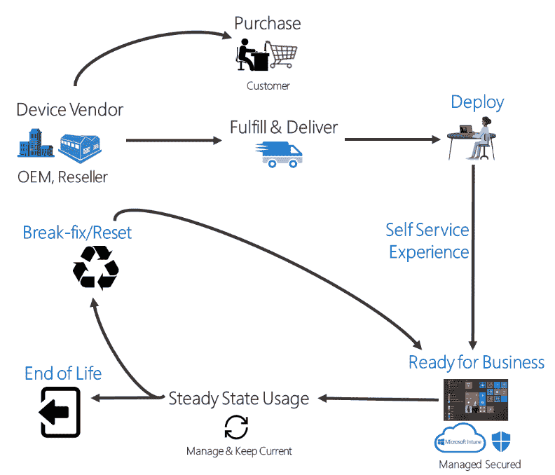
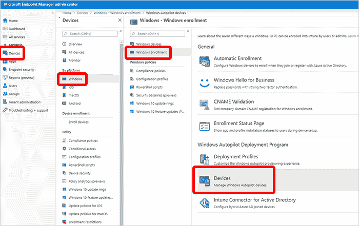
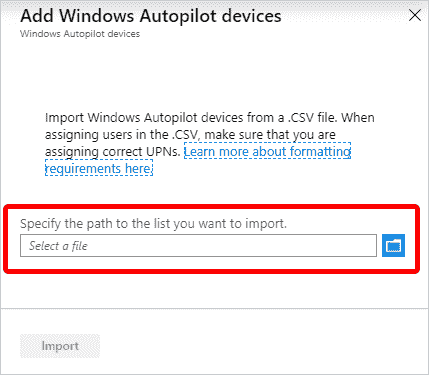
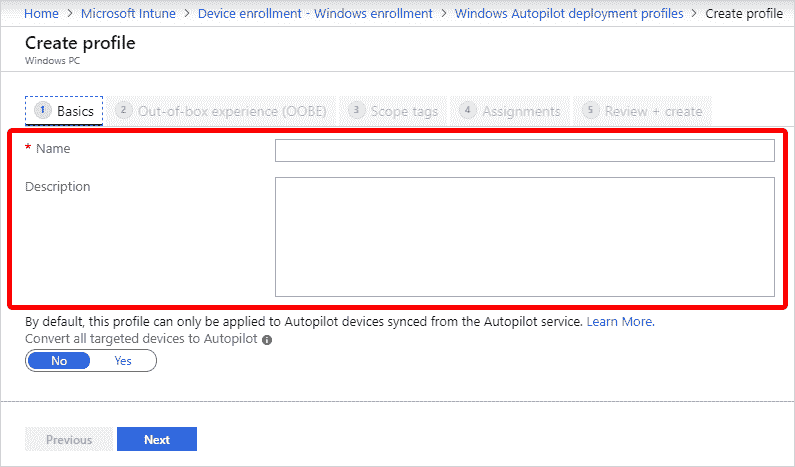
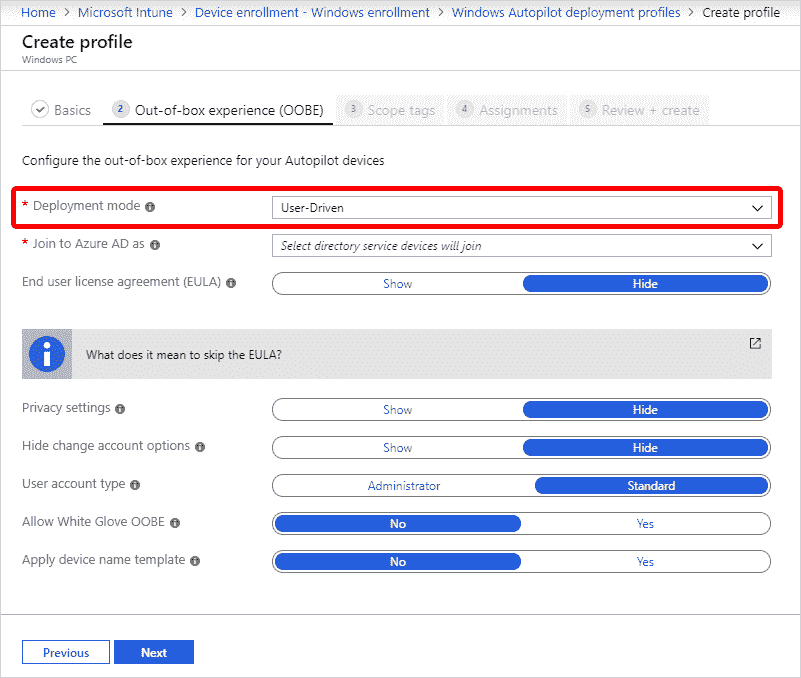
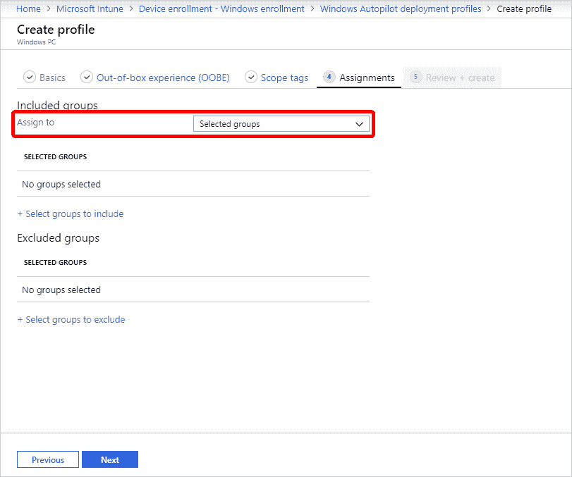
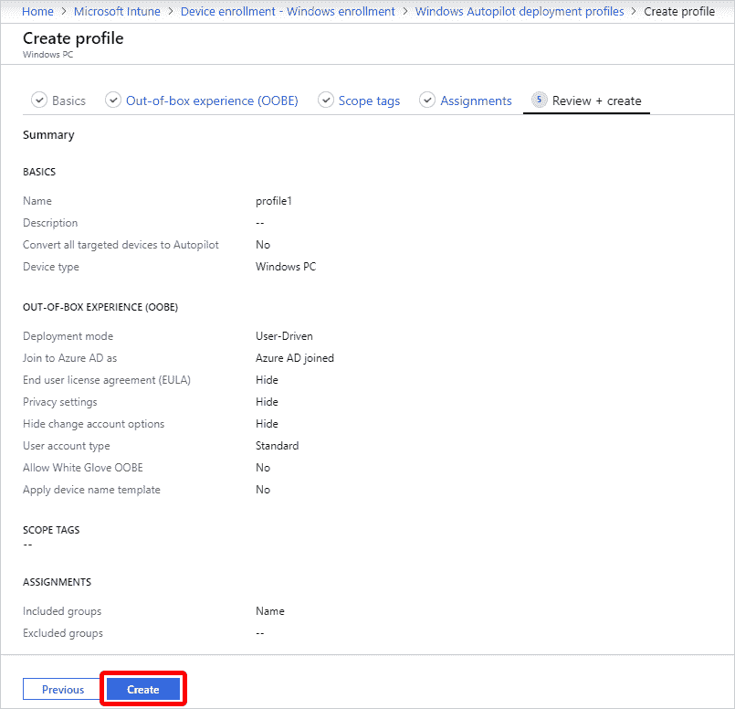
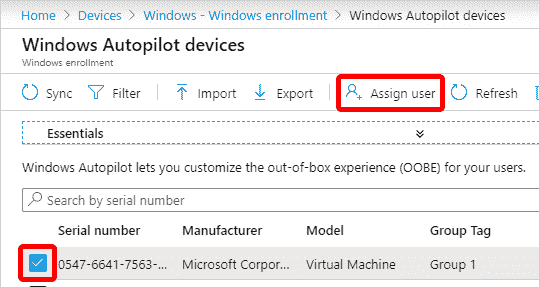
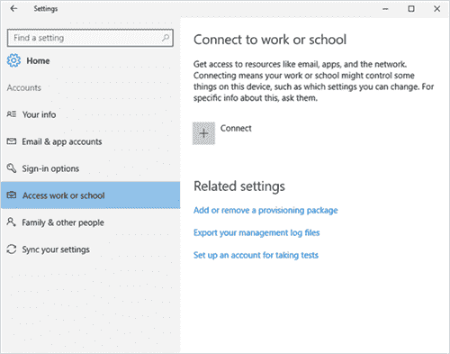

# 在 Microsoft 365 中规划 Windows 10 部署

> 原文：<https://medium.datadriveninvestor.com/plan-windows-10-deployments-in-microsoft-365-72b74906c264?source=collection_archive---------3----------------------->

微软 365 是微软的新产品，它将 Windows 10 与 Office 365 以及企业移动性和安全性(EMS)相结合。

要在您的组织中成功部署 Windows 10 操作系统，了解其不同的部署方式非常重要，尤其是现在有新的场景需要考虑。在这些场景中进行选择，并了解每个场景的功能和局限性，是一项关键任务。

Windows Autopilot
就地升级
使用 Intune 部署 Windows 10 升级
使用 Microsoft Endpoint Configuration Manager 部署 Windows 10 升级
使用 Microsoft Endpoint Configuration Manager 部署计算机更新

**学习目标**

*   规划 Windows 即服务(WaaS)
*   选择 Windows 10 部署方法
*   Windows 10 自动驾驶部署
*   创建自动驾驶部署配置文件
*   注册 Windows 10 设备
*   分析 Windows 10 的升级准备情况
*   Windows 10 企业安全功能
*   威胁防护
*   部署企业安全功能

# 规划 Windows 即服务(WaaS)

Prior to Windows 10, Microsoft released new versions of Windows every few years. This traditional deployment schedule imposed a training burden on users, because the feature revisions were often significant. That schedule also meant waiting long periods without new features, a scenario that doesn’t work in today’s rapidly changing world, a world in which new security management and deployment capabilities are necessary to address challenges. Windows as a service delivers small feature updates two times per year around March and September to help address these issues. In the past, when Microsoft developed new versions of Windows, it typically released technical previews near the end of the process when Windows was nearly ready to ship. With Windows 10, new features will be delivered to the Windows Insider community as soon as possible. With Windows 10, you will need to change the way you approach deploying updates. Servicing channels are the first way to separate users into deployment groups for feature and quality updates. With the introduction of servicing channels comes the concept of a Deployment Ring, which is simply a way to categorize the combination of a deployment group and a servicing channel to group devices for successive waves of deployment. There are three core servicing channels. The first one is Semi-Annual. **Semi-Annual** servicing channel feature updates are available as soon as Microsoft releases them. When Microsoft officially releases a feature update for Windows 10, it is made available to any device not configured to defer feature updates so that those devices can immediately install them. Organizations that use Windows Server Update Services, or WSUS, Microsoft System Center Configuration Manager, or Windows Update for Business, however, can defer feature updates to selective devices by withholding their approval and deployment. In this scenario, the content available for the Semi-Annual channel will be available, but not necessarily immediately mandatory, depending on the policy of the management system. **Long-Term**: Specialized systems, such as devices that control medical equipment, point of sale systems, and ATMs often require a longer servicing option because of their purpose. These devices typically perform a single important task and don’t need feature updates as frequently as other devices in the organization. LTSC, or Long-Term Servicing Channel, model prevents Windows 10 Enterprise LTSB, or Long-Term Servicing Branch, devices from receiving the usual feature updates and provides only quality updates to ensure that device security stays up to date. Quality updates are still immediately available to Windows 10 Enterprise LTSB clients, but organizations can choose to defer them. **Insider**: Windows 10 feature flighting enables Windows Insiders to consume and deploy pre-production code to their test machines, gaining early visibility into the next build. Microsoft recommend all organizations have a few devices enrolled in the Windows Insider program. Deployment rings in Windows 10 are similar to the deployment groups most organizations constructed for previous major revision upgrades. They are simply a method by which to separate machines into a deployment timeline. With Windows 10, you construct deployment rings a bit differently in each servicing tool, but the concepts remain the same. Each deployment ring should reduce the risk of issues derived from the deployment of the feature updates by gradually deploying the update to entire departments. Defining deployment rings is generally a one-time event or at least infrequent, but IT should revisit these groups to ensure that the sequencing is still correct. Also, there are times in which client computers should move between different deployment rings when necessary. For example, you may use Preview, General, and Critical as the deployment rings. Now we can assign devices to servicing channels. The first deployment ring type is Preview, and this is referred to as the Windows Insider Program and mapped to that service channel. Feature deferral and update deferral are not enabled. The General deployment ring is a Semi-Annual channel and the feature deferral is 120 days until it is forced-installed. Update referral is seven to 14 days. And then, of course, our last one is Critical, and these are devices that are critical and will only receive updates once they’ve been vetted for a period of time by the majority of the organization. So once again, this one sits in the Semi-Annual channel. There’s a 180-day feature deferral and a 30-day update deferral. Now if we look at the servicing channels, we have all three, Semi-Annual, Long-Term Servicing, and Insider. The **Semi-Annual channel** is the default servicing channel for all Windows 10 devices except those with the LTSB edition installed. So we can see the Semi-Annual servicing channel applies to Professional, Enterprise, Professional Education, Education, and Mobile Enterprise version. Each edition of Windows 10 is available in one or more of the servicing channels. So in the **Long-Term servicing channel**, it’s only the Enterprise LTSB version, and for the **Insider Program**, it’s each version of that, but does exclude the LTSB. And that’s an important note to make, is that if you are running the LTSB, so the Long-Term Servicing Branch, it will only sit in the Long-Term servicing channel. Determining the servicing channel for your Windows 10 devices is critical in ensuring that the updates are installed effectively and that you remove some of the critical issues that are found often after updates have been deployed.

# 选择部署方法

Organizations normally deploy a new version of Windows using a wipe-and-load deployment process. As a high level, this process captures existing data and settings from the existing device, deploys a new custom-built Windows image to that device, injects hardware drivers, reinstalls applications, and finally restores the data and settings. With Windows 10, this process is still fully supported and for some deployment scenarios is still necessary. Windows 10, however, also introduces two additional scenarios that organizations should consider. The first is in-place upgrade, which provides a simple automated process that leverages the Windows set-up process to automatically upgrade from an earlier version of Windows. This process automatically migrates existing data, settings, drivers, and applications. The second option is dynamic provisioning, which enables organizations to configure new Windows 10 devices for organization use without having the deploy a new custom organizational image to the device. When choosing the deployment scenario, we first need to understand the type and how and when we should choose them. So our first option is **in-place upgrade**. You’ll choose this option when you want to keep all, or at least most, of the existing applications. Also, if you do not plan to significantly change the device configuration. So for example, a BIOS change maybe switching to Secure Boot or even an operating system configuration moving from x86 to x64, or even language changes or domain changes. The second option is the **traditional wipe-and-load**. When you make significant device or operating system changes, or you want to start from clean, or you have significant numbers of applications along with the OS that you wish to retain. Also, if you’re migrating from Windows Vista or other previous operating systems. And then our final choice is **dynamic provisioning**. For new devices, especially in the choose-your-own-device scenario, when simple configuration, not re-imaging, is all that’s required. You can utilize this in combination with a management tool, for example, a mobile device management service such as Microsoft Intune, that enables self-service installation of user-specific or role-specific applications. Now when we talk about the deployment and the installation process, we are catering for three clear types. One is **migration**, one is **new**, and one is **update**. For migration from previous Windows versions, for existing PCs running Windows 7 or Windows 8.1, in-place upgrade is the recommended method for Windows 10 deployment and should be used whenever possible. Although the wipe-and-load and OS refresh deployments are still fully supported and often necessary, in-place upgrade is simpler and faster and enables a faster Windows 10 deployment overall. For new computers acquired with Windows 10 preinstalled, you can leverage **dynamic provisioning** scenarios to transform the device from its initial state into a fully configured organization PC. There are two primary dynamic provisioning scenarios you can use. The first is **user-driven** from the cloud. By joining a device into Azure Active Directory and leveraging the automatic Mobile Device Management, so the MDM provisioning capabilities at the same time, an end user can initiate the full provisioning process themselves. This is done by them entering their Azure Active Directory account and password, often called their work or school account within Windows 10\. The Mobile Device Management service can then transform the device into a fully configured organizational PC. The second option is the **IT admin-driven** using new tools. Using the new **Windows Imaging and Configuration Designer** or the ICD tool, IT administrators can create provisioning packages that can be applied to a computer to transform it into a fully configured organizational PC. Now, of course, once we have all these machines migrated and built, then we need to focus on updating them. For computers already running Windows 10 on the semiannual channel, new upgrades will periodically be deployed approximately two to three times per year. You can deploy these upgrades by using a variety of methods, Windows Update, Windows Update for Business, for devices where you want to receive updates directly from the internet. You can also utilize Windows Server Update Services, so WSUS, for devices configured to pull updates from internal servers after they are approved. You can also utilize System Center Configuration Manager, utilizing task sequences, or utilizing the next software update capabilities. Now we still have the Deployment Toolkit that can be utilized for deploying updates to devices. The Deployment Toolkit is a unified collection of tools and processes, and guidance for automating desktop and server deployments. It’s built on top of the core deployment tools in the Windows Assessment and Deployment Kit, so the Windows ADK, and has support for zero-touch installation if we’re using System Center Configuration Manager. If you are deploying using System Center, then the operating system deployment with Configuration Manager is part of a normal software distribution infrastructure, but there are additional components that are required. For example, operating system deployment in Configuration Manager may have to utilize the state migration point role, which is not used by normal application deployment in Configuration Manager.

# Windows 10 自动驾驶部署



Windows 10 自动驾驶取决于 Windows 10 和 Azure Active Directory 中可用的特定功能。它还需要 MDM 服务，如 Microsoft Intune。这些功能可以通过各种添加和订阅程序获得。要提供所需的 Azure Active Directory 和移动设备管理功能，需要以下许可证之一。Microsoft 365 商业订阅、Microsoft 365 F1 订阅、Microsoft 365 学术 A1、A3 或 A5 订阅、Microsoft 365 企业 E3 或 E5、企业移动和安全或 EMS E3 或 E5、教育版 Intune，以及 Azure Active Directory Premium P1 或 P2(含 Microsoft Intune 订阅)。 **Windows Autopilot** 使您能够自动将设备加入 Azure Active Directory 或 Active Directory，自动将设备注册到移动设备管理服务(如 Microsoft Intune)，限制管理员帐户创建，基于设备配置文件创建设备并将其自动分配到配置组，然后自定义特定于组织的现成体验内容。当我指的是开箱即用体验时，这是 Windows 10 经历的安装过程。现在，从场景角度来看，Windows Autopilot 包括对许多不同场景的支持，旨在支持常见的组织需求，这些需求可能会根据组织的类型以及向 Windows 10 的迁移和向现代管理的过渡而有所不同。第一个场景是部署由组织成员设置并为其配置的设备。我们还可以部署自动配置为共享使用的设备，例如信息亭或数字标牌设备。还可以在业务就绪状态下重新部署设备，为设备预配置最新的应用程序、策略和设置。当然，在现有的 Windows 7 或 8.1 设备上部署 Windows 10。现在，至于使用 Windows 10 自动驾驶仪，这些是以下步骤。首先，创建一个基本的 Windows 10 映像，并确保它正在运行。这可以使用现有的硬件或虚拟机来完成。捕获特定设备的硬件标识符。重置开箱即用体验，因此这将重置回默认设置，以便为构建做好准备。验证 Azure Active Directory 中的订阅级别和许可证。配置可能需要分配给开箱即用体验的任何公司品牌，或者诸如背景或登录屏幕之类的东西。配置 Intune 自动注册流程。注册 Windows 10。一旦您完成了这些，您就可以创建并分配一个部署概要文件。此时，您就可以使用自动驾驶程序部署 Windows 10 设备了。

# 检索自动驾驶仪的设备详细信息


为了利用 Windows 10 自动驾驶仪，需要完成几个步骤。在这种情况下，我们将利用一个虚拟机，我们将检索有关设备的一些信息，然后将这些信息上传到 Microsoft Intune 门户。为此，我们需要使用 PowerShell。因此，我以管理员身份启动了 Powershell ISE，我的第一个任务是执行执行策略命令，并将其设置为无限制(Set-execution policy Unrestricted)。这是为了当我们从微软源码安装脚本时，我们将使用一个 NuGet 包并把它们存储在那里，我们不会有任何安全问题。因此，我将简单地选择它，然后执行。(Set-execution policy Unrestricted)现在，它将返回并通知您正在更改执行策略，并且存在安全风险。现在我们可以对所有人说是。(Install-Script Get-windows auto pilot info)他们将实际安装所谓的获取 windows 自动驾驶信息。这是一个由微软提供的 PowerShell 模块，它将从硬件设备(在本例中为虚拟机)中检索所需的信息，以便我们可以将其上传到 Intune 门户。现在顺便提一下，当您执行这个命令时，通常是第一次，如果您从未执行过任何 PowerShell 命令，也从未连接到 NuGet 包，它也会提示您进行安装。我之前已经完成了，所以它不会提示我。现在已经安装好了，我将导航到该位置。所以模块本身被安装到程序文件、窗口、PowerShell 和脚本中。我将执行此操作，您将在 Powershell 底部看到，我现在已将目录(即 pushd 命令)推送到该位置。(pushd " c:\ Program Files \ windows PowerShell \ Scripts ")然后，我将执行实际的 PowerShell 本身，并将结果输出到一个我称为 HWID.CSV 的文件中。\ Get-windowsautopilotinfo . PS1-输出文件 HWID。CSV ),现在已经完成。现在，如果我打开我的文件浏览器，导航到我的位置，如果我浏览到程序文件、PowerShell 和脚本，您会看到 HWID CSV 现在已列出。如果我右击并选择编辑，这将在记事本中打开。这里最重要的信息是指设备序列号、Windows 产品 ID 和硬件哈希。当然，现在我们无法解码硬件哈希，但其他信息是存在的。现在我们对这个文件做的是，我们需要将这个文件复制出来并保存，这样我们就可以将它上传到 Microsoft Intune 门户网站。

```
md c:\\HWID Set-Location c:\\HWID Set-ExecutionPolicy -Scope Process -ExecutionPolicy Unrestricted Install-Script -Name Get-WindowsAutoPilotInfo Get-WindowsAutoPilotInfo.ps1 -OutputFile AutoPilotHWID.csv
```

# 进口硬件标识(HWID)



既然我们已经捕获了硬件标识信息，我们现在需要返回到 Microsoft 365 设备管理并单击设备。然后，我们向下移动到设备注册，并单击注册设备。在这里，您可以看到我们将选择 Windows 注册选项。我们不打算使用这些选项中的任何一个，而是滚动到底部显示“Devices”的位置。现在，当这个加载时，你会看到没有任何设备，但有一个导入选项。我们将单击“import ”,然后浏览到我们从另一台计算机上复制的文件。所以 HWID 的文件。然后，我将单击“import ”,这将启动一个导入该信息的过程。现在这可能需要 15 分钟。通常需要几分钟。有时更少，这取决于设备的数量，但这可能需要一些时间，所以要注意。Microsoft 会通知您，此过程可能需要 15 分钟，它会向您显示经过的时间。完成后，该设备仍不会在此处列出。然后，我们必须执行同步过程。它将在执行后完成。所以，那个设备现在已经进口了。我可以在这里关闭这个选项。但是请注意，即使我单击“refresh ”,设备也会列出来，但是没有任何相关联的内容。这是我们经常单击同步选项的地方，这将把这些信息直接同步到 Microsoft engine 的其余部分。所以，有两个部分的过程。我们获取 HWID 文件，导入它，它会在这里列出项目。



有时候，不是所有时候，我会对你说实话。然后单击“同步”,以确保该文件被列为项目。我可以单击“refresh ”,它现在会显示已经同步。这就是我们将硬件信息直接导入的方式。现在，我可以点击这个。您可以在右侧看到，它将为我提供有关该特定设备的信息。但是你会注意到没有群标签。它没有被分配任何东西，没有被注册，什么都没有。这只是将设备直接放入 intune 以备使用的过程。

# 创建自动驾驶部署配置文件



既然我们已经注册了希望注册的设备，现在我们需要在 Microsoft 365 设备管理控制台配置设备注册策略。我将再次单击“devices ”,您可以看到我们将返回注册设备，然后从这里我们将定义一个部署配置文件，您将看到我们已经定义了一个自动导航配置文件。实际上，我将为此创建一个新的配置文件，并为其命名，然后我们将选择“下一步”，然后我们将决定部署模式以及是否将其加入 Azure AD 以及其他一些可用选项。这里的第一个选项是用户驱动或预览模式下的自我部署，在本例中，我们将使用用户驱动，这意味着当用户进入计算机并尝试登录时，将要求他们提供凭据，一旦用户完成了这一步，部署流程的其余部分将由该流程自动处理。



我们将选择实际加入 Azure 广告域，然后我们可以决定是否显示微软许可条款，我将暂时隐藏它。对于隐私语句，我将隐藏这些内容，我也不需要最终用户阅读软件许可证或隐私，然后能够隐藏更改帐户选项，我想这样做是因为我不想让他们修改任何内容。然后，我可以选择我希望添加的帐户类型，作为此过程的一部分，我将把它保留为标准帐户。然后，我将使用“允许白手套开箱即用”体验，这意味着我可以对开箱即用体验进行更改，这意味着它会自动定义我希望在开箱即用体验中部署、修改或更改的所有组件。然后，我还可以应用一个设备模板名称，您会看到框外会出现一个示例，显示我的公司破折号，然后是一些随机字符，您可以使用特定字符定义任何类型的格式模式小写字母、大写字母或数字，还有 rant 之类的功能。我将选择“否”,我不需要为此定义特定的格式，我将选择“下一步”,然后决定将此配置文件分配给谁。



我将选择要包括的组，当我的组列出时，我将一直向下滚动到我在这里创建的名为“Windows 10 AutoPilot”的组，其中只包含一个用户，即我们一直在使用的帐户，然后我将单击“next”。然后，我们会看到一个审查和创建选项，在这里我们可以确保一切都按照预期进行设置。现在，我注意到我需要更改的一个选项是将设备转换或定位为自动驾驶，因此我可以单击“基本信息”,您会注意到，我们可以前后单击每个位置，根据需要进行更改，然后我可以单击“返回”查看和创建，我将单击“创建”。



现在继续创建我的新策略，您将看到一个配置文件已创建，并已成功分配给包含该用户的组，分配给包含该单个用户的组。



现在，我们已经注册了设备，也创建了自动驾驶部署配置文件，我们现在需要将设备分配给要部署到的用户，因此我将单击“设备”,返回“注册设备”。返回我的设备列表，然后选择该设备，您会在右上角看到，“分配用户”变为活动状态。我将单击“assign user ”,然后我可以搜索我的用户。我将单击该用户，选择“select ”,单击“user ”,选择“select ”,您会看到现在它会显示信息，然后显示“user friendly name”。现在，它会将该内容关联到用户，我可以按保存。我们现在已经将一个用户与 Windows 10 设备相关联，然后将用户添加到一个安全组，该安全组具有与之相关联的部署配置文件。

# 注册 Windows 10 设备



所以我们回到了 Windows 10 设备，准备进行注册过程。只需输入工作帐户，然后将该设备直接注册到 Intune，然后下拉我们之前定义的所有配置文件和配置。因此，以用户身份登录设备，然后选择下一步。这将要求输入密码。请记住，这是用户的 Azure Active Directory 帐户。现在，这将根据我们键入的帐户建立到 Azure Active Directory 的连接，连接到您的组织。在这种情况下，它将是您的组织。然后连接到我们在 Microsoft Intune 中创建的入口点，开始将所有这些零碎的东西连接在一起。所以接下来选择“是”。然后我们可以选择任何隐私设置。让我们选择 Accept 作为默认设置，然后我们将通过 Microsoft 加载过程让我知道 Microsoft Windows 当前正在执行一些配置。如您所见，首先出现在这里的是，该组织需要 Windows Hello 作为注册过程的一部分，这是策略中配置的内容。所以让我们选择设置 PIN。这将我带到组织登录，询问更多信息，因为我们已经定义了策略。选择下一步。它会询问有关手机或移动应用程序的信息。在这种情况下，我们可以使用移动应用程序。在这一点上，我们可以说接收验证通知或根据需要使用验证。我们将单击“设置”,然后从移动设备上，我们可以像平常一样添加工作和学校帐户。这只是将身份验证应用程序连接到 Office 365 帐户，然后允许我们每次身份验证时生成一个 ID。现在要做的是检查激活状态，以确保它已被配置。我们会等一会儿。单击下一步。然后，它会在移动应用程序上提示批准，因此在设备上单击“批准”，然后会检查并确认我们在设备上要求的额外安全验证已按预期工作。这里的第二个选项显然是添加一个移动设备作为电话号码，以便在我们丢失电话的情况下，我们可以添加第二个因素身份认证选项，该选项将发送文本消息，而不是使用移动应用程序本身。所以键入电话号码，然后选择完成。现在将要求我们为本地设备设置 PIN。您会注意到，当我们键入一组较小的字符时，由于我们创建的配置文件中的复杂性要求，它会提示我们返回。现在点击确定。这里以全屏模式回到桌面。如果现在单击开始菜单并导航到该帐户，如果您单击更改帐户设置，您可以看到信息现在已连接。以用户身份登录到域中，我们现在已作为 Windows 10 设备成功连接到 Microsoft 云。现在已经添加了 Windows 10 设备，我们可以单击 Microsot 365 设备管理主页中的设备，然后我们可以单击进入 Windows，您会看到添加的桌面，在我的情况下是一个虚拟机，已经作为公司所有权添加，并且处于合规模式。您还会看到该电子邮件地址，也就是实际与之关联的用户。

[***在第二部分我们将考察这个环节。***](https://medium.com/@ealtili/how-to-upgrade-windows-10-deploy-enterprise-security-features-cbc041e61602)

*   分析 Windows 10 的升级准备情况
*   Windows 10 企业安全功能
*   威胁防护
*   部署企业安全功能

*原载于*[*https://github.com*](https://github.com/ealtili/Blog/blob/master/Microsoft365/Windows10Deployments.md)*。*