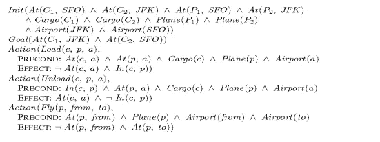
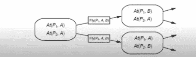
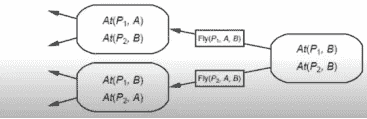
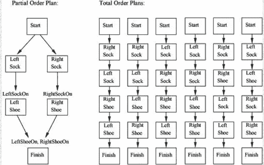
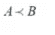
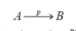
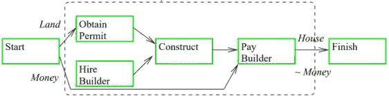

# 人工智能规划

> 原文：<https://medium.datadriveninvestor.com/planning-in-artificial-intelligence-5f498489605a?source=collection_archive---------0----------------------->

在人工智能中，存在通过传感器感知环境并通过致动器或效应器作用于环境的代理。就像人类有传感器，我们通过传感器来感知周围的环境(眼睛、耳朵、鼻子、舌头和皮肤)，还有执行器(四肢)来对这些环境执行动作。代理从初始状态开始，执行一系列动作以达到目标状态。例如，真空吸尘器代理将执行左右移动和吸入灰尘的动作，以达到成功清洁环境的目标。

## 规划及其类型

这种提出一系列行动以实现目标的活动被称为计划。规划可以是经典的，也可以是非经典的。在经典规划的情况下，环境是完全可观察的、确定的、静态的和离散的，而在非经典规划的情况下，环境是部分可观察的(即，在给定时刻环境的整个状态是不可见的)或非确定的(或随机的，即，当前状态和选择的动作不能完全确定环境的下一状态)。

## 规划语言

规划问题的表示通常使用条带(斯坦福研究所问题求解器)来完成。它包括:

> 一组状态——它是正基本文字的合取。
> 
> 一组目标-部分指定的状态，表示为正文字的合取，以及
> 
> 一组行动——每个行动都有一个必须满足的先决条件和一个反映行动实施后对环境影响的效果。

规划问题也可以用 PDDL(规划领域定义语言)来表示。

## P 规划使用状态空间搜索

状态空间由初始状态、一组目标状态、一组动作或操作、一组状态和路径成本组成。需要搜索这个状态空间，以找到通向目标状态的一系列动作。这可以向前或向后进行。

## 正向状态空间搜索

也叫级数。它从初始状态开始向前搜索，直到我们到达目标。它使用条带表示法。这就是问题表述的样子。

> 初始状态:开始状态
> 
> 行动:每一项行动都有一个特定的先决条件，在行动执行之前必须满足，以及行动对环境的影响。
> 
> 目标测试:检查当前状态是否是目标状态。
> 
> 步骤成本:假设每个步骤的成本为 1。

FSSS 从初始状态开始，应用动作到达下一个状态。然后它检查这个状态是否是目标状态。如果没有，它继续应用其他动作，直到达到目标。

让我们以空运货物问题为例。这里 P1 和 P2 是两架飞机，A 和 B 是两个机场。我们从初始状态开始，用问题的动作向前搜索目标状态。

## 向后状态空间搜索

它也被称为回归。它使用条带表示法。问题公式类似于 FSSS 公式，由初始状态、行动、目标测试和步骤成本组成。在 BSSS 中，搜索从目标状态开始，并向后移动，直到到达初始状态。它从目标开始，检查它是否是初始状态。如果没有，则应用相反的操作来产生子目标，直到达到开始状态。举个例子，

## 总订单计划(顶层)

FSSS 和 BSSS 是最好的例子。他们只探索从开始到目标状态的线性行动序列，他们不能利用问题分解，即把问题分解成更小的子问题并单独解决它们。

## 部分订单计划(POP)

它致力于问题分解。它会把问题分成几个部分，独立实现这些子目标。它用子计划解决子问题，然后根据需求组合这些子计划并重新排序。在 POP 中，操作的顺序是部分的。它没有指定计划中的两个动作中哪个动作先发生。让我们借助一个例子来看看这一点。穿鞋的问题可以通过总订单或部分订单计划来执行。

> 初始化:赤脚
> 
> 进球:右鞋^左鞋
> 
> 动作:1。RightShoeOn
> 
> 前提条件:RightSockOn
> 
> 效果:右鞋
> 
> 2.LeftShoeOn
> 
> 前提条件:LeftSockOn
> 
> 效果:LeftShoeOn
> 
> 3.LeftSockOn
> 
> 前提条件:赤脚
> 
> 效果:LeftSockOn
> 
> 4.RightSockOn
> 
> 前提条件:赤脚
> 
> 效果:RightSockOn

顶部由六个序列组成，可以选择其中一个序列以达到结束状态。然而，POP 并不复杂。它结合了两个动作序列。第一个分支覆盖左袜子和左鞋子。要穿左脚的鞋，穿左脚的袜子是先决条件。类似地，第二个分支覆盖右袜子和右展示。一旦采取了这些行动，我们就实现了我们的目标并达到了结束状态。

 [## 机器学习和人工智能如何改变电子商务的面貌？|数据驱动…

### 电子商务开发公司，现在，整合先进的客户体验到一个新的水平…

www.datadriveninvestor.com](https://www.datadriveninvestor.com/2020/11/19/how-machine-learning-and-artificial-intelligence-changing-the-face-of-ecommerce/) 

## 定义部分订单计划

*   构成计划步骤的一系列行动。例如，{右鞋，右袜，左鞋，左袜，开始，结束}。
*   一组排序约束，A 在 b 之前。例如，{ right sock< RightShoe, LeftSock < LeftShoe}.

*   A set of causal links, A achieves P for B.

*   A set of open preconditions. A precondition is open if it is not achieved by some action in the plan.

## HI archical Planning

这里的计划是以层次结构的形式组织的。它对计划分解起作用。复杂的动作被分解成简单的或原始的动作，并且可以借助于层次结构中不同级别的各种状态之间的链接来表示。这叫做算子展开。

原始任务——这些对应于长条的动作，

复合任务——这些是一组更简单的任务，

目标任务——这些对应于长条的目标。

在分层规划中，我们通过分解复合任务找到一个原始任务序列，以达到目标。例如，在建造房子的情况下，使用如下所示的分级规划。

## 条件规划

不管行动的结果如何，它都会起作用。它通过检查计划中预定点的环境中正在发生的事情来处理不确定性。它可以发生在完全可观察和不确定的环境中。它将采取行动，并且必须能够处理所采取行动的每一个结果。举例来说，如果<test-cond>然后计划 a，否则计划 b。在吸尘器出现问题的情况下，如果在左边^清洁，然后右边其他吸。</test-cond>

**进入专家视图—** [**订阅 DDI 英特尔**](https://datadriveninvestor.com/ddi-intel)