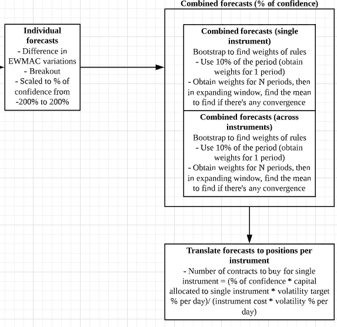

# 框架:使用连续预测的未来趋势跟踪(受 AQR 和曼·AHL 启发)

> 原文：<https://medium.datadriveninvestor.com/plans-for-developing-a-trend-following-strategy-in-futures-using-continuous-forecasts-inspired-by-e00e31255144?source=collection_archive---------5----------------------->

Plan summary

> 截至 2021 年 5 月 27 日的更新:您可以访问此[链接](https://blog.quantinsti.com/trend-following-strategy-futures-time-series-momentum-continuous-forecasts-project-jirong-huang/)查看完整的调查研究。您也可以访问 [Github 知识库](https://github.com/jironghuang/trend_following)下载已完成研究中使用的代码库。
> 
> 免责声明:作者在这项研究的策略中没有立场，但对未来开发和投资跨资产类别的可行趋势跟踪策略有浓厚的兴趣

# 项目动机

正如 19 世纪英国经济学家大卫·李嘉图曾经说过的，“减少你的损失，让你的利润趋势发展”。这暗示了一点，趋势跟踪作为一种有利可图的策略甚至可以追溯到那个时候。

在阅读了 AQR 关于时间序列动量(TSMOM)的论文后，我热衷于在期货领域探索这一主题，以进一步分散我的投资组合。

Quantopian 社区已经探索了这个策略，源代码和数据集可以在这个 [github 库](https://github.com/quantopian/research_public/tree/master/advanced_sample_analyses/TSMOM)中找到。除了 AQR 的论文，我还密切关注罗伯特·卡弗的工作，他以前是 AHL 的定量分析师，专门研究中长期趋势跟踪期货策略。

# 资料组

跨 4 种资产类别的期货数据集:指数、债券、货币、大宗商品

*   2016 年前的量子数据设置:大概是通过向后、向前、比例调整方法缝合的。
*   Quandl 中的 CHRIS Wiki 连续期货数据集:数据集由连续的原始未调整价格拼接而成，但不是向后、向前、按比例调整的价格。存在第一合同、第二合同、第三合同等的变体。为了将它用于数据建模目的，我必须假设在某个日期需要展期(通过交易量或未平仓权益)。
*   [Quandl](https://www.quandl.com/databases/SCF/data)中的 Steven Analytics 期货数据集:具有向后、向前、比例调整变化的拼接数据集。不幸的是，这背后是一个付费墙。

# 数据挖掘技术

在 AQR 的论文中，作者试验了 1 年的固定回望期，并决定了下个月的交易信号，即如果资产价格在 1 年内上涨，下个月的交易信号将会很长。当资产价格下降时，反向持有。每项资产的头寸基于每日回报的回顾指数标准差，年波动率为 40%。聚集成一个投资组合，年化标准差接近 12 %, 30 年的夏普值约为 1.0。

相反，我在这篇研究论文中打算进行的是更接近罗伯特·卡弗的方法论，

1.  首先，根据以下内容计算 3 种类型的连续预测:

> 指数移动平均线(例如 8–32，16–64，32–138)

*   原始预测:取一对移动平均线的差值
*   将原始预测除以工具风险(以价格单位表示的工具波动性)，得到风险调整后的预测。

> 突围

*   原始预测，范围内的比例价格:(价格 Ravg 或 med N)/(RmaxN-RminN)
*   将原始预测除以工具风险(以价格单位表示的工具波动性)，得到风险调整后的预测。

> 进位策略

*   原始预测=(远期合同价格-远期合同价格)/合同之间的距离
*   将原始预测除以工具风险(以价格单位表示的工具波动性)，得到风险调整后的预测。

2.重新调整第 1 点中的信号，以获得一段时间内每个预测的平均绝对信号强度 10。基于扩大所有工具的中值窗口的重新标度因子。

3.跨系统合并第 2 点中的信号。使用具有扩展窗口的自举或块自举来寻找最优权重(对于样本内或样本外数据。需要这方面的指导)。信号上限为-20 至+20。

4.通过多样化，点 3 中的组合信号将把平均信号强度降低到 10 以下。需要一个预测多样化乘数(FDM)来使信号再次达到平均值 10。FDM = 1/[sqrt(W X H X W 转置)]，其中 W 是预测权重，H 是点 1 中预测值的相关矩阵

5.头寸分配基于 25 个交易日的回顾指数波动率。可能会考虑按资产类别分层。

*   例如，1，000，000 份投资组合的 25%波动性目标表明年化风险为 250，000，每日风险为 250，000/16 = 15，625
*   如果有 4 个资产类别，每个资产类别被分配 3，906 的每日风险
*   如果每个资产类别中有 4 种工具。这将是每个工具大约 977 美元的每日风险。一个工具的信号+10 表示 977 美元的风险，而+20(强正预测)表示 1954 美元的风险。
*   进场和出场规则基于连续预测，而不是二元进场和出场。即策略取决于预测的状态

# 战略评估

对于战略评估，我计划使用以下指标，

1.  夏普/索蒂诺比率
2.  卡尔马尔比率/最大压降
3.  β/Fama-French 3 因素分析
4.  策略的偏斜/峰度

# 潜在挑战，需要进一步考虑以下几点

1.  期货数据集的拼接。
2.  在实践中，我们何时以及如何进行翻转？
3.  避免远期合约是必要的吗？为了避免 2020 年初的“石油合同”负面价格问题？
4.  我们是否总是保留在具有最高交易量/未结权益的合同中？
5.  我们如何找到最佳权重？
6.  我们如何正确使用自举来避免样本内偏差？

如果你喜欢这些内容，你可以访问我以前的文章 [*part1*](https://medium.com/datadriveninvestor/designing-and-building-a-fully-automated-algorithmic-trading-portfolio-management-system-6945c6c87620) *，* [*part2*](https://medium.com/datadriveninvestor/developing-a-performance-monitoring-component-in-my-fully-automated-algorithmic-trading-system-88f5afae05cd) *，*[*part 3*](https://medium.com/datadriveninvestor/developing-a-performance-monitoring-component-in-my-fully-automated-algorithmic-trading-system-983368441bba)*，*[*part 4*](https://medium.com/datadriveninvestor/performance-monitoring-component-in-my-fully-automated-algorithmic-trading-system-part-3-3d41f14005)*和*[*part 5*](https://medium.com/datadriveninvestor/how-to-place-option-spread-e-g-straddle-through-interactive-brokers-api-a-101-tutorial-aca2a0be3737)

*为了更好地理解上述战略发展计划，您可以阅读罗伯特·卡弗关于系统交易和杠杆交易的书籍。但是要注意的是，这些书非常厚，我花了一些时间才理解了他的框架。*

# *参考*

*   *赫斯特，布赖恩，华钥 Ooi，和 Lasse Heje 彼得森。“趋势跟踪投资的一个世纪的证据。”《投资组合管理杂志》第 44 期，第 1 期(2017):15–29。*
*   *莫斯科维茨，托拜厄斯 j .，华钥 Ooi，和 Lasse Heje 彼得森。“时间序列动量。”《金融经济学杂志》104 卷，第 2 期(2012 年):228–250 页。*
*   *罗伯特·卡弗。系统交易:设计交易和投资系统的独特新方法。哈里曼住宅有限公司，2015 年。*
*   *罗伯特·卡弗。杠杆交易。哈里曼房屋有限公司，2019。*