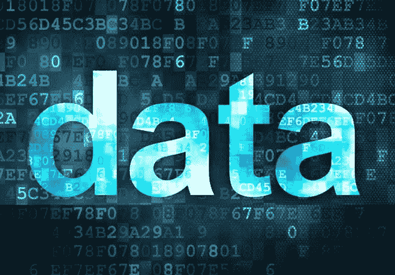
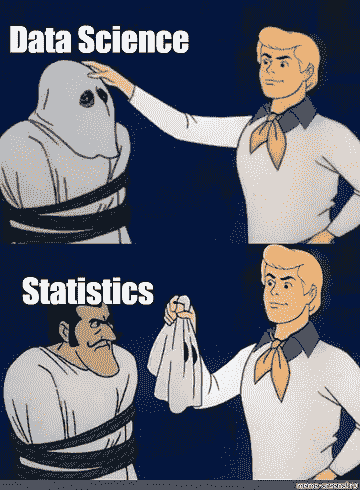
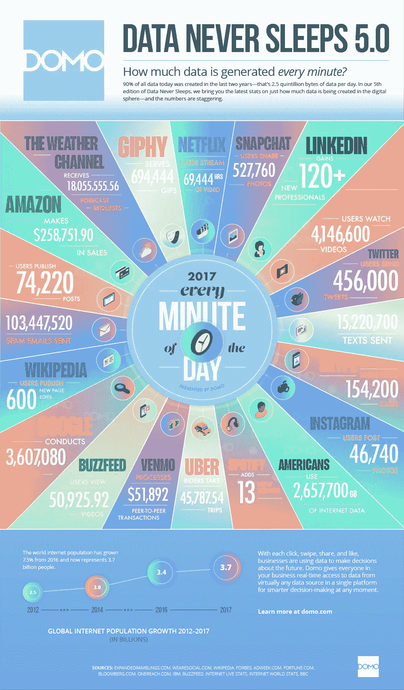

# 按我的方式玩。了解数据。

> 原文：<https://medium.datadriveninvestor.com/playing-it-my-way-getting-to-know-data-85fb30434691?source=collection_archive---------6----------------------->

# **什么是数据？**

在我们进入故事之前，让我告诉你什么是数据。数据是一种原始实体，大部分是随机的或无组织的。它是由无组织的事实组成的未经处理的信息状态。这就是数据和信息的区别。

> 当数据经过处理、结构化和组织后，我们称之为信息。

数据一词源于拉丁语“数据”，意思是“给定的东西”。

# **了解数据类型**

一般来说，我们有两种主要类型的数据**、定性(分类)**和定量(数字)。**定性数据不能用数字**来衡量，它又进一步分为 ***二进制******名义*** 和 ***序数数据*** 。**定量数据由数值**组成，又分为 ***离散*** 和 ***连续*** 数据。

 [## 数据分析如何为房地产金融提供信息|数据驱动的投资者

### 数据是 21 世纪的热门商品。因为它能够推动和通知几乎所有行业…

www.datadriveninvestor.com](https://www.datadriveninvestor.com/2020/07/02/how-data-analytics-can-inform-real-estate-finance/) 

## 离散和连续(区别)

听说过“系统有一半缺陷”这样的话吗？没有权利！。一个系统要么有一个完整的缺陷，要么根本没有缺陷。没有一半、四分之一或分数。这类数据称为**离散数据**例如:是/否、好/坏等。只有有限数量的值是可能的，并且这些值不能被进一步细分。**连续数据**是可以测量并分解成更小部分且仍有意义的数据。钱，温度，时间是连续的。例如:如果你有很多比萨饼，那么计算比萨饼的数量是不连续的，测量每个比萨饼并记录尺寸(即 25.2 厘米、26.1 厘米、29.5 厘米等)，这是连续的数据。特定数据项的值的范围具有最小值和最大值。连续数据可以是介于两者之间的任何值。

## 二进制、标称和序数(区别)

**标称值**是当每个值代表一个状态(或一个类别)时。例如:浅色皮肤、深色皮肤、中等皮肤、橄榄色皮肤、棕褐色皮肤。所有这些都是肤色的例子。

当名义数据中存在排序时，我们称之为**序数数据**。印度学生会讲的一个例子:差、一般、好、很好、优秀、杰出。这些是学生渴望得到的分数，所以你可以看到有一个排名，我们知道没有学生想要“差”。

**二进制数据**是只有两个类别或状态 0 或 1 的名义数据。如果二进制数据的两种状态对应真或假，则称之为布尔型。

*我相信你已经了解了什么是数据以及你在周围看到的数据类型的本质。现在让我们进入你可以用数据做的事情，了解一些你每天听到的与数据相关的流行语。*

> 一位英国作家曾经说过，“除非你知道数据背后的数学和数字，否则你不能玩数据”:)
> 
> 诗人的名字将在本文末尾披露。请不要向下滚动来查看名称。要有耐心:)。

## 是时候谈谈数学了，或者像数据专家所说的“统计学”。

***利用数学对我们所拥有的数据进行分析的方法叫做统计学。***

## 但是为什么统计学很重要呢？

让我们以两种情况为例。第一个场景，一个人去找一个朋友，说“我今天吃了很多汉堡”。第二个场景，同一个人去找他的另一个朋友，说“我今天吃了 8 个汉堡”。与第一个场景相比，第二个场景会有巨大的反响。所以这里有一个数字可以帮助你做出一个具体的结论，一个人吃了很多食物，第二天他的肚子会发疯。因此，这里涉及的数学帮助我们对现有的数据做出具体的结论，而不是仅仅猜测所有可能的情况。

统计学是一个庞大的概念，而这篇文章是对数据整体的基本介绍，所以我们现在就坚持这一点。

现在你知道什么是数据及其类型。让我来回答一些你现在正在思考的明智的问题。

# 数据是如何创建或生成的？谁在创造数据？每天产生多少数据？

当一个人开始思考数据是什么时，这些是他/她头脑中最基本的问题。

现在，让我们来理解这些问题，寻找答案。

为了让你理解答案，我从《福布斯》的一篇文章中收集了一些数据。

**互联网**

*当我们手里拿着手机，想要查找某个问题的答案时，我们该怎么做？*

我们谷歌一下！或者就在网上找答案。这里有一些统计数据可以帮助你理解互联网上的数据是如何产生的。

*   现在，我们一半以上的网络搜索是通过手机进行的。
*   超过 37 亿人使用互联网(比 2016 年增长了 7.5%)。
*   平均而言，Google 现在每秒处理超过 40，000 次搜索(每天 35 亿次搜索)！
*   虽然 77%的搜索是在谷歌上进行的，但不要忘记其他搜索引擎也在为我们的日常数据生成做出贡献。全世界每天有 50 亿次搜索。

**社交媒体**

**社交媒体**

根据 Domo 的数据从不睡觉 5.0 报告，这些是每天每分钟产生的数字:

*   Snapchat 用户分享了 527，760 张照片
*   超过 120 名专业人士加入 LinkedIn
*   用户观看了 414.66 万个 YouTube 视频
*   Twitter 上发送了 456，000 条推文
*   Instagram 用户发布了 46740 张照片
*   15 亿人活跃在脸书**日报**
*   欧洲有超过 3.07 亿人居住在脸书
*   每秒钟有五个新的脸书个人资料被创建！
*   每天有超过 3 亿张照片被上传
*   每分钟有 510，000 条评论被发布，293，000 条状态被更新

我们来看看 Instagram 里会发生什么:)

*   有 6 亿 instagramers 4 亿每天都很活跃
*   Instagram 上每天分享 9500 万张照片和视频
*   每天有 1 亿人使用 Instagram 的“故事”功能

是啊！我知道这些数字很疯狂。

**通讯**

想象一天不跟人说话，除非你是个内向的 XD。

*   我们发送 1600 万条短信
*   有 990，000 次打火
*   发送 1.56 亿封电子邮件；预计到 2019 年，全球将有 29 亿电子邮件用户
*   15，000 张 gif 图片通过脸书信使发送
*   每分钟有 103，447，520 封垃圾邮件被发送
*   Skype 上有 154，200 个电话

这些是摘自《福布斯》2018 年发表的一篇文章的一些统计数据，现在我们是在 2020 年。我与您分享这些统计数据的基本想法是让您了解数据是如何创建的，以及每天创建的数据量。

除此之外，还有其他生成数据的地方。

我们在智能手机上点击的数码照片也是数据。像优步、Spotify、维基百科这样的服务产生数据，现在在物联网出现后，大量的数据正在产生。

Image source: [https://www.domo.com/learn/data-never-sleeps-5?aid=ogsm072517_1&sf100871281=1](https://www.domo.com/learn/data-never-sleeps-5?aid=ogsm072517_1&sf100871281=1)

我相信，当你看到数据时，你脑海中的所有问题现在都有了答案。

**最后**

# 我相信数据是用来探索的，它很酷，但绝不容易:因为数据是巨大的。

PS:非常巨大！

# 顺便说一句…呆在家里！注意安全。

参考:[https://www . Forbes . com/sites/Bernard marr/2018/05/21/how-much-data-do-we-create-every-day-the-mind-blowing-stats-every one-should-read/# 656 deaac 60 ba](https://www.forbes.com/sites/bernardmarr/2018/05/21/how-much-data-do-we-create-every-day-the-mind-blowing-stats-everyone-should-read/#656deaac60ba)

**访问专家视图—** [**订阅 DDI 英特尔**](https://datadriveninvestor.com/ddi-intel)