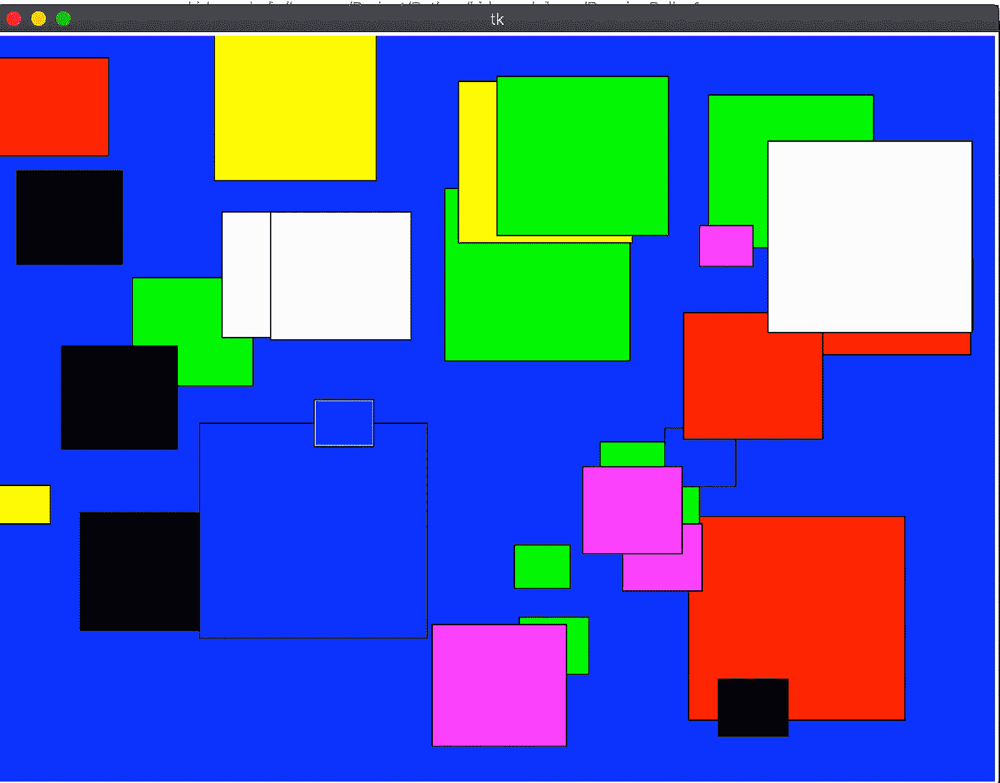

# 小部件和更多的图形以 Pythonic 的方式编写代码:任何孩子都可以编码

> 原文：<https://medium.datadriveninvestor.com/playing-with-widgets-any-kid-can-code-eabd60d50d4?source=collection_archive---------24----------------------->

## 逻辑思维和实现逻辑思维有助于以简单的方式概括日常问题:练习和发展你的逻辑能力

让我们利用迄今为止学到的知识。在前两篇博客中，我们学习了 GUI 编程，并设法在画布中移动了一些小部件。你可以参考下面的博客:

[](https://laxman-singh.medium.com/gui-programming-any-kid-can-code-45089f32a896) [## GUI 编程:任何孩子都可以编码

laxman-singh.medium.com](https://laxman-singh.medium.com/gui-programming-any-kid-can-code-45089f32a896) [](https://laxman-singh.medium.com/more-gadgets-any-kid-can-code-1cf54db0452e) [## 更多小工具——任何孩子都可以编写代码

### 在上一篇博客中，我们了解了 GUI 编程和 tkinterface 的一些介绍。我希望你会…

laxman-singh.medium.com](https://laxman-singh.medium.com/more-gadgets-any-kid-can-code-1cf54db0452e) 

我们将解决上述博客中提到的两个任务，我将尝试提供实现它们的不同方法。

## 任务 1

画布中不止一个物体在移动:
我将制作一个正方形和一个圆形来移动画布中的一个游戏:

```
*'''
Program to make rectangle and make it move in canvas
'''* # importing important libraries - we already know about all of them
from tkinter import *
import random
import time

# defining colors so that everytime you run this program will have different color rectangle
color = ["red", "green", "black", "blue", "yellow"]

# creating an instance of tkinterface
tk = Tk()

# deciding height and width of the canvas, we will pass this while creating canvas below
# WIDTH and HEIGHT are constant to give your program more understanding
WIDTH = 500
HEIGHT = 500

# creating our playground
canvas = Canvas(tk, width=WIDTH, height=HEIGHT, bg=random.choice(color))
canvas.pack()

# creating widget i.e, rectangle and oval here and assigning it to variable
rectangle = canvas.create_rectangle(10,20,60,60,fill=random.choice(color))
circle = canvas.create_oval(20,20,50,50,fill=random.choice(color))

# deciding the speed of the rectangle to move
# again both are variables and positive value will make it move forward and vice versa
moveXCoord = 1
moveYCoord = 3
moveXCoord_circle = 4
moveYCoord_circle = 1

# function to keep track of position
def checkBoundary(shape, moveXCoord, moveYCoord):
    *'''
    This function will check the current position
    in case figures is moving out of canvas
    it will change the movement to negative
    and (negative negative makes positive)
    So, it will work iteratively* ***:return****: new position to move
            negative means move backward
            positive means move forward
    '''* pos = canvas.coords(shape)
    if pos[3] >= HEIGHT or pos[1] <= 0:
        moveYCoord = -moveYCoord
    if pos[2] >= WIDTH or pos[0] <= 0:
        moveXCoord = -moveXCoord
    return moveXCoord, moveYCoord

# Introducing infinite loop
# it will run the program till you wont close it
while True:
    canvas.move(rectangle, moveXCoord, moveYCoord)
    canvas.move(circle, moveXCoord_circle, moveYCoord_circle)
    moveXCoord, moveYCoord = checkBoundary(rectangle, moveXCoord, moveYCoord)
    moveXCoord_circle, moveYCoord_circle = checkBoundary(circle, moveXCoord_circle, moveYCoord_circle)

    tk.update()
    time.sleep(0.001)

tk.mainloop()
```

> 以上代码是自我解释的，为了方便起见，我把我的意见，并随时优化相同的。

相信自己，实践，学习和调整代码，我知道这些成分会让你开发出更好的逻辑，提出更多创新的想法。我们的目标肯定是实现这一目标。

## 任务 2:

做一个循环，随机选择坐标，在画布上出现不同的图形。然后，试着让他们动起来。

```
*'''
Program to make rectangle and make it move in canvas
'''* # importing important libraries - we already know about all of them
from tkinter import *
import random
import time

# defining colors so that everytime you run this program will have different color rectangle
color = ["red", "green", "black", "blue", "yellow","cyan","white","magenta"]

# creating an instance of tkinterface
tk = Tk()

# deciding height and width of the canvas, we will pass this while creating canvas below
# WIDTH and HEIGHT are constant to give your program more understanding
WIDTH = 800
HEIGHT = 600

# creating our playground
canvas = Canvas(tk, width=WIDTH, height=HEIGHT, bg=random.choice(color))
canvas.pack()

rectangle = []
xy_coord = []
for cr_rect in range(30):
    # creating widget i.e, rectangle here and assigning it to variable
    side = random.randint(50,200)
    rectangle.append(canvas.create_rectangle(10,20,side,side,fill=random.choice(color)))
    # rectangle.append(canvas.create_polygon(80,90,50,60,side,20,fill=random.choice(color)))

    # deciding the speed of the rectangle to move
    # again both are variables and positive value will make it move forward and vice versa
    moveXCoord = random.randint(-10,10)
    moveYCoord = random.randint(-10,10)
    xy_coord.append([moveXCoord,moveYCoord])

# function to keep track of position
def checkBoundary(shape, moveXCoord, moveYCoord):
    *'''
    This function will check the current position
    in case figures is moving out of canvas
    it will change the movement to negative
    and (negative negative makes positive)
    So, it will work iteratively* ***:return****: new position to move
            negative means move backward
            positive means move forward
    '''* pos = canvas.coords(shape)
    if pos[3] >= HEIGHT or pos[1] <= 0:
        moveYCoord = -moveYCoord
    if pos[2] >= WIDTH or pos[0] <= 0:
        moveXCoord = -moveXCoord
    return moveXCoord, moveYCoord

# Introducing infinite loop
# it will run the program till you wont close it
while True:
    for cnt_rect in range(len(rectangle)):
        canvas.move(rectangle[cnt_rect], xy_coord[cnt_rect][0], xy_coord[cnt_rect][1])
        xy_coord[cnt_rect][0], xy_coord[cnt_rect][1] = checkBoundary(rectangle[cnt_rect], xy_coord[cnt_rect][0], xy_coord[cnt_rect][1])

    tk.update()
    time.sleep(0.001)

tk.mainloop()
```

> 我想看到你在评论部分的成就，作为上述两个代码生成的输出。随意实验！

就是这样！两个任务完成了。理解它们，这没什么不同，只是应用了我们对变量、循环、条件的理解。准备好升级吧。我认为我们下一步将转向 OOP(面向对象编程),相信我，你已经准备好了。



Create this! and make them move will be fun! I can’t wait much :)

我们理解了这个概念，我将为你提供一个例子来做同样的事情使用循环，然后使用我们的新朋友 oop。而且，你会看到更有条理和更好的输出。我希望你会出现在这个博客上，以一种更漂亮的方式修改这个代码。或者，由于我们是 python 程序员，我们将以 python 的方式来做。做好越来越多练习的准备。并且，我将努力使下一个水平对你来说容易和简单。继续努力，好好享受！**我很快就会回来！**