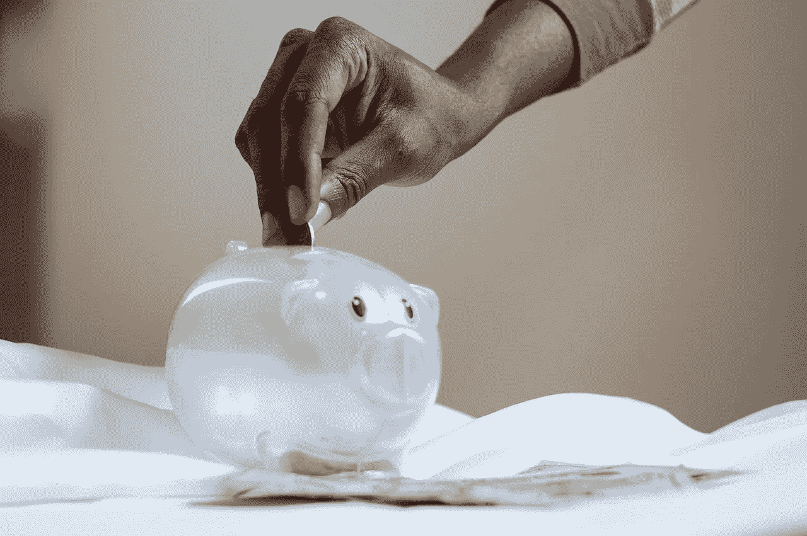
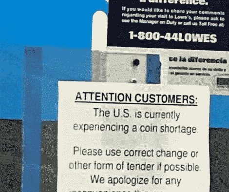

# 请不要找零了

> 原文：<https://medium.datadriveninvestor.com/please-dont-keep-the-change-c992faa8a969?source=collection_archive---------9----------------------->

## 花掉你的零钱

Photo by [Joslyn Pickens](https://www.pexels.com/@joslyn-pickens-2185980?utm_content=attributionCopyText&utm_medium=referral&utm_source=pexels) from [Pexels](https://www.pexels.com/photo/plastic-piggy-bank-3833052/?utm_content=attributionCopyText&utm_medium=referral&utm_source=pexels)

你的存钱罐越来越大了。

把你的硬币放在你的存钱罐、罐子或抽屉里，这可能是如此自然，以至于你没有注意到—

我甚至没有注意到，直到我最近去杂货店购物，门上有一个标志，要求准确的变化，以完成任何现金购买。

如果你不经常使用现金，很容易忽略美国的硬币短缺。

据《新闻周刊》报道，冠状病毒是罪魁祸首。当病毒抬头，企业放缓或关闭时，美国造币厂也减少了员工，铸造了更少的硬币。

 [## 成功人生的 25 种自我提升方式|数据驱动的投资者

### “我活得越久，学到的就越多。学的越多，体会的越多，知道的越少。”―米切尔·莱格兰德时间到…

www.datadriveninvestor.com](https://www.datadriveninvestor.com/2019/03/12/25-self-improvement-ways-for-a-successful-life/) 

[为了减缓病毒](https://medium.com/datadriveninvestor/life-and-economy-collide-in-a-confusion-of-expectations-about-whats-good-c714ab4061f5)的传播，美国造币厂少了赚钱的人，所以工人没有生病，可以保持安全。我们当然能够理解安全的需要；什么事？其他大大小小的企业也有同样的想法。这种思想植根于这个常识性的想法——为了人们的健康和安全，让我们少流通硬币。我们希望那些过得好的人继续过得好，所以美国在经济中流通的硬币减少了。

美国美联储主席杰罗姆·鲍威尔说:

> “现在的情况是，随着经济的部分封闭，硬币在经济中的流动已经……有点停止了。”

来自[的个人对个人](https://medium.com/publishous/you-dont-have-to-be-a-victim-of-identity-theft-33a55ea5900c)的硬币分享嘎然而止，因为没有人愿意碰别人持有的硬币。没有人知道这些硬币去了哪里，或者它们可能携带着什么。

银行也有同样的想法。还记得不久前，你把自己的存钱罐和硬币储备都倒在一个塑料袋里，然后带着存款单去银行，让一名员工通过硬币柜台存入你的账户吗？我也是——这感觉像是一个过时的想法。与硬币有关的问题是，现在没人想碰它们。这是经济放缓的自然副作用。

Photo by author

无论我们往哪里看，我们都能看到要求零钱的标志。在像 Wawa、Walgreens、Lowes 和其他零售连锁店这样的巨头，企业要求在可能的时间和地点进行精确的改变。

此外，在海滩和公园，以及几乎任何人们可以娱乐的地方，你都会被索要硬币。如果你愿意，你可以多付钱，但不要指望得到零钱作为回报。企业可能有也可能没有改变。如果他们有，他们可能不想给。大多数地方仍然接受卡和其他形式的货币。

美国造币厂通过再次增加硬币产量来应对短缺。造币厂认为它可以相当快地补充商业硬币。据 [CNN](https://www.cnn.com/2020/06/18/us/us-coin-shortage-coronavirus-trnd/index.html) 报道，限量供应是暂时的。

时间会证明短缺是否像政府希望我们相信的那样是暂时的。我们可以猜测，替代形式的电子货币将被追求来解决这个问题。

我们已经有很多种电子货币:

*   比特币
*   莱特币
*   伯克希尔股票
*   等值美元
*   伊萨卡小时
*   星巴克之星
*   亚马逊鹦鹉
*   焦急
*   汰渍洗涤剂
*   林登元
*   印象分——不是做好事的分数。

直到我查阅了这些表格，我才知道上面的一些表格是存在的，你可能也不知道其中的一些。保罗·坎普-罗伯逊的这个 Ted 演讲将让你了解你可能不知道的加密货币的最新情况，你也将学会如何使用新的形式。

**剧透警告**:根据坎普-罗伯逊的说法，比特币是加密现金之王。

硬币荒会推进新形式的电子货币吗？很难说，但目前的形势意味着电子现金的发展时机已经成熟。[我们倾向于相信企业](https://medium.com/swlh/surround-your-business-with-excellent-people-for-success-853ae028b30c)创造的货币，我们用自己的美元买进——可以这么说。

亚马逊币可以兑换 Kindle 应用、游戏等。毒品贩子正在把汰渍洗洁精变成“液体黄金”，供有购买毒品欲望的人使用。耐克让你用汗水竞价，用追踪你的卡路里和汗水消耗来换取商品。

这是品牌忠诚度的形成和它的最佳状态。此外，人们信任创造货币的企业，而不是政府货币。

## 包装硬币

硬币短缺可能是暂时的，也可能持续下去。我们还不确定。我们所知道的是，商业经济的创新和发展时机已经成熟。

现在，请不要找零了。花掉它。企业指望你不要找零。

**访问专家视图—** [**订阅 DDI 英特尔**](https://datadriveninvestor.com/ddi-intel)