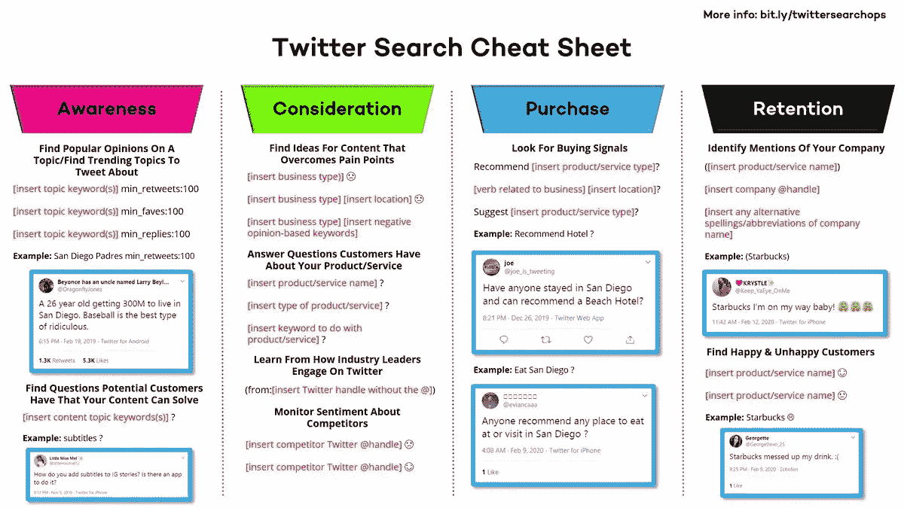
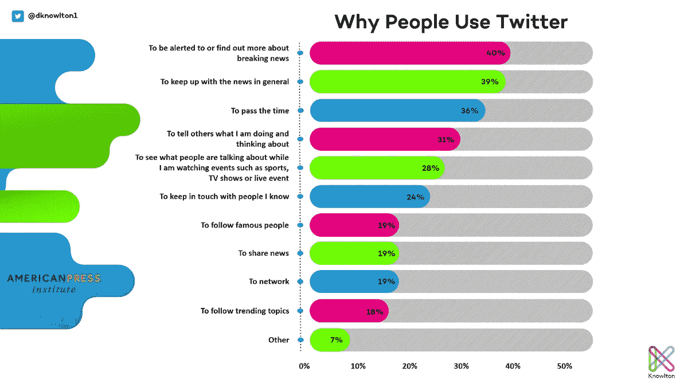

# 以结果为导向的策略会带来丰厚的回报

> 原文：<https://medium.datadriveninvestor.com/plot-your-trek-to-a-motherlode-of-rewards-70179f418e66?source=collection_archive---------16----------------------->

## 及时准确地参与并响应客户的需求

Photo by Tabea Damm on Unsplash

在追求结果之前，你需要一份路线图——一份计划。在社交媒体上，需要汇集已被证实的建立权威的方法:

*   要有耐心，始终如一。
*   提供价值。
*   使用内容格式展示权威。
*   向行业专家学习。
*   分享一下你的看法。
*   展示你所有的社会证明。

这些是[丹·诺尔顿](https://twitter.com/dknowlton1/)的基石。前 100 名数字营销影响者是一位演讲者和 [Knowlton](https://mobile.twitter.com/KnowltonTeam) 的联合创始人，Knowlton 是一家数字营销机构，与顶级品牌合作“制作销售产品的娱乐广告”

 [## 社交媒体广告让你直接与你的目标受众联系起来

### 即使对脸书有更严格的规定，付费广告仍是一条路要走

blog.markgrowth.com](https://blog.markgrowth.com/cook-up-the-social-ad-recipe-for-success-c02a39c43559) 

与数字营销专家 [Madalyn Sklar](https://twitter.com/MadalynSklar) 一起，Knowlton 在 Twitter 上谈论了如何创建[结果驱动战略](https://blog.markgrowth.com/social-strategy-changes-like-the-weather-44eb4425156c?source=friends_link&sk=01a2231a9658725e61f8081f6420e472)。

该平台是一个理想的营销渠道，因为它是即时的全球范围内。一旦你理解了它的力量，你就可以制定策略，如何最大限度地利用它为广大受众服务。

诺尔顿说:“我认为 Twitter 的超级力量是一个无价的客户洞察工具，可以告知并支持你做出更好的营销决策。”“现在，轻松搜索和识别潜在客户意见模式的能力让它变得炙手可热。”

这些年来，Sklar 已经看到了 Twitter 流行的许多原因:

*   它可以帮助提高你的品牌知名度。
*   实时参与是最好的。
*   推特聊天。
*   客服。
*   很容易监控趋势、客户和竞争对手。

她发表了一篇文章， [*“为什么 Twitter 应该成为你社交媒体战略的一部分。”*](https://madalynsklar.com/2020/04/twitter-social-media-strategy/)

# **推文技巧**

此外，社交媒体管理公司 [Hootsuite](https://twitter.com/Hootsuite) 的全球参与主管[尼克·马丁](https://twitter.com/AtNickMartin)为发推特提供了一些好的技巧。

一般来说，定期发微博。在传播别人和你的好作品时，一定要准确，以增加价值。

“在你的推文中使用表情符号是一种被证明可以增加参与度的方法，但在桌面上不容易找到，”马丁说。“如果你有 Mac，按住 Control + Command +空格键就可以打开表情符号菜单。

“你想说的话是否超过 280 个字符？”他说。“用 Twitter 帖子讲一个故事。”

一个线程是一系列链接在一起的推文，因此它们不会丢失或被断章取义，就像苹果电视显示的[。](https://mobile.twitter.com/appletv/status/1144667597633249282)

 [## 计划者保持社交媒体正常运行|数据驱动投资者

### 如果想达到并保持最高效率，忙碌的人会坚持使用系统。这是 Tweepsmap 和…背后的前提

www.datadriveninvestor.com](https://www.datadriveninvestor.com/2019/03/11/schedulers-keep-social-media-on-track/) 

“安排推特可以节省时间，”马丁说。“最好的社交策略有精心策划的内容日历。如果你已经准备好了你的内容，安排你的推文——比如通过 Hootsuite——可以节省时间，让你更有条理。”

Hootsuite 发表了一篇文章， [*“推特黑客:你可能不知道的 24 个技巧和功能。”*](https://blog.hootsuite.com/twitter-hacks/)

营销人员可以[利用 Twitter 分析](https://medium.com/datadriveninvestor/create-from-your-heart-not-the-analytics-4b3807d057c4?source=friends_link&sk=5bd54f5ac42e422244bd01259e3b3f7f)来帮助验证他们的活动和结果，以支持代表客户的工作。

“Twitter 可以在营销漏斗的所有阶段产生结果——取决于你如何使用它，”诺尔顿说。“这些因素包括对你的品牌的认知和考虑，转化显示购买信号的客户，以及通过 Twitter 的客户服务能力留住客户。”

获得客户洞察力的最佳方式是提问。然后注意并对答案做出反应。简单地传播内容只会打击你自己的自我，对他人没有什么好处。

“使用推特搜索，”诺尔顿说。“我做了一份备忘单，你可以用它来了解漏斗的各个阶段。”

# **限寻**

高级搜索是另一种可能性，但 Knowlton 不太喜欢这个功能。

“它确实有局限性，”他说。"使用搜索栏提供了更广泛的搜索条件。您可以使用几种不同的[搜索操作](https://developer.twitter.com/en/docs/tweets/rules-and-filtering/overview/standard-operators)。”

Sklar 建议通过民意调查询问追随者他们需要什么。

“订婚，”她说。“那就再多搞一些。检查你的分析。”

 [## 当人们想要快速的客户服务时，他们更喜欢发推特

### 航空公司等企业使用 Twitter 进行快速回复

blog.markgrowth.com](https://blog.markgrowth.com/customer-service-is-only-a-tweet-away-b3a22020b4c7) 

以及时、准确和关怀的方式回应顾客的询问，让他们知道他们是在和一个真正理解他们困境的人交谈。这有助于留住客户。

“记住客户服务，”诺尔顿说。“Twitter 上 85%的中小企业表示，在 Twitter 上提供客户支持很重要。”

他用来自 [Buffer](https://twitter.com/buffer) 、 [Mailchimp](https://twitter.com/Mailchimp) 和 [Zappos](https://twitter.com/Zappos) 的技巧和最佳实践例子来说明如何通过客户服务留住客户。

Sklar 说:“当你把重点放在客户而不是你身上时，你就能留住客户。”“表示你的关心。为你的顾客着想。及时回复他们。越快越好。”

通过[讲述你的品牌](https://medium.com/datadriveninvestor/what-is-the-greatest-tale-you-can-tell-e68ff19e4e84?source=friends_link&sk=b837ab9edb8814acba6dddda9aade814)以及它如何为消费者服务的故事，在 Twitter 上建立知名度。越多的人称赞一家企业，它就越能在公众中引起共鸣。

诺尔顿说:“创造满足顾客需求的内容。”。“美国新闻学会和 Twitter 调查了 4700 多名社交媒体用户，询问他们为什么使用 Twitter。询问您的客户为什么使用该平台，并满足他们的需求。”

肇事逃逸不会引起人们的注意。

Sklar 说:“通过每天露面来建立品牌意识和权威。“始终提供价值。参与你的社区。”

# **信守承诺**

通过兑现承诺来为自己的所作所为建立声誉。这为可靠性和真实性提供了可信度。

诺尔顿说:“像在其他任何地方一样，你可以建立信任。“例如，在推特上发布案例研究和推荐、用户生成的产品评论和拆箱。与 Twitter 上的相关影响者合作[。我看到的最大错误是人们谈论一个好游戏，但没有拿出证据。](https://www.datadriveninvestor.com/2020/01/15/influencers-perform-in-the-spotlight/)

案例研究可以有所帮助，但没有证据的话只是话。

“我百分之百同意，”诺尔顿说。“这一天，我们意识到展示您所做的伟大工作的重要性，而不仅仅是谈论它，这对我们的机构来说是非常重要的。”

 [## 营销不是一见钟情

### 花时间真正了解你客户的需求

jkatzaman.medium.com](https://jkatzaman.medium.com/marketing-is-not-relationship-at-first-sight-4d0d6a3d966e) 

关键是与他人建立关系。

“你必须让人们了解、喜欢和信任你，”Sklar 说。“你通过出现来做到这一点。每天都保持高度可见。分享您的社区想要的精彩内容。用定制的 gif 展示真实的你。”

在 Twitter 上推动购买的一种方式是[提供销售线索磁铁](https://blog.markgrowth.com/lead-magnets-attractive-ways-to-get-your-foot-in-the-door-2005d8be6f96?source=friends_link&sk=486e392d0e5fa857a8efc14adaae5512)。提供一些有价值的东西，吸引消费者购买他们真正想要的东西——即使他们事先并不知道。

诺尔顿说:“使用推特搜索来识别发推特的人，显示对你的产品和服务类型的购买意图。”“例如，如果你在圣地亚哥拥有一家酒店，你可以搜索‘推荐圣地亚哥酒店？’然后向人们伸出援手。"

Sklar 同意，提供“一个令人惊讶的官员”有助于巩固人们的了解、喜欢和信任，从而导致他们购买。

环顾四周，诺尔顿说，这些是他最喜欢的品牌，这些品牌“正在钉”他们的 Twitter 营销战略:

*   [维他可可](https://twitter.com/VitaCoco/)
*   [温迪的](https://twitter.com/Wendys/)
*   [汉堡王](https://twitter.com/BurgerKing/)
*   [无辜的饮料](https://twitter.com/innocent/)
*   [肯德基](https://twitter.com/kfc/)
*   [嘉士伯](https://twitter.com/carlsberg/)
*   [网飞](https://twitter.com/netflix/)

**关于作者**

吉姆·卡扎曼是 T21 拉戈金融服务公司的经理，曾在空军和联邦政府的公共事务部门工作。你可以在[推特](https://twitter.com/JKatzaman)、[脸书](https://www.facebook.com/jim.katzaman)和 [LinkedIn](https://www.linkedin.com/in/jim-katzaman-33641b21/) 上和他联系。