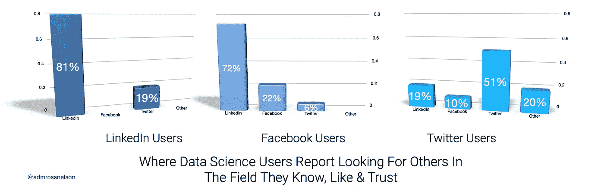

# 民意调查结果显示，数据专业人士需要一份高质量的 LinkedIn 个人资料

> 原文：<https://medium.datadriveninvestor.com/poll-results-show-why-data-scientists-need-a-quality-linkedin-profile-1b2548dc7427?source=collection_archive---------31----------------------->

## 通过 LinkedIn、Twitter 和脸书进行的三次民意调查的结果。

A 跨领英和脸书，数据科学用户报告称，在寻找他们了解、喜欢和信任的领域的其他人时，他们更喜欢 LinkedIn。

Image Credit: Author’s visualization of social media poll results. This visual shows that LinkedIn seems to be the most popular platform among Data Scientists when looking for others in the field they know, like, and trust.

即使在 Twitter 用户中，LinkedIn 也是第二大首选平台。

> 在 LinkedIn 和脸书，数据科学用户报告称，在寻找他们了解、喜欢和信任的领域的其他人时，他们更喜欢 LinkedIn。

如果你想成为一名数据专家，请告诉我。你可以在这三个平台中的任何一个上找到我。

 [## 社交媒体和通过赞助受欢迎度超过可信度的秘密审查|数据驱动的投资者

### “喜欢”按钮，如选项、鼓掌、关注或推荐按钮，是社交网络平台、互联网…

www.datadriveninvestor.com](https://www.datadriveninvestor.com/2020/11/19/social-media-and-covert-censorship-by-sponsoring-popularity-over-credibility/) 

# 感谢阅读

如果你喜欢我要说的，可以在 adamrossnelson.medium.com 的[找到更多。](https://twitter.com/adamrossnelson)[查看我的 Udemy 课程](http://www.udemy.com/user/adam-ross-nelson/)。

感谢阅读。把你的想法和主意发给我。你可以写信只是为了说声嗨。如果你真的需要告诉我是怎么错的，我期待着尽快和你聊天。推特:[@ adamrossnelson](https://twitter.com/adamrossnelson)| LinkedIn:[亚当·罗斯·纳尔逊](http://www.linkedin.com/in/arnelson) |脸书:[亚当·罗斯·纳尔逊](http://www.facebook.com/adamrossnelson)。

 [## 加入我的介绍链接媒体-亚当罗斯纳尔逊

### 作为一个媒体会员，你的会员费的一部分会给你阅读的作家，你可以完全接触到每一个故事…

adamrossnelson.medium.com](https://adamrossnelson.medium.com/membership) 

## 访问专家视图— [订阅 DDI 英特尔](https://datadriveninvestor.com/ddi-intel)