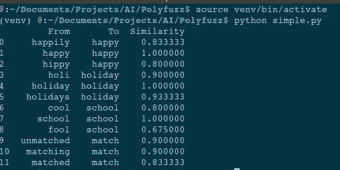
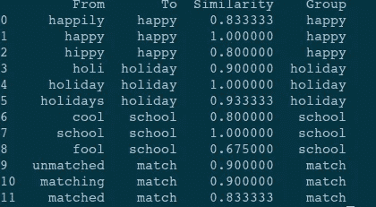
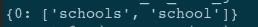

# PolyFuzz——高级模糊匹配框架

> 原文：<https://medium.datadriveninvestor.com/polyfuzz-advanced-fuzzy-matching-framework-c2e891d43de1?source=collection_archive---------4----------------------->

## NLP 的模糊匹配技术的替代方法，以提高性能。

使用自然语言处理时，我们可能会面临许多使用各种字符串匹配技术的场景。大多数情况下，我们使用模糊匹配技术从数据库中找到一个字符串的近似匹配，或者在其他一些情况下，我们使用它们来理解打字错误、误译等。

Polyfuzz <> [TDS blog](https://towardsdatascience.com/string-matching-with-bert-tf-idf-and-more-274bb3a95136) [Maarten Grootendorst](https://medium.com/u/22405c3b2875?source=post_page-----c2e891d43de1--------------------------------)

除了使用模糊库进行字符串匹配用例之外，我们还经常使用编辑距离方法、levenshtein 距离方法、TF-IDF 基于字符的 n-gram 方法、单词嵌入方法来理解字符串的含义并在单词之间进行匹配。

 [## 使用 Python |数据驱动投资者的名称匹配技术

### 我们确实面临很多情况，我们必须匹配一个有很多变体的单词。这可能是因为错别字…

www.datadriveninvestor.com](https://www.datadriveninvestor.com/2020/12/07/name-matching-techniques-with-python/) 

让我们一步一步来。对于**安装** polyfuzz，您有不同的方法，如下所示。

## 如何让它发挥作用？

耶！所以假设你有两组弦
`[happily, happy, hippy, holi, holiday, holidays, cool, school, fool]`和另一组`[happy, holiday, schools]`。考虑我们是否要基于他们的编辑距离方法来找到相似性。这就是我们如何用 polyfuzz 做到的。

通过这样做，你会得到这样的结果

Generated By Author

## 它还为你提供了什么其他功能？

它提出了匹配的分组和聚类。从前面的结果中，你可以看到有机会将一些字符串组合在一起。PolyFuzz 给了你这样做的能力。

您可以在下面看到输入字符串被分组在一起的结果。

Generated By Author

此外，也有可能将它们放在一起形成集群，您可以使用 PolyFuzz 轻松实现这一点。

你可以看到下面的聚类，其中一些字符串分组在一起。

Generated By Author

PolyFuzz 中实现的模型也很少。这包括`RapidFuzz, EditDistance, TF-IDF, FastText and GloVe, 🤗 Transformers.`

您可以根据自己对字符串匹配、分组和聚类的要求来使用这个模型。

查看下面的回购链接，看看你如何使用它们，并使它对你有用。

 [## 马尔滕格尔/PolyFuzz

### PolyFuzz 执行模糊字符串匹配、字符串分组，并包含广泛的评估函数。PolyFuzz 是…

github.com](https://github.com/MaartenGr/PolyFuzz) 

这个故事之前贴在[这里](https://www.datadriveninvestor.com/2020/12/15/polyfuzz-advanced-fuzzy-matching-framework/)

 [## PolyFuzz —高级模糊匹配框架|数据驱动的投资者

### 使用自然语言处理，我们可能会面临很多使用各种字符串匹配技术的场景…

www.datadriveninvestor.com](https://www.datadriveninvestor.com/2020/12/15/polyfuzz-advanced-fuzzy-matching-framework/) 

**进入专家视角—** [**订阅 DDI 英特尔**](https://datadriveninvestor.com/ddi-intel)