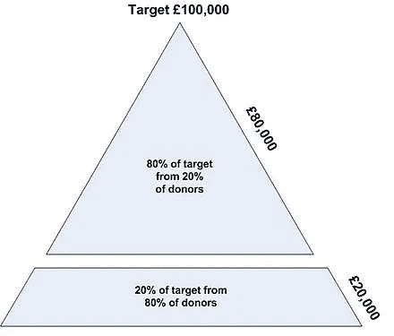

# 前 10%高产者的秘密

> 原文：<https://medium.datadriveninvestor.com/pomodoro-or-flowtime-the-secrets-of-the-top-10-productive-people-90dbad56fcc7?source=collection_archive---------8----------------------->

科学说的和你的直觉做的

[@austindistel](https://unsplash.com/@austindistel)

在那些日子里，休闲文化是潮流。像加里·维纳查克和托尼·罗宾斯这样有影响力的人所做的鼓舞人心的演讲都是关于如何努力让自己在生活中出人头地。如果你不努力，你就会落后很多。因为上面的说教，我们发现自己处在一个推崇 24 小时/ 7 天工作马拉松的时代，在这个时代，每个人都在寻找最大生产力的终极配方。

在我为《达斯·维达征服手册》征服这一切的过程中，我必须收集尽可能多的数据。我已经知道一两个窍门，如何集中注意力，提高效率。然而，我必须找到生产力源泉隐藏的大秘密，所以我搜索了。

尽管科学已经将所有人类的生产力模式描绘成一个统一的模式，但我发现，尽管我们作为人类物种有相似之处，但我们的大脑携带着他们的个性化签名和对可变触发因素的不同反应。这是多年来不同的，取决于我们经历的不同环境，我们的童年，积累的知识，以及其他因素。

我的研究导致了不同的路线，在支持短时间工作的研究人员和支持长时间逐渐增加注意力的鼓吹者之间。我必须运行我自己的搜索，然后根据我多年来穿着自己的肉甲生活的经验总结出最佳实践。

 [## 在家工作如何提高我的工作效率|数据驱动型投资者

### 在家工作确实激发了我最大的潜能，让我更有效率。因为在家工作给了我…

www.datadriveninvestor.com](https://www.datadriveninvestor.com/2020/07/29/how-working-from-home-increased-my-productivity/) 

# 科学表明

当谈到生产力时，无论是在生活中还是在职业中，两个主要因素应被考虑:

## #1 —中断

信息技术教授 Alessandro Acquisti 和卡耐基梅隆大学的心理学家 Eyal Peer 合作[设计了一个实验来测量因干扰而损失的脑力](https://www.nytimes.com/2013/05/05/opinion/sunday/a-focus-on-distraction.html)。

该实验在三个测试组上进行，这些测试组经历了一系列不同的中断，在连续的试验中进行。在第一轮测试中，被打断的小组比控制组成员少答对 **20%** 。在最后一轮中，那些被警告有中断但从未出现的人提高了惊人的 43%。他们的表现甚至超过了那些没有被打扰的控制测试者。

根据皮尔博士对结果的解释，参与者从他们的经历中学习，他们的大脑适应了。

> 也许被打断的可能性是一种期限，帮助他们更好地集中注意力。

不知何故，似乎他们调动了额外的脑力来免疫自己不受干扰。

## #2 —休息

根据 [Park West Gallery](http://www.parkwestgallery.com/) 进行的一项研究，“总共有 **61%** 的被调查员工认为休假可以改善身体健康，而 **55%** 的人认为休假可以改善心理健康。”

多伦多大学管理学副教授 John Trougakos 进行的另一项研究表明，59%的受访者声称更多的休息会提高他们的工作幸福感。

> 他的决心:“脱离工作可以给人们的精力和心态带来奇迹。”

繁重的工作由 DiskTime 完成，他对某些群体中效率最高的员工进行了彻底的研究。高绩效、高产员工的一个共同点是什么？ ***有效的破套路。***

# 为什么干扰的预期+中断工作？

本文包含的所有研究都支持 ***100%奉献的理论；*** 当你在做任何任务的时候，无论是什么任务，你都需要以 100%的全力投入去彻底完成。当你只有一小段时间来完成一项特定的任务，并且你知道在 X 时间内你会被你的闹钟打断，你的大脑会产生一种紧迫感；你有一个冲刺的最后期限来满足。你需要让你分配给这项任务的时间变得有价值。

# 术语

你现在可能想知道:一个普通人的平均注意力持续时间是多少，重新启动我们的思维和提高我们的注意力所需的最佳休息时间是多久？

嗯，我们需要先回到学校，从一些方法论的定义开始:

1。 **Pomodoro 方法论:**这种方法论是为了最大化注意力跨度而设计的。Pomodoro 这个名字来源于意大利语中番茄形状的滴答声闹钟，它表明为了达到最高的效率，一个人应该以 25 分钟的间隔工作，然后休息 5 分钟。一旦四个间歇，或者说番茄大战结束，你可以休息 15 到 20 分钟来补充能量。

番茄红素的缺点是它禁止我们进入心流状态；你完全沉浸在一项任务中的时间。一段你高度集中精力和富有成效的时间。

2。 **Flowtime 方法论:**该方法论解决了番茄果实的短跨度问题。你可以花更长的时间去解决更复杂的问题:写作、编码和数学问题，而不是先工作 25 分钟，然后休息 5 分钟。

这种方法暗示了同样的番茄劈开技术，但有一点小小的改变:间隔应该被延长。你将有更多的时间沉浸在心流状态中，你将不再等待被短暂的计时器打断。前面提到的 DiskTime 研究发现，高生产率员工交付的最佳结果来自 52 分钟的比率，然后是 17 分钟的休息。

3。**Flow-Modoro 混合方法学:**混合方法学是两种方法学中间的一个甜蜜点，在这里你可以在短时间内使用 Pomodoro，这是一个乏味的、不需要动脑筋的任务。Flowtime 可以解决需要创新、创造力和更高精神状态的更复杂的任务。

既然我们已经确立了科学的说法，我将根据我的个人经验与你分享我的直觉。然后，我会让你决定符合你心意的路线。

# 我的直觉告诉我

基于我收集的科学事实，以及我 13 年来在工作场所中所见证的最佳和最差的工作习惯，我发现有一点对所有变量都是不变的:

> **生产力最佳实践因人而异，对同一个人来说也因时而异。**

有些人会相信科学的说法，但我发现，即使番茄工作法在我 20 多岁的时候很管用，但它不再适合我了。虽然流动持续时间更长帮助我粉碎了工作中的目标，但它从未对我的新写作习惯起作用。

这就是为什么从科学提供的秘密中测试和验证你自己的最佳生产力实践是至关重要的。

# 混合尖端

在这三种方法中，Flow-Modoro 混合方法是我的首选。既然我们一致认为你需要测试和验证你自己选择的生产力方法，我将留给你五个关于如何掌握你自己的混合生产力方法的技巧:

## # 1——提前创建你的待办事项清单

你计划要做的任务清单是开始你一天的好地方。然而，如果你提前足够的时间做，会方便得多；那是前一天晚上。通过提前一天做这件事，你可以给你的大脑时间去适应计划好的任务安排，并且你可以节省 15-30 分钟的宝贵时间，如果你在同一天做计划的话，这些时间会从你的工作日中被剥夺。

## # 2——从吃青蛙开始

在醒来后的前三个小时，你的大脑仍然是一个处女——没有错过最后期限留下的模糊想法，也没有对未知未来的黑暗恐惧。你的头脑是警觉的，这是从摆脱最消耗智力的任务开始的最佳时机。这样，你就一石二鸟了:你在头脑最清晰的时候完成了最困难的任务，而你对完成最具挑战性的任务感到满意。现在，你有剩余的时间来享受这种成就感。

## # 3——相似的鸟聚集在一起

这也是你的任务聚集的方式。根据重要性或相关行动的相似性，将你的日常任务分成不同的类别。一旦你完成了这些，就开始把每一批任务当作一个模块来处理。一个区块完成后，你移动到下一个区块，以此类推。创建相似任务的集群可以让你的思维更容易进入该批次所需的特定专业领域。在这个过程中，你的大脑不需要重新设置 read apt——结果是:更快的执行。

## #4 —应用帕累托原则

或者 80/20 法则:大约 80%的结果来自 20%的原因。换句话说:你 20%的努力要对你 80%的结果负责。

Source: Wikipedia

## #5 —更聪明，而不是更长久

按照前面的建议，认识到导致 80%结果的前 20%的行动，你需要以包含上述所有要点的方式规划你的工作日。你需要停止更努力或更长时间的工作，开始更聪明地工作，计算更多的休息时间。

## #6 —七个 P

"适当的预先计划可以防止糟糕的表现."不需要更多的解释。

# 最后的想法

结果，我发现了杰西卡·格林在扎皮尔的博客中分享的内容:

> "最好的生产力技巧是个性化."

当你下一次休息时，无论是短暂的 25 分钟还是漫长的 52 分钟，你需要记住的一件事是，把你的思想转移到工作以外的任何事情上。永远不要利用休息时间来计划或策划下一个工作间隔，因为这会降低整个实践的有效性。

努力工作，加大刹车力度，永远:记得呼吸。

**访问专家视图—** [**订阅 DDI 英特尔**](https://datadriveninvestor.com/ddi-intel)