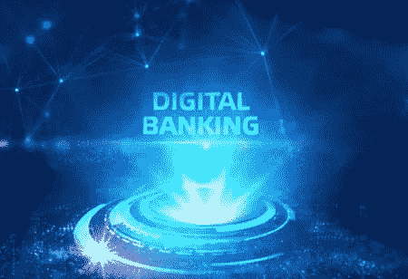

# 数字银行的流行趋势

> 原文：<https://medium.datadriveninvestor.com/popular-trends-in-digital-banking-2ed28d893ae5?source=collection_archive---------11----------------------->

**来源:** [**金融科技评论**](https://www.financialtechreview.com/)

由于智能手机和全球互联网覆盖的增加，数字银行已被证明是金融科技企业的一个有利可图的发展机遇。随着数字银行的发展趋势，企业可以利用其优势，例如:

**AI 驱动的安全**

将人工智能算法集成到数字银行中，可以通知用户对其账户的访问尝试、异常变化和交易，并帮助纠正这些问题。

它还可以了解哪些使用模式通常与用户相关联，并在可疑事件期间将其注册为积极的交互。

**区块链数据管理**

在传统银行和金融科技初创公司中实施区块链可以实现更好的安全性，并允许透明的交易市场，B2C 和 B2B 利益相关者可以最大限度地使用银行平台。

区块链的数据跟踪和知识管理为全球客户提供了增强的数字银行安全。

 [## 加速科技银行的数字化:云和人工智能成为疫情赢家|数据驱动的投资者

### 疫情新型冠状病毒的经济效应正在把斗争推向每个国家的主要产业…

www.datadriveninvestor.com](https://www.datadriveninvestor.com/2020/05/12/speeding-up-the-digitalization-of-the-tech-banking-cloud-and-ai-as-the-pandemic-winners/) 

**无卡交易**

数字银行将使其用户能够通过二维码和各种无卡交易进行 POP 和 POS 购买，使银行机构能够绿色出行，并强调其移动银行服务。

**简化客户计费**

数字银行可以让用户进入他们的平台，只需点击一个按钮就可以支付任何到期的账单。它还可以提高绿色系数，方便客户计费。

**语音辅助银行**

语音辅助银行的特点可以让客户在导航、交易和聊天机器人互动中使用他们的声音，从而有效地缩小差距。它还可以通过只注册客户和他们的命令来进行语音锁定，从而增强数字银行平台的安全功能。

**手机银行**

移动银行因其便捷性和可访问性而广受欢迎，使金融科技企业和传统银行有可能开发自己的移动银行平台，帮助人们满足日常需求。

**新闻来源:**

[**数字银行领域 6 大流行趋势**](https://bityl.co/3HPM)

**进入专家视角—** [**订阅 DDI 英特尔**](https://datadriveninvestor.com/ddi-intel)