# 有效视觉效果的流行 UI 设计趋势

> 原文：<https://medium.datadriveninvestor.com/popular-ui-design-trends-for-effective-visuals-e779604ffce0?source=collection_archive---------10----------------------->

dribble.com

在开发产品时，为你的手机或网络应用制作一个干净的用户界面/UX 是主要的元素之一。[设计趋势](https://blog.galaxyweblinks.com/9-ux-trends-that-are-here-to-stay-in-2021/)通常跟随每年的技术进步，设计师应该根据最新趋势不断提高他们的技能和实践。

第一印象非常重要，尤其是根据英国科学家的研究，94%的第一印象与设计[直接相关。](https://dl.acm.org/doi/10.1145/985692.985776)

开发好的设计首先要尽可能多地收集相关信息。UX 设计必须完美地实现，并与现有的用户需求保持一致，以呈现一个令人惊叹的用户界面或 UX。

# 当前用户界面/UX 设计趋势

**为了保持领先地位，让你的设计对用户有吸引力，并带来良好的用户体验，这里列出了一些最新的用户界面设计趋势:**

1.  最低纲领
2.  插图
3.  增强和虚拟现实(AR 和 VR)
4.  语音 UI 和 AI(人工智能)
5.  明亮的 UI
6.  动画
7.  新形态
8.  不对称布局
9.  讲故事
10.  3D 元素
11.  无密码登录
12.  深色模式

# 1.最低纲领

极简主义已经是 UI 中一个众所周知的趋势——极简这个词指的是任何被剥去本质的东西。

设计中的极简主义为用户提供了一个直观而有意义的旅程，其核心元素是界面。

整洁的设计使整个设计变得复杂和易于使用，并且它给用户带来审美上的满足[创造一个令人满意的 UI](https://zesium.com/10-things-every-designer-should-know-about-mobile-app-interaction/) 。此外，最小化设计与无按钮趋势相关，这是简化设计的基础。

极简主义包括以下一些特征:

*   简单明了
*   注意比例和构成
*   提高对核心细节的关注度
*   消除非功能性元素
*   大量备用空间

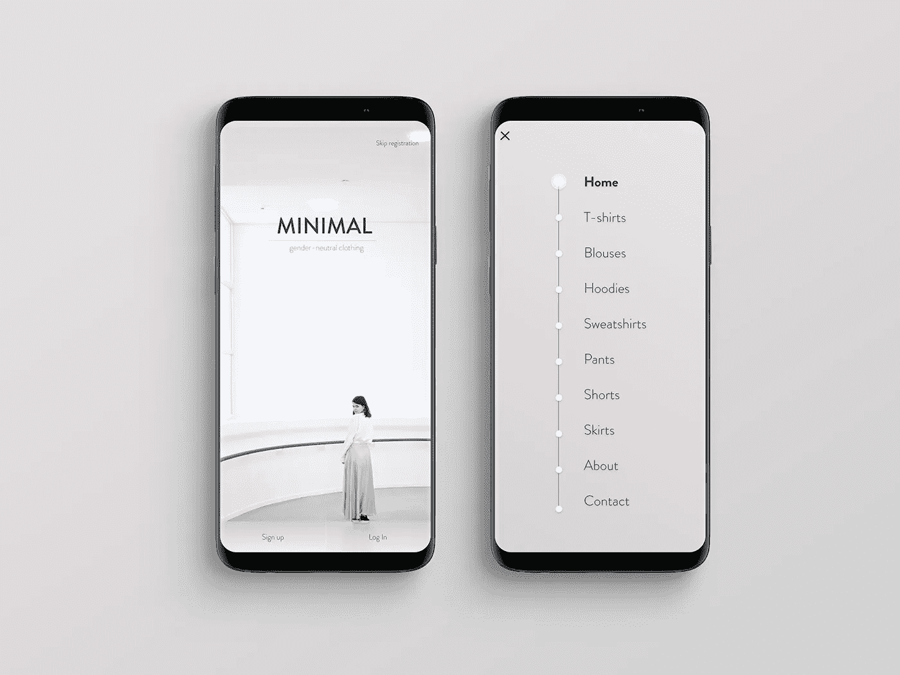

behance.net

# 2.插图

插图是用户界面设计的重要元素，它使用户能够以一种更容易、更清晰的方式进行交互。

自定义插图建立艺术和谐，增加用户界面(UI)的创造性，使您的设计在竞争对手中脱颖而出。

手绘插图通常用来给用户留下一个有机的印象，把他们和它的用法联系起来。

用户界面图像的一些趋势如下:

*   用面部表情、线条、形状、颜色和曲线等插图点燃情感。
*   设计视觉刺激来传达正确的信息。
*   插图将用作登录页面、评论等的主要图像。虽然它们必须与业务目标很好地平衡
*   根据您的目标受众创建信息丰富的插图，建立品牌认知度。

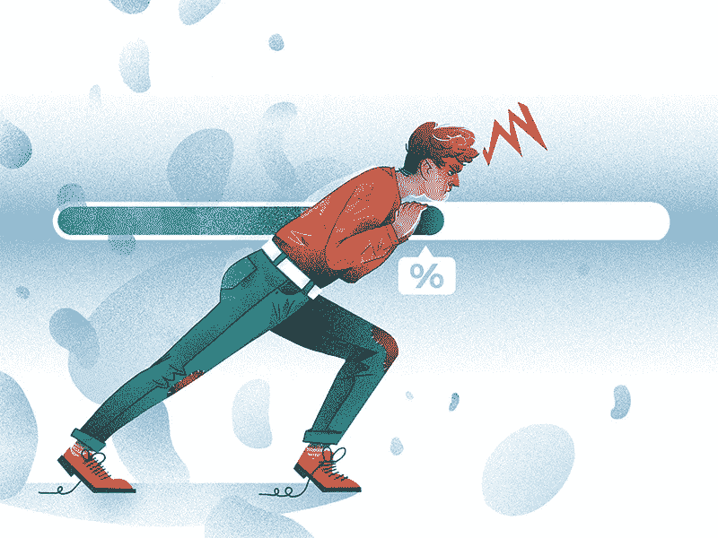

icons8.com

# 3.增强和虚拟现实(AR 和 VR)

增强(AR)和虚拟现实(VR)已经作为一种设计趋势出现了一段时间，它肯定会成为未来的长期趋势。

AR 驱动的特性使得对特性的理解更容易、更准确、更好。AR 允许用户获得关于应用程序的实时反馈，出于设计目的，最好是研究用户的习惯，如在应用程序上花费的时间或可能的期望。一个很好的例子是在医疗领域，AR 可以集成到远程医疗或在线医疗咨询中。

虚拟现实(VR)被设计者认为不仅仅是基本的方面(摄影，动作设计等)。)而是针对其他元素，如交互、声音设计、曲面设计和周围环境。

在 UI 中使用 AR 的一些趋势:

*   代表用户的 AR 头像
*   实时人脸过滤器(如 Snapchat)
*   用户与应用程序交互时的实时动画

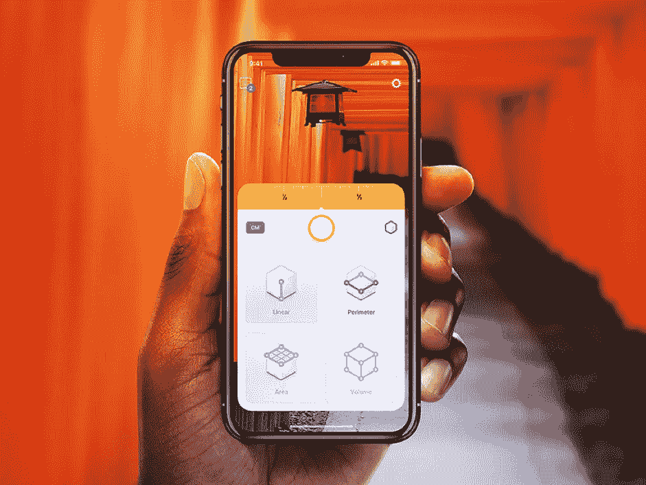

crazyleafdesign.com

在设计中使用虚拟现实的一些建议趋势是:

*   360 度视觉
*   弧形设计使用户更容易阅读文本或图像
*   显示所有 UI 元素、菜单或文本等的相同深度。

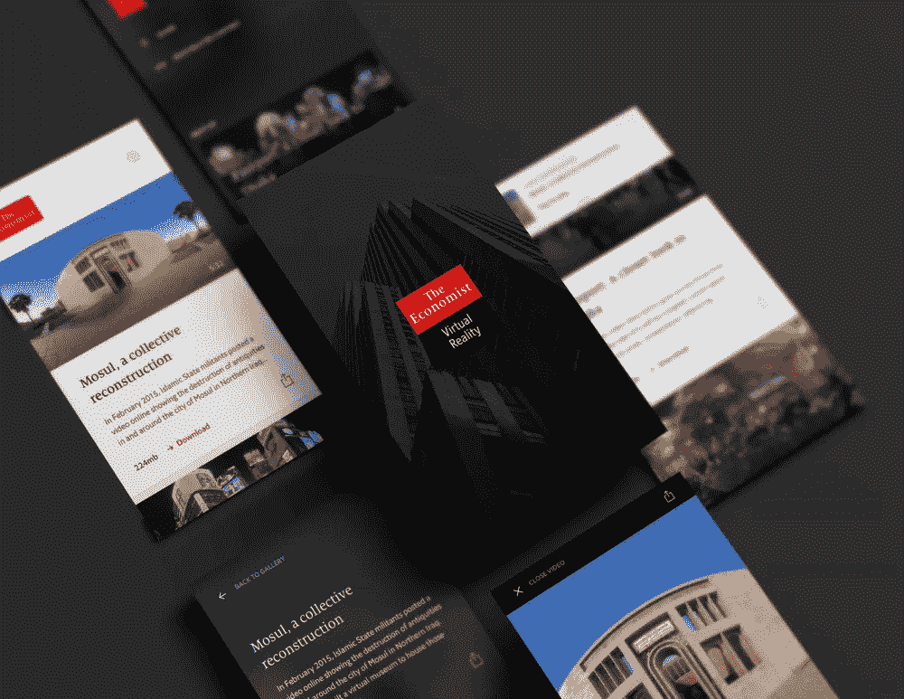

invisionapp.com

# 4.语音 UI 和人工智能(AI)

我们生活在 Alexa、Siri 等的时代。根据某些研究，到 2021 年，语音将在超过 50%的搜索中使用。

如果你想在你的应用中注入一些创新，应用开发者应该考虑一个语音用户界面。基于语音的 UI 可以[实现到你的 UI/UX 设计过程中](https://www.toptal.com/designers/ui/designing-a-vui)——它提供缺失的信息，允许用户通过语音命令与系统交互。

在语音助手的帮助下，它可以帮助您的企业网站的访问者搜索信息或服务。随着人们已经习惯了语音聊天机器人和虚拟助手，UX 的设计师们明智的做法是将 [VUI](https://www.design1st.com/challenges-voice-ui-design/) 整合到他们的应用程序中，让它们对用户来说更有趣。

使用语音交互创建 UX 的提示:

*   引导用户使用所使用的功能
*   为语音接口实施不同的设计准则
*   理解人们用声音进行的自然交流
*   为用户提供选项，而不是图形用户界面

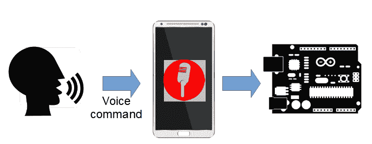

design1st.com

# 5.鲜艳的颜色

颜色是 UI 设计师必须考虑的一个方面。设计师应该掌握一些色彩理论的知识，以便有效地将它们应用到产品中。趋势可能会有所不同，但在网站和应用程序中使用[鲜艳的颜色和渐变](https://altrxaltr.com/blog/bright-colors-in-ui-design-benefits-and-drawbacks)是一个不成文的规则。

当谈到颜色时，最新的用户界面趋势是[简单的单色选择](https://www.designbombs.com/design-monochromatic-colur-scheme/)——因为简单是关键，这样的选择使应用程序更有意义。因此，大胆颜色的使用应该受到限制，设计师应该让[颜色梯度](https://digitalsynopsis.com/design/beautiful-color-ui-gradients-backgrounds/)和对比度对用户更有吸引力。

明亮的用户界面和渐变的一些好处是:

*   清晰的导航和直观的交互系统—突出和对比重要元素
*   增加可读性——高对比色只应用于突出元素
*   应用于多个元素的一种颜色，以显示它们之间的联系
*   在徽标、网站和移动应用程序中使用相似的颜色来提高品牌知名度
*   即使在激烈的竞争中，流行色也能吸引用户的注意力

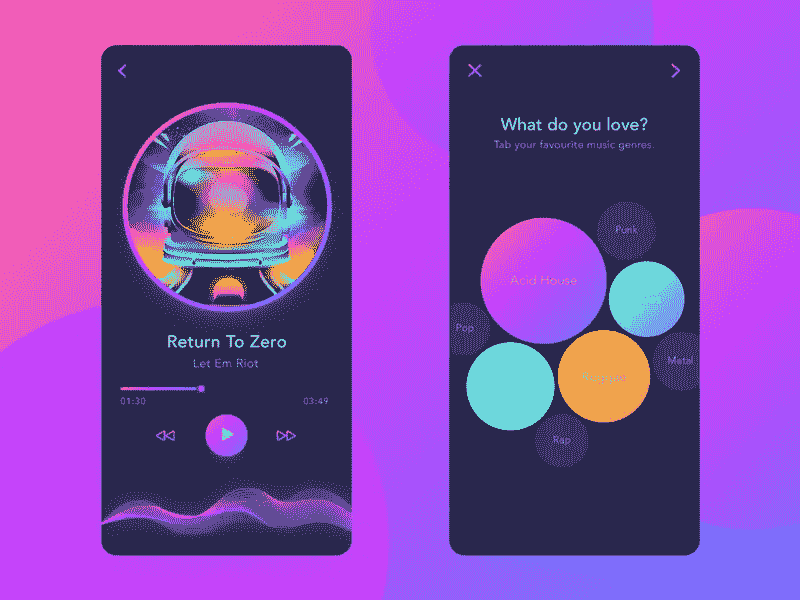

justcreative.com

tubikstudio.com

# 6.动画片

动画对所有年龄段的人都有吸引力——因此，越来越多的人使用动画插图来吸引大众。

 [## 设计隐私|数据驱动的投资者

### 我们生活在一个由技术进步和数字创新主导的时代。关于数据，这些…

www.datadriveninvestor.com](https://www.datadriveninvestor.com/2020/05/18/on-privacy-by-design/) 

[在网络或移动应用程序等的插图中使用动画](https://theninehertz.com/blog/animation-used-in-user-interface-design/)。给整个 UX 设计带来一种自然的感觉——它可以完美地讲述一个故事，否则如果用文本阅读会很乏味。

使用动画插图是以更有效的方式向用户传达信息的明智方法。

动画插图的好处是:

*   讲述产品、服务或品牌故事的有效方式
*   提高用户对你的产品或服务的参与度
*   越来越吸引用户的注意力

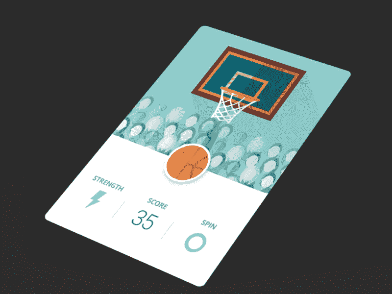

dribble.com

# 7.新形态

[新形态](https://uxdesign.cc/neumorphism-in-user-interfaces-b47cef3bf3a6)将成为 2020 年最大的设计趋势之一。

它的名字是由 NEO+[skeuomorphism](https://en.wikipedia.org/wiki/Skeuomorph)= NEO morphism 创造出来的。Neomorphism 是一种通过组合阴影来匹配现实生活中的对象，从而创建挤出形状的图像的方法。

youtube.com

低的和高的形状都是由与背景完全相同的材料制成的，这很容易通过使用两个阴影(正值和负值)来创建[。然而，如果你想让它工作，背景不能全黑或全白。它需要一点色调，所以黑暗和光明的阴影都是可见的。](https://uxdesign.cc/create-soft-ui-neumorphism-in-adobe-xd-bc08bb4cb79d)

新形态的好处是:

*   无生命的表象被移入现实，给人一种新的感觉
*   代表带有高光和阴影的详细设计
*   使用新形态卡片作为凸起的形状提供了设计的深度

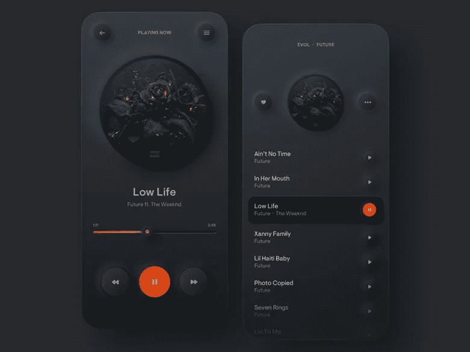

webgyaani.com

# 8.不对称

在传统 UI 原则的保护伞下工作没有错，但是让你的设计脱颖而出意味着你有时必须打破规则。

与其遵从传统的[网格系统](https://www.mockplus.com/blog/post/ui-grid-layout-design)，你应该挑战基本原则，用不对称的网格和布局来推动边界。

尝试[用更多的动态构图](https://dribbble.com/stories/2020/02/05/asymmetrical-layouts-ui-design)为你的设计增添个性和特色。

考虑以下不对称设计:

*   尝试更动态的构图
*   根据用户需求进行设计
*   利用地形和图像进行创意设计
*   折叠檐槽并覆盖多个元素，以实现更有效的设计
*   使用表面区域的空白

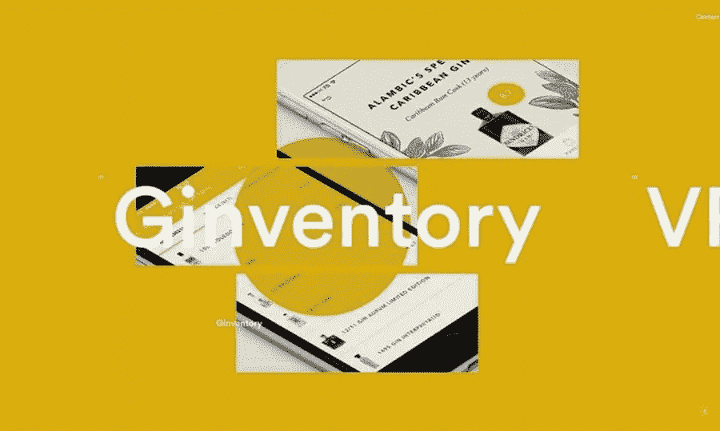

blog.creative-team.com

# 9.讲故事

据说[65–80%的人在视觉上学习得更好](https://introwellness.com/eyes/the-link-between-vision-and-learning/) — [讲故事](https://www.justinmind.com/blog/guide-to-visual-storytelling-for-ux/)是一种基于用户测试和研究告诉用户他们需要知道什么的视觉方式。

它在品牌和用户之间创造了积极的情感，因为你可以在一个(或多个)图像或 20 秒的视频中传达你的信息。[讲故事](https://appinventiv.com/blog/visual-storytelling-app-ui-ux-design-guide/)以一种更有创意、更容易理解的方式将故事传达给用户。

通过你的产品或服务，用由图片和短文组成的故事来教育你的用户——这将帮助用户快速理解你的信息，比阅读一系列乏味的技术规格要容易得多。另一个好处是，讲故事可以巩固用户对你的品牌的第一印象。

把信息修改成朗朗上口的故事，有助于用户在未来记住你的品牌。

在用户界面设计中讲故事的好处是:

*   实现更轻松的用户旅程
*   为客户接触点创建有效的设计，让他们能够再次回来
*   利用一个情节和一场冲突，让你的品牌故事更吸引人

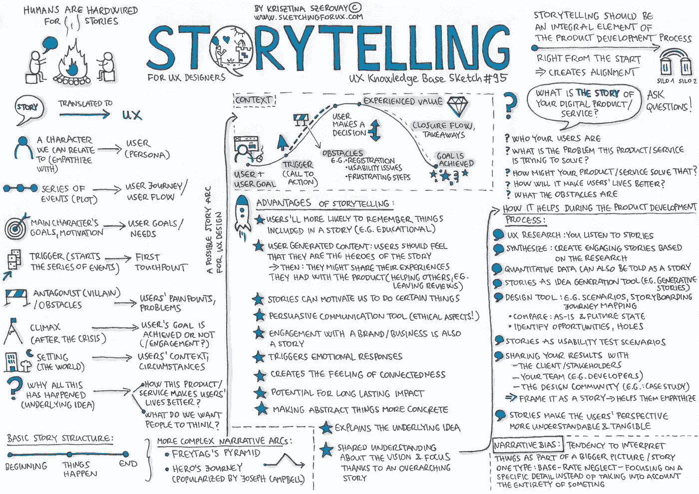

pinterest.com

# 10.3D 图形

3D 设计元素仍然是用户界面设计趋势的首选——它通过使用增加用户参与度的照片真实感的基本原理而变得流行。

它们正与增强现实(AR)和虚拟现实(VR)等最新技术相结合，允许 UX 设计师创建超现实的 3D 视觉效果。这样，你可以保持用户参与，但要小心，因为这些元素可能会降低你的网站的速度，并始终确保它们得到适当的优化。

3D 视觉效果对用户来说更有吸引力，可以激发他们的长时间参与。

3D 图形包括以下内容:

*   改进 UX 设计的 360 度展示
*   用于移动和用户界面的 3D 图形
*   使用背景元素来平衡可读性和有效的用户导航

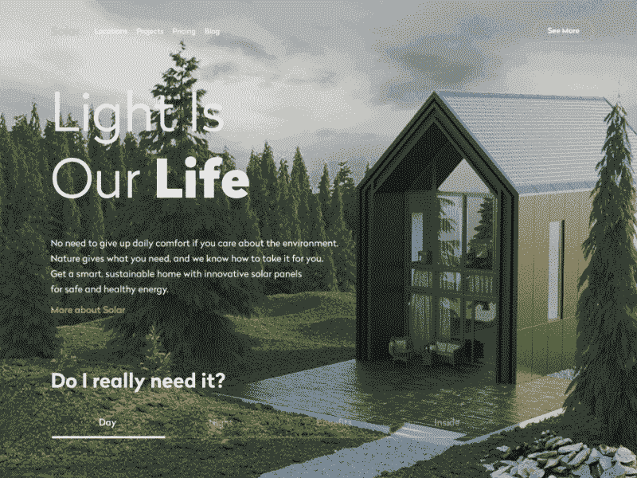

uxplanet.org

# 11.无密码登录

随着科技的进步，人们总是寻求节省时间的方法。跳过输入密码的紧迫性让我们想到了用户的另一个重要元素——无密码登录。

[大多数用户在使用在线网络平台时通常容易忘记密码](https://digitalguardian.com/blog/uncovering-password-habits-are-users-password-security-habits-improving-infographic)，由于密码通常包含字母、数字和特殊字符，用户很难记住或回忆起来。

为了解决这个问题，最新的用户界面设计趋势正是针对这个问题——设计师已经开始利用各种其他选项让用户登录他/她的帐户。

有了生物识别技术(指纹或面部识别)、一次性密码(OTP)或 PIN 码，用户再也不用担心要记住他们所有的 50 个密码。

移动应用程序设计者在设计 web 或移动应用程序的登录页面时，可以将这种 UI/UX 设计趋势牢记在心。

这种无密码登录的优势:

*   支持更轻松的长期用户参与
*   轻松访问您的网站或应用，提供用户友好的服务
*   保护用户数据的有效无密码方法
*   在设计应用程序的登录页面时，请记住这种方法

dribble.com

# 12.深色模式

在最新的用户界面/UX 设计趋势中，黑暗模式选项已经越来越受欢迎。深色主题是显示深色表面的弱光。用户更喜欢[这样的黑暗主题](https://99designs.com/blog/web-digital/dark-mode/)，主要是因为它可以节省电池寿命，减少眼睛疲劳(已经证明暴露在明亮的光线下会影响你的视力。

黑暗模式已经在新的 [Android 10](https://www.android.com/android-10/) 和 [iOS 13](https://support.apple.com/en-us/HT210393) 中使用，通过新的操作系统，用户可以根据自己的选择和意愿在黑暗和光明主题之间切换。如果你想跟随潮流并留住你的用户，这个特性对于未来的 UI 设计是必须的。

应用中黑暗模式的优势:

*   突出设计元素
*   更大程度地节省电池使用
*   看起来很吸引人，对大多数用户更有吸引力

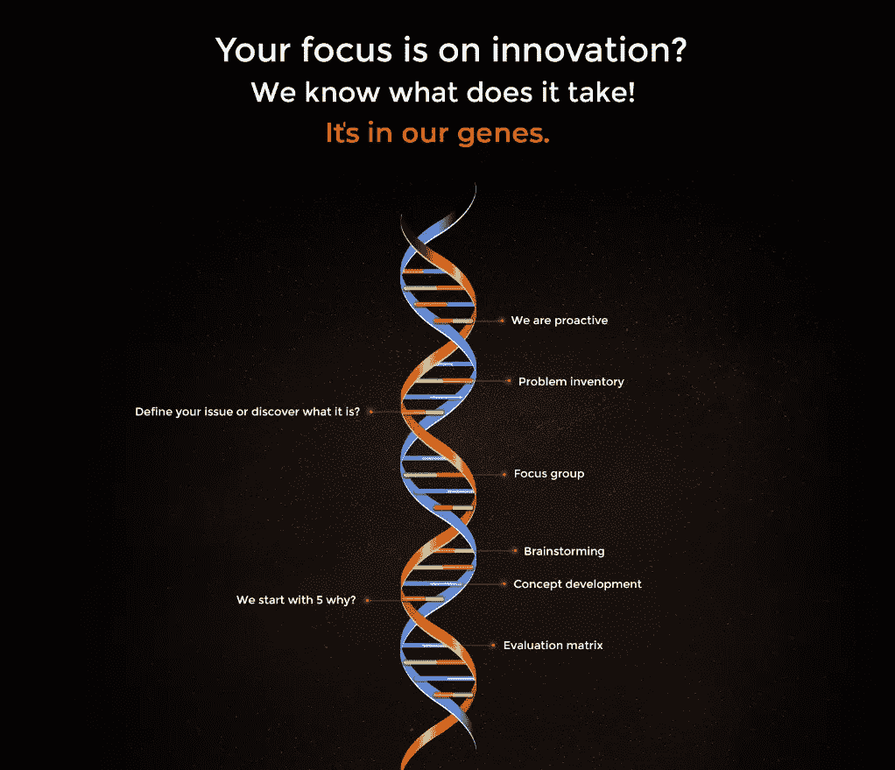

zesium.com

# 结论

列出的趋势只是最受欢迎的趋势中的一部分，因为它们满足了用户的审美需求，所以在未来十年中会保持下去。

这些趋势提供的主要好处与 UI 设计的可访问性和[可用性有关，提供了更高的用户参与度和丰富的用户体验。](https://zesium.com/10-important-usability-issues-in-mobile-apps/)

需要记住的重要一点是，UI/UX 设计的趋势并不仅仅集中在视觉美学上，而是倾向于大大提高最终用户的可用性和便利性。

如果你明智地应用这些趋势，它会给你的产品带来很多好处。

## 访问专家视图— [订阅 DDI 英特尔](https://datadriveninvestor.com/ddi-intel)

通过以下链接安排与[**Maja Dakic**](https://app.ddichat.com/experts/maja-dakic)**的 DDIChat 会话。**

** [## 马贾达基奇-迪迪恰特

### 技术行业(软件、移动应用、物联网、人工智能等)的资深作家。)以及在…

app.ddichat.com](https://app.ddichat.com/experts/maja-dakic) 

在此申请成为 DDIChat 专家[。
与 DDI 合作:](https://app.ddichat.com/expertsignup)[https://datadriveninvestor.com/collaborate](https://datadriveninvestor.com/collaborate)在此订阅 DDIntel [。](https://ddintel.datadriveninvestor.com/)**