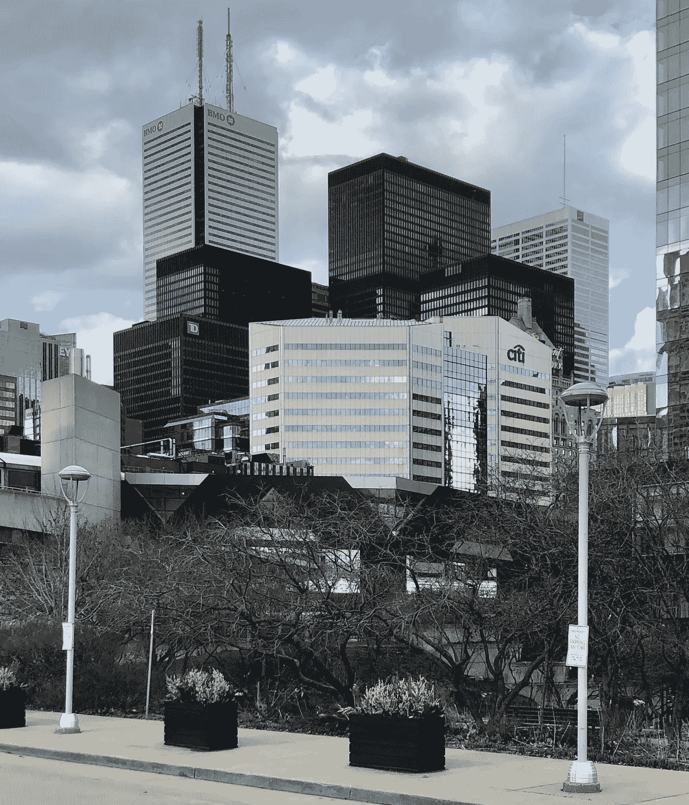

# 将自己定位于财务增长

> 原文：<https://medium.datadriveninvestor.com/positioning-yourself-towards-financial-growth-f40bb9fb99e5?source=collection_archive---------20----------------------->

## 个人成长之路以及如何丰富你的闲暇时间

作为人类，我们既需要空闲时间，也需要有所作为。如果你的宝贵时间浪费在不会产生最终结果的活动上([那是你的收入、额外收入、](https://medium.com/makingofamillionaire/building-up-your-net-worth-3e3175c46d29)或对你和/或你的家庭或社区的某种好处)，你就是在浪费时间。同理，如果你的空闲时间被用来做一些对你没有积极作用的事情，那你就是做错了。好消息是，我们可以通过采取简单的步骤来提高我们活动的质量。

互联网创造了与利基市场联系的机会，并以非零和的方式从中获利。这些机会来自它的网络效应，每一个贡献都加强了生态系统。你可以通过在一个利基市场内工作(通过销售数字或实物商品)获得一些收入，几乎可以覆盖整个世界。

开始侧推的步骤很简单，我们将在这里讨论。困难来自于这样一个事实:你需要一致性，并有足够的雄心去探索你的利基——成为三个不同利基中最优秀的 25%的人。

 [## 更好的预算，打造更大的|数据驱动型投资者

### 即使是专家也承认它们并不完美。从 1 到 10 的范围内，安东尼·科普曼和德尔…

www.datadriveninvestor.com](https://www.datadriveninvestor.com/2018/11/08/budget-better-to-build-bigger/) 

与此同时，作为人类，我们需要休闲时间，互联网为我们提供了新的娱乐方式，也提供了大量浪费时间的来源——想想每日新闻，在 Twitter 上浪费时间，等等。一个完整的成长方法也应该包括优化你业余时间的方法。这将通过减少你在低质量娱乐上浪费的时间，并把这些时间(或部分时间)用于高质量的休闲上来实现。

## 增长的有效途径

一个增加[财富](https://medium.com/makingofamillionaire/my-approach-into-building-my-net-worth-99e469a85191)和[分散财富](https://medium.com/datadriveninvestor/senecas-timeless-advice-for-spending-and-desires-edc023ac83ee)的计划，学习新东西(通过阅读和写作)，走上个人成长的[之路](https://medium.com/makingofamillionaire/if-you-are-robust-you-wont-need-a-detailed-financial-plan-d0e71143d472)。简而言之，五个有助于你成长的日常活动:

**1)关注货币化的社交媒体客户不断增长**

将你的社交媒体账户视为获取收入的一种方式，并寻找将其货币化的方法。在 Instagram 上，你可以通过销售 add 和开办为你的粉丝销售产品的副业来获得收入。人们可以使用 Twitter 来扩大追随者的基础，创办时事通讯，并利用它来销售数字产品，等等。要有创意。

当然，你不能仅仅开始探索它。您还需要创建和发布内容。一个简单的经验法则是将你的帖子分成 90%的免费内容和 10%的货币化内容。建立一个社区，销售能为他们创造价值的产品。

深入自己喜欢的东西，多了解，创作内容。

**2)可能让你年收入增加 10%的活动**

在这里，我们可以考虑副业或一些你可以学习的技能，用它来做副业。你可以写作，在 Fiverr 做自由职业者，Workana 和 Upwork 或者开始你的网上生意。

此外，您的社交媒体账户的货币化部分也可以包含在这里。

那些可怕的时代向我们展示了拥有多样化收入来源的[重要性。](https://medium.com/makingofamillionaire/planning-for-bad-times-3f555a9da23)

**3)阅读**

你应该每天阅读。不是新闻，是书(尤其是旧书)。一天读几页书，或者在没有读完之前的那本书的情况下开始一本新书，都比一天什么都不读要好。

每天一篇文章

最好的学习方法是向某人解释你学到了什么。写关于你所学的文章，锻炼你的知识。试着强调你所知道的。不要忘记经验比理论知识更有价值，所以试着让你的写作更多地基于你的经验，而不是你最近读到的东西。

**5)举重。**

每天锻炼。每周进行三次高强度的锻炼，其余时间积极活动(长距离步行)。如果你不健康，你就不会有效率。

## 改善你的休闲时间

高效享受闲暇时光。

高质量的休闲比仅仅阅读每日新闻或在社交媒体上浪费时间要好。我会说，如果你每天花 1 个小时看新闻，并且喜欢玩电子游戏，玩一个小时的电子游戏比浪费时间看嘈杂的信息要好。你的空闲时间也很宝贵，不要拿它去换无用的东西。

不看电视节目或不坐下来喝一杯放松一下是毫无意义的，理由是你“不想浪费时间”，每天花六个小时使用手机。效率和优化意味着你应该有一个高质量的自由时间，以及有一个最高水平的工作表现和生产力。

我喜欢烹饪(牛排和意大利菜)，喝酒，看足球和重新观看呼唤电影或电视节目。对我来说，下班后做这件事比每天花两个小时在推特上读废话要好。我不是说你不应该读 twitter。关键是不要在这些不是休闲、不会给你带来任何东西的事情上浪费太多时间。如果你是为了未来的货币化而使用该平台，那么你应该将其纳入工作时间，而不是业余时间。把你的时间分类。

当然，重点不是为你的闲暇标时间，计算它的分分秒秒。而是减少浪费在非休闲和非生产性活动上的时间。通过去除无用的东西比试图加入新的东西和低效的东西更容易有结果。