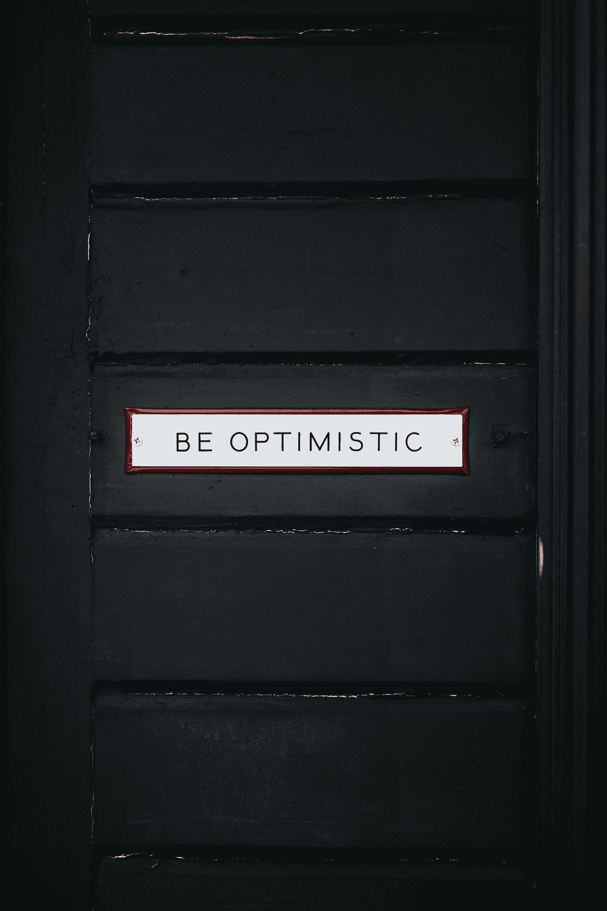

# 积极心理学与身体

> 原文：<https://medium.datadriveninvestor.com/positive-psychology-and-the-body-e15cfbe9e784?source=collection_archive---------6----------------------->

> “……只是简短地提到了身体活动、触摸、营养等。这使得幸福拼图中最基本的一块缺失了——身体。”凯特·赫夫龙

Photo by [Nathan Dumlao](https://unsplash.com/@nate_dumlao?utm_source=medium&utm_medium=referral) on [Unsplash](https://unsplash.com?utm_source=medium&utm_medium=referral)

打篮球或运动，或者以健康、快乐、反应灵敏的身体生活就是这样的礼物。当你想到我们的大脑和身体的适应性时——与生物化学、肌肉、释放到我们系统中的皮质醇和褪黑激素、血清素和多巴胺有关，以及这些相互关联的相互作用如何自愿和非自愿地创造积极的幸福感或快乐感。

*咻，那是一个句子。*

作为一名前职业运动员，我理所当然地认为，我们的身体是一种没有被充分谈论和研究的现象——特别是在幸福、健康和积极心理学方面。

我不庆祝和尊重我的身体对我的思想的影响。

嗯，还不够，但…

## 这是我对积极心理学和身体的了解:

> 随着年龄的增长，为了快乐和精神上的繁荣，我们必须控制我们的身体，这是一个巨大的挑战。我们没有改正的身体上的错误会变成坏习惯，从内部改变我的快乐状态。

 [## 良好的生活是习惯的形成|数据驱动的投资者

### 过度思考是过度紧张。仅仅几个简单的习惯就会在一天中产生巨大的影响。那是…

www.datadriveninvestor.com](https://www.datadriveninvestor.com/2020/01/17/a-good-life-is-habit-forming/) 

# 佩尔马

PERMA 代表积极情绪。订婚。关系。意义。和成就。

我们需要这五样东西才能活得更快乐，更繁荣。

如果我们谈论积极的情绪，让我们来讨论快乐和和谐这两个词，哪个能增加长久的幸福和安康？

享乐主义观点是关于一遍又一遍地寻找和培养积极的情绪。新的经历，比如去新的地方旅游，赢得篮球比赛，取得成就，以及有一个孩子都符合这个定义。这是你寻求的渴望，一旦得到满足，只会持续一会儿。人们去享乐主义的岛屿，在那里身体接触和性快感创造积极的情绪和感觉。

另一方面，幸福观是关于实践美德的。尽你所能抚养孩子所需要的美德。你在场吗？当你不想爱的时候，你在爱吗？你在付出吗？

快乐的感觉一天天减少。为了继续好好抚养你的孩子，一个人必须追求个人发展和成长，以保持对孩子的积极影响。Eudaimonic 是后苏格拉底时期用来描述道德理想的术语。美德。你是否在最高水平上实践美德和自我成长？

为了繁荣，我们必须平衡这两种旧哲学，找到我们的优势来完成赋予我们意义的事情，有目的地生活，与我们选择生活、热爱和参与的人、关系和社区交往。

这是走向繁荣的伟大起点。但是我们的身体要说什么呢？

# 积极心理学中的神经系统

Photo by [Stas Svechnikov](https://unsplash.com/@svechnikov?utm_source=medium&utm_medium=referral) on [Unsplash](https://unsplash.com?utm_source=medium&utm_medium=referral)

睡眠不足会带来严重的后果，包括疲倦、容易抑郁、产生幻觉和生产力下降。——凯特·赫夫龙

我们的身体很敏感。随着年龄的增长，我注意到了这一点。如果我吃了 Jet 的披萨(我确实吃了)，第二天就会宿醉。我很重。我有偏头痛。我爸爸总是说，“你不能在法拉利里放无铅汽油。”

我们的身体是法拉利的，但我们对待他们就像 1989 年的道奇杜兰戈。

他们都应该得到最大限度的照顾。我们的意识状态和世界处于如此高度焦虑状态的原因之一是因为我们的交感神经系统无法关闭吗？副交感神经系统从来没有机会接管，因为我们不断被电子刺激淹没，数字感官超载，更不用说电视新闻，广播和播客媒体对政治，死亡，分裂和我们国家心态危机的冲击。

如果你住在丛林里，你会整天听到吼猴和巨嘴鸟在闲聊。你会不时看到一只鬣蜥，或者一只鬣蜥滑过。但是你永远不会有一整片丛林从四面八方向你咆哮！

这就是现在的现代生活。

**丛林无时无刻不在吸引你的注意力。**

*“仅从电视和互联网上，我们一周接触到的刺激就比我们旧石器时代的祖先一生接触到的还要多。我们不停地奔跑以跟上新的信息，以至于我们长期疲惫不堪。我记不清有多少次听到有人说，'如果没有咖啡因，我将一事无成！'大自然把大脑设计成一次只处理一头对我们咆哮的狮子，而不是整个丛林都反对我们。然而，现在我们的大脑负担过重，没有时间整理所有的数据，更不用说用新的眼光来看待它，决定什么是或不是危机，以及需要采取什么措施(如果有的话)。*”—凯特·赫夫龙

# 积极心理学的长寿

想活得更久？

实践乐观主义。

每个想法都很重要。

如果是阴性。尝试使用缩写: **S.T.O.P.**

S top。

深呼吸三次。

观察消极的想法，用

肯定的，不加判断地继续下去。

一遍又一遍地这样做是自我意识的练习，也是增加你幸福的良性途径。

[*之父马丁·塞利格曼学会了乐观*](https://amzn.to/2K6uOwC) ，他是这样说的:“*我们估计，处于乐观情绪的上四分之一似乎对心血管风险有有益的影响，大致相当于每天不抽两包烟。*

# 积极心理学中的饮食和健康

不要吃太多的糖。这增加了患抑郁症的风险。伸手去拿健康的东西。找一种[糖](https://amzn.to/2VepM7G)替代品(附注:我喜欢这种东西，也是亚马逊服务有限责任公司合伙人计划的参与者之一)。我知道当我吃真正的蛋白质、真正的蔬菜和少量淀粉时，我会感觉更好。你可以在每餐中找到复制的方法。或者拿出淀粉去两个菜。

成功的简单公式。

"*最近发表在《英国精神病学杂志》上的一项大型研究发现，食用加工食品，如精制碳水化合物、糖果和加工肉类，会增加约 60%的抑郁风险。另一方面，食用全食物饮食可以降低 26%的患病风险。凯特·赫夫龙*

# 身体活动

当我不动我的身体时，我感觉像废物。当我找不到阳光和汗水。

出汗。连接到你的身体。如果你需要慢下来，做瑜伽。拉伸。骑自行车。

把一个健康习惯放在镜子上，记录下下个月你能坚持多少天。我使用一个习惯跟踪器，这也是我从詹姆斯·克利尔的《原子习惯》中学到的东西，这是我最喜欢的一本书，通过了解习惯——无论是好习惯还是坏习惯——形成的细微差别来创造个人力量。

体育活动是幸福、健康和繁荣的另一个最重要的组成部分，但它通常是我们选择不实践的一个习惯(证据是我们社会的高肥胖率、心血管疾病、糖尿病和药物治疗率)。

“赫夫顿和穆特里认为体育活动是一种‘恒星’积极心理学干预，因为它不仅能够降低风险和缓解不健康状况，还能产生积极的情绪、自我效能、掌控力和全面发展。在*减少*方面，已经发现活动可以降低患“肥胖症、心血管疾病、冠心病、中风、糖尿病(2 型)、骨质疏松症、某些睡眠障碍、高血压(例如，运动后血压下降长达 12 小时)、某些癌症(结肠癌、乳腺癌、直肠癌、肺癌、前列腺癌、子宫内膜癌)甚至过早死亡的风险。”锻炼也可用于增强免疫系统功能，然而，似乎存在一种 J 形关系，即中等、长期水平的活动比长期、高强度的活动更能促进免疫系统功能。

就产生的*而言，身体活动已经与快乐和幸福的体验联系在一起，包括:积极的情绪、自尊、身体形象、认知功能、心理健康、创伤后成长、心流、生活目标和许多许多更多的概念。"*

积极心理学和身体是联系在一起的。我们美国社会知道这个吗？我的意思是，当我不流汗，不联系，不与我的健身社区和朋友交往时，我的生活麻木是有明显原因的。

我能真切地感受到抑郁和消极情绪的螺旋上升，它们将我禁锢在这个隔离区里。我不会让坏人得逞，而是专注于我能控制的事情。我活在实践快乐中，关掉我的神经系统开关(关掉丛林)，实践并跟踪乐观、健康饮食和体育锻炼的习惯

祝你好运，

保持灵感！

特雷弗·霍夫曼

[凯特·赫夫龙](https://twitter.com/katehefferon)是东伦敦大学创伤后成长研究小组的负责人。

这篇文章包含书籍的链接，我是亚马逊服务有限责任公司协会计划的参与者，这是一个附属广告计划，旨在为网站提供一种通过广告和链接到 Amazon.com 赚取广告费的方式。