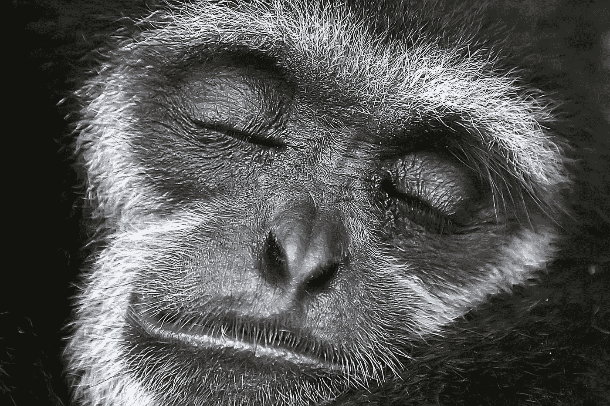

# 积极的思考转化为积极的行动

> 原文：<https://medium.datadriveninvestor.com/positive-thinking-into-positive-action-84a32b8fd752?source=collection_archive---------11----------------------->

如果你在谷歌上搜索“积极思维”，你会找到很多书、名言和迷因。他们大多专注于成就、幸福和成功的理想。这当然是一项崇高的事业，不幸的是，它很容易被误解。

> 积极思考不应该成为一种有意识地否认、埋葬、忽视我们负面情绪和想法的做法。相反，它应该帮助我们识别负面情绪的来源并加以转化。

 [## 成功人生的 25 种自我提升方式|数据驱动的投资者

### “我活得越久，学到的就越多。学的越多，体会的越多，知道的越少。”―米切尔·莱格兰德时间到…

www.datadriveninvestor.com](https://www.datadriveninvestor.com/2019/03/12/25-self-improvement-ways-for-a-successful-life/) 

你知道善恶狼的故事吗？

> *一天晚上，一位年长的切罗基勇士给他的孙子讲述了一场发生在人类内心的战斗。*
> 
> *他说，“我的儿子，这场战斗是我们内心两只‘狼’之间的战斗。一个是邪恶。它是愤怒、羡慕、嫉妒、悲伤、后悔、贪婪、傲慢、自怜、内疚、怨恨、自卑、谎言、虚假的骄傲、优越感和自我。*
> 
> *其他的好。它是快乐、和平、爱、希望、宁静、谦逊、善良、仁慈、同情、慷慨、真理、同情和信念。”*
> 
> 孙子想了一会儿，然后问爷爷:“哪只狼赢了这场战斗？”
> 
> 老切诺基人回答道:“你喂养的那只。”

我们如何喂养我们的负面想法和情绪？当我们陷入消极时。

*   我花了很多时间谈论什么不起作用。
*   我在《每日新闻》的戏剧中找到了一些奇怪的快乐，尤其是当我读到或听到的证实了我的观点。
*   我花了太多的时间试图学习如何摆脱一个不理想的情况。
*   我有一种持续的低能量、悲观的感觉，我一直在做无益的活动。

我们如何处理我们的负面情绪和想法，而不做出反应，或者更糟的是拒绝？我们可以将它们转化为积极的行动。以下是适合我的步骤:

1.  我注意到消极的想法和情绪。
2.  我不再急于关注积极的事情，而是停下来关注它们。
3.  我提醒自己承认它们是我要求行动的一部分。
4.  我问自己:我能做些什么来将想法和情绪转化为积极的行动？
5.  我创造行动的条件。

**我来分享一个例子**:

我遇到一个人，他非常在意自己的外表、昂贵的衣服、闪亮的配饰和年轻的说话方式。我想，“哦不，一个自大狂在行动，”我觉得“我不属于这里。”

1.  我发现自己对刚认识的人的反应和判断仅仅是因为他的外表。
2.  我阻止自己找借口离开。
3.  我发现我用错误的观察判断人是肤浅的。我的判断也很肤浅！
4.  我将开始一次更深入的谈话，试图理解我和他之间的任何共同点。
5.  我看到他戴着智能手表，这是我感兴趣的话题。我将询问他对它的体验。

这个过程，当应用多次时，教会我们将消极转化为积极。

当我们喂好狼以赢得战斗时，我们学会了积极主动的态度，在当下寻找现实的解决方案和机会。当我的钱包很薄，我觉得在家很无聊，我知道在大自然中散步就像今天我买不起的高级餐厅一样令人满意。

维塔利·阿诺辛的照片