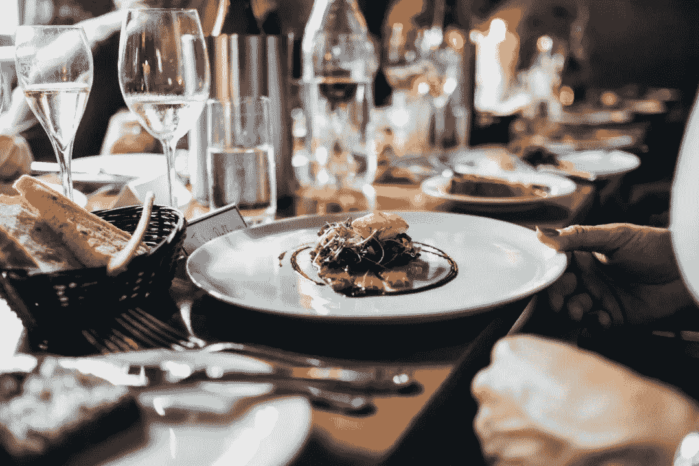

# 后新冠肺炎餐厅创新趋势

> 原文：<https://medium.datadriveninvestor.com/post-covid-19-restaurant-innovative-trends-b76d6206b9a5?source=collection_archive---------6----------------------->

不可否认，酒店业是受席卷全球的疫情影响最严重的行业之一。随着许多餐馆被关闭，在这紧张的封锁期间，我们最怀念的事情之一是能够出去与家人和朋友一起享受食物和饮料。

餐饮业在我们闲暇时的娱乐方式中扮演着重要的角色，从这个意义上说，它对我们的文化有着重要的贡献。毫不奇怪，快速休闲餐厅是我们希望尽快恢复的第一批分店之一。

虽然封锁对餐馆来说很难，但许多餐馆已经能够创新，以便在当前的环境下继续运营。此外，随着许多餐厅重新开业，我们看到围绕外出就餐的法规发生了变化，这反过来又导致了食品领域令人惊叹的新创新。不幸的是，许多我们最喜欢的美食机构，如休斯顿和爱迪生的 Mercy Wine Bar、联合塔的 Five Sixty、沃思堡的 Chicken Scratch、Birds Cafe、达科他州的牛排餐厅都在我们下面永久关闭了。有些是我每周或每月经常光顾的，有些是我自 1998 年搬到达拉斯后就喜欢的，而其他的则是我们周末和孩子一起享受的家庭热点。

以下是自冠状病毒爆发以来，餐馆发展的一些最新趋势。

# 在线订购

好吧，这并不是什么新鲜事，但疫情意味着许多企业不得不通过网络来继续销售他们的食物，因为由于 COVID，进入餐馆受到限制。这导致越来越多的餐馆使用应用程序点餐服务，顾客可以直接通过应用程序点餐。人们已经选择享受一个晚上的外卖，这使得企业能够探索他们的在线产品。

我们也看到了一个有趣的在线订购趋势，即小型在线订购平台的兴起，这些平台针对特定城市，旨在帮助他们的城市摆脱困境。与 UberEats、Grubhub、DoorDash 或 Deliveroo(这些公司通常收取订单价值的 15-20%)等大公司相比，小企业有机会更有效地服务于他们的直接社区，并且餐厅的成本更低。).这种差距给了小公司服务社区和让他们的餐馆重新站立起来的机会。一个很好的例子是 Yoello，这是一个基于加的夫的平台，它已经与大公司竞争并胜出。

所有的餐馆现在都需要一个基本的网站，能够与他们的销售点(POS)和忠诚度系统集成在线订购，此外还需要与众多供应商提供的交付解决方案集成[。](https://www.deliverysolutions.co/)

# 路边交货

随着隔离的全面展开，人们无法接触，我们已经看到路边交付作为一个概念出现。这项服务使人们可以在路边捡食物，就在他们的餐馆外面，他们的家，或者他们旅行的任何地方。

这项创新让人们不必接触送货司机就能拿到食物，反之亦然。

# 无接触递送

在这一趋势中，我们也看到了 Grubhub、DoorDash、Zomato、Deliveroo、JustEat 和 UberEats 等公司的交付方式发生了变化。非接触式送货已经变得必不可少——司机把食物放在门口台阶上，以避免与人接触。

虽然这类应用程序上的定位服务和[应用内通信一直是优先考虑的事情](https://www.eno8.com/services)，但冠状病毒的爆发意味着司机和餐馆不得不关注他们的交付位置和通信。在过去，快递代理可以要求某人下来见他们，但是因为这是不可能的，所以平台通信方面的创新和投资必须加快。

尽管随着与他人接触的威胁减少，这种非接触式交付可能会逐渐减少，但在线订购文化可能会继续存在。

# 健康和安全已成为首要任务

正如我们提到的无接触传输，健康和安全必须放在第一位。这一领域的一些创新包括在进入场所时记录温度，并在每个顾客进门时记录他们的情况，以便跟踪可能爆发的任何类型的疫情。

作为健康和安全措施的一部分，餐馆呼吁顾客采取额外的预防措施，并使用非接触式温度计等技术，试图让那些身体不适的人远离场地。社交距离和餐厅内有限的座位已经实施。

# 你碰过的菜单已经是过去式了

更有趣的趋势之一是，由于细菌传播的明显原因，人们不再想触摸菜单。因此，从你自己的手机或平板电脑上在线点餐正在成为一种创新的技术趋势，主导着餐馆业。

顾客被鼓励在自己的设备上点餐，并通过使用条形码 QR 的应用程序或网页将食物送到他们的桌子上，而不是必须与服务器或服务员进行不必要的接触。

高端餐厅已经抛弃了老式的光滑菜单，现在用打印纸打印出来，这些打印纸是可以回收利用的。

# 有限的菜单选项

许多餐馆也不得不考虑限制他们的菜单选项，以便使用更容易获得的配料。随着食品供应问题冲击美国和全球，餐馆不得不与食品经销商合作，使用可用的原料。这使他们能够削减成本，同时仍然使用有限的原料，并保持他们的菜单新鲜。

# 随着科技的发展，排队现象正在减少

在减少人们付款时排队的问题上，科技也很有帮助。通过鼓励在设备上在线订购，人们不必离开座位，这有助于防止病毒传播的风险。

将来，我们很可能会看到这种在线订购的趋势继续下去。人们似乎更乐意关掉手机点餐，把自己和其他人分开，这对餐馆来说很好，因为它减少了体力劳动。对双方来说，这种自带设备(BOYD)的安排似乎是行得通的，而且结果也许会留在这里。

# 创建餐包和 DIY 选项

由于许多地方的空间有限，桌布有限或完全停止供应，餐馆不得不考虑如何在舒适的家中为顾客服务。

需求也意味着人们想在自己舒适的家中享用餐馆的食物。为了使用新鲜农产品和减少浪费，餐馆已经开发了家庭工具包，允许人们在自己家里舒适地烹饪餐馆标准食物。德克萨斯州也有酒吧开始制作鸡尾酒制作套件，这样人们就可以在家里体验鸡尾酒了。

# 使用弹出窗口展开

在市场上建立弹出式商店，扩大他们的影响范围，并把你的包装和捆绑食品送到你城镇中没有商店的其他地方。最好的例子就是我最好的朋友的食物链，[*肥吸管。*](https://www.fatstraws.co/) *Terry Pham 和 Jennifer Pham 调整了他们的业务，确保他们的顾客以他们最喜欢的泡沫茶和耐嚼泡芙甜甜圈的形式获得快乐和微笑。*

# *包装创新*

*我们看到的不仅仅是餐馆内部的创新，我们看到的后冠状病毒时代的包装创新也可能会持续下去。*

*在我们如何跟踪、追踪和查明包裹的位置以及与谁或什么接触方面，包装已经取得了很大进展，但是冠状病毒加快了这一需求。由于对食品卫生的需求增加，再加上大多数食品都需要运输，这一时期的包装必须是无缝的。*

*在此期间，从汤到热巧克力的一切都必须通过汽车或自行车运送，因此包装必须跟上——这意味着没有溢出，没有潮湿的底部，所有类型的食物在运输过程中都能保持不变。*

# *继续投资研发*

*密切关注趋势和客户需求，确保我们的业务为新常态做好准备，并对您客户群的独特需求做出响应。不断倾听你的顾客和需求。**肥吸管是一个小企业的例子，即使在受疫情影响的低迷时期，他们也没有停止创新菜单。他们通过介绍流行的 Dalgona 奶油和他们受欢迎的泡沫茶和耐嚼甜甜圈的新口味重新吸引了顾客的注意力。这有助于像他们这样的公司消除疫情带来的噪音，让顾客脸上重新焕发笑容。***

# ***重新审视你的餐厅的数字形象***

***人们可能不会像以前那样开车在镇上转悠，或者路过你的餐馆，他们可能会在谷歌上搜索，或者通过其他人的社交媒体帖子和社交媒体群找到你。***

***随着餐饮限制的取消，消费者开始寻找订餐、提货或冒险就餐的地方，你必须重新考虑如何通过所有的噪音吸引他们的注意力。花些时间[优化你的网上形象](https://www.digitalsuccess.us/blog/5-digital-strategies-to-create-a-growing-restaurant-during-covid-19-crisis.html)，[更新你的网站](http://www.maintain.ws/)和点餐功能，并确保你的社交媒体渠道一致，这样当消费者冒险出去寻找你的餐馆时，他们就能真正找到你，并感到你为他们的安全着想。***

**我们已经体验到餐馆老板在社交媒体上的帖子是多么有创意，[创造了他们存在的意识](https://www.digitalsuccess.us/blog/how-the-search-is-changing-during-coronavirus-pandemic-and-how-the-businesses-should-adapt-to-the-change.html)以及他们如何利用他们的顾客来推广他们最喜爱的品牌。**

# **餐厅创新的下一步是什么？**

**在冠状病毒期间，餐馆的经营方式发生了许多变化，其中许多餐馆看起来会留在这里。令人惊讶的是，大多数餐饮企业不得不快速思考，适应不断的变化并采用这些新技术，不断地改变、创新和试验，以跟上并保持活力。就在几个月前，像疫情这样的限制给这个行业带来的创新是不可思议的。人们会嘲笑这些已经成为现在生活一部分的想法。**

# **我们能从这个行业的创新中学到什么**

**在此期间，你觉得最有趣的食品技术创新是什么？读了这篇文章，以及那些由于环境的限制而被迫改变和创新的餐馆，你是如何在你的行业中改变和创新的？(不一定是餐饮业)。我很乐意阅读您的评论和您独特的 COVID 创新故事。**