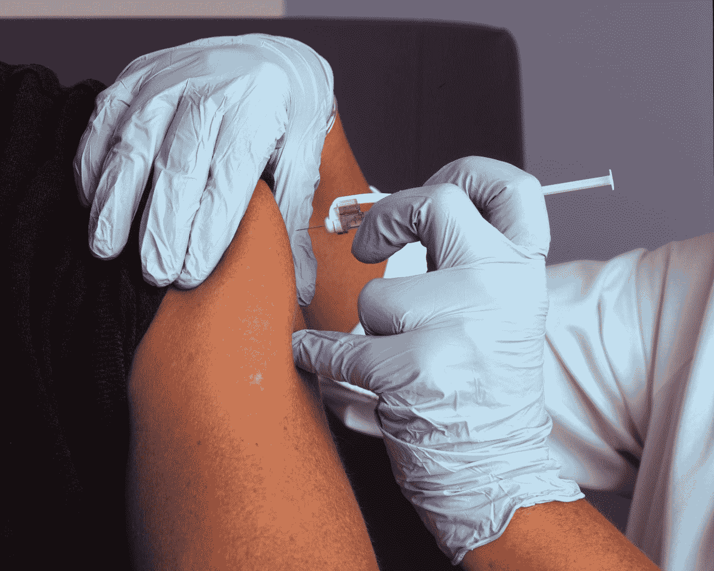
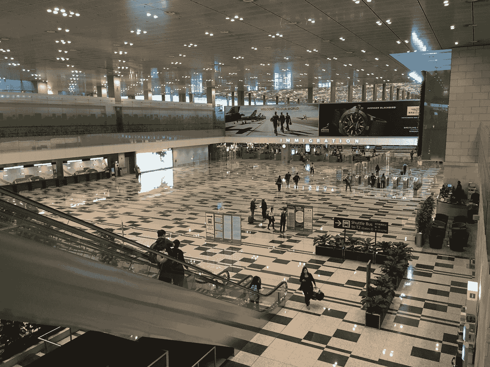

# 后 COVID 19:疫苗即将问世，世界将会是什么样子

> 原文：<https://medium.datadriveninvestor.com/post-covid-19-what-the-world-will-look-like-now-that-a-vaccine-is-forthcoming-c17c2a7a6580?source=collection_archive---------11----------------------->

## 一年即将结束，世界各地的人们都希望疫情在一年结束时结束。随着针对该病毒的疫苗的出现，是时候看看疫情被遏制后的世界会是什么样子了。

Photo by [National Cancer Institute](https://unsplash.com/@nci?utm_source=medium&utm_medium=referral) on [Unsplash](https://unsplash.com?utm_source=medium&utm_medium=referral)

仍在影响世界的新型冠状病毒导致大多数人被限制在家中数月。它正在重新定位人们与外部世界、彼此之间以及与政府的关系。现在有几种疫苗可以用于新冠肺炎，世界可以开始回到正轨。然而，根据科学家的说法，会有一些变化，因为这种病毒不太可能被根除。

在接下来的几个月，或者可能是几年，将会发生的变化将会令人不安或者陌生。触摸他人会成为禁忌吗？一些国家会继续对游客关闭吗？

但疫情也创造了许多机会，包括灵活和复杂的技术应用。人们重新开始欣赏户外，享受简单的快乐。两极分化较少。但最重要的是，世界各地的人们将不得不接受生活方式、经济、医疗保健、政府等方面的变化。

# 现状

放眼望去，到处都是巨大的生命损失，人们正在应对收入和就业的损失，儿童教育的中断，以及与家人和朋友失去社会联系。现在人们在家里和工作中做事情的方式不同了。人们不得不应对其他疾病，如抑郁症和其他心理健康问题。

人们将不得不保持基本的健康协议，戴口罩和面罩、保持社交距离和定期洗手将成为人们日常生活的一部分。

公司正在调整他们的工作政策，包括灵活的工作时间，并允许更多的员工远程工作。

Photo by [Matt Seymour](https://unsplash.com/@mattseymour?utm_source=medium&utm_medium=referral) on [Unsplash](https://unsplash.com?utm_source=medium&utm_medium=referral)

# 未来会怎样

专家认为[新冠肺炎将成为地方病](https://theconversation.com/covid-19-will-probably-become-endemic-heres-what-that-means-146435)，并成为全球人口继续应对的越来越多的传染病的一部分。马里兰大学医学院疫苗开发中心 NFID 主任 Kathleen M. Neuzil 博士认为握手将被遗忘，飞机将变得更宽敞，一个人的常规免疫计划将包括新冠肺炎疫苗接种。

NFID 公司的首席执行官兼执行董事马拉·道尔顿认为，疫情将结束开放式办公室的概念和面对面的会议。她看到了远程教育、在线音乐会、更好的食品和饮料配送的扩展，人们将经常戴口罩和洗手。

随着在线交流的增加，人们将不得不接受缺席更好的观点。然而，那些没有宽带接入的人将处于不利地位。

在美国，爱国主义将采取另一种形式。先锋将是新爱国者，包括医生、护士、护理员、药剂师、店员、教师、小企业主、雇员和公用事业工人。他们应该得到与退伍军人相似的福利。

 [## 新冠肺炎期间股票交易的 9 个教训|数据驱动的投资者

### 在你浏览之前，让我告诉你一些关于我自己的情况。我是…

www.datadriveninvestor.com](https://www.datadriveninvestor.com/2020/12/09/9-lessons-learned-about-stock-trading-during-covid-19/) 

由于疫情，美国人学会了接受科学和专业知识的重要性。他们以前变得自满，是因为他们享受了富裕、和平和高效消费技术带来的奢华。现在他们想听听医学专业人士怎么说。

社会学教授埃里克·克兰伯格也是纽约大学公共知识研究所的主任，他认为人们会在公共和卫生服务方面进行新的重大投资。随着人们意识到他们依赖他人并重视他人的帮助/支持，个人主义将会减少。

对在线工具的监管限制将会减少。许多机构将不得不进行改革，以使人们能够使用在线工具。例如，HIPAA 需要允许医疗提供商使用电子邮件、Facetime 或 Skype 等通信工具。雇主将不得不允许员工下载特定的应用程序，以便更有效地在家工作。

疫情暴露了许多类型的服务中的许多违规行为和漏洞，尤其是医疗保健。预计后新冠肺炎将侧重于远程医疗、家庭保健计划以及老年人和残疾人计划。

2020 年全球经济陷入衰退。一些专家预测，跨国公司将把部分生产设施从中国转移到其他具有物流优势、高人力资本水平和更广泛生产设施的发展中国家。一些发达国家将把他们的工厂迁回本国。

在经历了远程工作之后，许多公司，尤其是服务行业的公司，将更多地使用远程工作系统，而大公司的一些部门将考虑从外部供应商那里购买额外的服务。

国际劳工组织(ILO)从不同的角度看待这种情况，预测失业将普遍存在，收入将减少，家庭债务水平将上升。

虽然许多人认为经济呈下降趋势，但其他人认为大流行后的环境是新机遇和创新的动力源泉。不可否认，冠状病毒会留下积极和消极的影响，因此需要政府、私人和公共机构以及个人利用他们在疫情期间学到的各种经验来扭转局面。

## 访问专家视图— [订阅 DDI 英特尔](https://datadriveninvestor.com/ddi-intel)