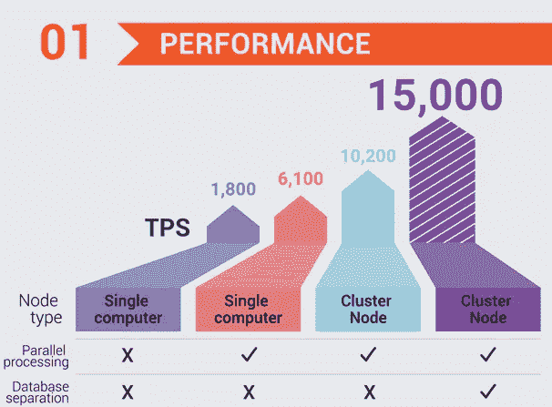

# 后 COVID 世界——区块链可以扮演的角色以及为什么扩展很重要！！

> 原文：<https://medium.datadriveninvestor.com/post-covid-world-role-blockchain-can-play-and-why-scaling-matters-a8523a06e387?source=collection_archive---------15----------------------->

这些天，有两个主要因素预计会给区块链一些额外的喷气燃料继续前进。

第一个是比特币 Halvening，它通过将每块比特币奖励削减一半而获得通过。下一个更有影响力的是重塑了我们所知的世界的新冠肺炎。

新冠肺炎是一个完美的场景，可以帮助新的市场力量出现。没有人预测到 COVID 19 会变成一场全球公共卫生危机、一场经济崩溃和在线连接的激增，这可能是世界经济论坛创始人克劳斯·施瓦布的新书《第四次工业革命》中提到的第四次工业革命的催化剂

克劳斯认为，第四次工业革命将从根本上不同于过去的革命，并将以一系列融合物理、数字和生物世界的新技术为特征，影响所有学科、经济和行业，甚至挑战关于人类意味着什么的想法。

这正是过去几个月发生的情况。目前世界各地采取的对抗电晕的措施肯定会对我们的生活和我们与技术的关系产生长期影响。

在这个新世界里，社交距离已经成为一种新的规范。现在，银行业务就发生在你的指尖。在家工作或远程工作现在是一种新的方式。电子和移动支付已经开始激增。

根据最受技术驱动的行业之一最近的一项研究，银行业的 1000 名银行客户发现，82%的受访者担心走进他们的本地分行，63%的受访者比疫情之前更愿意通过数字应用程序或网站联系。

 [## 数字货币、区块链和货币的未来|数据驱动的投资者

### “区块链”、“加密货币”、“令牌化”，以及现在的“央行数字货币”已经成为…

www.datadriveninvestor.com](https://www.datadriveninvestor.com/2020/02/18/digital-currencies-blockchain-and-the-future-of-money/) 

目前，在美国，移动支付在所有支付方式中所占比例[不到 10%](https://www.cnbc.com/2019/08/29/why-mobile-payments-have-barely-caught-on-in-the-us.html) ，而在中国，这一比例超过 80%。在 COVID 之前，美国公民更多地使用信用卡、现金、支票等支付方式，而不是虚拟支付。但一旦 COVID 的影响到来，银行已经见证了移动银行和电子支付服务新注册的激增。

随着冠状病毒传播后世界消除了身体接触，区块链可以通过促进数字支付取代现金交易来增加巨大的价值。

# 为了满足这些新需求，我们需要速度更快且可扩展的区块链

可扩展性是加密货币的核心问题之一，尤其是在涉及旧硬币的时候。让我们以 BTC 为例。平均而言，BTC 目前平均处理速度为 5–7 TPS，而以太坊的交易处理速度为 15–20 TPS，因为全球集中支付系统 Visa 可处理 24，000 TPS。

尽管许多区块链声称超过了 Visa 的 TPS，但这只是纸上谈兵，因为大多数这些区块链使用理想条件来衡量 TPS，而不是现实世界的条件。

在这些人中，区块链脱颖而出。

aelf testnet 于 2018 年 6 月 30 日正式推出，并取得了 14，968 TPS 的惊人成绩。

除了速度，aelf 区块链还可以有效地扩展，这对于企业采用来说至关重要

此外，从发展的角度来看，Aelf 也是最活跃的项目之一。在过去，Aelf 被列为 GitHub 活动量最高的 10 个项目之一。

这只是我们的未来和区块链未来将面临的期望的一个冰山一角。

我们正在目睹一场前所未有的范式转变，随着数字化转型席卷全球，旧的商业模式和方法正在变得过时。我们需要像 Aelf，BNB 等坚实的项目作为领跑者，帮助为即将到来的区块链革命增加巨大的价值。