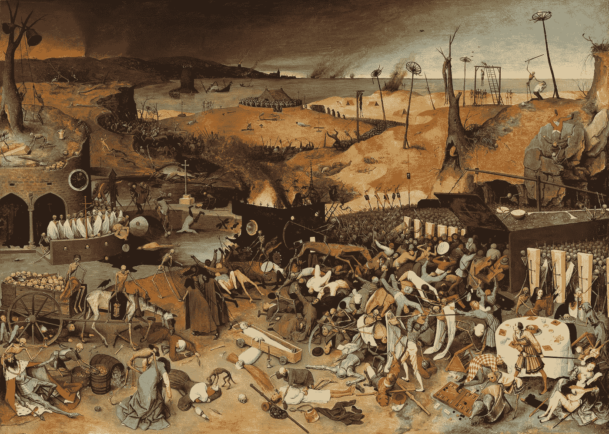
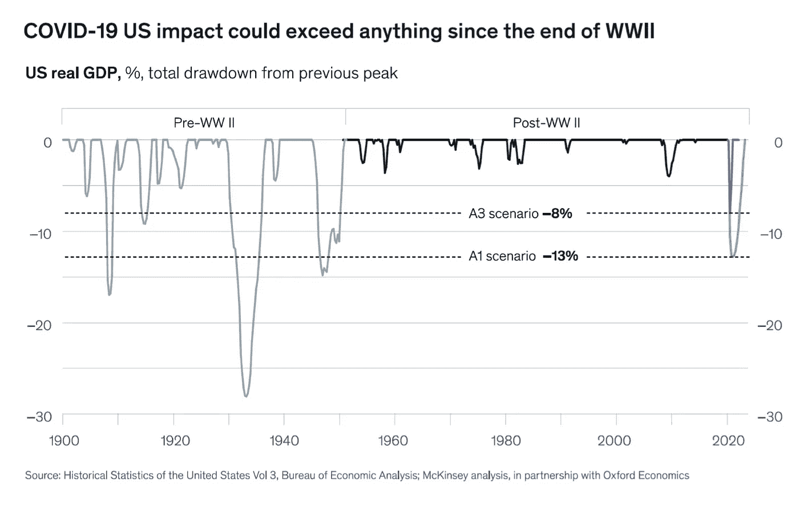
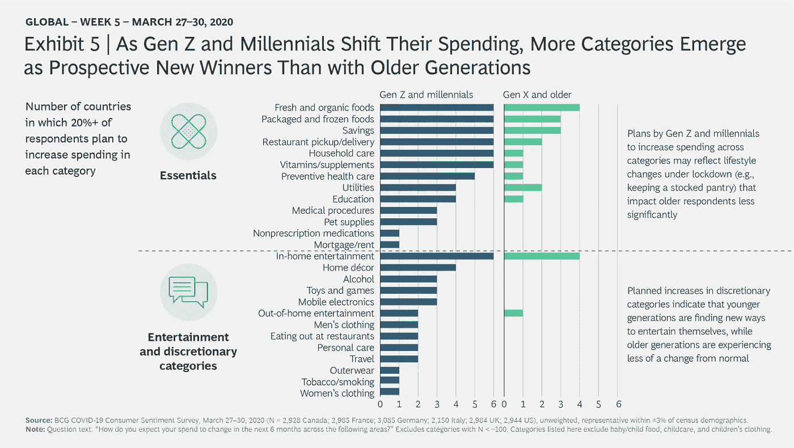
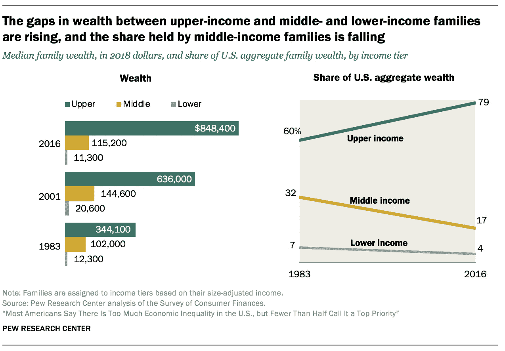
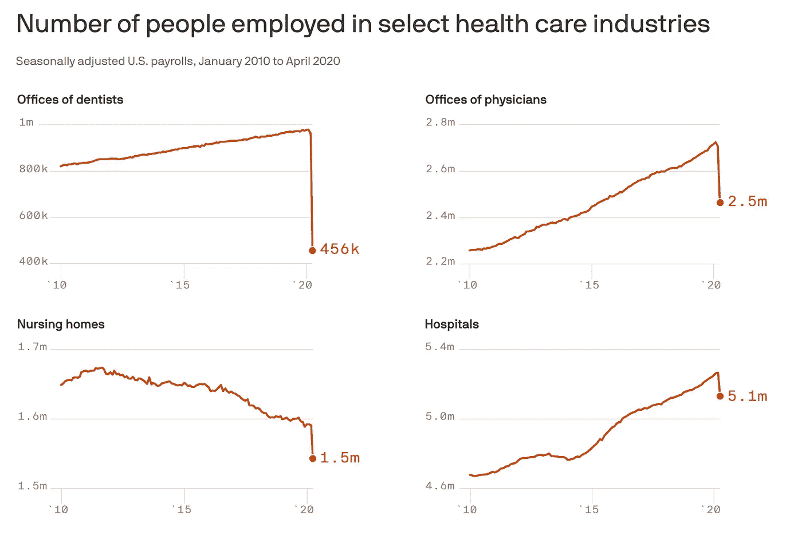
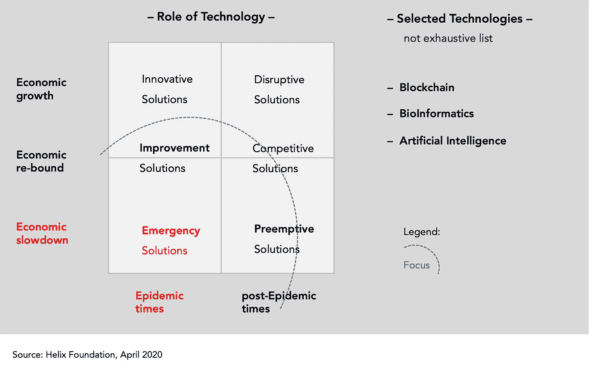

# 后疫情病毒经济学:去全球化、去增长和去中心化

> 原文：<https://medium.datadriveninvestor.com/post-pandemic-vironomics-deglobalization-degrowth-and-decentralization-910b9921c668?source=collection_archive---------7----------------------->

Probably one of the most iconic and frightening paintings ever made dated circa 1562, ***The Triumph of Death* by Pieter Bruegel the Elder** housed in *The Museo del Prado* in Madrid, depicts the end of the post-bubonic world (Jon Meacham, Pandemics of the Past, [NYT](https://www.nytimes.com/2020/05/07/books/review/pandemics-of-the-past-coronavirus.html))

*为什么区块链是医疗经济学的“DNA 疗法”*

勃鲁盖尔的“ [*”死亡的胜利*](https://www.widewalls.ch/pieter-bruegel-triumph-of-death-museo-prado/) ”的红褐色调(上图)，给了他的骷髅军队一个地狱般的舞台，穷人和富人都没有希望。这种大流行后的绝望感是恰当的，因为我们在美国无助地目睹了超过 10 万人丧生和 4000 万新的失业申请，这代表着我们的卫生和经济系统的彻底崩溃。

但是流行病结束了，有必要利用这些时间作为一个机会来重新想象我们的未来(我在这里写了这个)。

历史向我们展示了流行病以两种方式结束。一个是*医疗终结*。病毒(比如流感)或细菌(比如淋巴腺鼠疫)变弱，随后重新出现，或者通过疫苗被消灭(比如天花)。这就是为什么目前有一个巨大的努力来寻找疫苗和“结束疫情”,同时也助长了错误的期望。

 [## 数字货币、区块链和货币的未来|数据驱动的投资者

### “区块链”、“加密货币”、“令牌化”，以及现在的“央行数字货币”已经成为…

www.datadriveninvestor.com](https://www.datadriveninvestor.com/2020/02/18/digital-currencies-blockchain-and-the-future-of-money/) 

流行病终结的第二种方式是*社会*。[心理疲惫](https://www.theatlantic.com/ideas/archive/2020/05/quarantine-fatigue-real-and-shaming-people-wont-help/611482/)和挫折感，加上生死存亡的经济威胁，带给人们、社区和国家以想要回归他们的生活，渴望把疾病的噩梦抛在身后。

然而，为了设计这个新的开始，重要的是不仅要了解我们的'*拼凑反应*和哪里出了问题，更重要的是要了解我们的'*拼凑经验和遗产*，我认为这将导致三个相互依赖的现象:

(1)去全球化

(2)去增长

(3)DLT 的大量采用

# #1:病毒学将导致去全球化

我们要求的“封锁”和其他控制新冠肺炎的努力导致了自 1933 年以来最大的季度经济活动下降(见下图)。25%的美国家庭靠薪水生活，40%的美国人[无法在不借款的情况下支付 400 美元的意外开支，对许多人来说，长期封锁的影响无异于灾难。](https://www.federalreserve.gov/publications/files/2019-report-economic-well-being-us-households-202005.pdf)

[Source](https://www.mckinsey.com/business-functions/strategy-and-corporate-finance/our-insights/safeguarding-our-lives-and-our-livelihoods-the-imperative-of-our-time)

这不仅导致了消费的根本转变，也导致了重大的行为变化，即:

1.  信心的侵蚀将使信任比以往任何时候都更加重要。
2.  任何可以虚拟完成的事情都将是虚拟的。
3.  每个企业都需要明白如何成为主导公民思维的新健康生态系统的一部分。
4.  随着人们更多地呆在本地，家庭支出将会增加，在家里做茧自缚。
5.  暂时来说，政府和公司在社会中的角色会得到更大的认可，集体行为的重要性也会得到更大的认可。

Brand trust, virtuality and cocooning will gain importance ([source](https://www.bcg.com/en-us/publications/2020/covid-consumer-sentiment-survey-snapshot-4-13-20.aspx))

个人保护以及对健康和安全的担忧也会转化为公众情绪。尽管全球贸易和国际联系的增加总的来说是繁荣与和平的力量，但供应链的脆弱性、旅行、贸易和投资的中断，加上国际机构 T31 失败的总体情绪，助长了民粹主义、保护主义和民族主义本能。

> 但是，正如新冠肺炎是一种全球性的病毒一样，全球化本身也是一种病毒。因此，也许全球化并没有处于危险之中，而是需要将我们的经济从“增长”转变为“去增长”。

# #2:病毒学将导致衰退

纵观历史，财富要么是自己创造的，要么是从别人那里获得的，要么是在地下找到的。生产率——即由学习、建设和创造力驱动的人均产出——一直是*财富增长的主要驱动力，并且随着时间的推移显著增加。然而，由于不同的系统原因，不同的人有不同的上升速度(更多关于这一点的阅读[这里](https://www.pewsocialtrends.org/2020/01/09/what-americans-see-as-contributors-to-economic-inequality/))，因此造成了[显著的收入不平等](https://www.pewsocialtrends.org/2020/01/09/trends-in-income-and-wealth-inequality/)(见下文)。*

[Source](https://www.pewsocialtrends.org/2020/01/09/trends-in-income-and-wealth-inequality/)

后新冠肺炎时代的金融崩溃只是加速了这些趋势，导致许多工作岗位一去不复返，并暴露了我们过度追求增长的资本主义经济的许多弱点。

1972 年，社会哲学家安德烈·高兹(André Gorz)提出了消除增长(Degrowth)的观点，强调工作和工作时间是改善个人和社会生活的手段，而不是加剧无情的经济竞争和社会分化。

因此*衰退*包括 5 个经济特征:

(1) **把生命放在经济系统的中心。**

医疗保健、教育、可再生能源和生态农业经济的核心不是增长和浪费的生产，而是生活和福祉。

2) **从根本上重新评估为了让所有人过上好日子，需要做多少工作，做什么工作。**

例如，新冠肺炎已经表明家务劳动是必不可少的，需要被重视和货币化。类似地，远程工作表明我们可以减少工作时间并引入工作共享方案。

3) **围绕提供基本商品和服务组织社会。**

虽然我们需要减少浪费性消费和旅行，但必须通过普遍基本服务或普遍基本收入计划来保障每个人的基本人类需求，如获得食物、住房和教育的权利。

4) **使社会民主化。**

让所有人，特别是边缘化群体，参与影响他们生活的决策，对经济有重大意义。能源、食品、住房、健康和教育需要在经济合作的基础上使用*。*

政治和经济体系应该建立在团结的基础上。

再分配正义——跨国的、交叉的和代际的——必须成为当代人和后代人之间、国家内部社会群体之间以及全球南方国家和全球北方国家之间和解的基础。

衰退背后的想法不是要统治资本主义，而是思考未来的措施可以刺激我们的复苏，重点是创造有意义的工作条件，这不仅是收入的来源，也是身份和个人自尊的来源。

然而，对减少增长和有意义的工作来说，这也是对我们当前的**寻租经济进行修正的紧迫性，在这种经济中，钱是从每笔交易*中提取的，而*没有增加价值。**

> **事实上，全球经济表现不佳和 T2 长期不平等的原因之一是传统银行体系的结构。**

# **#3:病毒经济学表明，保险公司是传统的医疗保健银行**

**医疗保健行业的金融崩溃来得又快又快。除了[医生发誓要离开](https://elemental.medium.com/when-this-war-is-over-many-of-us-will-leave-medicine-86a274b5a627)和数十万基本医疗工作者[工资过低或被低估](https://www.brookings.edu/research/essential-but-undervalued-millions-of-health-care-workers-arent-getting-the-pay-or-respect-they-deserve-in-the-covid-19-pandemic/?utm_campaign=Brookings%20Brief&utm_medium=email&utm_content=88669730&utm_source=hs_email)之外，医疗行业在疫情 [期间损失了*超过 140 万个工作岗位*](https://www.axios.com/newsletters/axios-vitals-cacbbdf4-4694-4db3-9299-5a7e29ebee7e.html?chunk=1&utm_term=emshare#story1)！(下)。**

****

**[Source](https://www.axios.com/newsletters/axios-vitals-cacbbdf4-4694-4db3-9299-5a7e29ebee7e.html?chunk=1&utm_term=emshare#story1)**

**医疗危机期间 25%的医疗人员流失不仅令人惊讶(人们会认为在公共卫生危机期间你需要更多的医疗专业人员)，而且也指出了一个糟糕的经济设计，一个在选择性程序上过于可靠的系统。**

**但是，当医院正在努力应对新冠肺炎费用增加、T2 流动活动减少和 T4 工人休假时，保险公司报告了引人注目的季度报表，认为经济衰退即将到来。让事情变得复杂的是，医院得到了税收的救助，明年保费可能会上涨 40%。**

**从本质上说，这意味着支付者不是(用我们的钱)支付我们需要的(目前)医疗保健类型，而是(用利润)持有它，支付他们(最终)将批准的治疗类型。**

> ***因此，当务之急是*我们向市场推出基于 DLT 的支付解决方案，这些解决方案支持:价格透明、[令牌管理的注册中心](https://arxiv.org/pdf/1906.03300.pdf)和令牌化的资产，以便创建一个反竞争的经济，能够在我们需要时以可承受的价格为我们提供我们需要的治疗。**

****

**We need to create an [anti-rivalrous decentralized economy](https://medium.com/@BiankaB12/introducing-daostack-the-future-of-scalable-collaboration-anti-rivalrous-economics-548887d58ab2) that discourages monopoly and market manipulation**

# **最后的想法:病毒经济学认为 DLT 是医疗经济学的 DNA**

**Marc Alizart 在*Cryptocommunisme(press Universitaire de France，2019)* 中用生物学解释了人类经济学。他雄辩地写道:**

> **“……就像金钱是 ATP 一样，区块链是 DNA。不可变的、加密的和不可替代的，DNA 是一个分布式账本(第 116 页)…”**

**[ATP 分子](https://en.wikipedia.org/wiki/Adenosine_triphosphate) *为活细胞提供*能量(一种“能量货币”)。是[线粒体](https://en.wikipedia.org/wiki/Mitochondrion)产生的*，也是*组织*和*分配*它。因此，线粒体本质上是银行或保险公司，它们通过设计来维持我们的经济健康。***

*然而，目前这种能量与我们的直接需求脱节，导致了一种需要彻底治疗的疾病状态。*

> *换句话说，我们目前的医疗保健经济抑制因素需要基因治疗——一种将改变其 DNA 的激进治疗——这是其本质。*

*这并不奇怪。*

*随着“*”[终结封建主义](https://www.salon.com/2020/04/26/the-black-death-led-to-the-demise-of-feudalism-could-this-pandemic-have-a-similar-effect/)，后新冠肺炎病毒经济学呼吁*去中心化、相互依存的新经济*能够抵御下一次大流行，并且希望，就像勃鲁盖尔杰作右下角的那对恩爱夫妻一样(现在就去查看)——我们将会获胜。**

***如果你喜欢你读到的内容，* ***继续在下面“鼓掌”，这样其他人也会看到(最多允许 50 次鼓掌！)*****