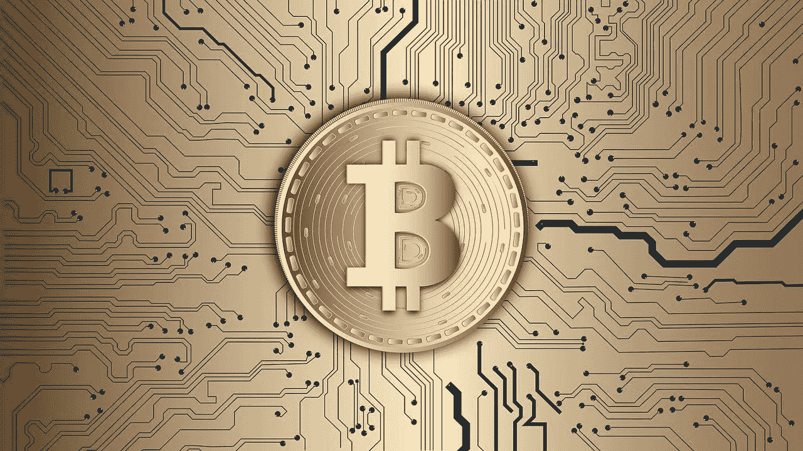
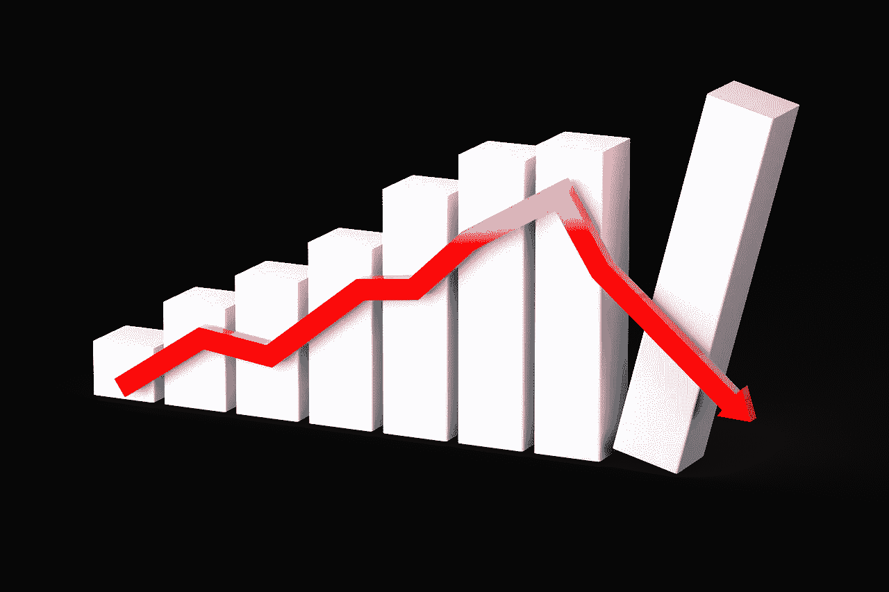

# 后疫情；加密空间会变成什么样？

> 原文：<https://medium.datadriveninvestor.com/post-pandemic-what-becomes-of-the-crypto-space-eec7c7fb0975?source=collection_archive---------17----------------------->

[Source](https://pixabay.com/illustrations/covid-19-coronavirus-analysis-5205245/)

2020 年必将作为 21 世纪最引人注目的一年而载入史册，同时也是人类历史上最艰难的时期之一。最初影响极少数人的“神秘流感”演变成了一场全球性的噩梦。经济崩溃，社会活动停止，医疗中心挤满了病人，夺去了难以置信的生命。

疫情冠状病毒继续在世界范围内肆虐，大多数人类活动受到负面影响。世界仍然处于黑暗之中。卫生系统和政府的努力旨在控制传播和拉平感染曲线，同时药物寻求治愈方法。

[Source](https://pixabay.com/illustrations/stock-exchange-financial-crisis-4878214/)

这个派对不排除加密空间。在冠状病毒疫情重创全球经济之前，加密货币图表看起来很有前途，几乎有爆炸的趋势。将加密货币的价值击得粉碎，并将 btc/usdt 汇率降至 4500 美元以下。比特币总市值低于 900 亿美元，替代币也呈现类似趋势。

在冠状病毒导致的崩溃最严重的时候，大多数加密货币都出现了高达初始值 50%的有形两位数价格崩溃。随着 BTC 在价格回升后收于 6500 美元，3 月份是加密货币持有者应该忘记的一个月，但毫无疑问，这为投资者创造了一个以更低价格买入的好机会。

由于冠状病毒恐慌继续对人类生活的各个方面造成影响，4 月份价格持续不稳定。

在一个相当令人惊讶的事件中，加密货币价格继续复苏，看到了有形的收益和相对较小的回调，因为加密货币再次公布了比包括石油在内的大多数数字资产更高的回报。

随着一系列价格上涨，比特币在 4 月的最后一天上涨了 15%以上，以超过 8500 美元的价格结束了这个月。Altcoins 在这段时间内也取得了相对有形的收益，因为加密货币的总市值再次超过了 2300 亿美元。比特币的两个分叉；比特币 SV(BSV)和比特币现金(BCH)分别在每月的第十天和第八天开始获得其块奖励减半的奖励。

在疫情引发的崩盘过去几个月后，一些著名的加密货币出现了大幅上涨。比特币令人印象深刻的涨势使其突破了 12000 美元大关，并在 11500 美元的良好支撑下进一步走高，以保持其在加密货币总市值中的主导地位。Altcoins 也发生了骚乱，在比特币加入潮流之前获得了巨大的收益。*我还真以为是奥特曼季呢！*，现在我没说那么大声。

简而言之，加密货币带来了惊人的价格波动；相对来说。在这样一个奇怪的时间里进行这样的表演更是一个令人惊讶的壮举。看看全球形势，你会认为事情会朝着相反的方向发展。去年的动态看起来比今年健康得多，但加密货币在潮汐中表现更好。

全球各地的情况报告显示，情况正在好转，世界正在从疫情逐渐恢复，每天的病例数不断减少，恢复统计数据正在改善。尽管疫情还远未结束，但情况有望变得更好。看看我们在疫情期间令人印象深刻的表现，在世界完全复苏后，加密货币会如何发展？

[Source](https://pixabay.com/illustrations/planet-space-world-astronomy-night-2953871/)

## 加密货币繁荣的更好世界？

疫情在巅峰时期传播的负面浪潮导致了今年最大的加密货币价格下跌，嗯，其他所有数字资产和股票都下跌了。石油价格跌至有史以来的最低点。世界经济的噩梦。试图增加其法定头寸的投资者冲击交易所，将其投资变现为更稳定、更容易获得的形式。

由于对即将发生的事情感到恐惧，投资者平仓的压力越来越大，这在很大程度上导致了疫情开始时价格的大幅下跌。恐惧、不确定性和怀疑，伴随着疫情对生活某些方面的影响，形成了主要的崩溃力量。

然而,《疫情》揭示了一些隐藏的人性漏洞。在这些封闭、限制和悲伤的日子里，我们学到了我们这一代人最重要的经验。我们认为微不足道的事情至高无上。互联网再一次被证明是过去和现在这个世纪最大的创新之一。

我们有史以来第一次意识到灵活支付方式的实际重要性。对数字支付结构的需求很高。人类接触正处于历史低点。

[Source](https://pixabay.com/illustrations/bitcoin-currency-technology-money-3089728/)

后疫情；世界将更加数字化，因为许多人被迫更多地使用互联网，并发现了使用互联网的可能性和可以实现的目标，特别是当它涉及金融交易时。虽然移动银行设施在疫情期间提供了一些便利并简化了当地的金融业务，但国际金融活动还是遭受了巨大的打击。

由于各国采取措施缓解疫情的经济影响，目前的法定恶性通货膨胀再次损害了法定货币的声誉。世界可能会为这个在艰难时期摇摇欲坠的体系寻找更好的选择。当代金融机构的这些缺点可能会将世界引向“更好的替代品”——加密货币和区块链技术。人们涌入加密空间肯定会引领疫情之后的下一次繁荣。

[Source](https://pixabay.com/illustrations/growth-progress-graph-diagram-3078544/)

继疫情之后，我们可能会迎来另一次科技繁荣。如果说数字资产世界从疫情学到了什么，那就是加密货币相对于其他数字/数字化资产的优势。Defi 仍然统治着比赛，它的引擎似乎还有一些汽油。在疫情期间，Defi 一直是密码领域最吸引人的概念之一。随着世界经济在疫情之后稳步好转，复苏带来的利润可能会进入加密货币领域。

## 事情会反过来吗？

兴奋吗？暂停一会儿…加密空间是一个非常不可预测的环境。事情在疫情进行得很好，在疫情之后似乎会变得更好，但实际情况可能并非如此。

尽管加密货币在疫情期间让投资者高兴，但回归旧生活方式的冲动可能会导致投资者抛售所持的加密货币，直接回到他们的办公室，这听起来不可能，对吗？人类的行为引导着市场，另一方面，人类是不可预测的；可能是密码空间也难以预测的原因。

越来越多的人参与加密货币和区块链技术可以追溯到这样一个事实，即越来越多的人正在寻求替代的收入方式来抵消疫情的影响。当疫情结束，生活恢复正常，对这种“替代”的需求就减少了。接下来会发生什么很难预料。

[Source](https://pixabay.com/illustrations/graph-diagram-recession-3078540/)

回归正常生活可能有利于加密货币，但反过来也是可能的。尽管有所收获，但这可能只是又一个牛市陷阱。系绳公司的人仍然在印刷价值数亿美元的稳定硬币，却没有非常明确的解释。前一年 13，000 美元 btc 价格戏弄的类似事件。

无论如何，我真的希望创网络的 USDT 令牌实际上是“被一些 ERC-20 USDT 取代”。但是，如果像美国政府一样，再次凭空印出钞票，那么“新投资者”和机构开始清算他们的收益，把我们直接送上巨额赤字只需要一段时间。