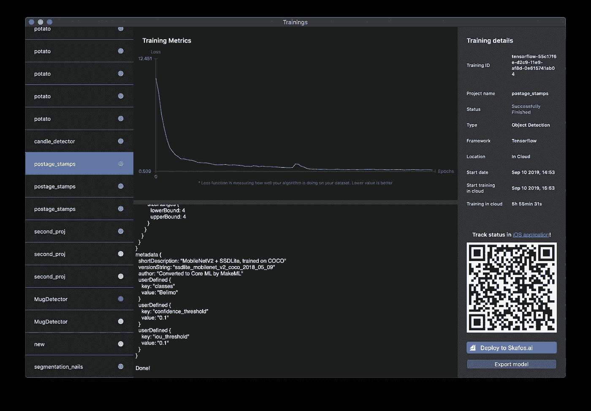

# 使用 MakeML 的 iOS 版邮票对象检测教程模型训练

> 原文：<https://medium.datadriveninvestor.com/postage-stamps-object-detection-tutorial-model-training-using-makeml-22dfdd5ad8f8?source=collection_archive---------1----------------------->

当谈到为移动应用程序创建神经网络时，有三个重要的瓶颈:数据收集和准备，模型的设置和训练，以及将模型集成到您的应用程序中。在本教程中，我们将向您展示 MakeML 如何帮助解决第一个问题。我们将使用 MakeML 的视频注释工具，它将帮助我们在不到 5 分钟的时间内创建一个包含 500 幅图像的带注释的对象检测数据集。

我的一个朋友曾经对我说，他在他朋友的收藏中发现了两张价值 7000 美元的邮票。他问我是否可以开发一个应用程序来检测昂贵的邮票。

 [## DDI 编辑推荐:5 本让你从新手变成专家的机器学习书籍|数据驱动…

### 机器学习行业的蓬勃发展重新引起了人们对人工智能的兴趣

www.datadriveninvestor.com](https://www.datadriveninvestor.com/2019/03/03/editors-pick-5-machine-learning-books/) 

这个提议只是一个应用程序的想法，很多应用程序都会出现在精通技术的人的每一次长谈中。然而，我在这个提议中看到了一个极好的机会来展示 MakeML 的视频注释工具是如何被利用的。

我们的示例应用程序是用一个邮票的短视频制作的。这是我创建的一个应用程序，就在我得知这个应用程序想法的同一天晚上:

注意:我们的模型有明显的局限性。我们只在数据集中添加了一种邮票类型。这就是为什么它只检测这张邮票。此外，在拍摄注释视频的相同照明条件下，它会更好。

因为我没有任何昂贵的邮票，所以我用谷歌搜索了“最有价值的邮票”,并下载了一张珍贵邮票的图片。然后我把它打印出来了。因此，我有一个假的标记，我认为这对于我们的例子来说已经足够了。这一步是整个教程中最耗时的:)

正如我们所知，我们需要许多图像来创建一个数据集，使用它我们可以训练一个神经网络。实际上，在这个例子中，我们没有准备任何照片。我用这枚假的稀有邮票拍摄了一个小视频。这是这段视频:

几分钟后，我们将从这个视频中获得大约 150 张带注释的图片。我拍摄的视频每秒 24 帧。这意味着我们可以在 6 秒钟内提取大约 150 幅图像。在本教程的下一章，我们将向您展示如何做到这一点。

我花了大约 5 分钟捕捉视频，并把它们从我的 iPhone 发送到我的 Mac 电脑。从这一点出发，我们需要标记它们。为此，我们将使用 [MakeML 应用程序](https://apps.apple.com/us/app/makeml/id1469520792?mt=12):

1.  打开 MakeML 应用程序并创建一个新的 MakeML 项目。

2.选择对象检测数据集类型和 Tensorflow 训练配置，输入项目名称，然后按“创建”按钮。

3.按下“导入视频”按钮，选择一个您之前拍摄的视频。

4.要注释我们的图章，我们需要在第一帧点击并拖动它，输入注释标题，按 ok，设置每帧的图像数量，然后按 import 按钮。如果项目中已经有注释标题，注释标题将会合并。对象跟踪算法将跟踪视频中的对象，并自动将带注释的图像添加到您的数据集中。

在 stamps 项目中，我设置了如下培训配置参数:

1.  批量大小— 24
2.  迭代次数— 3000 次

要开始我们的训练，我们需要按下“运行”按钮。

按下“Run”按钮后，数据集上传到 MakeML 服务器，模型的训练开始。你需要等到你的模型准备好了。您可以在训练屏幕上监控的参数是损耗。我已经在[指甲教程](https://makeml.app/nails_segmentation_training.html)中更深入地解释了这个参数的含义。

当模型的训练完成后，您可以将其导出并接收一个. coreml 文件，该文件已准备好集成到您的 iOS 应用程序中。你只需要按下“导出模型”按钮。

模型与 iOS 应用程序的集成是本教程的最后一步。导出模型后，您将收到一个包。我们需要这个包中的“model.mlmodel”文件。

我们准备了一个项目，您可以在其中快速运行和测试您的 CoreML 对象检测模型。你可以从 [Github](https://github.com/makeml-app/LiveObjectRecognitionCoreML_iOS_App) 下载。

您需要打开项目，将您的“model.mlmodel”拖放到其中。然后将“objectdetectionviewcontroller . swift”中的“modelURL”变量改为“model.mlmodel”。在你的 iPhone 上运行这个项目，就这样，你就可以开始搜索昂贵的邮票了！

*原发布于*[*https://makeml . app*](https://makeml.app/postage_stamps_tutorial)*。*