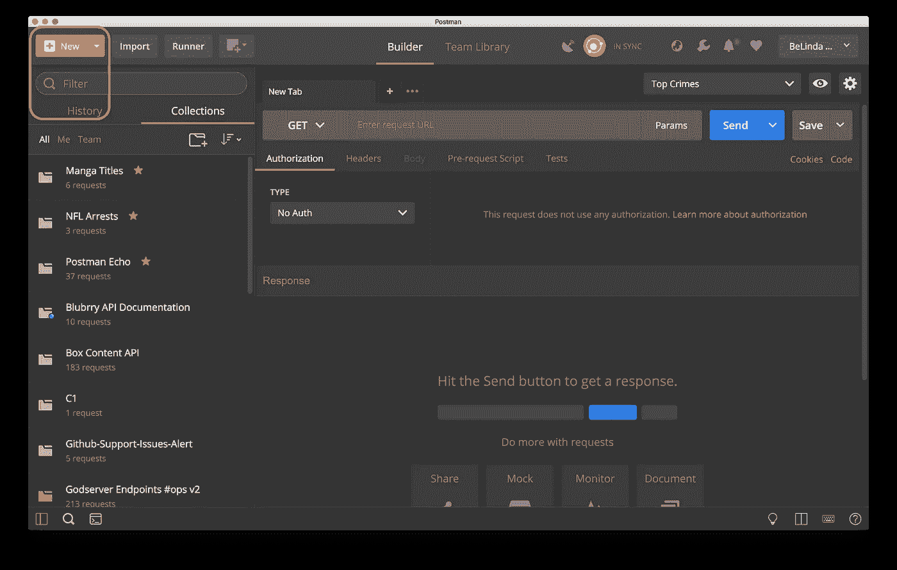
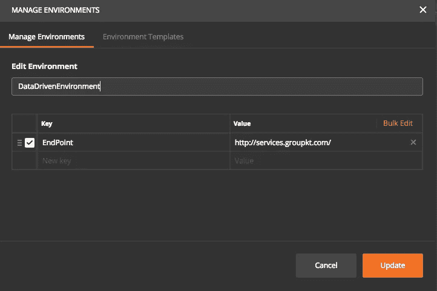
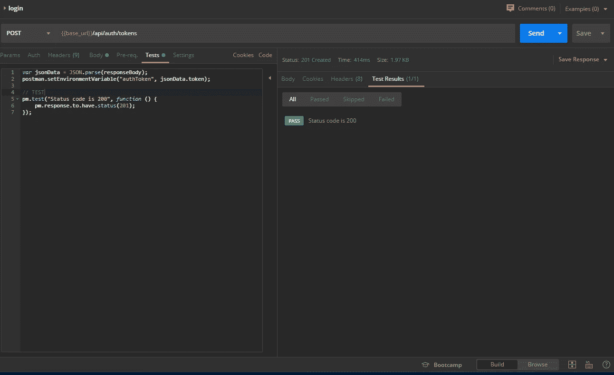
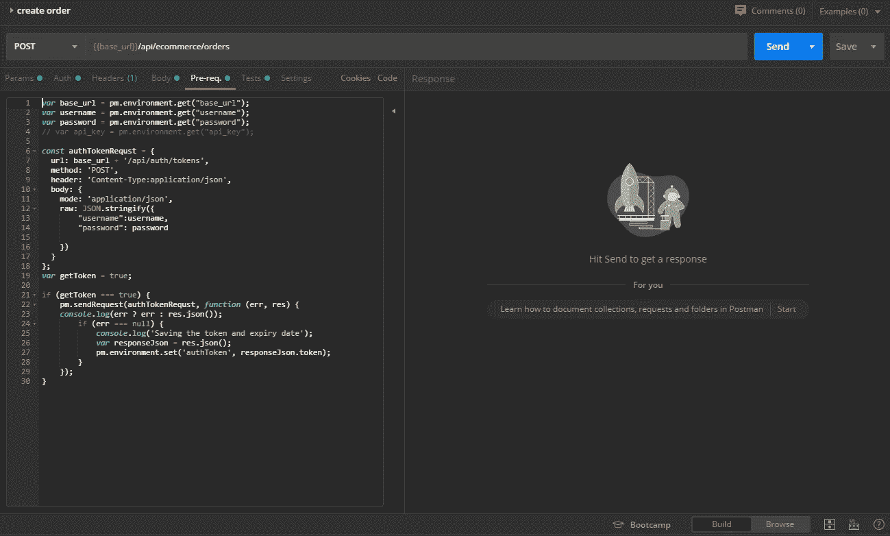

# 邮递员提示和技巧

> 原文：<https://medium.datadriveninvestor.com/postman-tips-and-tricks-78550b978d18?source=collection_archive---------2----------------------->

> " **Postman** 是一款与 HTTP APIs 交互的 app。它为您提供了一个友好的 GUI 来构造请求和读取响应。”

[https://www.postman.com](https://www.postman.com/)

如果你是一名软件开发人员，无论你是前端、android 开发人员还是后端开发人员，那么你可能会在工作中使用 postman。尤其是当你处理 API 的时候。所以你用 postman 来测试不同的 API。

在本文中，我们将讨论 postman 为您提供的一些特性，这些特性将使测试 API 变得更加容易和快速。所以让我们开始吧。

在开始之前，让我们假设我们有以下 API。

> 用户通过用户名和密码登录，它会返回令牌
> 
> 在标题中使用此标记来创建产品。
> 
> 使用产品 id 支付。

# 1.收集

image from postman blog

集合是一组 API 请求，您可以出于多种目的将其保存到一个文件夹(集合)中。

*   组织您的请求
*   导出收藏或与同事共享收藏。
*   为这个集合编写文档，这样如果有人想集成你的 API，和他共享这个集合就很容易了。

[*此处*](https://blog.postman.com/2017/10/10/create-collections-documentation-and-more-with-postmans-new-button/) *如何在邮差中创建收藏。*

# **2。环境**

P问题:

你想用用户名和密码登录。但是您必须在本地和生产环境中测试这个端点。所以每次你都会手动更改请求 URL 和正文。

SS**解决方案:**

Postman 提供了一个允许你添加变量的环境，所以你可以在不同的请求中使用这些变量。因此，您可以创建两个环境，一个用于本地环境，另一个用于生产环境，并定义{{URL}}、{ {用户名}}和{ {密码}}。所以下次你必须测试 API 的时候，你需要做的就是切换环境。酷吧:D

# 3.试验

所以现在你很高兴有这样的环境，不需要手动改变网址或正文。然后，您使用用户名和密码登录到返回令牌的 API。

P问题:

您仍然需要复制令牌，将其放入下一个请求的头中，以便创建产品。

St 24】解决方案:

在这里，登录请求中的 Tests 选项卡的作用出现了，它允许您从返回的响应中获取令牌，并将其存储在环境{{token}}中。因此，当您调用 create product API 时，您不需要复制令牌，只需将{{token}}放入标头并发送请求即可。

“测试”选项卡还允许您为预期的响应编写一个测试，因此如果有任何缺失的响应属性，测试将会失败，并且在“测试结果”选项卡中会显示哪个失败。因此您可以测试 API 返回您想要属性。

# 2.预先请求

所以现在您不再需要复制响应数据。但是你的 API 越来越大，你不断增加请求。通过 proeuct _ id 支付产品费用。

P **问题**:

所以每次你需要登录，然后创建一个产品，然后支付这个产品的 id。大量的移动和敲击，对！

S溶液:

在**预请求**选项卡中，您可以添加代码，以在支付产品之前告诉邮递员更新令牌并创建产品，然后更新{{product_id}}。所以当你点击发送，它会支付你刚刚创建的产品。

 [## 雅虎财经 API |数据驱动投资者的 6 种替代方案

### 长期以来，雅虎金融 API 一直是许多数据驱动型投资者的可靠工具。许多人依赖于他们的…

www.datadriveninvestor.com](https://www.datadriveninvestor.com/2019/02/25/6-alternatives-to-the-yahoo-finance-api/) 

Postman 是一个非常强大的工具，它有很多功能，可以帮助我们更快更容易地进行开发，包括文档、监控、设计和模拟以及自动化测试。这些功能有些是付费的，有些是免费的。所以去试试这些，如果你使用了另一个邮递员功能，请在下面的评论中分享它，这样我们都可以知道它并使用它。