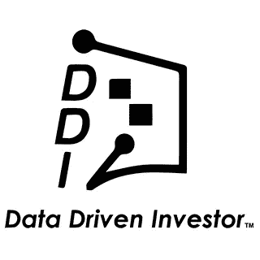

# DDI 于 2020 年 5 月 13 日发布的帖子

> 原文：<https://medium.datadriveninvestor.com/posts-from-ddi-for-may-13-2020-6356dbe6bf9b?source=collection_archive---------26----------------------->

# **最新文章:**

*   [**回购市场注入对经济有何影响——跟随面包屑**](https://www.datadriveninvestor.com/2020/05/13/what-repo-market-injections-say-about-the-economy-follow-the-breadcrumbs/) *(布拉德利·斯通)*
*   [**加速科技银行数字化:云和人工智能成为疫情赢家**](https://www.datadriveninvestor.com/2020/05/12/speeding-up-the-digitalization-of-the-tech-banking-cloud-and-ai-as-the-pandemic-winners/) *(奥斯卡·查韦斯·维拉)*
*   ***【吉姆·卡扎曼】***

# ****编辑推荐:****

*   **[**一线希望:颠覆创造的世界**](https://www.datadriveninvestor.com/2020/05/08/silver-lining-the-world-that-the-disruption-created/) *(作者卡蒂亚·雷)***
*   *****(作者 Ashain Perera)*****
*   ****[**为什么我们必须用科技做好事，现在比以往任何时候都更需要**](https://www.datadriveninvestor.com/2020/05/05/why-we-must-use-tech-for-good-now-more-than-ever/) *(布伦丹·埃利斯)*****

# ******DDI 介质上的新功能:******

*   ****[**【疫情时代】失去隐私**](https://medium.com/datadriveninvestor/losing-privacy-in-times-of-pandemic-f52aff6eb0ab) *(作者克里斯特尔·里弗斯博士)*****
*   ****[**《计算机视觉》中定义“视觉”**](https://medium.com/datadriveninvestor/defining-vision-in-computer-vision-38ed2a045eef) *(苏尼拉·戈拉普迪著)*****
*   ****开放银行业:美国监管准备好了吗？ *(作者达拉·塔尔科夫斯基)*****

# ******DDI 介质上的趋势**:****

*   ****美联储可能已经完成了它目前所能做的拯救经济的任务****
*   *****[**即将到来的政府和第二次大萧条**](https://medium.com/datadriveninvestor/the-coming-administration-and-the-second-great-depression-11ca665e6a41) *(作者纳丁·布热津斯基)******
*   *****[**冠状病毒期间的五种生活方式疫情感觉像一部电影**](https://medium.com/datadriveninvestor/five-ways-life-during-the-coronavirus-pandemic-feels-like-a-movie-108b9e6fa155) *【曼尼·奥蒂科】******