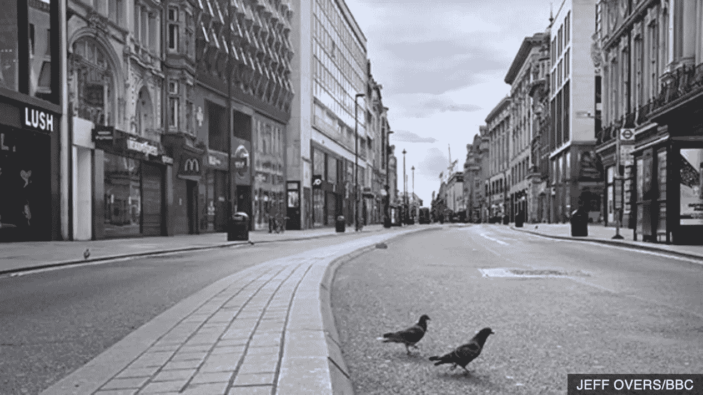

# 对环境的潜在影响，对办公室的需求，以及我们在家工作时对区块链技术的使用。

> 原文：<https://medium.datadriveninvestor.com/potential-impact-on-environment-need-for-offices-and-use-of-blockchain-technology-as-we-work-from-1b2f72d57fb4?source=collection_archive---------19----------------------->

巴克莱(Barclays)在纽约时代广场附近的办公室有大约 7000 名员工。)、摩根大通(有 18 万名员工在家办公)和摩根士丹利都是银行业的一部分，银行业长期以来一直是这座城市的经济支柱，拥有超过 2 万名员工。他们在纽约总共租赁了超过 1000 万平方英尺的土地

摩根士丹利首席执行官詹姆斯·戈尔曼[告诉彭博](https://www.bloomberg.com/news/articles/2020-04-16/gorman-sees-morgan-stanley-future-with-much-less-real-estate)，公司已经*证明我们可以零足迹*

甚至沃伦·巴菲特最近在他的年度投资者会议上也说“*很多人已经知道他们可以在家工作*”

帝国大厦和曼哈顿其他八处房产的所有者帝国州房地产信托公司(Empire State Realty Trust)的首席执行官安东尼·马尔金(Anthony Malkin)表示，前景更加乐观，“纽约的吸引力——多样化、受过教育的劳动力和大型产业，包括快速增长的技术部门——将推动经济反弹和对办公空间的渴望”。

大量的办公室工作人员，除非我们在此之前接种疫苗，否则不太可能在秋季可能是新年之前返回工作岗位。

 [## 数字货币、区块链和货币的未来|数据驱动的投资者

### “区块链”、“加密货币”、“令牌化”，以及现在的“央行数字货币”已经成为…

www.datadriveninvestor.com](https://www.datadriveninvestor.com/2020/02/18/digital-currencies-blockchain-and-the-future-of-money/) 

事实上，谷歌和 FACEBOOK 将于 2021 年 1 月 1 日重返办公室

TWITTER 可能永远不会

事实证明，企业不需要办公室，因此减少通勤会改变生活方式，减少污染，这对气候变化和个人生活都有好处。

我们还要多久才能看到商业地产价格下跌，写字楼变成住宅公寓？

如果远程工作，对保护数据的需求增加，因此可能会看到区块链技术及其军用级安全性的使用增加

如果你想每周收到数字字节，请使用此链接注册[http://eepurl.com/gTDiwP](http://eepurl.com/gTDiwP)