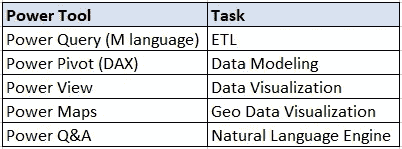

# 简化的电源 BI

> 原文：<https://medium.datadriveninvestor.com/power-bi-simplified-bdf4df180868?source=collection_archive---------12----------------------->

Image 1: Photo by [Campaign Creators](https://unsplash.com/@campaign_creators?utm_source=unsplash&utm_medium=referral&utm_content=creditCopyText) on [Unsplash](https://unsplash.com/s/photos/data?utm_source=unsplash&utm_medium=referral&utm_content=creditCopyText)

Power BI 是一个简单的数据分析、数据可视化工具，由微软开发。

它被数据分析师、商业智能分析师和其他专业人士广泛使用，以获得对他们使用的某些数据集的见解。Power BI 的工业用途不仅仅限于 IT，还包括其他行业，如政府和教育、医疗保健服务、制造、零售和消费等。

> **什么是权力 BI？**使用统一、可扩展的自助服务和企业商务智能(BI)平台连接并可视化任何数据，该平台易于使用，可帮助您获得更深入的数据洞察力。

## 使用的语言

Power BI 主要使用两种类型的表达式语言

1.  ***M 语*** —这是权力查询的语言。m 语言用于导入和整形数据。
2.  DAX(数据分析表达式)— DAX 是 Power Pivot 的公式语言。这用于数据建模和计算。

## 电动工具

Power BI 使用一组工具来完成与数据操作相关的特定任务。这些工具被称为电动工具。

下图显示了 Power BI(桌面)应用程序的动力工具与一组任务的匹配情况。

Table 1: Corresponding Power Tool with Task

*参考文献*

*   [微软 Power BI 官网](https://powerbi.microsoft.com/en-us/)