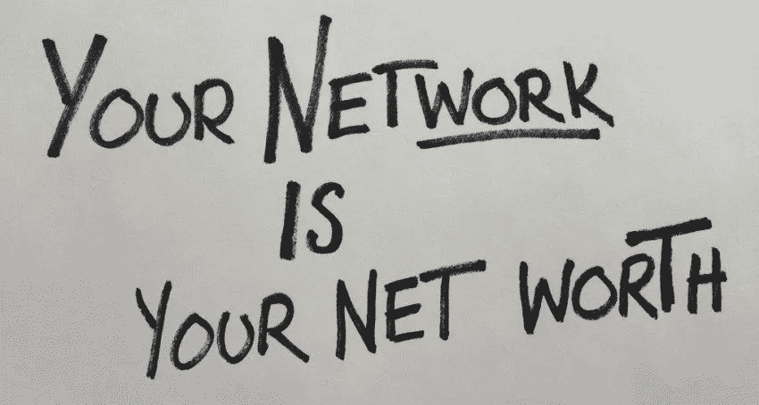
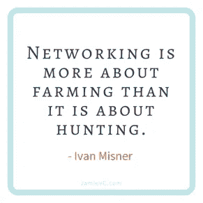

# 强大的网络不仅仅是一个梦想

> 原文：<https://medium.datadriveninvestor.com/powerful-networks-are-more-than-a-dream-61c666b9a1fe?source=collection_archive---------8----------------------->

## 对话会带来更多的联系和支持

亲密的关系不仅仅是一场梦。他们随时都会出现，通常是从简单的说声“嗨”开始的。

这是前提，也是来自[j·凯利·霍伊](https://twitter.com/jkhoey/)的生活和事业的证明。作为[国家演讲者协会](https://twitter.com/NSAspeaker)的成员，她是[打造你的梦想](https://twitter.com/BYDNetwork)播客和书籍的作者和创作者。

在 Krost 的#MillennialTalk Twitter 聊天中，Hoey 与千禧一代专家、营销和品牌策略师、全球演讲者和 LinkedIn 讲师 Chelsea Krost 进行了交谈。他们研究了每个人如何将强大的网络和关系变成现实。

没有比现在更好的时机来建立关系网了。开始对话，让一件事引出另一件事。

霍伊说:“首先要承诺倾听和帮助他人，而不是寻求帮助。”“实际上，如果你在为职业和商业机会建立关系网，从 LinkedIn 开始吧。

“你永远不知道机会会从哪里来，”她说。"实习生、以前的同事、客户和朋友都给过我机会。"

 [## 如何穿着睡衣建立良好的关系

### Twitter 聊天有趣、轻松，非常适合社交

medium.com](https://medium.com/datadriveninvestor/how-to-make-great-connections-in-your-pajamas-461e91356295) 

尤其是通过社交媒体，接触不受时间和地点的限制。

克罗斯特说:“人际交往的美妙之处在于，当你碰巧遇到一个有趣的人时，你可以随时随地自然而然地进行交往。”。“这就是为什么随时准备好一张名片、电梯推销或对你所做工作的解释至关重要。

“不要只想着生意，”她说。“认为更多的关系等于友谊。像所有的关系一样，人际关系是双向的。”

有限的社交机会其实并不有限。

克罗斯特说:“多亏了社交媒体和万维网，我们从来没有像现在这样有更多的机会与远近的人们联系。”

“当谈到网络时，让我们跳出框框思考，”她说。“你必须亲自参加社交活动的日子是很棒的，但现在还没有。利用你所拥有的优势。”

# **不同的心境**

真正的网络始于新的思维方式。

霍伊说:“首先要改变你想象中的人际关系网是什么的心态。“Twitter 聊天是网络。与你的朋友分享你从聊天、播客或在线课程中学到的东西是*网络*。

“写书评是*社交*，”她说。"因为书评，我已经见过、采访过、联系过几个《打造你的梦想》的读者."

打招呼是一个开始，但只有坚持下去才有意义。

“当你加入 Twitter 和 Zoom 上的在线对话时，介绍你自己，”Hoey 说。“参与每一次数字互动。社交媒体使建立联系的途径和机会民主化，但你必须像在现实生活中一样出现在网上。

她说:“如果你认为社交仅仅是在鸡尾酒会上闲聊或者你在找工作的时候才会做的事情，那你就错过了机会。”。

 [## 充分利用会议连接

### 提前准备，一定要跟进

medium.com](https://medium.com/datadriveninvestor/make-the-most-of-conference-connections-b0b17cd08037) 

小心地与那些你以前没有联系的人交往。

“做研究，”霍伊说。“在你彻底了解这个人之前，不要轻易联系他。如果你可以谷歌一下这些信息，读一读，然后问这个人一个更好的问题。然后让*更强*的第一印象。”

克罗斯特建议，在建立强大的人际网络时，不要自我设限。对于那些想引起别人注意的人，她建议做几件事:

*   在社交媒体上联系。
*   对他们的帖子进行评论和点赞。
*   发送直接信息或个人电子邮件。

Krost 说:“当联系新朋友时，在你的联系信息中找到一个双赢或分享你的价值——你可以提供服务或有解决方案的地方。”。

“我个人最讨厌的事情是当人们第一次找我时，突然要求安排一个电话‘向我请教’，”她说。*号号*号。要留心。不要马上要求什么。分享和付出才能建立真正的联系。”

# **自然手感**

克罗斯特给出了她关于更聪明而不是更努力地建立关系网的最佳建议。

“你不需要认识新的人来开始有效的人际交往，”她说。“我的座右铭是，‘通过你的网络和关系做好事。’这样，介绍彼此的社区或关系会感觉更自然。

“作为一个社会，我们总是倾向于追逐下一个事物——客户关系——但不要忽视你已经拥有的关系、网络和客户，”Krost 说。“在你的人际关系网中保持健康和积极的关系将有助于你结识新的志同道合的人。”

过度思考可能会弄巧成拙。

“不要陷入自己的头脑中，”克罗斯特说。“很多时候我们是自己的街区。我们告诉自己这个不真实的故事，为什么这个人永远不想和我们联系。不要让 [成为自己最大的敌人](https://medium.com/datadriveninvestor/striking-a-pose-is-not-in-vogue-7b09379e3f9b?source=friends_link&sk=e6326d4bf7b890bf0cfac1dbd10b4264)

她补充说，在建立关系网时，“回复你的人是你应该联系的人。”

霍伊建议人们在睡觉时上网，因为他们需要保持持续的数字存在。

“第一印象通常是基于社交档案，”她说。“这一点我怎么说都不为过:让它们保持更新和准确。

霍伊说:“帮助你关系网中的其他人，因为这样他们就会想帮助你。”。“这使得网络*更智能*，*更容易*和*有趣*。”

 [## 他们的故事值得一看

### 讲故事创造联系和关系

medium.com](https://medium.com/datadriveninvestor/theirs-are-stories-to-behold-3cb18a55cc72) 

只要它们看起来不像垃圾邮件，最终不会被当作垃圾邮件丢弃，创建个性化的战略模板就没问题。

“我想到的是战略指南或最佳实践指南和框架，而不是模板，”Hoey 说。“网络不是一刀切的。如果您不更改称呼并将其发送给每个人，模板可能会被误用。注意不要剪切和粘贴你的信息。人们可以闻到它。”

克罗斯特同意嗅嗅测试。

“创建战略性电子邮件推广模板是一个伟大的‘更聪明地工作’战略，*但是*总有*需要在每封电子邮件中进行一定程度的定制，”她说。“否则，它就是不真实的，我称之为‘广告牌信息’"*

# **简单确认**

通过说谢谢来感谢网络联系人。不要想太多，也不要拘泥于形式。这是你的私人关系网，不是正式的恋情。

“一点不错，”霍伊说。“大多数时候，人们只是希望得到承认。仅此而已。”

她建议在接洽时采取以下步骤:

*   尊重人们给你的时间——打电话、发邮件、放大照片。
*   让他们知道你欣赏这个建议，不管你用不用。
*   跟进让他们知道你是如何应用他们的建议的，或者根据你们的谈话给出一个更新。

“我的经验是，大多数人只是想帮忙，但是你需要让他们知道他们是如何帮忙的，”霍伊说。

 [## 表达感谢并真心实意

### 礼貌的社会交往是有益的

blog.markgrowth.com](https://blog.markgrowth.com/give-thanks-and-mean-it-17174f79a8e5) 

Krost 遵循以下建议来感谢人脉关系:

*   手写、视频或音频笔记。
*   新关系介绍。
*   在 LinkedIn 上写一封推荐信，推荐或支持那个人。
*   在内容、数字激活和现场活动中邀请或展示新的联系。

巩固人际网络的主要方法是积极参与。不做播主，不互动。你可能会有很多跟屁虫，但这是描述藤壶的另一种方式。

“我最喜欢的支持我的网络的方式是通过*合作*双方共赢，”Krost 说，并引用了一些活动，如联合 Instagram Live、文章、视频系列、网络研讨会和 Twitter 聊天。

此外，Hoey 还依靠志愿服务，并积极参与行业或专业组织。

“发一条生日短信，”她说。研究表明，这个简单的行为可以建立更强的联系。此外，要准时出现，有条理，为网上会议做好准备。”

对于通过社交媒体建立关系网，确保每天发布几条消息来显示你还活着。主动与你的人际网络中的其他人交往。以一种公开的方式互动，因为世界上的其他人都在看着并可能加入进来。

“采取行动，确保你的人际网络多样化，”霍伊说。“每天坚持出现。一致性建立信任。信任建立关系。关系等于强大的网络。”

**关于作者**

吉姆·卡扎曼是[拉戈金融服务公司](http://largofinancialservices.com/?source=post_page---------------------------)的经理，曾在空军和联邦政府的公共事务部门工作。你可以在[推特](https://twitter.com/JKatzaman?source=post_page---------------------------)、[脸书](https://www.facebook.com/jim.katzaman?source=post_page---------------------------)和 [LinkedIn](https://www.linkedin.com/in/jim-katzaman-33641b21/?source=post_page---------------------------) 上和他联系。